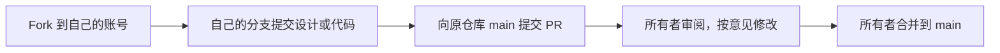

# 参与设计

Record Companion 是音乐唱片桌搭与唱片挂件项目，目前处于概念审阅、材料盘点和模块原型规划阶段。

仓库公开供所有人查看。参与者通过 Fork 和 Pull Request 提交建议、设计和代码，不授予原仓库写权限；`main` 由仓库所有者 `yigencong-1` 审阅并合并。

## 先看这些内容

- [项目简报](docs/project-brief.md)：已确认要求、技术范围与待定事项。
- [最新方案](docs/next-stage-plan.md)：声音、墨水屏、电源、网络和结构的配合。
- [材料盘点](hardware/inventory.md)：参考规格不代表已有实物。
- [决策记录](docs/decisions.md)和[验证记录](docs/verification.md)：区分已确认决定、建议和实际结果。
- [项目工作约定](AGENTS.md)：改动范围、来源记录与验证方式。

## 提交方式

1. 在 [原仓库](https://github.com/yigencong-1/record-companion) 点击 Fork，创建自己账号下的副本。
2. 在自己的 Fork 中创建分支，例如 `design/speaker-layout`，围绕一个明确问题提交改动。
3. 硬件、固件、网页和结构分别放入 `hardware/`、`firmware/`、后续网页目录和 `mechanical/`；讨论与证据放在 `docs/`。可先通过 Issue 讨论方案。
4. 发起 Pull Request，目标选择 `yigencong-1/record-companion` 的 `main`。
5. 描述改动原因、影响范围和实际验证结果。原型图、软件模拟、编译通过和实物验证分别说明；未验证的项照实记录。
6. 仓库所有者审阅后合并；需要调整时继续向自己的分支提交，PR 会随之更新。

外观、范围、预算与重要体验取舍先讨论落实，再实施依赖该决定的工作。复用外部代码、设计或素材时记录来源、版本及许可；公开仓库不改变这些材料的使用条件。

不上传令牌、Wi-Fi 密码和本机凭据。同学使用各自账号参与，无需共享所有者账号。
