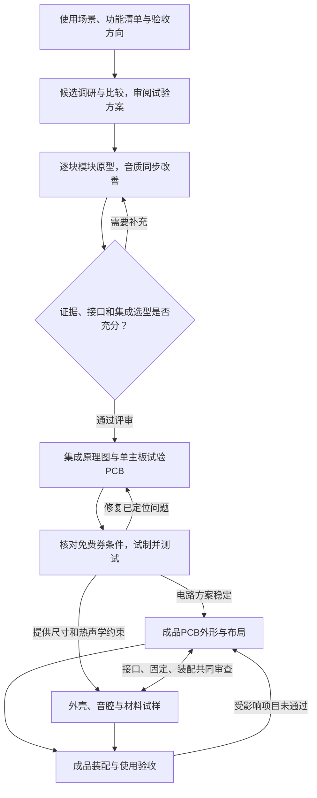

# 开发流程与选型评审

日期：2026-10-08。已确认制作路线见D036–D041；本文件落实阶段交付、选型方法和试制规则。以下具体表格、接口类别和通过条件是主控建议，尚未形成器件、采购或制造定稿。

## 已确认的制作路线

先逐块实现模块，可以使用面包板、洞洞板和现成模块。模块阶段在条件允许时尽早做好音质，预留有实际用途的扩展接口；随后设计集成原理图和PCB，以一块主板集中功能。试验板利用适用的嘉立创免费打样迭代，其形状可以独立于成品。成品板按声音、装配和外壳需要重新确定外形与走线，PCB和结构可以并行，最终使用更好的材料。

功能、芯片和模块按调研、比较、验证、审阅的过程选择。当前的ESP32-S3、MAX98357A、PN532、BQ25895等都是候选示例；此前建议和估算没有完成完整选型评审，也不是已批准采购的BOM。

## 阶段与交付

| 阶段 | 必须得到的具体结果 | 进入下一阶段的依据 |
|---|---|---|
| 功能梳理 | 从[项目简报](project-brief.md)建立功能表，写清用户价值、优先级、实现成本与验收方向 | 重要范围和体验取舍经用户审阅；已确认要求直接沿用 |
| 模块选型调研 | 通常比较2–3个适用候选，附官方资料、价格来源、差异与推荐理由 | 试验目的、候选、需要的材料和费用明确；单一合理候选说明原因 |
| 独立模块原型 | 接线、供电、代码版本、功能结果、音质或其他体验、功耗与问题记录 | 关键能力可复现，已知问题可解释，取得集成所需接口与电流证据 |
| 集成选型评审 | 正式器件与模块方案比较、接口表、电源预算、BOM及结构占位 | 用户落实重要成本和体验取舍，关键器件与封装有采用依据 |
| 单主板工程试制 | 嘉立创源工程、制造文件、检查结果、试验板和改版记录 | 在真实PCB上完成上电、并发、声音、充电与相关接口验证 |
| 成品PCB与结构 | 联合尺寸、最终布局、音腔、材料试样和装配路径 | 制造可行，音质、温升与体量获得实测支持 |
| 成品验收 | 固件与板版号、装配记录、声音和日常操作、边充边用与续航证据 | 完整装配达到已落实的目标，交付文件对应实际成品 |

不规定固定改版次数。每轮试制应解决明确问题；已经通过的项目仅在电路、布局、结构、固件变化影响它时重测。停止改版的依据是验收通过和已知问题有明确处理，不是免费券用完。

## 功能如何选择

在现有简报的已确认范围内，逐项记录以下内容。新增功能、延后实现及只预留接口的取舍由用户审阅；不能把候选功能直接列入首版。

| 字段 | 每项功能应回答的问题 |
|---|---|
| 使用情景与价值 | 平时何时会用，完成什么操作，是否经常需要？ |
| 状态与优先级 | 已确认要求、待评估建议，还是用途尚不清楚？哪些属于首版、后续实现或接口预留？ |
| 离线与联网 | 无网能做什么，断网如何表现，是否需要外部服务？ |
| 体验目标 | 用户怎样知道操作成功，怎样退出，如何验收？ |
| 实现代价 | 增加哪些器件、软件、空间、功耗、费用与维护工作？ |
| 决定与证据 | 哪条用户决定支持它，哪些数据已核实，什么仍需试验？ |

AI的用途未定，先探索实际场景。麦克风、蜂窝模块和订阅服务仍需用途及候选比较支持。生日范围继续遵守D031，仅一张唱片和一个菜单入口。

## 芯片与模块如何选型

每次先写用途和必要条件，再检索候选；核对官方手册、参考设计、真实供货及软件支持，然后进行适度试验。先排除不满足必要条件的候选，再比较性能、价格与实现成本；综合评分的权重若涉及音质、体积和价格的重要取舍，由用户落实。

建议使用下表比较，单项没有资料时写“待核实”，不根据品牌、销量或最大额定值给出性能结论。

| 比较项 | 候选A | 候选B | 候选C，必要时 |
|---|---|---|---|
| 名称、准确型号与公开资料 | 待调研 | 待调研 | 待调研 |
| 必要能力、接口与兼容性 | 待核实 | 待核实 | 待核实 |
| 实测表现、测试条件与问题 | 待试验 | 待试验 | 待试验 |
| 功耗、供电、尺寸与封装 | 待核实 | 待核实 | 待核实 |
| 单价、数量档、供应商与查询日期 | 待询价 | 待询价 | 待询价 |
| 外围件、焊接、移植和调试成本 | 待评估 | 待评估 | 待评估 |
| 供货、替代及维护条件 | 待核实 | 待核实 | 待核实 |
| 推荐理由、关键取舍与适用阶段 | 待形成 | 待形成 | 待形成 |

原型模块与正式芯片分别评审。现成模块能节省验证时间；转入PCB时要重新核对外围电路、封装、焊接能力和供货，明确继续使用封装模块还是采用芯片最小系统。相同功能不意味着能直接替换。

价格记录区分规划估算、实际报价和已支出。总成本同时包含元件、PCB、贴片或手焊、必要钢网、结构试样、运输和改版损耗；免费PCB的节省单列。更贵的材料和器件要说明具体收益，预算暂无硬上限不等于无需比较。

## 逐块验证与接口预留

| 模块 | 独立验证重点 | 向主板提供的结果 |
|---|---|---|
| 声音与存储 | 本地格式、左右声道、控制、稳定播放；配合早期音腔试样改善人声、低频、底噪和失真 | 数字或模拟接口、音频路由、实际供电电流、单元和音腔要求 |
| 电池与电源 | 电源路径、充电结束、Type-C切换、低电行为、温度检测与稳压 | 平均及峰值预算、保护和测温要求、系统电源接口 |
| 墨水屏与时钟 | 实物屏驱动、刷新并发、可读性、离线时间与状态显示 | 接口、时序、尺寸、安装与刷新策略 |
| 唱片识别 | 在位、取走、换片、未绑定标签与预期壳厚 | 通信接口、线圈位置、识别范围和固定要求 |
| 网页与本体操作 | AP配网、断网本地使用、上传保存、播放状态一致 | 网络和存储资源、操作契约、配置保存策略 |
| 灯光与运动 | 亮度、可靠停机、电流、机械声及对声音的干扰 | 控制接口、峰值负载、隔振与运动空间 |

主控建议先调研声音与存储链路，再实施这一块模块。比较主控解码配合I2S音频链路、独立音频解码/播放方案等适用路线，结合网页写入存储、左右声道、音质、功耗和移植成本形成候选报告。首块模块的具体开发板与功放在该报告及库存核对后暂选。

面包板适合低电流控制和快速接线。功放、充电、稳压及电机优先用已核对的模块、端子、短线和可靠配电，必要时转到洞洞板焊接；数字音频和存储信号线保持短且有连续回流路径。接线、触点、电源去耦或地回流引起的问题应先排查，避免将其误判为芯片或扬声器性能。

音质在模块阶段同步改善：尽早制作两只扬声器的可调整音腔，用同一音乐、相近响度比较实际听感与功耗。功能通过和音质记录分别保存；裸放扬声器的低频不能替代装入音腔后的结论。当前不强制指定参考设备。

| 预留类别，均待接口评审 | 要明确的条件 |
|---|---|
| 烧录与诊断 | USB或UART入口、关键测试点、成品维护时的可达性 |
| 外接低速模块 | 按实际主控选择I2C、UART等接口，记录电平、供电、电流、引脚和占板面积 |
| 声音或AI扩展 | 先评估音频输入或输出用途、总线和并发资源，再决定连接器或未装器件位置 |
| 软件与资源 | 模块职责、存储和内存余量、配置版本，以及未接扩展时的正常行为 |

预留表写清用途、资源占用、保护需求和代价，不笼统预留所有接口。精确GPIO、连接器、电源轨及未装器件待主控和外围方案比较后确定。

## 试验板与成品板

目标是一块主板集成主控、存储、音频、电源及所需控制电路。屏幕、扬声器、电机等按位置连接到主板。若实测或装配要求确需分板，应提交具体证据、成本与方案，先由用户落实这一目标的变更。

| 项目 | 工程试验板 | 成品板 |
|---|---|---|
| 目标 | 验证集成电路、定位问题、方便测量和返修 | 满足最终声音、体量、外壳和装配 |
| 板形与布局 | 可独立板形；主控建议便于加工和探测的规整外形 | 按接口、固定、音腔、电池和天线共同确定 |
| 打样条件 | 使用满足当期规则的免费券，记录资格、工艺和次数 | 按成品需要选择尺寸、层数、板厚和材料工艺，不受免费券设计约束，仍满足制造工艺要求 |
| 调试入口 | 保留清晰测试点、接口和必要的隔离或旁路位置 | 保留必要诊断、烧录与维护入口，优化可达性与空间 |
| 资料组织 | 规划保存至hardware/prototype/下独立版号目录 | 规划保存至hardware/product/下独立版号目录，保留变更依据 |

原理图功能分块保持可追溯，两个板型分别维护外形与布局。试验板先验证电路，同时用结构占位模型检查主要器件尺寸。电路方案稳定后，成品PCB和外壳并行细化，共同审查接口、固定孔、天线净空、NFC距离、音腔、电池散热和装配维护路径。

改变板形、布局、走线、地回流或外壳材料后，重测受影响的声音、充电、温升、通信和续航项目。试验板通过的结果不能直接替代成品验收。

成品材料按声学密封与刚度、触感、耐用、散热、加工精度和维修需求比较，选择带来实际收益的升级；具体材质、品牌、工艺和费用仍需试样及用户审阅。

## 嘉立创免费打样规则核查

访问日期2026-10-08。以下为实际读取的官方公开规则，具体券、账号资格和订单条件在每次试制前再次核对；本轮没有领取券、上传制造文件或下单。

| 项目 | 当前公开规则与本项目处理 |
|---|---|
| 常规尺寸与数量 | [PCB+SMT免费券细则](https://www.jlc.com/portal/server_guide_37595.html)，2026-09-29更新：10×10 cm以内、5片，排除“长宽小于1CM”的板；单片出货、常规工艺。试验板尺寸和工艺按选定券核对，未固定设计尺寸 |
| 设计软件 | 上述细则区分不限制设计软件的通用券和需嘉立创EDA设计的专用券；本项目使用嘉立创EDA平台，实际文件和下单路径仍需符合所用券要求 |
| 阻焊与入口 | 常规细则写双面板支持杂油，单、四、六层仅支持绿油；使用嘉立创小助手、移动端下单。板厚、铜厚和附加工艺不能仅凭“常规”推定 |
| 次数与有效期 | [0元福利规则](https://www.jlc.com/portal/server_guide_4114.html)，2026-09-29更新：每月两次0元福利；[领券中心](https://www.jlc.com/coupons)写领取后30天有效，六层免费券每月仅选其中一张使用。用户当前余额未核实 |
| 六层额外条件 | [六层券细则](https://www.jlc.com/portal/server_guide_37576.html)，2026-09-29更新：真实六层，不允许空白层凑层数；10×10 cm以内、1.6 mm、5片、绿油、单片不拼板、沉金、不需要阻抗，后续免费资格涉及上次订单晒单 |
| 沉金面积 | 领券中心写免费沉金面积不得超过整板20%；具体适用券及详细口径在工艺评审时核对 |
| 开源与返单 | 领券中心原文：“开源文件、返单或者存在拆单行为均不支持免费打样”。它没有在已读内容中定义“开源文件”是否包括自行设计后公开的工程，也没有说明真实改版与返单的判定边界，需在提交制造文件前向官方核实 |
| 费用范围 | 0元福利页宣传免运费及24小时加急，实际券、附加工艺、贴片、器件和结构费用应逐项核对；不将PCB优惠等同于完整研发免费 |

本项目公开与Fork/PR协作要求保持有效。自研公开工程的免费资格尚未确定；不为取得优惠改变公开要求、不通过无意义改动假装改版。真实改版先列问题与变更，再核对规则。若优惠不适用，形成实际付费报价与影响，采购前由用户落实费用。

免费券是降低试制费用的方式，层数和工艺仍依据性能、布局、加工与成本比较选择。免费代拼服务和免费PCB打样券是不同规则，本项目不从代拼宣传推断试验板可以拼板免费出货。

## 每轮试制记录与下一步

| 记录项 | 本轮必须明确的内容 |
|---|---|
| 版本与目标 | 板版号、原理图/PCB版本、固件版本；本轮要消除的关键不确定性 |
| 改动与原因 | 已定位的问题、具体修改、影响哪些功能和测试 |
| 制造与费用 | 工艺参数、券种及资格依据、BOM与实际支出；记录公开结果，不保存个人订单或凭据 |
| 实测 | 上电、功能、声音、充电、温升和接口中与本轮相关的预期及观察结果 |
| 下一步 | 已通过项、剩余问题、继续改版或进入成品设计的依据 |

接下来先形成声音与存储模块的候选比较报告，并与[库存盘点](../hardware/inventory.md)对照。报告给出推荐试验路线、材料缺口和报价依据，用户审阅重要取舍后，再落实暂选器件、接线与模块制作。
