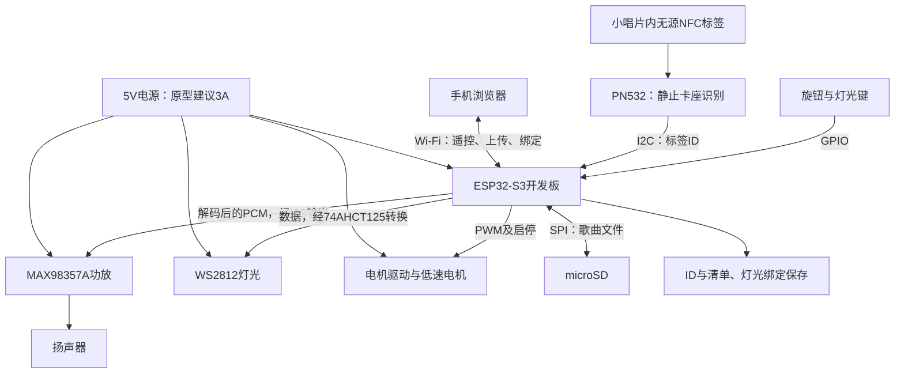

# 第一轮方案审阅

日期：2026-10-07，Asia/Shanghai。阶段：主控接手、外观与操作概念、模块原型建议。

后续进展：2026-10-08用户补充希望实现转动，挂件插入或表面放置均可，随后提出左右声道、前置墨水屏、电池和Type-C边充边用。当前规划见 [下一步方案](next-stage-plan.md)；本文保留第一轮概念与取舍，单声道模块、旧尺寸及费用仅为历史规划。

本文中的尺寸、配色、交互、模块和费用均为主控建议，等待概念审阅与实物盘点。用户已授权本轮先推荐原型开发板；采购项在盘点后确定。正式芯片仍在原型验证之后选定。

上图为概念示意，未按可制造尺寸建模；[可编辑概念图](../assets/concepts/first-round-concepts.svg)保留在工程内。

## 审阅结论

推荐先推进 **低矮唱片机**：小唱片挂件放在静止卡座中识别，本体另有一张大唱片转动。这样挂件保留随身携带的价值，主要操作直接，识别线圈和运动部件也容易分别验证。

备选 **竖立唱片灯座**：挂件本身安装到竖直转轴上转动，视觉更集中，但挂扣拆装、轴向固定、移除检测和机械噪声都增加了制作难度。

两种概念都围绕通用本地播放器：首批邓紫棋、汪苏泷和通用唱片对应不同内容，无唱片也能播放，并支持灯光、唱片互动、网页遥控及上传与绑定。公开内容另保留一张可配置生日唱片和一个菜单入口，详细交互待设计；正式芯片仍在原型验证之后确定。

## 已核实的项目状态

- 已读取 README.md、AGENTS.md、项目简报、决策记录、完整主控提示词、验证记录、技能计划、参考索引与来源记录。
- 本轮开始时 `git status --short --branch` 显示 main 跟踪 origin/main，工作区干净；origin URL 与项目记录一致。本轮没有核查远程可见性或发起提交、推送。
- 对 assets、firmware、hardware、mechanical 和 .agents/skills 分别检查了目录内容，只有目录保留标记，没有固件、结构模型或已安装的项目技能。
- 主工程没有音频文件。参考资料库按所列音频扩展名查到四个教学/语音示例文件：两段 Keil 教学 WAV 和两个很小的语音 MP3；没有可直接作为项目歌单的材料证据。未据此推断其他个人目录的音乐库存。
- 参考库存在 ESP32-S3、ESP-32F、WS2812、TB6612 等资料。它们是候选资料，不是实物库存证明；本轮未解压或采用其中的固件。
- 用户最新说明：以前购买过墨水屏桌搭材料，并制作过流体灯板；现有型号与完好状态、音乐素材、工具和打印条件仍需检查。用户将按本轮清单盘点，再确定需采购材料。
- 写回前重新读取文档，发现项目已新增D013–D015：通用播放器、首批三类唱片、无唱片播放。本轮保留并纳入这些最新记录；三类唱片的具体曲目和通用唱片内容仍未确定。

## 概念：低矮唱片机

**本体**：约185 × 140 × 65 mm，圆角低矮盒体，奶油色上盖、木色前面板和低亮暖色底光。上方大唱片约95 mm，右侧有独立、静止的小唱片卡座。前面是扬声器开孔、一个旋钮和一个灯光键。尺寸是布局起点，扬声器、识别板和电机实测后再收敛。

**挂件**：约55 mm直径、4–6 mm厚的黑色小唱片，内嵌无源 NFC 标签，用短挂扣连接书包。标签图案可自行替换，正面不放未经用户提供的姓名、照片或关系宣言。挂扣进入静止卡座的预留槽，不接近转动的大唱片。

**配合方式**：小唱片放回侧边卡座，线圈与标签平行，读取其ID并调用本体保存的绑定关系。大唱片由底部电机驱动，作为音乐播放的视觉动作；音乐从存储卡数字播放。两张唱片的作用和运动空间分开。

首批三张挂件保持相同结构，中心标签分别为邓紫棋、汪苏泷和通用；通过封面图案与可读文字区分，绑定均可在网页中修改。具体图片和音乐待用户提供。无唱片时建议旋钮短按播放上次清单、双击下一首，任意歌曲/歌单也可从网页选择；通用唱片默认对应什么内容仍待审阅。

**建议的一天**：早晨取走小唱片挂到书包，本体仍可按旋钮播放上一次清单。回家把挂件放回卡座，播放其绑定清单并点亮对应灯光；同一张持续放置不反复触发。旋钮转动调音量、短按播放/暂停，灯光键切换日常/夜间。夜间建议保留音乐，电机停止、光线变暗并可全关。取走挂件继续播放，方便拿走书包。以上规则需要用户审阅确认。

**内容更新**：建议长按旋钮进入内容管理，手机连接设备本地热点后打开网页，查看歌曲、上传文件、绑定当前唱片，并显示保存结果。第一版建议进入更新状态后暂停播放，上传结束返回播放；是否需要边播边上传，在原型资源与使用需求明确后决定。

**生日入口**：按D031仅保留一张可配置生日唱片和一个菜单入口，复用本地歌曲/歌单绑定机制。内容、入口位置、触发和退出规则待审阅，尚未实现或验证。

**结构关注点**：卡座线圈背面避开扬声器磁体、电机及金属件；先用纸板/泡沫做1:1布局。电机通过独立支架与软垫安装，先比较直接驱动和皮带传动的低速噪声。底盖可拆，存储卡及调试接口保留维护路径。

## 概念：竖立唱片灯座

**本体**：约145 × 95 × 170 mm，炭灰色矮底座支撑竖立唱片，后侧是一道莓色漫射光弧。扬声器与旋钮位于底座前部。强调唱片轮廓，配色偏酷；外观仍是待审阅建议。

**挂件**：约65 mm直径，中心有定位结构，短挂扣可拆。放到本体前，挂扣先收进底座的小槽，挂件固定到转轴后才允许电机启动。需要验证尺寸与重量是否仍适合书包挂件。

**配合方式**：唱片按固定角度装入，电机停止时完成 NFC 识别，再开始转动。转动期间不依赖持续读卡判断是否还在轴上，另用微动开关或霍尔检测装入状态。取下前先停机，固定方式和检测须一起设计。

**建议的一天**：出门把小唱片从底座取下并接上挂扣；回家拆掉挂扣、装入唱片，确认固定后播放绑定清单。旋钮控制音量和暂停；取下唱片停机并暂停音乐。没有装唱片时，仍可用旋钮播放保存清单。夜间建议停止转动，只保留低亮光弧和音乐。

生日唱片与菜单的内容范围与低矮概念一致；具体入口与操作随结构方案一起审阅。

**结构关注点**：轴向松脱、挂扣误留在旋转区、立架共振和重心都需要实物验证。NFC 标签需避开中心金属轴并在识别时对准线圈，可能影响唱片图案与内部布局。与低矮方案相比，需要额外的移除检测和固定结构。

## 两种概念的关键取舍

| 维度 | 低矮唱片机 | 竖立唱片灯座 |
|---|---|---|
| 日常价值 | 放回即触发，挂扣保留；取走不断歌 | 挂件直接参与转动，仪式感强；拆装步骤更多 |
| 外观 | 低矮、温暖，接近迷你唱片机 | 竖立、炭灰莓色，唱片视觉更集中 |
| 结构 | 静止识别卡座与大唱片机构分开 | 增加轴向固定、挂扣收纳及移除检测 |
| 音质 | 底座更便于布置40–50 mm扬声器及小音腔 | 薄底座可能限制音腔；同样扬声器不必然更差 |
| 机械噪声 | 容易分开试验电机隔振和传动 | 立架可能放大振动，需要更多验证 |
| 夜间 | 停电机、低亮底光或全关，音乐继续 | 停电机、光弧变暗；光弧需遮住可直视灯珠 |
| 制作取舍 | 推荐作为第一轮原型和成品候选 | 在用户更重视挂件直接转动时继续探索 |

音质、机械噪声和夜间体验是设计判断，不是已经测得的成品表现。两种方案使用相同音频模块时，主要差异来自音腔、扬声器位置和机械安装。

## 首轮最小模块原型（历史方案）

以下单声道、外接供电与费用是首轮估算。当前双声道、前屏和电池原型以[最新规划](next-stage-plan.md)及[材料盘点表](../hardware/inventory.md)为准。

原型先搭在可拆装台架上。推荐 **ESP32-S3 开发板，带8 MB PSRAM、排针和USB调试接口**，以 ESP32-S3-DevKitC-1-N8R8 的功能规格为参考。若现有开发板符合条件优先复用；兼容板须核对实际模块标识和引脚。该推荐不确定成品芯片。

推荐它的原因是同一块板可承担 Wi-Fi 网页、本地存储、数字音频和外设控制，减少为了网页额外增加另一颗主控的原型联调。普通 ESP32 若已有，可先验证部分模块；是否足以承载完整上传和播放流程由实际并发测试决定。

音频优先 **MAX98357A I2S 功放 + 一个4 Ω、3 W、40–50 mm扬声器**。先以16位 PCM WAV检验声音和存储链路，随后验证实际 MP3 素材的解码与网页上传；不把WAV测试通过等同于常用音乐格式已经支持。单个扬声器为单声道听歌原型，最终音质目标和是否升级音频模块留待试听。

存储优先 **主控直接读写 microSD**，使播放和上传使用同一文件系统。常见 DFPlayer 类串口播放器适合发声测试，但通常不能让主控直接写其卡内歌曲，不能单独承担已确认的网页上传功能。

识别优先 **PN532 + 四张 NTAG213 无源标签**：前三张对应首批三类唱片，第四张验证未绑定行为。标签ID对应存储在本体中的清单和灯光主题，网页修改绑定关系；挂件本身不用电池。原型采用静止卡座验证实际识别距离与反复取放。

灯光使用8–12颗 WS2812 灯环/短灯带并加漫射材料；电机使用小型低速直流减速电机和DRV8833或库存中合适的TB6612驱动模块。实际驱动电压、启动电流、堵转电流和低速噪声核对后再确定接线与转速。

### 材料核对清单

下表是核对用途与规格的清单。费用是国内常见兼容模块的规划估算，不是本轮商家报价；库存复用后再形成采购金额。型号不符的材料先记录，不直接判废。

| 材料 | 建议数量/规格 | 用途与核对重点 | 估算费用（元） |
|---|---|---|---:|
| ESP32-S3开发板 | 1；8 MB PSRAM，N8R8参考规格 | 网页、上传、存储、音频和状态控制；确认准确板型、模块标识、能否烧录 | 45–85 |
| MAX98357A模块 | 1 | I2S音频直接驱动扬声器；确认供电和引脚 | 8–20 |
| 扬声器 | 1；4 Ω/3 W，40–50 mm | 试听歌声和音量；确认阻抗、尺寸、状态 | 10–30 |
| microSD卡与转接模块 | 各1；16/32 GB卡，3.3 V逻辑兼容 | 存歌曲、读写上传；确认模块供电、电平、卡能否读写 | 20–42 |
| PN532模块 | 1；支持3.3 V主控接口 | 识别小唱片；记录板型和接口选择方式 | 18–40 |
| NTAG213标签 | 4；先用普通圆贴标签 | 三张绑定不同清单，一张测试未绑定行为；记录标签尺寸 | 5–15 |
| WS2812灯环/短灯带 | 1；8–12颗 | 场景和夜间光；确认电压、数量和数据方向 | 6–18 |
| 74AHCT125电平转换 | 1 | 3.3 V灯光数据转5 V；普通双向I2C转换板不作首选 | 3–8 |
| 低速电机与驱动模块 | 各1；5 V低速直流减速电机候选 | 大唱片转动；驱动模块电压/电流匹配，核对实际电机状态 | 21–50 |
| 带按键旋转编码器、灯光按钮 | 各1 | 音量、播放与夜间操作 | 5–12 |
| 稳压电源与线缆 | 1套；5 V/3 A起点 | 整机供电；核对供电接口和带载稳定性 | 18–35 |
| 连接、焊接与配电材料 | 1套 | 排针、端子、线材、去耦电容及小台架 | 20–40 |
| 简单传动与固定材料 | 1套 | 唱片轴、支架、软垫、皮带/联轴件试样 | 10–25 |
| 音频素材 | 2–3首能播放的本地文件 | 核对格式、是否加密、曲名与试听用途；教学示例不能替代项目歌单 | 待提供 |
| 工具与打印条件 | 核对已有 | 电烙铁、万用表、电脑数据线；卡座与台架先用现成材料，打印可后置 | 不计入模块估算 |

前13项合计约 **190–420元**，不含工具购置、正式PCB、最终外壳、运费和返工。第一步先验证声音与存储，识别、灯光和运动模块再依次加入；预计不是一次性全部采购。

### 连接与数据流

供电分支在台架配电处安排，模块共地；功放、灯光和电机负载不走开发板3.3 V稳压器。PN532和SD转接板的供电按具体板型核对。本轮只明确接口职责，不冻结GPIO编号；带八线PSRAM的板型要避开占用的引脚。

扬声器两根线接功放差分输出，不能把其中一根接地。电脑USB调试与外部供电的并接方式按实际开发板电路核对，不用未经确认的双电源连接。

### 原型先验证什么

以下是建议的通过标准，待用户审阅；不是实测结果。

| 顺序 | 实验与目的 | 建议通过标准 |
|---|---|---|
| 1. 声音与存储 | 开发板读卡输出WAV，随后试听实际MP3 | 无手机连接连续播放30分钟，无重启、明显断音；在约0.5–1 m听人声清楚、音量有用 |
| 2. 上传与绑定 | 手机上传、切歌、调音量、保存清单与绑定 | 传完才显示成功；重启后歌曲和绑定一致；中断上传不破坏旧歌单；未支持格式明确反馈 |
| 3. 唱片识别 | 三张绑定唱片和一张未绑定标签，按拟定壳厚取放 | 每张绑定标签取放各20次，无错误清单；稳定放置建议1秒内响应；停留不反复从头播放；未知标签不乱切 |
| 4. 灯光与运动 | 接入灯环、电机，比较驱动和隔振方式 | 音频、灯光、电机同时运行30分钟无掉电重启；可可靠停机；低音量听歌时机械声不盖过人声 |
| 5. 夜间与整机操作 | 暗环境中实测低亮、全关与主要按键 | 夜间电机完全停止；音乐继续；无可直视刺眼灯珠；暂停与音量无需手机即可操作 |

识别标准必须在标签、线圈、打印/替代壳厚、扬声器和电机同时在场的布局中再测。手机上传速度、歌曲容量、音质级别和机械声阈值目前没有实测依据。

## 本阶段技能、依赖与来源

| 技能/流程 | 来源与本轮用途 | 依赖及迁移安排 |
|---|---|---|
| visualize | 本轮使用的全局技能；展示两种概念、放回/取走和夜间 | 对话渲染环境；交互示意不当作硬件证据；不重复复制到项目技能目录 |
| agent-browser | 已安装的全局技能与当前CLI core；读取厂家/官方网页，检查概念演示 | 本机agent-browser CLI，预览时使用任务专用会话；不迁移登录数据 |
| playwright | 已安装的全局技能；核实示意的跨宽度交互与截图 | 使用已有bundled Playwright与本机Edge执行一次性复现脚本，不添加项目测试框架或领域技能 |
| pdf:pdf | 后续需要读器件手册、尺寸图时使用 | 依手册任务加载，本轮没有读取PDF，不声称已核对全部电气参数 |
| frontend-design | 网页开发阶段按已选视觉方向启用 | 网页技术栈确定后使用；本轮只审阅操作，不搭建成品网页 |
| 音频、存储、NFC与电机开发流程 | 采用平台及库的官方文档；当前没有核实可直接使用的项目Skill | 选好板型与工具链后固定版本，记录库、依赖和许可；只有真实跑通的流程才整理成项目技能 |

当前未选择OLED、KK_OLED、KK_UI或STM32CubeMX2，相关硬件库技能保持候选，不迁入。本轮未复制参考库源码、脚本或技能，参考库按只读约定使用。实际采用组件时，完整依赖复制到主工程并在 references/sources.md 记录版本与来源。

## 下一步的决定与证据

1. 用户审阅低矮唱片机与竖立唱片灯座，确认偏好的造型与挂件是否直接参与转动。这决定结构路线；当前推荐不代表用户已选择。
2. 用户按材料清单盘点，记录准确型号、数量、完好状态、照片/资料入口；主控据此去重并形成采购项。
3. 明确音质目标、夜间场景和可接受本体尺寸，再固定原型接线与验证标准。

排期按材料盘点、模块验证和结构依赖推进。本轮没有确定成品BOM和芯片。

## 证据边界

本轮交付为方案文档、两种概念示意及软件交互检查。模块能力依据官方文档；费用为规划估算。未进行固件编译、烧录、接线、硬件功能、实物音质或机械噪声验证。
