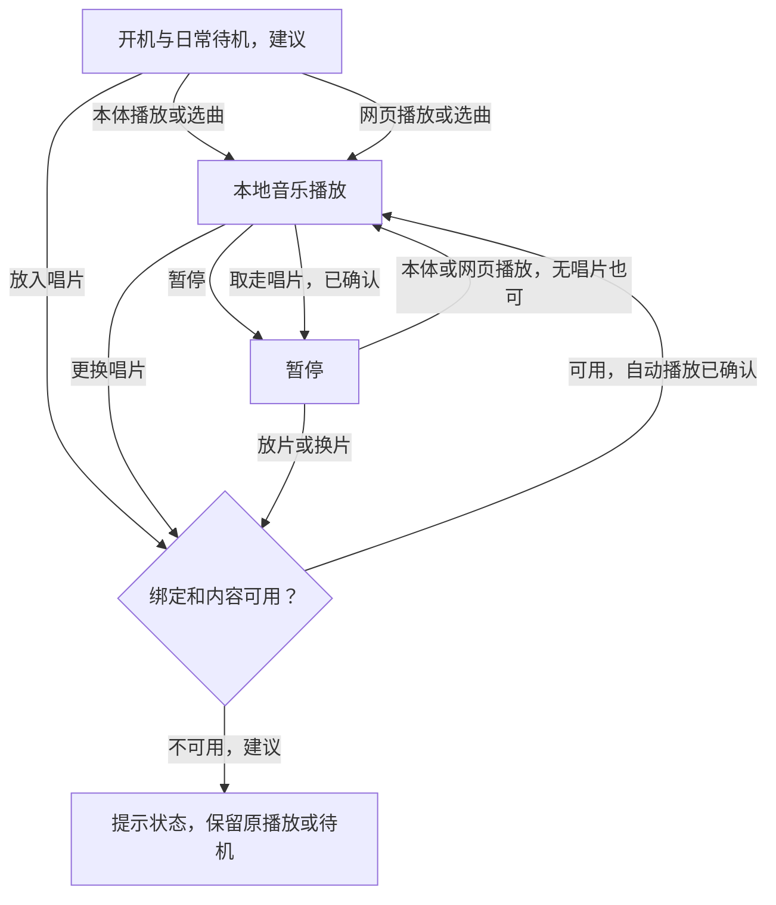

# 首版功能规格：评审稿

日期：2026-10-08。状态：功能选择中，尚未冻结首版范围或操作规则，尚未实现和实物验证。

已确认要求来自[项目简报](project-brief.md)及[决策记录](decisions.md)。本文件集中维护功能细节、操作草案、评审选项和验收计划；选型方法见[开发流程](development-process.md)，实际结果记入[验证记录](verification.md)。主控推荐与用户已确认决定分开记录。

## 功能审阅基础

本体能独立播放本地音乐，无唱片也能使用；唱片与本体、网页是并列播放入口，放片即播、取走暂停、换片播放新绑定内容，见D046。用户已选择本体能离线完成基本全部功能，AI留到后续扩展，见D042、D043。日常显示采用时间/日期、播放器状态、事件页面与静态图片切换，D045；具体实现先参考旧墨水屏项目。网络通过本地AP配置外部Wi-Fi。内置电池与Type-C边充边用是已确认要求。原型逐块验证，同阶段尽早改善音质，之后评审器件并集成单主板。

已确认需求继续作为设计基础。下表的“首版建议”是待整体审阅的发布规划，不能视作已批准的版本范围；重要功能延后或目标改变需用户落实。

| 编号 | 功能范围 | 已知状态 | 首版建议与需落实内容 |
|---|---|---|---|
| F01 | 本地音乐播放 | 独立播放与无唱片播放已确认，D013、D015 | 纳入；播放、暂停、切歌、音量与歌单选择。文件格式、顺序/随机/循环等模式及开机行为待审阅或验证 |
| F02 | 唱片与内容绑定 | 三类常规唱片已确认，插入或表面放置均可，D014、D017；入口规则已确认，D046 | 放片即播、取走暂停、换片播放新绑定内容；同一张持续在位不反复启动，无唱片仍可用本体/网页播放。未绑定与缺失内容反馈待审阅，识别器件和卡座形态待原型比较 |
| F03 | 本体离线操作 | 用户选择本体基本全部功能可操作，D042；控制器未定 | 本体菜单覆盖音乐、歌单、唱片绑定、生日入口、灯光、转动与已纳入的日常设置；具体管理操作见下表。按键/旋钮数量与手势在操作审阅后比较 |
| F04 | 前屏与日常桌搭 | 前屏及墨水屏参考方向已确认，D020、D025、D044；日常显示功能包已选择，D045 | 时间/日期与播放器状态纳入；推荐曲目、播放、电量、充电与网络状态等具体字段。事件和换图见F15、F16，中文曲名、刷新和离线校时需验证 |
| F05 | 灯光 | 音乐配合灯光及网页调整已确认，D004、D005 | 纳入；亮度、全关及与播放的配合。推荐提供常规与夜间设置，具体效果和联动待审阅 |
| F06 | 大唱片转动 | 希望实现，D017；未验证机械效果 | 纳入模块验证，提供可靠启动、停止和独立关闭的候选规则；由噪声、功耗及机构结果落实成品取舍 |
| F07 | 本地网页管理 | 控制、上传与绑定已确认，D005 | 纳入；曲库、歌单、唱片绑定、音乐与灯光控制，显示保存/上传结果。格式、容量、删除与播放中修改策略待细化 |
| F08 | AP配网与外部Wi-Fi | 配网路线及离线边界已确认，D023、D024 | 纳入；配置外部Wi-Fi或热点、反馈连接结果、离线管理入口。建议网络变化期间保持本地播放 |
| F09 | 电池与Type-C供电 | 内置电池、边充边用和尽量长续航已确认，D021 | 纳入；显示充电和低电状态、切换供电及安全结束充电。容量、续航、输入功率、低电提示和关机策略依据实测及审阅落实 |
| F10 | 生日唱片和菜单 | 范围仅一张唱片与一个菜单入口，D031 | 保留范围；推荐两个入口调用同一份本地内容。菜单位置、文字、歌曲、进入和退出规则待审阅 |
| F11 | 内容、绑定与设置保存 | 自行更新及长期使用目标已明确，具体保存契约未定 | 推荐保存歌曲、绑定及设置，重启后可用；失败操作给出状态，不破坏既有内容。恢复出厂与清除网络的操作待细化 |
| F12 | 天气与其他在线信息 | 候选，未列入本轮选定日常功能包 | 如需追加再评审服务来源、更新、过期状态和费用维护；联网失败时基础功能继续 |
| F13 | AI问答 | 用户明确留到后续扩展，D043；用途、输入与服务未定 | 本轮不安排AI功能实现；接口评审考虑后续用途，但不据此确定麦克风、语音唤醒或服务商。后续另评审价值、延迟、呈现、费用和离线边界 |
| F14 | 扩展与维护接口 | 希望预留扩展，D036；接口未选型 | 纳入接口评审；优先明确烧录、诊断和实际扩展用途，评估引脚、总线、供电、空间与软件资源，精确接口留到器件比较后 |
| F15 | 离线事件显示 | 用户已选择事件页面，D045；原作倒计时与累计事件作为参考 | 纳入；推荐本体可查看和设置，网页可批量编辑。事件类型、数量、时间粒度与到期行为待审阅，不自动增加闹钟或日期触发播放 |
| F16 | 静态图片切换 | 用户已选择，D045；原作换图指令作为参考 | 纳入；推荐切换已导入图片或封面，断网可用；格式、存储、字模和刷新方式待验证，不等同于动画或视频 |
| F17 | 离线语音指令 | 原项目采用VC02预设语音指令，本项目未选入 | 与AI分开评估；若有明确需要再比较识别、播放干扰、空间、功耗和成本。引用原项目不等于已决定增加麦克风或语音模块 |

音质、体量和续航是跨功能目标：模块阶段同期试听、试音腔和测功耗；最终尺寸和电池容量由实物证据及用户取舍确定。左右独立声道是当前推荐路线，具体音频系统仍需比较，不能根据扬声器数量推断成品音质。

## 墨水屏参考功能与本项目候选

2026-10-08实际读取[Juno-cyber/Xiaotian_Epaper固定提交README](https://github.com/Juno-cyber/Xiaotian_Epaper/blob/12ae6d740e2a28a43390a719fc71b2e7cf20b20a/README.md)，版本与采用边界见[来源记录](../references/sources.md#墨水屏作品)。以下核实的是公开说明，未验证原作品实物，也未移植代码。

| 原项目公开说明 | 本项目推荐用途 | 当前状态 |
|---|---|---|
| 时间显示、RTC及手动校时指令 | 时间和日期，与曲目及电源状态一起显示；本体可校时 | F04已选范围，具体字段、RTC和刷新待验证 |
| 倒计时事件、累计事件 | 日常事件页面，例如倒数日或距某次记录的时间 | F15事件页面已选；具体类型与操作待审阅 |
| 更换图片指令 | 在已导入的静态图片、唱片封面或日常页面之间切换 | F16已选；格式、存储和导入方式待落实 |
| VC02离线语音控制 | 可独立比较的控制入口 | F17候选，尚未选择；不等于AI问答 |
| README未列明天气、在线AI | 如需增加，另调研来源、服务与断网行为 | 天气F12未定；AI F13按用户要求后续扩展 |

用户已选择时间/日期、播放器状态、事件页面与静态图片切换，D045。事件和静态画面适合按需刷新，原项目语音控制作为独立候选继续评估；材料与实物能力仍需核实。

## 本轮三项选择

本轮三项选择均已落实到下表与决策记录。范围及明确的唱片行为已经确认，具体界面、控件、内容管理等其余规则仍待审阅。

| 评审项 | 已确认方向 | 尚需细化 |
|---|---|---|
| Q1 日常显示与联网扩展 | 时间/日期、播放器状态、事件页面、静态图片切换，D045；AI后续扩展，D043；AP配网按D024 | 页面字段、事件类型/数量、图片格式/导入与刷新；天气和离线语音尚未选入 |
| Q2 本体控制范围 | 本体离线操作覆盖基本全部功能，D042；网页提供另一个控制与管理入口 | 具体菜单、控件、手势与管理操作范围 |
| Q3 唱片入口及取片行为 | 放片即播、取走暂停、换片播放新绑定内容，D046；持续在位不重复启动，无唱片仍可播放 | 歌单起始位置、切换反馈、未绑定与缺失内容状态，以及识别稳定性 |

Q1中的基础功能包包括音乐、唱片、网页管理、AP配网和电池充电要求，日常显示选择不取消这些已确认要求。AI已留到后续扩展，不再把首版文字AI试验作为当前待选项。

## 本体与网页的操作覆盖草案

本体基本全部功能可操作是已确认方向；以下是推荐的具体覆盖表，管理范围与编辑方式尚未逐项获批。“离线”不需要互联网；本体日常使用也不需要手机持续连接。导入新文件需要实际文件来源，不将已有文件的操作和导入混为一谈。

| 操作 | 本体建议覆盖 | 网页建议覆盖或依赖 |
|---|---|---|
| 音乐与歌单 | 选曲、歌单、播放/暂停、切歌、音量、播放模式及已有歌曲的歌单编辑 | 相同控制及较方便的批量整理 |
| 唱片与生日入口 | 给识别到的唱片绑定已有内容、查看或解除绑定、进入一个生日菜单 | 同一套绑定与内容设置；生日仍仅一张唱片和一个菜单入口 |
| 灯光与转动 | 亮度、全关、运动开关及已确定的模式 | 相同设置，状态与本体一致 |
| 日常显示 | 时间设置、页面选择、记录/编辑事件和切换已有图片 | 事件文字和图片整理更方便；范围已按Q1落实，具体编辑方式待审阅 |
| 内容与设备设置 | 已有内容管理、保存状态、容量、电量、网络状态、开启AP及清除网络等候选操作 | 上传歌曲/图片、批量管理、按D024配置外部Wi-Fi；设备AP无需互联网 |
| 新文件导入 | 存储卡导入或Type-C数据等路径待比较，不因“本体完整操作”直接决定硬件接口 | 本地网页上传已确认；本体是否还需独立导入路径单独审阅 |

不把本体完整操作静默缩减为仅能暂停、切歌和调音量。批量编辑、删除、恢复出厂等管理规则继续审阅；原型控制器与屏幕刷新需能支撑选择后的菜单。

## 日常操作草案

本节按行区分已确认规则与待审阅建议。本体操作范围、日常功能包、AI安排和D046唱片行为已确认；其余具体规则继续审阅。

| 情景 | 建议行为 | 状态或待定点 |
|---|---|---|
| 无唱片开机 | 显示日常界面并待机；用户操作后播放上次歌单，首次使用通用清单 | 开机是否自动播放、默认清单待审阅 |
| 放入已绑定唱片 | 调用绑定歌曲或歌单并播放；显示识别及内容状态 | 放片即播已确认，D046；歌单起始位置和反馈待审阅 |
| 播放中换片 | 播放新绑定内容；建议保留当前音量，同一张持续在位不反复启动 | 换片播放和不重复启动已确认，D046；音量规则及读取稳定性待落实 |
| 取走唱片 | 暂停播放；无唱片时可通过本体或网页再次开始播放 | 取片暂停及无唱片播放已确认，D046、D015；灯光和运动联动另审阅 |
| 未绑定或内容缺失 | 显示具体状态，保留当前播放与控制，网页可重新绑定 | 推荐规则待审阅 |
| 播放、暂停及切歌 | 本体可操作，网页显示一致的状态 | 本体覆盖方向已确认，具体控制器和手势待审阅 |
| 无唱片选择歌单 | 本体菜单可选择，网页提供另一个入口 | Q2已确认；歌单编辑和默认内容等细则待审阅 |
| 暂停与转动 | 建议暂停时停止转动，再次播放可恢复；转动允许独立关闭 | 联动、转速和控制方式待审阅及实测 |
| 夜间 | 建议关闭转动，灯光调暗或全关，音乐仍可播放 | 夜间切换及屏幕可读性待审阅验证 |
| 生日唱片与菜单 | 建议共用本地内容及播放界面；未配置时明确显示状态 | 本体菜单方向已确认；位置及退出是否恢复之前内容待审阅，不增加日期自动触发 |
| 上传或编辑内容 | 显示进度和保存结果；建议进入管理时先暂停音乐 | 是否允许并发播放及删除当前歌曲等行为待评审 |
| 断网与配网 | 本地播放和操作继续，联网扩展显示不可用或最后更新时间；保留手动AP入口 | 状态反馈与进入方式待细化，不自动清除已有网络配置 |
| 插拔Type-C | 正常负载下切换供电，显示实际充电状态 | 输入功率不足、低电量和停机行为待电源模块验证及审阅 |

图示包含已确认的唱片规则和仍为建议的开机/错误反馈，不是固件实现或运行证据。模块接口与程序依据已确认规则制定，其余行为在审阅后落实。

## 验收计划与追溯

以下是建议测试计划，全部尚未执行；通过条件随功能审阅和真实器件能力落实。原型、集成板与成品分别记录结果，改变电路、布局或结构后复核受影响项目。

| 测试编号 | 对应功能 | 建议验证内容与证据 |
|---|---|---|
| T01 | F01、F03 | 用可本地播放的实际素材，分别记录WAV、MP3及其他最终选择格式；左右测试音验证推荐立体声路线。断网、无手机持续连接连续播放30分钟，记录断音、重启及本体控制 |
| T02 | F02、F10 | 三张常规唱片与一张生日唱片分别绑定，各取放20次是建议标准；核对放片即播、取走暂停、换片播放新内容、持续在位不重复启动，以及无唱片用本体/网页再次播放；记录未绑定及内容缺失反馈 |
| T03 | F03、F04 | 断开互联网和手机持续连接，用本体完成已审阅的音乐、歌单、绑定、生日、灯光、转动及设置操作；检查中文曲名、状态一致、刷新不打断音乐，记录离线时间保持、校时和低光可读性 |
| T04 | F07、F11 | 网页控制与实物一致；上传完成后确认成功，重启后歌曲、绑定和设置仍可用。中断上传和保存失败时核对原内容状态，记录实际文件和容量限制 |
| T05 | F08 | 正确及错误网络配置分别测试，显示结果和重试入口；外部网络断开后本地播放继续，设备AP中的管理入口可用；不在公开记录中保存网络密码 |
| T06 | F09 | 在预期负载下记录Type-C切换、同时使用与充电、输入限制、充满结束、低电行为和温升；容量、平均/峰值功耗及完整续航单独实测 |
| T07 | F05、F06 | 灯光低亮与全关、可靠停转；整合运行及夜间试听，比较电机和灯光开关对声音、供电和功耗的影响 |
| T08 | F10 | 一张生日唱片和一个菜单入口的配置、进入、播放及退出按审阅规则测试；如果采用共用内容建议，核对两入口内容一致 |
| T09 | F12、F13 | 仅在选择纳入后制定：验证实际日常价值、在线状态、响应/更新时间、断网反馈、音乐恢复和服务费用。AI属于后续扩展，不是首版验收条件；不把网页或模型演示当成成品已实现 |
| T10 | F14 | 接口评审核对用途、引脚、电平、供电与资源占用；确认扩展未连接时核心功能仍能正常使用，保留必要诊断和维护入口 |
| T11 | F15、F16 | 按落实后的操作规则，断网时用本体设置/查看事件和切换已有图片；检查时间边界、重启保存、实际刷新和音乐并发，不把事件显示自动当作闹钟或日期触发播放 |
| T12 | F17 | 仅在选入后制定：预设指令在静音和听歌条件下分别验证，记录误触发、识别与功耗；离线语音和AI问答分别验收 |

每条实际结果引用测试编号、板卡或PCB版本、固件版本、接线和供电条件。功能状态按“需求/建议、选型、实现、验证”分别记录；编译通过、模拟和实物通过是不同证据。

## 下一轮收敛

Q1–Q3均已落实，AI已留到后续。下一轮审阅开机、通用歌单、播放模式、事件类型/数量、图片导入、夜间、生日退出和内容管理等剩余规则，再比较具体控件。首版范围和关键操作充分明确后，形成声音与存储等模块的候选比较及暂选试验方案。材料盘点、官方资料查阅和不依赖操作决定的实验准备可继续。
