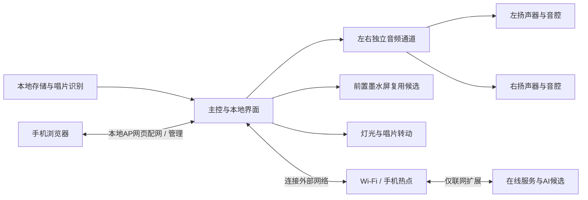
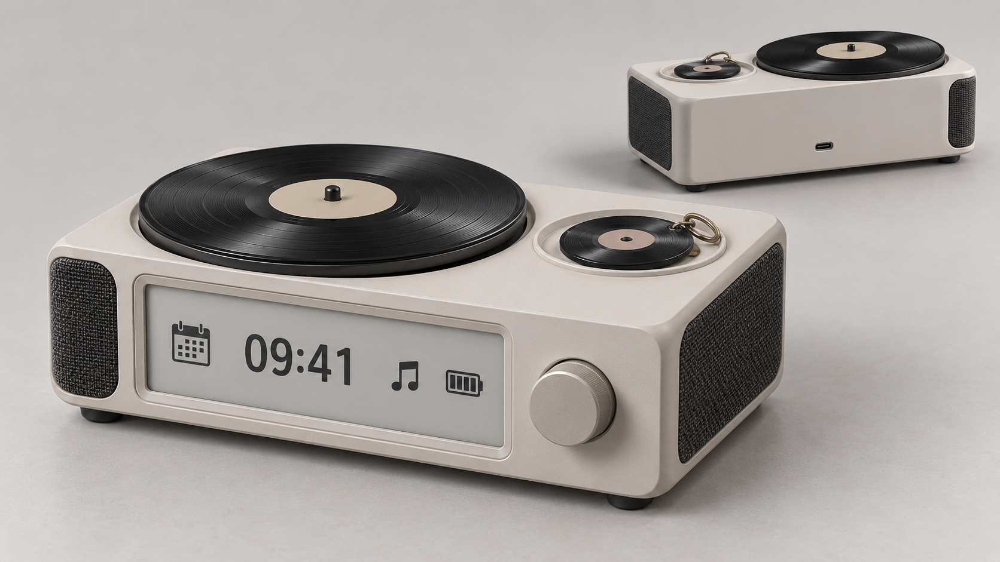
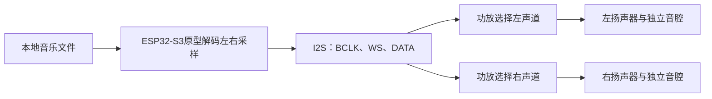
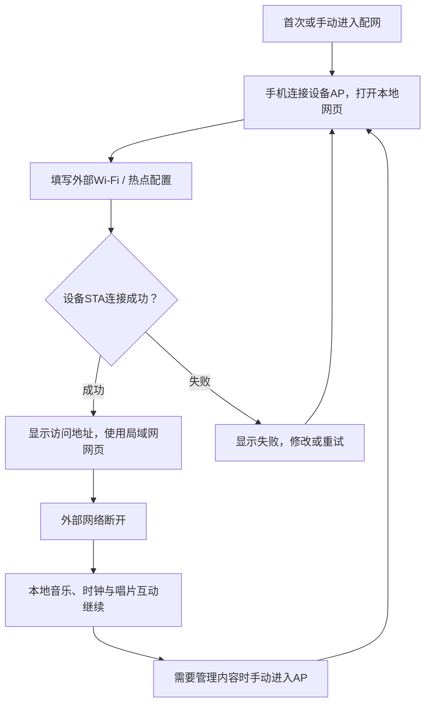
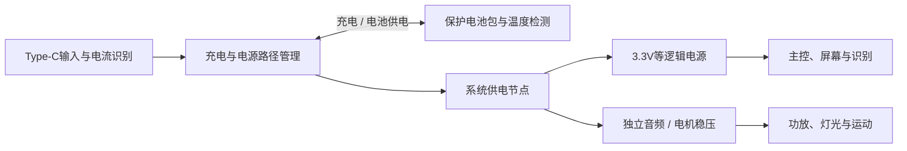
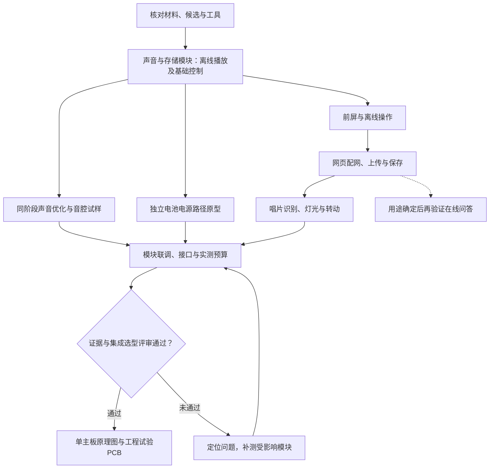

# 下一步：双声道、前屏与电池唱片桌搭

日期：2026-10-08。本轮继续规划，尚未开始固件实现、采购或实物制作。

## 最新约束与推荐方案

用户补充原话：“能实现更好，其次插入还是在表面我也都可以”。据此，转动保留为希望实现的效果；小唱片插入本体或放在表面均可，不把插入视为必须实现的装入方式。对应决定为 [D017](decisions.md)。

用户进一步要求整体不要太大，并强调音质不能牺牲，见D018、D019。具体厘米数没有选定；尺寸应由满足试听目标的扬声器和音腔反推。

最新推进顺序按D036–D041：先在面包板、洞洞板或现成模块上逐块验证，模块阶段同步争取好音质，评审扩展接口。功能、芯片与模块经过调研比较和审阅后选择，再集成一块主板，利用适用免费打样试制；成品PCB与外壳按性能和装配并行设计。当前不设参考设备，详见[开发流程](development-process.md)。

主控推荐以 **水平唱片机＋静止、平放的小唱片凹座** 为下一版规划基础。大唱片负责视觉转动；小唱片挂件作为内容入口，读到标签后调用本体歌单。平放可减少挂件对总高的影响。先完成声音、网页更新与识别，再测试电机及传动。

本轮新增要求见D020–D023：评估左右出声与前屏，内置较大容量电池及Type-C边充边用，续航尽量长，原理图与PCB先定嘉立创。随后按D042–D046明确本体离线操作覆盖基本全部功能，AI留到后续；日常显示采用时间/日期、播放器状态、事件和静态图片切换。唱片作为并列入口，放片即播、取走暂停、换片播放新绑定内容。推荐下一版采用左右独立声道、前屏和可验证的电池电源路径；屏幕器件、容量和控制器尚未选定。

最新落实D024–D026：本阶段先连接外部Wi-Fi，通过设备本地AP网页配置；前屏优先评估旧墨水屏项目复用；使用gpt-image-2生成一张实体效果图，已交付外观概念。左右独立声道仍是主控建议，实际板卡、屏幕与尺寸待核对。按D031，生日相关内容仅保留一张生日唱片和一个菜单入口，详细内容与交互待设计。

## 最新系统关系

这是功能架构建议，不代表器件选型或接线图。ESP32-S3带PSRAM仍可作为原型候选，用于存储播放、屏幕、网页和在线服务连接；不把它认定为能本地运行通用大模型的处理器。接口、内存与并发负载需验证后再确定正式芯片。

## 体量与布局重新核对

最新布局候选为左右侧面出声、前面显示、顶部唱片互动。左右单元先分别做音腔，电池与电路另留安装区；听音区域的侧向出声和稍向前倾斜的出声方案需要比较。两只喇叭不自动等于更好的音质，紧凑机身的声道间距也不能承诺宽广声场。

本次实体效果图以gpt-image-2模型名生成，一张图展示正面和背面两个视角；前屏、旋钮、大转盘、静止挂件凹座和后部Type-C便于审阅。[公开提示词](../assets/concepts/epaper-product-render-prompt.md)保留外观意图。配色只是中性探索，图中格栅转角与两视角细节不作为扬声器位置或数量的定稿。图像未验证比例、内部容积、音腔、旋转间隙、识别距离和装配，也不是可编辑3D模型。

[上一轮功能位置示意](../assets/concepts/stereo-display-layout.png)及[可编辑位置图](../assets/concepts/stereo-display-layout.svg)保留为历史分区参考，其发光屏幕表现不作为最新墨水屏目标。

[上一轮体量图](../assets/concepts/compact-footprint.png)及[可编辑图](../assets/concepts/compact-footprint.svg)仅作历史占地参照。15 × 11 × 5.5 cm和12 × 9 × 5 cm均未验证能容纳本轮双音腔、前屏、电池、电机与电路，不能作为本版外壳目标或上限。先核实扬声器、屏幕模块和电池的实际尺寸与音腔要求，再出新的布局及总外形。

最终最大外形计入挂件、挂扣、旋钮、脚垫和转盘突出部分。若声音或续航所需空间影响小巧要求，展示具体体量、收益和费用后由用户落实，不以缩减音腔或静默降低目标满足尺寸。

## 左右声道与前屏

第一轮一个MAX98357A是单声道播放通路候选。下一版建议传输立体声音频，左右分别驱动，先用两个MAX98357A模块各选左/右声道或一块真正双声道I2S功放模块验证。两个模块若都输出左右混合内容，仍是双单声道；要用左右测试音确认声道和接线，再做试听。最终功放根据单元、响度、失真、功耗与供电能力选择。

ESP32-S3原型解码歌曲后，用I2S传输左右采样。BCLK为位时钟，WS/LRCLK标记左右声道时隙，DATA携带音频数据；两个单声道模块可共用这些信号，分别设置为左或右。具体SD/MODE电阻取决于模块电路，准确板型确认后再出接线。左右区分提供录音中已有的空间定位，单声道音源两边相同属于正常情况；单元、音腔和供电仍决定实际听感。

前屏改为优先评估此前墨水屏项目，核实来源为Juno-cyber/Xiaotian_Epaper，固定提交和文件见[来源记录](../references/sources.md)。原作品使用2.9英寸、296×128屏，驱动支持黑白及黑白红，当前代码默认黑白红；用户现有屏型号和完好状态仍未盘点，不能假定就是这一配置。

原项目以STM32F103CBT6为主控，墨水屏底层依赖STM32 HAL GPIO，包含局刷与深睡接口。可评估复用屏幕、页面布局、RTC及刷新逻辑；若原型采用ESP32-S3，需要移植底层与任务调度，不能直接烧原STM32固件。原README对黑白屏写全刷约3秒、局刷约0.6秒，这不是所有屏的刷新保证，不能直接套到三色屏或未盘点的实物。

墨水屏适合低功耗静态时间、曲目与电量；它本身不发光，低光可读性需评估，不按高帧率动画或滚动歌词设计。驱动刷新单独调度，避免BUSY等待阻塞音频。若后续用途对动态界面有明确需求，再展示实测差异并落实取舍。先用旋钮/按键操作，触控仍未确定。

日常显示包已按D045选择时间/日期、播放器状态、事件页面与静态图片切换。具体字段建议包括歌曲、播放、电量与充电状态；离线时钟需要可校时、掉电后保持的RTC方案验证，联网时间同步可辅助校时。原墨水屏事件与换图功能的参考边界见[功能对照](function-spec.md#墨水屏参考功能与本项目候选)。天气、提醒与歌词仍是候选，AI已留到后续。

## 网络与AI的边界

按D024，本阶段先用外部Wi-Fi或手机热点，通过本地AP网页配网。若采用ESP32-S3，外部网络需支持2.4 GHz；首次或手动进入配网模式，手机连接设备AP并打开网页，填写网络名称及密码，设备保存配置后尝试STA连接。失败应显示结果并保留重试或修改入口，重连期间本地播放继续。设备AP提供本地网页，不自动提供互联网；连入外部网络后的网页访问地址需在屏幕显示并实测手机可访问性。

用户提到的“移动Wi-Fi模块”若指随身蜂窝联网，需要SIM/流量、天线、电源与额外空间。当前外部网络路线已按D024落实；内置4G/5G只在用途明确、确需脱离现有网络仍在线时另行评估。

| 功能候选 | 网络条件 | 当前建议 |
|---|---|---|
| 本地听歌、唱片互动、基础屏幕与灯光 | 无网可用 | 保留为核心；时钟需RTC与校时验证 |
| 网页控制、上传与绑定 | 同一局域网或设备热点，无需互联网 | 完成反馈与保存验证，不依赖AI服务 |
| 天气等在线信息 | 需要互联网 | 先判断日常价值，断网显示最后更新时间 |
| 文字问答 | 需要互联网及服务 | 后续扩展：用途确定后比较网页输入和设备呈现，尚未选定输入方式 |
| 语音问答 | 需要互联网、麦克风及语音服务 | 后续扩展：若确定要做，推荐先按键说话、暂停音乐后问答，再评估唤醒词与回声消除 |

用户已按D043把AI留到后续扩展；本轮不安排实现，也不固定麦克风、唤醒方式或服务商。后续先形成实际有用的情景，再验证识别、问答、显示/播报与恢复音乐。联网延迟、断网反馈、长期服务费与维护也影响交付；服务密钥由受控后端管理，不嵌入公开网页或仓库。离线通用AI问答不列为承诺功能。

## 电池与Type-C边充边用

这一要求可实现，关键是充电与系统负载有明确的电源路径管理。推荐评估单节成品保护锂电池、带Power Path的开关充电方案、系统稳压与电量检测；BQ25895是已核实的候选，不是最终选择。不能把普通TP4056模块加电池直接带负载视作已满足边充边用与充电终止要求。

图中稳压轨为候选，按最终负载确定。BQ25895的SYS不是固定5 V；如果选择5 V音频轨，需要单独匹配稳压/升压路径，不能假设其OTG输出可在充电时同时提供整机5 V。原型先验证电源板实际引出的接口和工作模式。

插入Type-C后，输入优先支持系统负载，剩余功率用于充电；拔掉后由电池供电。输入受限时应减少充电电流，必要时电池补充供电。因此“正在使用时始终以最大电流充电”不作为承诺。Type-C接口要核对CC连接、可用输入电流与适配器能力；需更高输入功率时再评估PD，不把接口外形当成功率保证。

续航记录为“尽量长”，不擅自设定4小时或10小时验收。可用6000/10000 mAh的1S成品电池包作能量与空间比较起点；容量、电压、保护和实际尺寸需核实，不能只看商家标称。以下只是能量预算示例，平均功耗未经测量：

| 电池示例，标称3.7 V | 标称能量 | 假设总可用比例85%、平均功耗3 W的估算 |
|---|---|---|
| 6000 mAh | 22.2 Wh | 约6.3小时 |
| 10000 mAh | 37 Wh | 约10.5小时 |

平均功耗包含音乐、屏幕、主控、灯光与运动；电池容量不能由功放额定功率直接反推。先测日常听歌、静态桌搭、AI联网和待机的平均及峰值功耗，之后给出实际电池选择、重量、续航和充电时间。墨水屏按需刷新与深睡、空闲时关闭不需要的功放/电机及网络工作方式可作为省电候选，需验证不影响使用。

原型应覆盖插拔Type-C不重启/不断音、使用同时充电、充满后正确结束充电、低电量停机、最高预期负载下的输入限制，以及电池/充电芯片温升。充电电流按电芯资料、NTC测温与热设计确定；保护与充电管理分工核对后再做正式电路。

## 嘉立创原理图与PCB

按D022使用嘉立创平台，建议以嘉立创EDA专业版保存可编辑原理图与PCB工程。具体版本与当前工具接入方式在开始画板时核实。本轮不提前定层数或制造参数。

原型后形成接口表、电源预算、候选比较与结构定位，按D037以一块主板集成主控/存储、音频、屏幕接口、充电/保护/稳压、识别及电机灯光控制。屏幕、扬声器等按位置连接到主板；若确需分板，先提交证据与取舍，由用户落实目标变更。PCB与外壳共同检查音腔、屏幕开窗、电池固定及更换、天线净空、NFC与金属/电池的距离、Type-C插拔和维修路径。

设计交付包括嘉立创源工程、原理图PDF、BOM、Gerber/钻孔及需要的贴片坐标；电源电流、热设计、封装引脚与ERC/DRC分别审查。检查通过后按用户授权打样，制板结果仍需实物验证。

工程试验PCB和成品PCB分别维护版号、板形和布局。试验板按[已查免费打样条件](development-process.md#嘉立创免费打样规则核查)与每轮实际资格试制，记录问题和改动；成品板不受免费券尺寸及工艺设计限制，按外壳和声音需要调整尺寸、走线与材料。成品PCB和结构可并行，改变布局后重测受影响项目。

## 音质如何验收

按D036，在模块原型阶段同步争取更好的音质；当前不设参考设备，也不将声音参照作为启动条件。建议在桌面约0.5–1 m距离，用同一音乐文件、相近响度比较每轮扬声器、音腔、功放和供电改进；这是拟定试听条件，尚未确认或实测。歌手唱片与通用唱片使用同一套音频系统，不靠标签或装饰转盘产生声音。

| 检查项 | 建议试听内容与通过方向 |
|---|---|
| 人声与层次 | 清唱、人声与伴奏较密的片段都听得清；齿音、共振和闷声不影响长时间听歌 |
| 低频与响度 | 用用户实际喜欢的音乐确认厚度、节奏和常用音量；不能仅以“能发声”判断通过 |
| 失真与底噪 | 常用及较大音量没有明显破音、箱体杂响；暂停和低音量时没有明显电流声 |
| 灯光与转动 | 相同片段比较灯光、电机关闭和开启后的听感；检查供电干扰、机械声和箱体振动 |
| 整合后的声音 | 音腔试样、装入结构、装上网罩后分别试听；最终装配仍达到用户认可的目标 |

第一轮MAX98357A与40–50 mm、4 Ω/3 W扬声器是验证播放通路的候选，不是最终声音选型。下一版按左右独立输出验证两只候选单元，功率标称不能替代音质验收。扬声器、各自可用音腔、密封、箱体共振、功放和供电一起验证；根据库存建立试听样箱，必要时再比较更合适的单元和匹配功放并说明费用变化。最终单元与音腔形式留到试听结果后确定。

## 卡座与转动如何配合

卡座先试表面平放浅凹座，留出手指拿取缺口和挂扣位置，识别线圈位于标签下方。挂扣和小唱片应避开大唱片的转动区域；小唱片尺寸、标签位置、凹座深度和附近金属需一起试验。图中挂件大小只作占位，不能据此判断能稳定识别。

若平放的拿取、挂扣容纳或读卡不合适，再试半露浅槽。用户接受两种方式，因此依据整体尺寸、取放便利和识别稳定性选择，不提前固定槽形。

大唱片由独立轴承/支撑承重，电机通过传动带或合适联轴件驱动，先比较噪声与运行稳定性。传动方式、转速和电机型号不提前冻结。电机停止时仍能正常播放音乐；夜间建议停止转动，灯光可降亮或全关。转动体验若不合适，先报告实测结果与处理建议，再落实成品取舍，不静默取消这项期待。

原型台架先用纸板/泡沫板或现成盒体试取放及布局；正式可打印模型、PCB和完整外壳在模块验证后确定。第一轮本体尺寸只作布局参考。

## 整体方案还需补齐

| 项目 | 本轮补充的建议与待落实内容 |
|---|---|
| 内部布局与维护 | 为左右扬声器留可验证的音腔；电池、电机和电路有明确安装区。检查出声方向、屏幕开窗、存储卡访问和可拆后盖；原型验证隔振与密封 |
| 供电与线缆 | 验证Type-C边充边用与电池续航，按整机实测电流匹配电源和稳压；容量、充电速度及PD待验证。线缆与接口位置纳入摆放检查 |
| 三类挂件 | 正面图案、背面标签和挂扣一起设计，绑定内容可重设。余下挂件的存放方式待审阅，暂不为收纳扩大本体 |
| 离线操作 | 按D042覆盖本体基本全部功能，评审音乐、歌单、绑定、生日和设置等菜单；开机默认、换片和取片规则集中在功能规格审阅 |
| 网页更新与联网 | 配网、连接入口、支持格式、容量显示、上传进度、失败提示和保存反馈需明确；无网保留本地功能，重启后保留内容与绑定 |
| 夜间使用 | 灯光可全关、电机可停止，先保证日常操作易懂 |
| 生日唱片与菜单 | 仅一张生日唱片和一个菜单入口，复用本地内容绑定；文字、歌曲、入口与操作待审阅，尚未实现 |

## 日常操作草案

首版范围、本体操作、开机、放片、换片、取片、生日入口、夜间和内容管理的规则集中维护在[功能规格评审稿](function-spec.md#日常操作草案)。本体操作、日常功能包、AI安排和基本唱片行为均已确认，具体状态见[评审项](function-spec.md#本轮三项选择)；其余细则继续审阅，避免两个文档分别维护不同操作版本。

## 按证据推进原型

下图是模块阶段的建议验证关系；选型评审、试验板迭代和成品制作遵循[开发流程](development-process.md)。

| 阶段 | 需要核对的材料 | 阶段完成证据 |
|---|---|---|
| 小模块声音与存储 | ESP32-S3带PSRAM参考、两个可选左/右声道的MAX98357A或双声道I2S功放、两只单元、microSD、编码器、外接电源 | 左右测试音声道正确；WAV与实际MP3分别记录；离线连续播放30分钟无明显断音/重启；本体播放、暂停与音量可操作 |
| 同阶段声音优化 | 两只匹配单元、独立可调整音腔试样、匹配功放与供电 | 同文件、相近响度比较各轮人声、低频、响度、底噪及失真；记录听感、尺寸、功耗与费用，最终声音另行验收 |
| 电源原型 | 带Power Path的充电评估模块、保护电池包、温度检测、匹配稳压和电量检测、Type-C输入与适配器 | 插拔输入不重启/不断音；负载下充电行为正确；记录电流、平均/峰值功耗、充满结束、低电停机和温升 |
| 前屏与离线 | 优先核对旧墨水屏及驱动板、旋钮/按键、RTC候选 | 文字与界面可读，核对局刷/全刷及低光体验；刷新时音乐不断；无网操作音乐和基础显示；电量/充电状态与实测一致；时间保持与校时可用 |
| 网页与更新 | 前一阶段硬件，手机浏览器、Wi-Fi或手机热点 | 配网与离线入口可用；切歌、音量与实际状态一致；上传完成才确认成功；重启后内容与绑定保存；中断上传不破坏已有内容 |
| 小唱片互动 | PN532参考、三类常规唱片、一张生日唱片和一张未绑定测试标签，临时卡座 | 四张已绑定唱片各取放20次，无误切；生日唱片与菜单指向同一内容；停留不反复触发；未绑定标签有明确状态；拟定壳厚和布局中测试 |
| 灯光与操作 | WS2812、适配电平转换、编码器与按钮、漫射材料 | 离线操作可用；低亮与全关可用；夜间无直视刺眼灯珠 |
| 转动与整机 | 电机、匹配驱动、支撑和传动试样、屏幕、电池及整合样箱 | 整机一起运行30分钟无重启；可可靠停机；低音量音乐不被机械声盖住；复核整合后音质；续航完整放电测试另行记录 |
| AI探索 | 用途确定后核对在线服务、后端与可能需要的麦克风 | 验证实际问答价值、延迟、断网反馈及音乐恢复；服务费与维护落实后再确定交付范围 |

以上是建议验收标准，尚未实测。具体接线和GPIO分配在准确板型及模块确认后制定；正式音频格式、容量和音质目标依据真实素材与试听落实。

## 第一阶段：小模块功能原型

建议先调研声音与存储模块，再暂选器件制作能独立播放、可区分左右声道的台架；按D036在同一阶段尽早改善音质。当前不设参考设备。以下是候选核对清单，完整选型报告尚未形成，不是已确认库存、最终型号或采购单。

| 材料 | 建议数量与参考 | 第一阶段用途 |
|---|---|---|
| 主控开发板 | 1；ESP32-S3-DevKitC-1-N8R8功能规格参考，带8 MB PSRAM | 读卡、解码、I2S输出及本体控制；正式芯片仍在原型后确定 |
| 音频功放 | 候选示例：2个可分别选左/右的MAX98357A，或真正双声道I2S模块 | 比较独立左右输出、声音、功耗及成本；准确模块电路核对后接线 |
| 扬声器与试样材料 | 2只匹配候选单元；尽早制作独立可调整音腔 | 同阶段验证声道与试听表现；已有40–50 mm仅为通路参考，按实测比较单元与音腔 |
| microSD与接口板 | 各1；16/32 GB卡与3.3 V逻辑兼容接口参考 | 使用同一存储完成本地播放与后续上传验证 |
| 带按键编码器 | 1 | 无唱片时控制播放、暂停和音量，具体手势待审阅 |
| 稳压供电与配电 | 1套；5 V/3 A为台架起点，按实际模块核对 | 先稳定验证声音，测量日常与峰值负载；不代表整机充电电源已选定 |
| 音频、工具与线材 | 2–3个能本地播放的音频文件，焊接与测量条件待核对 | WAV与实际MP3分别验证，记录模块、接线、供电和观察结果 |

功放直接从核对后的供电分支取电，不通过开发板3.3 V输出供电。电脑USB调试与外部供电的并接方式按实际开发板原理图核对。电池电源路径是后续必须验证的组成部分，台架外接电源测试不能替代边充边用验收。

建议的功能通过条件：左、右测试音分别由对应扬声器发声；WAV与实际MP3分别记录解码及播放结果；至少一种已记录格式在不连接外部网络、无手机持续连接时播放30分钟，无明显断音或重启；本体可播放、暂停及调音量。此阶段记录底噪、破音、响度等问题，功能通过不等于成品音质通过。

模块阶段在相同音乐与相近响度下逐项比较扬声器、音腔、功放及供电，记录人声、低频、底噪、失真与功耗变化，条件允许时尽早获得更好的声音。随模块验证核对墨水屏、电池、电源板、识别线圈和电机的尺寸，形成内部区域布局与整机外形候选；原有15厘米/12厘米效果参照不能代替容纳与装配检查。

若清单中的开发板、双功放、扬声器、存储、编码器、外接电源与线材均需购买，第一阶段暂留约150–350元的规划区间。这是未询价估算，不含电烙铁、万用表、正式外壳、屏幕、电池电源路径、识别、灯光与电机；库存复用、实际规格与供应商报价核对后更新，不作为新版整机总价。

本轮优先核对准确材料型号、可本地播放的音乐文件和焊接/测量条件，形成适用候选的性能、价格与实现成本比较，再制定暂选接线及最小采购缺口。声音参照不阻塞这一阶段；声音改善与模块验证同步推进，其余模块逐项加入，正式芯片与集成板在证据和选型评审之后落实。

## 现在最有用的材料盘点

可直接填写 [材料与工具盘点表](../hardware/inventory.md)。先看开发板、音频模块、扬声器、存储卡、电源和焊接/测量工具，再看识别、灯光及电机。型号不清楚或未测试的项照实记录，不要求先买齐所有模块。

原[第一轮材料估算](first-round-review.md#材料核对清单)约190–420元只对应旧模块范围。本轮双声道、前屏、电池及电源管理需重新形成分阶段预算；AI可能另有服务费用。先按库存去重、核对候选规格及报价，再列采购项与声学/结构试样费用，不沿用旧估算为新版总价。

库存、素材和打印条件仍未核实。本轮按实验依赖推进；生日唱片与菜单不依赖具体日期，操作审阅后再纳入本地功能验证。
