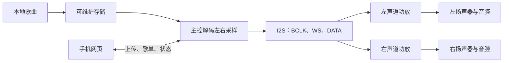
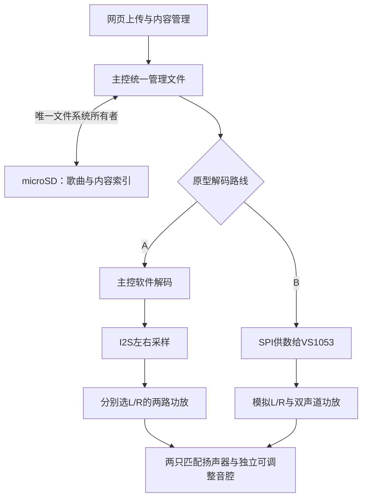
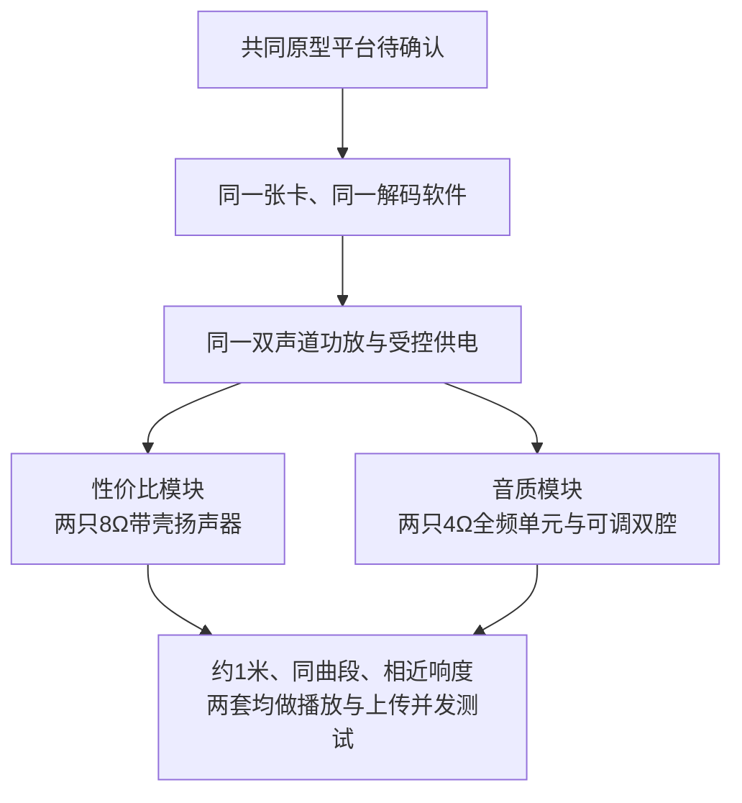

# 音频与存储专项

对应 F01、F11、F14，目标是先形成能离线播放、可上传更新、能验证左右声道的最小链路，再以音腔、功放、供电和扬声器试听提升音质。

## 已确认与边界

- 本体是通用本地播放器；无唱片时也能播放。推荐歌曲存于本体、小唱片承载身份，存储介质与挂件识别方式仍需比较后确定。
- 左右独立声道是当前评估路线。两个单声道I2S功放必须分别选择左/右时隙并用测试音确认，两个都播放左右混合仍然是双单声道。
- 本地网页需要管理曲库、歌单、上传和保存；具体格式、容量、顺序/随机/循环和开机行为待验证。
- 模块阶段同步做音质比较，功能通过不等于成品音质通过。
- D054已登记：网页上传新歌曲时保持播放，允许上传变慢；无断音能力在原型中验证，当前不是已通过的并发结果。
- D059：既有墨水屏方案按已有材料处理，接入时再核对版本、供电和引脚；本专项按新音频、存储模块准备，不以全面旧库存盘点为前置。
- D063：已确认S3模块验证、成品以S31为主；准确原型板和内存配置由[主控专项](../platform/README.md)牵头推荐，总规划协调联合审阅。DevKitC-1-N8R8 v1.1仍是板型建议，软件解码与音频外围尚未获批准。

本轮收敛见[第二轮音频原型具体选型](#第二轮音频原型具体选型2026-10-08)。以下示意为软件解码推荐链路，阶段主控方向已定，解码与输出器件仍待审阅。迁移到S31按[平台迁移表](../platform/README.md#s3验证到s31成品主线)重核GPIO、I2S/MCLK、SD、内存与USB，重验声音、上传并发和电流；不沿用S3二进制或直接继承通过记录。

### RC-05A · 单次点播与模式循环的播放接口边界（2026-10-09）

已确认产品行为：A仅触发普通单曲、取走不停播，不应注册持续`A模式`；B/C进入持续模式，绑定单曲或歌单时默认循环，B真实离座停止清空且再放从起点启动，C离座保持。建议音频层提供`PlayNormal(track_id)`、`StartMode(session_id,target,loop)`、`ModeSkip(session_id)`、`Pause/Resume(session_id)`、`StopAndClearMode(session_id)`等职责**而非冻结API签名**。

异步音频EOF、失败回调和停止完成必须校验当前`session_id`或播放器版本；旧B停止已提交后，新A/网页单曲不应被旧回调误停。模式暂停时自然EOF回调不自动恢复播放；B/C单曲/歌单EOF循环是正常规则，文件不存在、SD移除或读写错误**不是**正常EOF，不允许立即无间隔重试形成错误循环。新操作已获校验但启动途中失败后的模式恢复策略、显式STOP和MODE_EXIT的区别仍待用户评审。本节是产品与音频的接口规划，未经编译/实测。

## 候选比较输入

原型可比较带PSRAM的ESP32-S3开发板、主控直接读写microSD、两个可分别选声道的MAX98357A模块与真正双声道I2S功放。它们只是候选，必须核对准确板型、SD电平、功放MODE/SD接法、扬声器阻抗、供电和实测噪声。普通串口播放器可以做发声对照，但不能单独承担网页上传和本体曲库管理。

音腔要在模块阶段加入：用两只匹配单元和可调整试样，在相同文件、相近响度下记录人声、低频、底噪、失真、箱体共振、机械干扰、尺寸、功耗和费用。裸放扬声器的结果不能代表成品听感。

## 最小原型与通过条件

1. 先用已核对的主控、SD、功放和两只扬声器播放左右测试音；确认左右映射、WAV及实际MP3各自结果。
2. 断开互联网和手机持续连接，连续播放至少30分钟，记录断音、重启、底噪、温升和电流。
3. 通过网页上传并保存内容，重启后歌曲、歌单和绑定仍可用；中断上传不破坏旧内容。
4. 记录板卡、固件、接线、供电和音量条件，再比较扬声器、音腔、功放与电源。

正式芯片、音频格式、容量和成品单元由这些证据与价格性能比较后确定。实际工程进入 [firmware](../../firmware/README.md)、[hardware](../../hardware/README.md) 和 [web](../../web/README.md) 对话处理。

## 首轮细规划：2026-10-08

本轮完成公开资料核查与试验规划，尚无本项目接线、烧录、播放、试听或电流实测。以下器件、软件路径和通过条件均为候选或建议；正式芯片、采购、容量、预算和成品尺寸仍未确定。上文最小原型由本节细化，不改变已确认范围。

### 需求与缺口

| 依据 | 音频专项需要满足的行为 | 本轮缺口 |
|---|---|---|
| F01；D013、D015 | 通用本地播放器，无唱片也能通过本体或网页播放 | 实际音乐文件、编码参数、播放顺序/随机/循环、断电后恢复规则待审阅 |
| D019、D020、D035、D036 | 评估左右独立声道；模块阶段同步改善音质，当前不设参照设备 | 两只单元、阻抗、音腔、试听位置和可接受音量待核对；不预设品牌或尺寸 |
| F11；F07、D005、D024、D054 | 网页上传更新，内容和绑定保存，基础播放离线可用；上传保持播放，允许上传变慢 | 共享存储介质、满卡/坏文件反馈、限速与缓冲策略待联合审阅，无断音能力待实测 |
| D052、D066–D069 | A取走续播、B取走停止清空、C取走保持；B/C音乐循环，有效外部主动点歌先退出旧B/C；开机已有片等待显式启动 | 音频接收统一控制器命令，不根据UID漏读自行停播，须检验会话退出和迟到回调 |
| D018、D021、D041 | 整体紧凑、续航尽量长、成品材料改善声音与装配 | 尺寸、平均/峰值负载、电池容量、最终音腔与总预算待证据支持 |
| F14、D053 | 首版保留固件更新、烧录和应用无法正常启动时的维护路径 | 原型板的USB、下载/复位按钮可先验证；成品Type-C数据连接及维护可达性交联合评审 |

按D059，本专项按新模块形成原型选型与费用，不以全面旧库存盘点为前置；候选材料仍不等于已采购或验证。暂选准确板卡、功放、扬声器、microSD和音腔后核对规格及接线条件。建议先用PCM WAV和实际MP3验证，不据文件后缀承诺全部编码，也不据候选芯片的格式清单直接扩张首版支持范围。

### 两条适用路线与推荐顺序

推荐先验证A，B仅在定位为主控解码瓶颈且合理优化后仍不能满足播放并发时启动，不同时准备两套。理由是A让主控直接掌握歌曲、歌单与网页写入，器件较少，官方已有S3解码资源依据。B可卸载解码，但仍需主控管理文件、供数和网页，并增加模拟音频链路；目前没有证据说明B音质更好或整机更省电。两条路线采用同类S3只是比较基准，主控选型另由D061专项牵头。

| 比较项 | A：主控解码 + I2S功放 | B：主控供数 + VS1053独立解码 + 双声道模拟功放 |
|---|---|---|
| 原型组合 | 带PSRAM的ESP32-S3板 + 主控可读写microSD模块 + 两只MAX98357A模块 | 同类主控 + VS1053B解码/卡座模块 + TPA2016双声道功放模块 |
| 左右声道 | 一个I2S输出携带两个时隙，两只功放分别选择L/R；MAX98357A单块只有一路输出 | VS1053的LOUT/ROUT分别送双声道功放；解码器耳机输出不能直接承担4Ω/8Ω扬声器负载 |
| 文件与上传 | 主控独占卡的文件系统；软件解码与网页读取同一内容模型 | 主控读取卡后经SPI给VS1053供音频文件数据；卡座在解码板上不意味着解码芯片代管文件系统，仍可由主控统一写入 |
| 软件证据与代价 | ESP-IDF的S3 I2S驱动 + 官方`esp_audio_codec`/Simple Decoder可评估MP3与WAV；需实现文件服务、缓冲、调度和状态同步 | 模块有Adafruit VS1053库和接线资料；需移植/核对S3、SPI总线锁、DREQ供数、切歌复位及模拟接口；库存在不等于本项目已通过移植 |
| 资源与并发 | 解码使用主控CPU/内存；PSRAM可容纳非实时缓存，但Wi-Fi、屏幕、文件索引和DMA仍需联合测量 | 节省主控解码资源，不消除HTTP、文件缓冲和任务栈；SPI供数与卡读写争用仍可能断音，需DREQ及时响应 |
| 尺寸影响 | 主控板、卡座和两块功放分布放置；单块功放参考尺寸19.4 × 17.8 × 3.0 mm | 解码/卡座板参考尺寸58.08 × 27.72 mm，另加22 × 28 mm功放；模块占位更大，不直接等于成品芯片布局 |
| 供电与功耗 | MAX98357A产品页范围2.7–5.5 V；逻辑接口按3.3 V核对。实际平均/峰值电流待测 | 解码板有3.3 V/1.8 V稳压等外围，功放范围2.7–5.5 V；增加解码器并不能直接推导省电，实际平均/峰值待测 |
| 音质验证 | 核对I2S格式、增益、供电、底噪与两只音腔；产品标注3.2 W/4Ω/5 V是在10% THD条件下，不能作为干净可用音量 | 核对模拟输出耦合、底噪、供电和增益；TPA2016标注2 × 2.8 W/4Ω/5 V也是10% THD条件；试听时关闭AGC/动态处理或记录其状态，避免不公平比较 |
| 适用判断 | 推荐原型路线，待用户和平台联合审阅；先用WAV排查输出和声学，再加入MP3、网页和其他负载 | 仅在A实测解码瓶颈不能合理解决时启动；卡写阻塞、电源压降或错误调度应先修复，不能据此直接换独立解码 |

两条路线是替代方案，下图不表示同时采购或安装两个解码器：

MAX98357A的声道选择不能照抄其他模块接法。Adafruit 3006当前资料说明：SD/MODE低于0.16 V为关断，0.16–0.77 V为左右平均，0.77–1.4 V为右声道，高于1.4 V为左声道；板载上拉在5 V供电时默认输出左右平均。需核对准确板的电阻和供电，测量MODE电压，再以左右测试音确认。两块默认模块直接并联输入不自动成为左右独立输出。[S3]

VS1053模拟输出按准确模块版本核对耦合电容与AGND；GBUF是耳机参考端，不能当系统地短接。TPA2016参考板有输入耦合电容，仍需核对其差分输入接法。两条路线的功放扬声器输出均为BTL，不能把负端并到地或接入另一功放。[S4][S5][S6]

普通串口播放器不作为本轮完整路线：DFRobot DFR0299公开标价5.90美元/模块，产品页说明板载3 W单声道功放、另有立体声DAC输出。UART播放控制没有证明主控可通过它上传/删除卡内任意文件；其私有文件编号/扫描规则也需另核对。它可用于已有材料的发声对照，若要作为整机路线，必须先证明网页写入路径，不能让两个主设备同时直接控制同一张卡。[S7]

### 模块价格、供货与开发板候选

下表为2026-10-08公开页面核查，美元单价，按单件/1–9件档，全部是开发板或模块价格。未计运费、税费、microSD卡、扬声器、音腔、供电、线材和测量工具；国内准确板型报价、裸芯片价格与到货周期待核实。库存是该渠道当日页面状态，不代表已采购、国内可交付或长期供货。

| 物料与来源 | 页面单价 | 当日供货证据 | 比较用途 |
|---|---:|---|---|
| ESP32-S3-DevKitC-1-N8R8，Adafruit 5336 [S1] | $19.95/开发板 | Out of stock | 两路线使用相同主控的价格基线；须另核对可供渠道 |
| microSD SPI转接板，Adafruit 254 [S8] | $7.50/模块 | In stock | A的独立卡座参考；有稳压与电平转换，31.85 × 25.4 × 3.75 mm，不代表任意低价卡座模块相同 |
| MAX98357A，Adafruit 3006 [S3] | $5.95/模块；两块$11.90 | In stock | A的两路输出参考；准确左右选择仍待原型确认 |
| VS1053 Codec + MicroSD Breakout v4，Adafruit 1381 [S4] | $24.95/模块 | 95 in stock | B的解码/卡座参考；含卡座、不含存储卡或扬声器功放 |
| TPA2016，Adafruit 1712 [S5] | $9.95/双声道模块 | 35 in stock | B的扬声器功放参考 |
| XIAO ESP32S3基础板，Seeed SKU 113991114 [S9] | $7.49/开发板 | In stock；页面有未焊/已焊排针选项，具体订单变体待核对 | 小型主控对照，不是Sense摄像头套件，也不包含卡座 |

按DevKitC价格基线，A的主控/卡座/功放小计为$39.35，B为$54.85，差额$15.50。B已含卡座，不能再重复加A的卡座价。此小计只展示同渠道参考模块的差异，不能作为整机预算或国内采购金额；采购前需同一到货条件的报价与库存核对。

| 原型板 | 内存、接口与尺寸依据 | 更新/恢复能力 | 原型适用性与限制 |
|---|---|---|---|
| ESP32-S3-DevKitC-1-N8R8 | 双核最高240 MHz；8 MB Flash、8 MB PSRAM；官方V1.1机械图标注62.74 × 25.40 mm，天线模组伸出标注起点，完整装配包络与插线空间还需实物核对 [S1][S2] | 独立USB转串口与原生USB、BOOT和RESET，可评估应用损坏时进入ROM下载恢复；参考官方板使用Micro-USB，成品Type-C需另设计验证 | 推荐用于第一轮联调，排针便于多专项接入和测量；必须记录板版号。N8R8的八线PSRAM占用GPIO35–37，原生USB占用GPIO19/20，不能把全部标注引脚都分配给外设 |
| Seeed XIAO ESP32S3基础板 | 8 MB Flash、8 MB PSRAM；21 × 17.8 mm；基础板11个引出GPIO，需另计外置天线、排针、接线与卡座 [S9] | USB-C下载、BOOT/RESET入口有官方说明；UART恢复引脚可达性和实际下载方法需板上核实 | 适合已有板或声音子模块对照，价格/体积较小；引脚较少，不能直接保证整机屏幕、识别、旋钮、存储、功放和电机全部接入。板载充电能力不等于已满足整机边充边用 |

8 MB PSRAM是推荐的联调余量，不是已证明的最低配置；已有带2 MB PSRAM的板可先做WAV/MP3子模块测量。无PSRAM或板名相同但存储配置不同的版本，不能直接套用本轮并发评估。销售页中“暂无Arduino支持”的早期文字不用于当前软件结论：ESP-IDF官方S3 I2S驱动和当前官方解码组件是更直接的依据。[S1][S10]

### 内存与共享存储建议

官方`esp_audio_codec`组件页本轮显示2.6.2，Simple Decoder支持MP3/WAV等容器；官方README在ESP32-S3R8、44.1 kHz双声道条件下列出MP3解码28 KB堆内存、8.17% CPU占用。该表只统计解码堆，不含任务栈、卡读取、I2S、Wi-Fi、网页和屏幕；其全部解码器栈建议约20 KB也不等于本项目最终栈配置。它说明A值得验证，不能当成整机剩余资源或本项目实测结果。[S10]

ESP32-S3芯片有512 KB内部SRAM，应用可用量要扣除系统与各任务占用；N8R8的8 MB PSRAM不能按同样用途全部视为内部实时内存。原型必须测量实际最低余量，B也仍需为网页、文件服务和显示保留资源。[S11]

PCM吞吐可用于缓冲规划：44.1 kHz、双声道、16 bit为176,400 B/s，200 ms音频约35.3 KB；48 kHz同条件为192,000 B/s，200 ms约38.4 KB。这些只是计算，不证明200 ms足以覆盖卡写入长延迟。建议流式读取，记录卡读写最长阻塞、PCM低水位、欠载计数、任务栈高水位、内部可用内存/最大连续块及PSRAM余量。按选定IDF驱动保留DMA与实时任务所需的内部内存，不能只看PSRAM总量。

建议以microSD作为可维护的歌曲/图片存储候选，以内部Flash保存应用与少量配置；具体介质、容量和文件系统待联合评审。原型可暂选8–32 GB卡做FAT32试验，并核对卡座供电与读写稳定性，这不是容量定稿。四分钟320 kbps MP3约9.6 MB，44.1 kHz双声道16 bit PCM WAV约42.3 MB（均忽略少量文件头）；8 MB应用Flash还要承担固件/可能的更新分区，不适合据此承诺可存完整曲库。

给网络/显示/唱片专项的文件管理提案如下，除已确认的上传保持播放行为外，具体实现契约待联合审阅：

- 主控是唯一文件系统所有者。曲目以稳定`track_id`引用，歌单与唱片绑定不依赖文件目录顺序或临时编号；显示名称与存储路径分开，保留中文曲名。
- 上传分块写临时文件；核对长度和可支持的音频参数，关闭并刷新文件后发布为可用曲目，最后更新内容索引。未完成项不进入可播放列表；失败清理仅处理对应临时项，旧内容保留。
- FAT的重命名不能单独视为断电事务。中断网络、满卡、重启和写入掉电分别试验；索引可恢复或重建，不能用“保存成功”页面代替重启后读取验证。
- 正在播放的文件保持有效，替换/删除如何延期或停播需与网络和本体交互共同落实。第一轮不做双主控挂载，也不同时把同一文件系统暴露为可写USB磁盘。
- 按用户已确认的“保持播放、允许上传变慢”安排并发试验；建议上传限速、文件写入让出实时读取和音频供数。未取得证据前不承诺无断音；失败先定位存储延迟、调度和资源问题，不能自行改成暂停上传。

### 最小原型材料与规格核对

以下是新模块原型的需求清单，数量是试验需要；据暂选路线取得准确材料与报价，不依赖全面库存盘点。A/B的物料择一，不默认两套都买。

| 用途 | 最小材料与数量 | 选型与接入时需要核对 |
|---|---|---|
| 主控、离线控制与网页 | 1块带可核对PSRAM的开发板，首选评估DevKitC-1-N8R8 | 板名/版号/模组丝印、Flash/PSRAM、引脚、USB数据功能、BOOT/RESET、完好状态 |
| 歌曲与共享内容 | 1张已知容量microSD；A另需1块适配主控逻辑电平的卡座模块，B可用解码板卡座 | 容量/文件系统、SPI或SDMMC实际引出、稳压与电平转换、供电峰值、移除与维护可达性；SPI板不自动支持4位SDMMC |
| A：左右数字音频输出 | 2块可独立选L/R的MAX98357A模块；准确双声道I2S板可作为后续替代候选 | 芯片后缀、板载MODE电阻/跳线、增益、供电、BTL端子、板形；不同板不能直接复用接法 |
| B：独立解码及扬声器输出 | 1块VS1053B解码板 + 1块真正双声道模拟功放板 | 卡座/电平转换、DREQ/片选/复位、模拟输出版本和耦合、音量/AGC控制；作为有明确需要时才启动的备选核价 |
| 两只扬声器 | 2只匹配单元，4Ω或8Ω按功放与实际音量评估 | 型号、阻抗、额定功率/灵敏度资料、外框/开孔/深度、振膜状态、极性；尺寸和品牌待试听后决定 |
| 早期音腔与固定 | 2个可调整、可重复安装的独立腔体，密封/固定材料 | 结构专项配合提供净容积、开口/密封与壁厚记录；先比较可复现试样，再定成品材料，不能用裸单元试听替代 |
| 稳定供电与负载测量 | 1路满足所选模块的受控供电，电源线/端子；电池与电源路径模块由电源专项落实 | 输出电压/限流、共地与回流、接线压降、USB与外部供电关系。可把5 V/2 A列为台架电源候选能力，不是系统实际负载或电池规格 |
| 连接与基础工具 | USB数据线、短信号线、扬声器线、端子/排针、面包板或洞洞板、万用表 | 大电流功放回路使用可靠连接；数字音频/SD线短且有回流路径。示波器/电流记录仪按现有条件使用，缺少时不能伪造峰值结果 |
| 音频试验材料 | 左/右单独测试音、相同双声道测试音、至少一份实际WAV和实际MP3、代表试听曲段 | 采样率/位深/声道/码率/时长和可公开性；私人音乐仅本机使用，公开证据记录参数与脱敏结论 |

### 试验步骤与建议通过条件

全部尚未执行。下列条件用于P2模块门槛建议，成品音质、时延、音量、温升上限和续航仍由联合评审落实；不新增已批准验收编号。

| 顺序与对应计划 | 操作及需要记录的证据 | 建议通过条件 |
|---|---|---|
| 1．材料与供电核对 | 记录准确板卡/模块、卡、扬声器、临时音腔、供电、固件/库版本；确认GPIO/电平、卡读取和输出增益 | 资源无已知冲突、供电符合准确模块规格、卡可连续读写；出现问题先定位接线/供电/卡与模块，避免先换芯片 |
| 2．左右映射，T01 | 左侧音轨仅L有信号、右侧仅R有信号、两侧相同三组测试；交换输出侧检查问题跟随源还是单元 | L/R各进入指定扬声器，另一侧没有测试内容；左右混合默认设置须纠正后才可记双声道通过。电气串扰量需具备正确测量条件再量化 |
| 3．真实格式，T01 | PCM WAV优先，16 bit双声道44.1/48 kHz建议各一份；实际MP3建议覆盖CBR 128/320 kbps与一份VBR。记录单声道处理、曲名/标签和坏文件反馈 | 各声明支持的样本能完整播放、切换、暂停恢复，时长/声道合理；无不明重启或破音。未知编码给出明确状态；文件后缀不作为通过证据 |
| 4．离线连续播放，T01/T03 | 断开互联网和手机持续连接，连续播放至少30分钟；用本体执行音量/播放暂停/切歌。记录欠载、卡读延迟、最小内存、温升、平均电流 | 0次不明断音、重启和任务崩溃，本体操作可用；开机已放片只识别并等待播放，无唱片可主动播放。30分钟只证明模块稳定性，不是续航结果 |
| 5．网页并发，T04及屏幕联合 | 按已确认的保持播放行为，加入AP网页状态读取、独立新文件上传、屏幕刷新，分别试验后组合；记录上传速度/最长写阻塞/PCM低水位/命令响应 | 组合试验建议至少30分钟无欠载/断音，必要时降低上传速度；若失败先定位并修复，改变上传时播放行为须再由用户决定 |
| 6．保存与失败恢复，T04 | 正常上传后重启；约10%/50%/90%进度各做网络中断，另做满卡、写入中重启与受控掉电；播放中替换/删除按审阅规则验证 | 已发布歌曲、歌单、绑定和设置可读；未完成项不可播放，旧内容不被覆盖；存储错误有反馈，重建后仍能播放。不得承诺FAT在所有掉电情形下绝不损坏 |
| 7．音腔与声音，T01/T07 | 两只匹配单元装入结构试样，固定位置/距离/曲段/相近响度；比较人声、低频、底噪、失真、箱体共振。依次加入Wi-Fi上传、屏刷新、灯光和电机启停 | 初步建议：静音/暂停无明显噪声，目标试听音量下无可闻破音或箱体松动声；联合负载不引入可闻电子噪声/断音。主观记录由用户试听审阅，仪器THD/SNR另记，未指定参照设备 |
| 8．电流与电源交接，T06/T07 | 供电端分别测待机/暂停、低中高响度音乐、Wi-Fi上传、屏刷新、电机启动；记录供电电压、时间平均/短时峰值、功放支路、板温、方法与采样能力 | 输出测量表供电源专项评审；平均与峰值分开，普通万用表不能证明瞬态峰值。功放BTL若做输出测量采用正确差分方法，不把任一输出端接示波器地；不由标称功率推导续航 |
| 9．烧录与恢复，T10 | 首次下载、更新应用、启动异常后BOOT/RESET恢复；分别记录擦除范围及歌曲/绑定/设置影响 | 有可复现的有线恢复路径；应用更新若声明保留内容则实际重启核对。完全擦除与应用更新分开，不将USB接口存在等同于恢复成功 |

A/B试听使用同一对单元、同一音腔、同一曲段和相近响度，记录AGC/增益与DSP状态；比较优先定位声音变化来自哪里。完整电池放电、边充边用切换及成品布局复测分别由电源和联合验收承担。若某项失败，先留下可复现条件和根因证据，再决定修复或改变路线。

### 交给总规划的共享接口建议

本表是提案，供总规划汇入`product/interfaces.md`与整机验收；本轮仅维护本专项文件，不替其他专项定GPIO、供电轨或接口实现。

| 对接对象 | 音频需要的输入/约束 | 音频提供的输出/待落实契约 |
|---|---|---|
| 主控与固件 | A：I2S BCLK/WS/DATA三线，无需MAX98357A MCLK；卡SPI通常四线，可根据延迟证据另评估SDMMC。B：SPI三线+卡/SCI/SDI三个片选+DREQ+复位，另计模拟功放I2C/关断；共享总线的独立片选与实时锁需核对 | 预留音频供数优先级、缓冲低水位和调试统计；这些是接口计数，不是最终引脚分配。屏幕、识别和存储不得长时间占用播放关键总线 |
| 网络与共享内容 | 统一卡访问，分块上传/限速/取消、空闲容量、临时项发布；用户已确认上传保持播放、允许上传变慢，无断音待实测 | `track_id`、`playlist_id`、显示名、格式参数、文件长度、可用/缺失/不支持状态；保存与恢复规则；可用曲目发布后通知界面/绑定模块 |
| 本体与屏幕 | 本体和网页都发送同一组播放/暂停/曲目选择/音量命令；按D052处理冷启动；屏刷新不得阻塞供数 | 建议状态字段：`playback_state`、`track_id`、`playlist_id`、`position_ms`、`duration_ms`、`volume`、`source`、`error`、`revision`。播放状态/音量先回报，再更新慢屏；快进能力与更新频率未定 |
| 唱片专项 | 只接收确认的放片/取片/换片事件及绑定内容引用；短暂漏读由识别专项判别；开机已在位不作为自动播放事件 | 内容缺失/未绑定返回错误状态；B退出停止清空所属音频任务、C取走继续、A取走不停止；本体/网页主动点歌先退出B/C，建议用会话标识过滤旧回调，不能把漏读等同取走 |
| 结构、灯光与运动 | 左右独立可调整音腔、单元固定/密封、板卡与插线包络、卡与USB维护空间；电机机械声和驱动干扰可分开开关 | 单元尺寸/阻抗、音腔版本、测试位置、共振/噪声记录；两声道成立与实际空间声像分开评价，不把紧挨的两只单元自动当作明显立体声听感 |
| 电源 | 受控供电、允许峰值、USB/电池切换和关断控制；实际电源路径由电源专项选型 | 上述各状态的整机/功放支路平均电流、启动/音乐/无线并发峰值、最低供电电压和温升，注明电压/音量/测量条件。解码器省CPU与续航增益分别验证 |
| 固件维护，F14 | 原生USB或UART下载、BOOT/RESET/恢复路径、应用和内容的擦除边界 | 原型板实际下载/恢复记录；成品Type-C数据、插拔空间与维护盖需求交联合评审，OTA可另评估，不能替代有线恢复 |

### 需要用户决定与下一阶段门槛

用户确认的上传保持播放、允许上传变慢已登记D054，由总规划协调网络、显示和存储试验。D063已确认S3模块验证与S31成品主线，独立主控专项牵头准确配置；音频交付资源需求与推荐。D064确认两条声音路线完整测试、约1米听距；常用响度、格式扩展及音质与体量/费用取舍仍在试样与报价到位后审阅，当前不要求用户选最终成品芯片、扬声器或容量。

总规划需要协调：核对原型主控可用引脚与各专项负载；落实上传并发、播放来源切换、存储发布/恢复契约；安排结构早期音腔；接收平均/峰值测量计划；在候选与费用审阅后确定暂选板卡及原型材料。进入具体实现前应有准确材料、已落实的重要体验规则、可接受的供电和接口资源；正式选型在模块证据之后完成。

### 公开证据与查询来源

查询日期均为2026-10-08。产品页用于相应模块的价格/规格/渠道供货，厂商与官方软件页用于芯片或组件能力；推荐及计算见正文，不属于实测。外部源码进入工程时另核对准确版本和许可，本轮仅引用公开链接。

| 编号 | 来源 | 支持的事实与边界 |
|---|---|---|
| S1 | [Espressif DevKitC-1 V1.1用户指南](https://docs.espressif.com/projects/esp-dev-kits/en/latest/esp32s3/esp32-s3-devkitc-1/user_guide_v1.1.html)；[Adafruit 5336](https://www.adafruit.com/product/5336) | N8R8内存、USB/下载/复位、PSRAM占用引脚；开发板价格与该渠道缺货。板版号与销售文字需区分 |
| S2 | [Espressif DevKitC-1 V1.1机械图](https://dl.espressif.com/dl/schematics/esp_idf/DXF_ESP32-S3-DevKitC-1_V1.1_20220429.pdf) | 单页图已渲染核对，标注62.74 × 25.40 mm；不包括完整装配净空的承诺 |
| S3 | [Adafruit MAX98357A 3006](https://www.adafruit.com/product/3006)；[单声道板引脚与MODE说明](https://learn.adafruit.com/adafruit-max98357-i2s-class-d-mono-amp/pinouts) | 模块价格/尺寸、供电、功率的THD条件、默认混音与声道选择；具体板载电阻仍需核对 |
| S4 | [VLSI VS1053官方产品页](https://www.vlsi.fi/en/products/vs1053.html)；[Adafruit VS1053 v4 1381](https://www.adafruit.com/product/1381) | 独立解码、立体声DAC、模块外围/卡座/尺寸与报价；FLAC需要软件插件，不把销售格式清单当作开箱验证 |
| S5 | [Adafruit TPA2016 1712](https://www.adafruit.com/product/1712) | 双声道、输入耦合、I2C/AGC、供电、尺寸/报价；产品页列静态电流3.5 mA/关断0.2 µA，不能代替板级音乐播放电流 |
| S6 | [VS1053模块模拟输出连接说明](https://learn.adafruit.com/adafruit-vs1053-mp3-aac-ogg-midi-wav-play-and-record-codec-tutorial/audio-connections) | GBUF/AGND与版本相关耦合规则；精确接法在实际模块核对后由实现对话完成 |
| S7 | [DFRobot DFR0299](https://www.dfrobot.com/product-1121.html) | $5.90模块价、单声道功放/立体声DAC、UART播放控制；未获得主控任意写卡的证据 |
| S8 | [Adafruit microSD SPI转接板254](https://www.adafruit.com/product/254) | $7.50模块价、尺寸、稳压、电平转换与SPI引出，不含microSD卡 |
| S9 | [Seeed XIAO ESP32S3官方Wiki](https://wiki.seeedstudio.com/xiao_esp32s3_getting_started/)；[基础板商店页](https://www.seeedstudio.com/XIAO-ESP32S3-p-5627.html) | 内存、尺寸、GPIO、USB/BOOT与$7.49页面报价。Wiki混列基础/Sense/Plus，不能把Sense的SD卡座、摄像头和功耗套到基础板 |
| S10 | [ESP-IDF S3 I2S文档](https://docs.espressif.com/projects/esp-idf/en/stable/esp32s3/api-reference/peripherals/i2s.html)；[官方esp_audio_codec组件页](https://components.espressif.com/components/espressif/esp_audio_codec)；[官方资源测试README](https://github.com/espressif/esp-adf-libs/blob/master/esp_audio_codec/README.md) | 查询时I2S文档显示v6.1、组件页2.6.2；README提供S3R8解码资源测试条件。正式实现锁定兼容版本及许可后重新核对，并发表现由本项目实测 |
| S11 | [Espressif ESP32-S3官方产品页](https://www.espressif.com/en/products/socs/esp32-s3) | 芯片双核最高240 MHz、512 KB内部SRAM；不等于应用可用资源或开发板外部存储配置 |

## 开源广场电路复用候选：2026-10-08

针对电路设计的复用需求，核查了嘉立创开源硬件平台的双声道功放与独立解码播放器。推荐优先审阅下表第一项的功放电路，再配合主控官方参考电路和本项目的供电/存储接口集成；这能减少从零设计外围电路的工作，整机声音与并发能力仍由原型验证。

| 候选、作者与公开入口 | 本轮核实的资料 | 可复用部分与适用判断 | 仍需核对 |
|---|---|---|---|
| [Max98357AETE立体声验证板](https://oshwhub.com/shepiguai_eda/esp32_ble_audio)，shepiguai_eda；[公开EDA工程](https://pro.lceda.cn/editor#id=8242fb5c604d4c1fa288f2e603626c11) | 工程页提供原理图、PCB、BOM及两份芯片/评估板PDF；已匿名打开EDA中的`P1.Schematic1`和`PCB1`，可见两只MAX98357A、不同声道选择电阻、每路去耦及输出滤波网络；标注GPL 3.0 | **优先电路参考。** 对应路线A，可沿用两路I2S功放的电路结构与元件清单，单独核对SD/MODE、增益和本项目供电电压 | 作者明确报告过偶发噪声，不能直接认定布局合格；电阻配置、回流、去耦与输出滤波应对照官方资料核验。工程页更新时间2022-07-06，而原理图标题栏显示2022-08-25，复用时记录实际工程版本 |
| [MAX98357A TDM Stereo](https://oshwhub.com/seraph_lrk/max98357-tdm-stereo)，seraph_lrk | 描述为TDM slot0/slot1双声道，SD_MODE/GAIN由板上导线配置；页面未生成设计预览、暂无BOM/附件；标注GPL 3.0，更新时间2025-12-07；作者填报复刻成本￥25 | 双声道布板的进一步候选，需先读到完整工程再比较。作者报告4Ω/3 W单元下未见发热，没有完整供电、音量和测温条件 | TDM配置不直接等同本专项的标准I2S左右时隙配置；工程可读性、完整物料、实际通道映射尚未核实。￥25为作者填报，不是当前报价 |
| [基于STM32的MP3播放器](https://oshwhub.com/ZYNQ/ji-yu-STM32de-MP3bo-fang-qi)，ZYNQ | 描述为STM32F103RCT6读取FAT32卡、VS1053硬件解码；有`附件.rar`，作者称含程序与字库；页面暂无设计预览/BOM，附件内容未下载核验；标注Public Domain，更新时间2022-04-12 | 对应路线B，适合研究卡读取、独立解码与本体播放控制的连接关系；主控与网页部分需另适配，不能据此证明本项目上传并发 | 文中提到改版修正MOS/三极管封装；须核对实际版本与附件。TP4056和约10小时播放均为原项目说明，缺少本项目所需电源路径与负载条件，不能据此采用边充边用方案或推导续航 |

另查到[IceClock ESP32 S3全彩点阵屏时钟贴片版本](https://oshwhub.com/geniusice18/iceclockesp32s3)，geniusice18，标注GPL 3.0，更新时间2026-01-14。简介包含S3与双MAX98357，但页面暂无设计预览/BOM，附件只有视频；作者在评论中说明代码未开源。因此暂列硬件组合线索，不作为完整播放器的复用基线。

复用重点是功放、去耦、卡接口、USB/下载和已验证的电源子电路，主控型号、GPIO、卡管理、接口电平及PCB空间仍按本项目联合评审调整。第一项已经证明存在可读的原理图和PCB；其余项的公开描述不代表完整工程已核验。详情页曾出现反爬拦截，第一项另一次页面加载还显示“未发布或不存在”，但直达EDA工程能够加载；后续以实际可打开的源工程为依据。

项目许可标注与平台统一的“学习交流及研究、非商业使用”复刻说明并存；本轮记录来源和页面标注，未澄清其适用关系，也未将第三方设计纳入本仓库。正式采用与公开发布衍生电路时须落实署名、许可和发布条件，不能根据“开源广场”名称推断任意用途均获授权。

后续电路实现对话可从第一项与官方参考设计逐项审阅，输出适配后的功放子电路、准确BOM及供电/声道验证结果，再交总规划协调主板集成。当前仍是候选调研，没有制作或验证本项目电路。

## 2026-10-09 · 与NFC唱片机整机实例的音频复用边界

本轮开源广场补充核对了三套含NFC、SD与音频的实例：[yio-lab NFC唱片机](https://oshwhub.com/yio-lab/record-player)（ESP32＋RC522＋SD＋MAX98357，作者页面介绍唱片实物；完整BOM/编译源码未确认）、[lueer卡片音乐播放器-终极版](https://oshwhub.com/lueer/card-music-player-ultimate-editi)（ESP32、RC522、PCM5102A＋PAM8403，Arduino与AP/STA网页资源由作者描述、文件内容未核）、[Minecraft我的世界唱片机](https://oshwhub.com/lo_startnet/project_zqmulhqj)（STM32、RC522、SDIO、HT513 I2S，附件列有`JukeBox.zip`但尚未读取）。上述作品对**ID识别→歌曲选择→本地音频供数**有很强参考价值，但均不能直接证明本项目的左右独立声道、约1米两路线音质、网页上传时不断音或S31迁移可行。

因此建议先**核验参考工程源文件和依赖，再做S3最小链路复现**，保留本专项两条声音方案完整测试的D064决定：不因为某个开源实例只带单扬声器、串口MP3或廉价功放，就擅自降级成品音质目标，也不把第三方供电直接当D021边充边用方案。源材料公开许可、作者转载限制与平台非商业复刻说明须先辨明；本轮未引入任何外部源码或EDA文件。

### 2026-10-09进一步审阅的源码边界

[GH-01 NFCMusicPlayer固件](https://github.com/lucadentella/NFCMusicPlayer/tree/main/firmware/NFCMusicPlayer/src)已经确认MP3 I2S音频、SD映射与网页上传处理代码实际存在；网页上传回调直接执行SD文件写入，**并未验证**本项目D054“音乐播放时上传不中断”的最长卡写阻塞、文件锁或PCM欠载，不能原样认定满足需求。[GH-02 NFCmusicplayer](https://github.com/DeltaBravoCharlie/NFCmusicplayer/tree/main/src)存在较清晰的Audio/SD/Mapping/Web模块分工，可作为实现职责参考，但尚无本项目双声道/两套扬声器与S3→S31验证。两个工程依赖Arduino/特定外设，首试须保持当前主控与音频专项的软件版本、I2S左右选择、两套声音路线和约1米试听要求，不能把单声道Demo当成最终原型通过。外部源码未复制，出处与复用/许可证缺口见[来源登记](../../references/sources.md#2026-10-09--nfc唱片机与实体音乐播放器参考工程登记)。

## 第二轮音频原型具体选型：2026-10-08

**阶段主控已按D063确定：S3验证模块、成品以S31为主。** 本节提供资源输入，准确开发板/内存和GPIO由主控专项牵头审阅；音频输出、存储和试听材料仍是推荐，不是批准BOM或本项目实测。S3特定接线与资源数字仅用于对应板型，S31迁移重验。

**用户最新要求：音质和性价比两条声音方案都做模块测试，听距约1米。** 用户没有接受原750元预算，也没有批准采购。两条声音方案与“软件/独立解码”是不同维度：推荐共用一套主控软件解码、32GB microSD、供电和双MAX98357A输出，换装两套扬声器/声学模块分别测试；独立解码仍只作为计算瓶颈的条件备选。

音质方向推荐**两只Peerless PLS-P830985＋可调整双密闭音腔**；性价比方向推荐**Waveshare 8Ω/5W带壳双扬声器组件**。两条都按左右、WAV/MP3、约1米试听、持续播放及上传并发验证，不把便宜路线只当发声演示，也不提前认定较贵路线更好。相同电子链路先隔离声学差异，再根据试听证据做DAC/功放的单项对照。

这套建议已具体到模块型号、接口、台架材料和费用边界，但**尚不具备完整采购条件**：DFR0954国内官方店缺货，单元/卡座价格只有国内检索线索，主控、卡、加工和到货费用仍需落实。可先审阅路线、单元空间与预算方向；不以这些线索生成订单或宣称能够立即到货。

### 解码分工：对使用和声音的实际影响

“解码”是把MP3文件还原成左右声音采样；功放负责驱动扬声器。两种解码方式都可以播放左右声道，音质主要还取决于输出电路、供电、单元和音腔。独立解码芯片不会自动让声音更好。

| 影响 | 推荐：主控软件解码 | 条件备选：VS1053独立解码 |
|---|---|---|
| 用户看到的功能 | 主控直接管理本地歌曲、上传和播放状态，文件组织更容易统一 | 仍由主控管理歌曲、网页和文件系统；芯片只接收文件数据并解码 |
| 同时播放和上传 | 需要主控留出解码时间、音频缓冲和短时卡写入调度 | 减轻解码计算，仍会遇到卡写阻塞、SPI供数和网页负载，不保证不断音 |
| 硬件与声音 | I2S直接进数字功放，外围较少；先把供电、增益、单元和音腔做好 | 增加解码板、模拟输出耦合、功放及供电；更容易多出模拟噪声排查项 |
| 升级与开发 | 更容易统一格式处理、播放命令与软件音量；驱动/解码器版本要锁定 | 需要DREQ及时供数、SCI/SDI片选、复位和插件管理；格式扩展受芯片/插件约束 |
| 何时采用 | 推荐作为第一台架，待用户与主控专项联合审阅 | **仅当WAV稳定、同条件MP3发生欠载，且测量确认解码CPU占用/时限是根因，合理优化后仍不满足D054时**，再核价和移植 |

卡写入长阻塞、供电压降、屏幕长时间占总线或任务优先级错误，应分别修复；这些不是直接换VS1053的理由。备选沿用同一对单元/音腔，解码板具体参考Adafruit 1381 v4＋TPA2016模块1712；国内供货与到手价尚未核实，首轮美元价只作参考，不计入本轮推荐台架预算。[S4–S6]

### 准确材料组合与音质安排

| 用途与数量 | 推荐原型候选、版本依据 | 接入条件与包络 |
|---|---|---|
| 主控位：1块 | 给平台专项的参考板：**Espressif ESP32-S3-DevKitC-1 V1.1，ESP32-S3-WROOM-1-N8R8，8MB Flash＋8MB PSRAM**；同系列国内模块板参考Waveshare ESP32-S3-DEV-KIT-N8R8、加焊排针款 | 两者是不同板，不能互套版号/尺寸/USB供电接法。官方板62.74×25.40mm；微雪准确PCB版号、包络和当前变体报价待核。共同平台未定，不先采购主控 [S1、S2、S15] |
| 卡：1张 | **Kingston Canvas Select Plus SDCS2/32GB**，microSDHC、Class 10/U1/A1；原型格式化FAT32 | 这是准确候选，不是保证仍有货。型号与包装需对应，不用“金士顿32G”代替。验真、全容量写读、最长写延迟测试；U1/A1标签不保证SPI/SDMMC下的最坏延迟 [S16] |
| 卡座：1块 | **Waveshare Micro SD Storage Board，SKU3947**；已读原理图，标题日期2011-09-05，当前出货PCB版本待对应 | 3.3V直连板，无稳压/电平转换；有10k上拉、0.1µF去耦、D0–D3/CMD/CLK/CD。板体29.80×23.25mm，含横向排针投影36.25×23.25mm；高度/卡弹出行程接入前实量 [S14] |
| 左右功放：2块 | **DFRobot DFR0954 MAX98357A**；发布文件名1.0，实际原理图标题栏Revision V0.0.1、2021-12-29 | 已查看原理图和尺寸图；板18×18mm，图示总高7.1mm、PCB厚1.6mm，不含另焊排针与线缆。5V供电、3.3V I2S、PH2.0输出；分别设置L/R并实测。国内店当前缺货，供货未解决前不是可下单BOM [S12、S13] |
| 音质方向：2只 | **Peerless by Tymphany PLS-P830985**，同型号同批优先，名义4Ω、2.5英寸/64mm全频单元 | 数据库有T/S、频响资料入口，利于音腔设计。临时按每只80×80×60mm安装区占位，**这是带维护余量的建议包络，不是厂家实物尺寸**；外框、深度、开孔/孔距须从供应商准确图或样品补齐后加工。参考质量0.14kg/只尚未实称 [S17] |
| 性价比方向：2只带壳单元 | **Waveshare 8Ω 5W Speaker双扬声器组件**；英文商品SKU14595，中国商品页面检索SKU14539，两者对应关系待核 | 英文商品已核每只100×45×21mm、8Ω/5W、共用4PIN插头；包装数量与中国版本接线须再核。分别接两个功放的BTL线对，不能把负端合并；保留现成壳体，另做刚性可重复摆位骨架 [S19] |
| 双音腔：1对 | 结构专项提供可拆改密闭腔：每侧净容积先做**1.0L，可用实体填块减至0.8L/0.5L**；同一对单元反复换装 | 净容积扣除单元、填块和固定件，线孔密封。刚性面板、螺钉固定、闭孔泡棉密封条、少量可移除吸音材料；不用松软纸盒结果确定成品声音。容积与空间建议待结构联合审阅 |
| 台架供电 | 首次接入优先用可调限流的受控电源5.0V、3A能力；**DFRobot FIT0618 5V/4A适配器**作为后续固定供电候选 | FIT0618是固定电压适配器，不能替代首次接入的可调限流。DC5.5×2.1，需端子、支路保护和电流测量；USB与外电源的隔离按实际开发板核对 [S18] |
| 接线与台架 | USB数据线1根；microSD读卡器1个；短I2S/卡线；两组PH2.0线；扬声器线；DC母座端子；保险/配电端子；洞洞板/排针/固定骨架与螺钉 | 信号线起步≤10cm，功放与扬声器回路使用可靠焊接/端子，功放大电流不经面包板。USB端子形式按平台板确认；工具可借用，不要求全面盘点旧材料 |

**两条都从第一轮做声音验证**：音质方向使用可调双腔，性价比方向保留成对带壳单元，各自在约1米、相同曲段、相近响度下试听。PLS-P830985高额定承受功率不意味着要用30W功放；5V小功放只给有限功率，是否够用由试听判断。当前建议先验证每路约0.5–1W的干净输出再逐步提高响度，不把10% THD最大功率当作可用音量。4Ω与8Ω负载的同一音量数值不会产生相同响度；比较时记录输出/增益并匹配听到的响度。

| 声音方向 | 主要用途与取舍 | 必做模块测试 |
|---|---|---|
| 性价比 | 低成本带壳组件，少做专用箱体，先判断1米处的人声、音量、底噪和低频是否已够用；缺声学曲线，不预言效果 | 左右、WAV/MP3、30分钟/2小时播放、1米试听、上传并发、平均/峰值电流 |
| 音质 | 参数较完整的全频单元与可调音腔，单元/箱体费用和空间更大；较高价格不构成音质通过证据 | 同上，另比较0.5/0.8/1.0L音腔，记录是否带来可听见、值得费用和体量的改善 |

数据库给出Fs约120Hz、Qts约0.71、Vas约0.475L。用理想密闭箱关系`Qtc=Qts×sqrt(1+Vas/Vb)`、`Fc=Fs×sqrt(1+Vas/Vb)`，0.5/0.8/1.0L约对应Qtc 0.99/0.90/0.86、Fc 168/151/146Hz。这是基于第三方参数的简化计算，未计桌面、泄漏、阻尼与单元批差；不承诺80Hz或更低频的成品效果，不能用强行加低频补偿掩盖小音腔和行程限制。[S17]

**可提升链路**保留同一主控软件解码与同一单元：只有在音腔/供电/增益排查后，确认数字功放的噪声、失真或可用响度限制体验时，再用PCM5102A＋双声道模拟功放做同响度对照。首轮开源验证板资料可作电路参考；这一组合不是压缩音频硬件解码，也不提前认定更好，不纳入初次采购。若缺货导致使用其他MAX98357A板，必须补读其原理图、MODE电阻、准确BOM和国内报价，再作为同一输出链路的替换材料审阅。

### 国内费用、供货与预算边界

查询日期2026-10-08。**有效商品页标价、检索线索、预算预留分列**；币种为人民币，不从美元简单换算。以下先拆出共用电子台架与两套声音模块，避免重复计主控、卡、供电和工具。现有预留只解释原方案的费用构成，用户尚未认可；下一份完整报价按两条都测试重新核价。不含电池、成品主板、旧墨水屏、NFC、灯光或电机。

| 项目 | 数量/费用依据 | 当前国内证据与到货条件 | 用于预算的处理 |
|---|---|---|---|
| 主控参考位 | 1块，预留80元 | 微雪中国页面检索显示系列起价52元，含多个模组/排针变体；商城人机验证，**N8R8加焊排针款当前成交价/库存未核实**。官方DevKitC-1国内报价未核实 | 80元只是平台位预算；52元不作准确报价，不移用到官方板 |
| DFR0954功放 | 2×30＝60元 | 国内官方商品页直接显示30元/块、**暂时缺货**；无补货日期。国外店/代理可见美元报价，未核实国内到货税运及交期 [S12] | 60元是已核实的缺货标价，不是可成交总价；变更模块/渠道后重核 |
| PLS-P830985单元 | 2只，预留280元/对 | 立创检索摘要108.70元/只、标预售，商品页未成功加载；得捷中国检索有人民币阶梯价，数量1有效价格/库存未读到 | 217.40元仅为预售线索。预留280元，实际单价、批次、国内仓/进口、最小数量和到货日待确认 [S17] |
| 性价比带壳扬声器 | 两只；中国商品检索19元/套 | 微雪中国SKU14539摘要19元，店页人机验证；英文SKU14595已核规格，但中国SKU对应及一套数量未核 | 19元只为线索；若一套含两只则19元、若需两套则38元，均不能当已核实总价。骨架/线对转换另核 [S19] |
| SKU3947卡座 | 1块，预留25元 | 微雪中国检索摘要18.18元，直接店页受人机验证；英文店已读取SKU3947、支持SDIO/SPI，美元价不转换为国内报价 | 18.18元仅为检索线索；预留25元，出货版本/国内库存/运费待核 [S14] |
| SDCS2/32GB卡 | 1张，预留40元 | 厂商数据表检索可见型号线索，PDF未完整读取；未取得准确国内商家报价/库存；不采用京东品类聚合页作为商品报价 | 40元是预留，原型需核正品渠道、规格与容量；无货时先审阅准确替代型号 [S16] |
| FIT0618台架适配器 | 1×45元 | 国内官方页直接显示45元、**有货**，含DC2.1转Micro USB；收货地址的发货时间、运费和到达日期未核实 | 固定供电标价45元；可调限流电源借用状态/费用另核，不宣称已具备 [S18] |
| DC端子/保险/可靠配电 | 一套，预留25元 | FIT0618页关联DC母头显示2元线索；完整端子、线规、保险型号和费用未核实 | 25元为整套预留，不是按2元即可完成配电 |
| USB数据线、读卡器、信号/扬声器线、排针和洞洞板 | 一套，预留50元 | 准确规格/数量依平台和模块接头核对，当前没有逐项有效报价 | 50元为预留；工具仅核台架实际所需，不重新盘点全部旧材料 |
| 两个刚性可调音腔、骨架、密封与螺钉 | 一对，预留100元 | 净容积、面板/孔位和加工方式交结构专项，尚无加工报价 | 100元为手工原型预留，不是成品外壳费用 |
| 运费与零星装配余量 | 预留45元 | 国内多渠道、可能预售/进口；不能承诺统一交期 | 45元只为预算余量，实际运费/税费超出时重新审阅 |

原750元预留由**共用电子/供电/接线/运费370元＋音质方向单元280元＋音腔100元**构成；不是已核实报价，用户已要求改成双路线测试，**750元不作为批准预算或必须花费**。共用部分也含未核价预留，需逐项取得实际单价后收敛。国内低价MAX98357A板检索有4.1～7.5元线索，但仅为聚合页、型号/芯片/左右选择/出货板号未核，不能据此以8.2元替换60元的准确模块基准。[S20]

当前直接核实的商品页标价仍只有功放60元（缺货）与适配器45元（有货），合计105元。性价比声音模块新增材料有19～38元商品线索；音质单元有约217.40元/对预售线索，另加音腔。两路都测试的合计应是**一份共用材料＋两份声音模块＋必要运费/制作费**，不是两套750元。目前不报虚假的完整总价，未核价工具/进口/加工费单列。下一轮优先核对国内现货MAX98357A板与低价带壳组件的准确版本，降低可替换模块费用，同时保留两条完整验证。

当前到货计划须按以下条件落实：主控专项确定准确板卡/变体；功放有可核实的两块现货或经审阅的同路线替换；两只同型号单元明确交期并取得机械图；卡/卡座、供电和台架配件齐备。正常网页报价核验不需发消息给商家；需要联系询价时另取得用户授权。本轮没有下单、加入购物车或联系作者/商家。

### 给主控专项的计算、内存与接口输入

| 资源 | 推荐原型需求/估算 | 证据与实现边界 |
|---|---|---|
| 播放计算 | PCM WAV 16bit双声道44.1/48kHz；实际MP3 CBR128/320kbps及VBR；解码、I2S供数与HTTP写入分别统计 | 首轮官方S3R8测试为MP3约28KB解码堆、8.17% CPU；只说明有验证价值，不代表本项目并发余量。其他平台不能移用这一数字 [S10] |
| 音频吞吐 | 44.1kHz为176,400B/s，48kHz为192,000B/s；建议起步1秒PCM环形缓存约172/188KiB | 1秒是试验起点，不保证覆盖卡最长写阻塞；按欠载/低水位与响应实测调整 |
| 内存计划 | 起步PCM约192KiB，压缩预读64KiB，上传/文件缓冲合计约64KiB；这一配置的外部缓存先预算320–512KiB。内部RAM给解码、任务栈、I2S/DMA和卡驱动先预算96–160KiB | 平台页256/512KiB PCM是后续单项扫描，不能当作本行外部缓存总预算；增大PCM时重新汇总其他缓冲。均为建议，网络栈、界面、索引和碎片另计；DMA/PSRAM限制及最低余量按实测核对 |
| 存储 | 同一主控独占FAT32文件系统；先用1bit SDMMC，卡座保留4bit/SPI引出 | SDMMC不与屏幕SPI抢同一总线；不能避免文件系统/卡内部写延迟。无SDMMC平台可用独立SPI卡通道，但需复测带宽/长阻塞 |
| 输出 | 一组3.3V I2S BCLK/WS/DATA，两块功放共用数字输入，各取L/R；不需MCLK | 16bit PCM与实际I2S时隙宽度按驱动配置；两声道必须用测试音验证。固定增益/声道选择不计作普通数字GPIO控制 |
| 联调资源 | 音频I2S独立；SDMMC或单独SPI卡总线；屏幕/识别/控件接口由共同平台分配，保留USB及恢复 | 既有屏接入前核对6线/更多控制线、电平和刷新占用；未读取屏实物就不给它定GPIO。NFC、电机和灯光资源交各专项 |
| 网页并发 | 单个新文件上传，分块短写；播放低水位时暂停接收/降低上传速率，接收缓冲有上限 | 初试可从8–16KiB写块、32KiB上传缓冲开始；速率根据实测调节，不提前承诺KB/s。慢上传必须有进度反馈，播放状态仍可操作 |

主控阶段已按D063确定，音频侧保留既有依据：S3有Wi-Fi/AP、原生USB、I2S/SDMMC、带PSRAM模块和官方解码资源测试，适合先做模块验证；准确板型/内存仍待审阅。原ESP32-WROVER和裸STM32加Wi-Fi仅留作历史比较材料，不另设当前主线；S31迁移的实际驱动、并发、接口与功耗由平台和音频联合验证。[S1、S10、S11]

微雪Wiki版本表将N8R8的GPIO35–37列为普通功能引脚，而乐鑫对应Octal PSRAM模块资料要求核对这些存储占用；**该处资料冲突必须由平台专项按准确模组核实**，本提案不使用35–37。微雪的CH343/CH334、Type-C和供电设计也不能直接套用官方V1.1板。[S15]

下面只给**官方DevKitC-1 V1.1 N8R8比较基准的GPIO草案**，便于平台检查资源数量，不是接线授权：

| 连接 | 条件GPIO草案 | 逻辑/总线条件 |
|---|---|---|
| I2S BCLK / WS / DATA | GPIO16 / 17 / 18 | 同组扇出至两块功放，3.3V数字输入，功放供电5V |
| SDMMC CLK / CMD / D0 | GPIO12 / 11 / 13 | 1bit模式，3.3V；卡座有上拉，短信号线；卡识别与连续读写先验证 |
| 可选4bit扩展D1 / D2 / D3 | GPIO14 / 15 / 10 | 额外3脚，只有并发实测需要且共同GPIO允许才接；不因“更快”预先占满资源 |
| 可选卡检测CD | GPIO9 | 额外1脚；卡座机械检测是插卡状态，不是文件保存完整性 |
| SPI卡模式对照 | SCK12 / MOSI11 / MISO13 / CS10 | 与上面的SDMMC模式择一；CD另计。数字电平仍为3.3V |
| 保留与避开 | USB GPIO19/20、UART0 GPIO43/44、BOOT GPIO0、复位EN；避开存储占用及板载LED/启动配置脚 | GPIO35–37不使用；LED/版号差异按准确板核对。屏幕/读卡器不在本专项占用剩余脚 |

音频＋1bit卡最低6根信号线，加卡检测为7根；4bit加检测为10根。功放SD/MODE需根据实物电阻网络设置左右通道，不能把两个默认混音板接好就记立体声通过。DFR0954原理图可见SD/MODE至VCC的100k电阻、10µF＋100nF去耦及输出磁珠/470pF网络；以厂家准确模式说明配置并量电压、播测试音，不移用Adafruit板电阻值。GAIN建议先统一6dB并从低数字音量起步，实际输出功率与失真由测量决定。[S12、S13]

### 电源轨、估算负载与模块占位

以下是给电源专项的**规划预算**，不是实测电流或器件最大额定。音频台架不包含屏、NFC、电机和灯光的负载，不推导整机续航。

| 电源轨/负载 | 平均工况预算 | 较重/瞬态预算与需要验证 |
|---|---|---|
| 5V：左右MAX98357A | 总输出2×0.5W～2×1W、假设效率85%时，约0.24～0.47A，不含静态电流 | 用2×3.2W、效率85%估算约1.51A，仅用于电源覆盖，不是干净输出承诺。实际音乐峰值、启动瞬间和板温要记录 |
| 3.3V：主控、Wi-Fi、卡 | 无主控实物前先预留0.25～0.45A合计；不是S3已测平均值 | 总支路先预留0.8A瞬态能力，卡单独先按0.05～0.10A平均/0.20A短时预算，已包含在合计预留中，**不再次相加**。供电容量按准确卡/板资料及实测复核 |
| 换算到5V输入 | 主控/卡3.3V支路经LDO时，5V侧电流约等于该支路电流；经90%效率降压时约0.73倍 | 台架总5V先按约0.5～1.0A音乐工况、约2.3A重负载覆盖估算，建议供源能力3A及以上；不是实际系统需要持续3A |
| 板载3.3V稳压与USB | 卡供电不能仅凭3V3引脚存在就接入；核稳压器额定、5V输入时耗散、板载USB/LED消耗及压降 | 如0.8A经5V→3.3V LDO，耗散约1.36W；不能认定开发板可持续承担。必要时由电源专项提供独立受控3.3V支路，避免两个稳压输出并联 |

首次接入用5.0V可调限流电源，先分支检查主控/卡，再单路功放、双路与Wi-Fi逐步放开限流；最终限流值依供电和接线核对，不用突然满音量上电。FIT0618仅是45元固定适配器的可得性参考，后续加入经核对的配电/支路保护使用。功放电源与主控/卡电源分支回流，输出BTL两端都不是地；测功放输出采用差分方法，避免把示波器地夹接任一扬声器输出端。

给结构的初步输入：两块功放各18×18×7.1mm、卡座含排针投影36.25×23.25mm、官方参考主控62.74×25.40mm；这些尺寸均另加接头/线缆与USB/卡拔插净空。单元暂留80×80×60mm安装区/侧并补机械图，双腔净容积共1～2L，不把电池或电路塞入未扣除体积的音腔。最终外壳宽高深不能从这些包络简单相加得出。两声道电气独立与听到明显空间声像分别评价。

| 对接专项 | 本轮需要的输入 | 音频交回内容 |
|---|---|---|
| 主控/系统架构 | 准确共同板型/版号、内存、框架版本、DMA能力、USB恢复、可用GPIO/总线及稳压余量 | 上述计算/缓存/总线需求与条件GPIO草案；选定后重核接口，不默认沿用S3 |
| 电源 | 台架可用5V供源、限流与测流办法、3.3V支路能力、USB/外供隔离和回流安排 | 平均/重负载预算；后续实测按暂停、低中高音量、上传并发分别给平均/峰值与持续时间 |
| 结构声学 | 两只单元准确机械图/安装净空、1.0L可缩容双腔、刚性面板/密封和制作费用、试验摆位 | 单元参数线索、容积计算、模块包络；试听后给底噪、低频、共振、响度与空间声像记录 |
| 网络/显示/识别 | 单文件上传与状态接口；既有墨水屏准确型号、电平、引脚和刷新工况；读卡事件节奏 | 音频低水位、欠载、卡最长阻塞、上传限速和命令响应记录；保持D054，不自动改成暂停上传 |

### 从台架到并发的验证顺序

全部未执行。先在装好双音腔的同一硬件上做声音基线，再逐步加入并发，避免裸单元跑通就结束音质工作。

| 顺序 | 具体样本/工况 | 记录与建议通过条件 |
|---|---|---|
| 0．材料/电源/恢复 | 主控板确认后，记录全部丝印/版号；卡全容量写读，3.3V/5V及接线检查，低音量首次上电，有线下载与BOOT/RESET恢复 | 卡真实可用；无已知电平/USB反灌冲突；恢复步骤可复现。数据表、预算和实测分栏 |
| 1．左右与输出 | 44.1kHz、16bit立体声WAV：仅L、仅R、L/R相同；建议1kHz测试音从−20dBFS起步；静音与暂停 | 声道分别进入指定单元，默认混音纠正后才算通过；记录MODE电压、增益、音量与供电，不追求满幅大声 |
| 2．格式与音腔 | 同双腔播放44.1/48kHz PCM WAV、实际MP3 CBR128/320kbps和VBR；同曲段、相近响度对比 | 完整播放、暂停/切歌/恢复，0次不明重启。人声、低频、底噪、破音、机械共振分别记录；样本编码/码率写明 |
| 3．离线持续播放 | 本体离线音乐30分钟起步，再做2小时循环；加入本体音量/暂停/切歌 | 欠载计数0、无可闻不明断音/重启；记录最低缓存水位、最坏卡读延迟、内存与温升。2小时是稳定性验证，不是续航 |
| 4．两方向试听与音腔比较 | 约1米、同曲段、相近响度，比较带壳低价组件与PLS-P830985双腔；音质模块再比较每侧0.5/0.8/1.0L | 用户试听审阅；记录两套部件、接线、响度匹配、净容积、填料/密封、面板和距离；两方向均完成步骤1～3及5～7，不把便宜组件只测发声 |
| 5．单项网页并发 | WAV播放时上传一首约40～60MB的新文件；再MP3播放上传；同时查看进度/发播放命令。至少连续30分钟重复上传 | 播放保持、允许降速；欠载0、无可闻断音，记录最低PCM水位、卡最长写阻塞、上传速率和响应。先AP，再已配置局域网；不同模式分别记录 |
| 6．共享负载与保存 | 第5步通过后，分别加入旧屏刷新、NFC轮询，再组合；新文件上传完成发布、重启后检查；10%/50%/90%进度网络中断与满卡 | 上传在临时文件中完成，不覆盖正在播放的文件；失败项不可作为可播曲目发布，旧歌曲可用。卡/FAT受控掉电试验另留恢复证据，不承诺所有掉电均不损坏 |
| 7．电源/机械干扰 | 同曲段与音量加入灯光、电机启停，再测功放/主控分支，观察5V/3.3V最低值 | 电子噪声、机械声、断音分别定位；提供平均/峰值、峰值持续时间、测量采样能力和温升。万用表平均读数不作为瞬态峰值证据 |

实现中先区分：**WAV也断**优先看卡/供电/调度；**只有MP3断**再比较解码时间、CPU和缓存；**只有上传时断**看卡写延迟、锁持有时间和接收缓冲；**只是破音而无欠载**看输出削顶、供电、单元/音腔。定位清楚后再决定修复点或启动备选，不能把D054降为暂停播放后上传。

### 用户审阅与实现对话输入

用户已明确**音质与性价比两条都做模块测试，听距约1米**。两方向共用主控/存储/供电/测量平台，分别核增量材料和声音；这是规划要求，不是采购授权，也没有批准原750元预留。推荐软件解码、具体扬声器/音腔与完整费用仍交审阅；主控准确型号由平台专项的共同方案提交。常用响度尚未确定，在1米试听时逐级调节并由用户评价，不预设分贝目标。

下一实现对话应接收：经用户审阅的共同原型板/版号与资源表；暂选解码/输出方案；可成交的准确模块BOM、供货日与到手价；单元机械图和双腔试样；受控供电与USB隔离方式；测试音/WAV/私人MP3本机样本；锁定框架与解码库；上述试验和记录表。随后在独立实现对话完成接线、固件及必要的试验小板。功放缺货和机械图缺口不能省略，当前没有进入制作或采购。

### 第二轮来源与核查等级

本轮访问日期2026-10-08。原文件名、原理图标题版本和当前出货板号分开；网页公开资料、第三方参数和本项目计算分别标记。只摘录必要事实并给来源，没有将外部原理图/程序纳入工程。

| 编号 | 公开来源 | 本次核查范围 |
|---|---|---|
| S12 | [DFRobot中国DFR0954商品页](https://www.dfrobot.com.cn/goods-3573.html)；[DFR0954 Wiki](https://wiki.dfrobot.com/dfr0954/)；[原理图文件](https://dfimg.dfrobot.com/wiki/20560/DFR0954_max98357a-i2s_schematics_1.0.pdf) | 已读商品页30元/缺货、规格/模式；PDF首张原理图已渲染查看，标题Revision V0.0.1、2021-12-29；当前发货板版本仍待核 |
| S13 | [DFR0954尺寸图](https://dfimg.dfrobot.com/wiki/20560/DFR0954_max98357a-i2s_dimension_1.0.pdf) | 单页已渲染核对18×18mm、7.1mm、PCB1.6mm及接头方向；不含另加排针/线缆 |
| S14 | [Micro SD板英文产品页](https://www.waveshare.com/micro-sd-storage-board.htm)；[Wiki](https://www.waveshare.com/wiki/Micro_SD_Storage_Board)；[原理图](https://files.waveshare.com/upload/8/83/Micro-SD-Storage-Board-Schematic.pdf)；[尺寸照片](https://www.waveshare.com/w/upload/b/ba/Micro_SD_Storage_Board.jpg)；[中国商品入口](https://www.waveshare.net/Micro-SD-Storage-Board.htm) | 已核SKU3947、SDIO/SPI；原理图及尺寸图已视觉查看。中国18.18元仅为搜索摘要，店页人机验证，国内库存/交期未核 |
| S15 | [微雪S3板Wiki](https://www.waveshare.com/wiki/ESP32-S3-DEV-KIT-N8R8)；[中国商品入口](https://www.waveshare.net/ESP32-S3-DEV-KIT-N8R8.htm) | 已核模块/内存配置和CH343/CH334/USB-C描述；GPIO35–37说法与乐鑫模块需交叉复核。中国系列52元仅为检索摘要，具体排针变体/现货未核 |
| S16 | [Kingston SDCS2厂商数据表](https://www.kingston.com/datasheets/sdcs2_en.pdf) | 本轮仅核到厂商数据表检索入口，PDF下载失败；型号/容量/等级为待完整核对的候选规格。未取得准确国内成交报价，不把读速宣传当卡写最长阻塞证据 |
| S17 | [PLS-P830985参数数据库](https://loudspeakerdatabase.com/Peerless/PLS-P830985)；[数据表入口](https://loudspeakerdatabase.com/Peerless/PLS-P830985/Peerless_PLS-P830985.pdf)；[得捷中国商品入口](https://www.digikey.cn/en/products/detail/peerless-by-tymphany/PLS-P830985/6211132)；[国内预售检索线索](https://www.google.com/search?q=PLS-P830985+%E7%AB%8B%E5%88%9B%E5%95%86%E5%9F%8E) | 数据库页面已读名义4Ω、64mm、Fs/Qts/Vas及质量；厂家PDF镜像下载被限流，准确机械图待补。立创108.70元预售为检索摘要，得捷商品页安全验证，数量1价格/库存未核 |
| S18 | [DFRobot中国FIT0618](https://www.dfrobot.com.cn/goods-1930.html) | 已读45元、有货、5V/4A、DC5.5×2.1和附送Micro USB转换头；没有可调限流，到货日/运费未核 |
| S19 | [Waveshare带壳扬声器英文商品](https://www.waveshare.com/8ohm-5w-speaker.htm)；[中国商品](https://www.waveshare.net/shop/8ohm-5watt-speaker.htm) | 英文SKU14595已读8Ω/5W、100×45×21mm、4PIN接口；中国检索为SKU14539、19元，店页人机验证。SKU对应、包装内两只与线序仍待核 |
| S20 | [国内MAX98357A板检索线索](https://www.google.com/search?q=MAX98357A+%E6%A8%A1%E5%9D%97+%E4%BB%B7%E6%A0%BC+%E6%B7%98%E5%AE%9D) | 聚合页显示4.1～7.5元，仅用于后续准确现货核价；没有核到具体SKU/出货板、原理图和芯片来源，不作为有效报价或采购推荐 |

文档核查不代替硬件验证。当前无本项目GPIO接线、固件运行、声道/试听、并发、电流或温升结果；采购、准确原型主控与最终器件均未批准。
