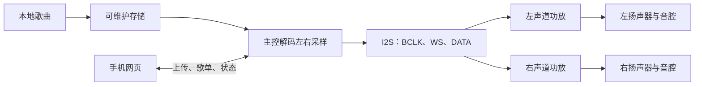
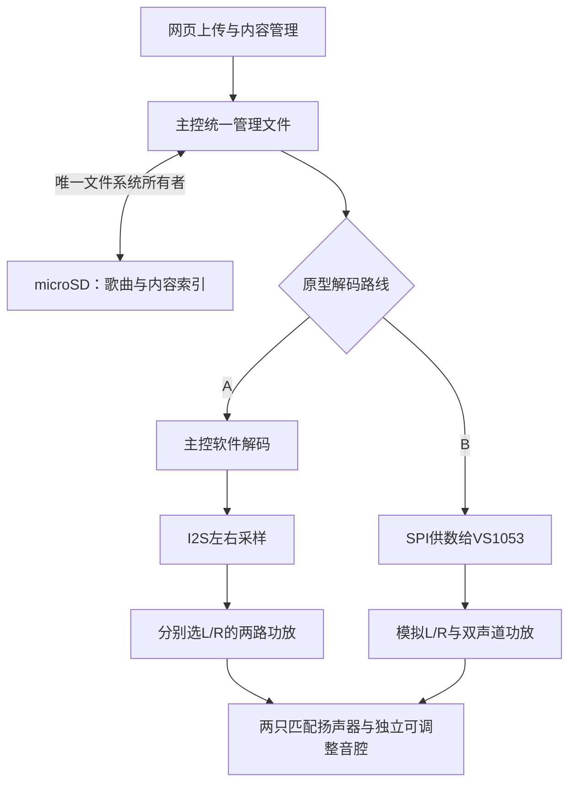

# 音频与存储专项

对应 F01、F11、F14，目标是先形成能离线播放、可上传更新、能验证左右声道的最小链路，再以音腔、功放、供电和扬声器试听提升音质。

## 已确认与边界

- 本体是通用本地播放器；无唱片时也能播放。推荐歌曲存于本体、小唱片承载身份，存储介质与挂件识别方式仍需比较后确定。
- 左右独立声道是当前评估路线。两个单声道I2S功放必须分别选择左/右时隙并用测试音确认，两个都播放左右混合仍然是双单声道。
- 本地网页需要管理曲库、歌单、上传和保存；具体格式、容量、顺序/随机/循环和开机行为待验证。
- 模块阶段同步做音质比较，功能通过不等于成品音质通过。
- 2026-10-08用户确认：网页上传新歌曲时保持播放，允许上传变慢；原型先验证能否无断音。此决定待总规划登记跨功能编号，当前不是已通过的并发结果。

## 候选比较输入

原型可比较带PSRAM的ESP32-S3开发板、主控直接读写microSD、两个可分别选声道的MAX98357A模块与真正双声道I2S功放。它们只是候选，必须核对准确板型、SD电平、功放MODE/SD接法、扬声器阻抗、供电和实测噪声。普通串口播放器可以做发声对照，但不能单独承担网页上传和本体曲库管理。

音腔要在模块阶段加入：用两只匹配单元和可调整试样，在相同文件、相近响度下记录人声、低频、底噪、失真、箱体共振、机械干扰、尺寸、功耗和费用。裸放扬声器的结果不能代表成品听感。

## 最小原型与通过条件

1. 先用已核对的主控、SD、功放和两只扬声器播放左右测试音；确认左右映射、WAV及实际MP3各自结果。
2. 断开互联网和手机持续连接，连续播放至少30分钟，记录断音、重启、底噪、温升和电流。
3. 通过网页上传并保存内容，重启后歌曲、歌单和绑定仍可用；中断上传不破坏旧内容。
4. 记录板卡、固件、接线、供电和音量条件，再比较扬声器、音腔、功放与电源。

正式芯片、音频格式、容量和成品单元由这些证据与价格性能比较后确定。实际工程进入 [firmware](../../firmware/README.md)、[hardware](../../hardware/README.md) 和 [web](../../web/README.md) 对话处理。

## 首轮细规划：2026-10-08

本轮完成公开资料核查与试验规划，尚无本项目接线、烧录、播放、试听或电流实测。以下器件、软件路径和通过条件均为候选或建议；正式芯片、采购、容量、预算和成品尺寸仍未确定。上文最小原型由本节细化，不改变已确认范围。

### 需求与缺口

| 依据 | 音频专项需要满足的行为 | 本轮缺口 |
|---|---|---|
| F01；D013、D015 | 通用本地播放器，无唱片也能通过本体或网页播放 | 实际音乐文件、编码参数、播放顺序/随机/循环、断电后恢复规则待审阅 |
| D019、D020、D035、D036 | 评估左右独立声道；模块阶段同步改善音质，当前不设参照设备 | 两只单元、阻抗、音腔、试听位置和可接受音量待核对；不预设品牌或尺寸 |
| F11；F07、D005、D024及本轮用户确认 | 网页上传更新，内容和绑定保存，基础播放离线可用；上传保持播放，允许上传变慢 | 共享存储介质、满卡/坏文件反馈、限速与缓冲策略待联合审阅，无断音能力待实测 |
| D046、D052 | 放片即播、取片暂停、换片切换；持续在位不重复启动；开机已在位先识别并等待按播放 | 音频接收明确播放命令，不根据识别器漏读自行停播；播放入口切换的状态契约待落实 |
| D018、D021、D041 | 整体紧凑、续航尽量长、成品材料改善声音与装配 | 尺寸、平均/峰值负载、电池容量、最终音腔与总预算待证据支持 |
| F14、D053 | 首版保留固件更新、烧录和应用无法正常启动时的维护路径 | 原型板的USB、下载/复位按钮可先验证；成品Type-C数据连接及维护可达性交联合评审 |

材料盘点尚未完成，板卡、功放、扬声器、microSD、工具和可用音腔材料不能写成已有。可独立推进公开调研；暂选准确模块和采购缺口须结合实际盘点。建议先用PCM WAV和实际MP3验证，不据文件后缀承诺全部编码，也不据候选芯片的格式清单直接扩张首版支持范围。

### 两条适用路线与推荐顺序

推荐先验证A，保留B作为对照或解码并发确有瓶颈时的备选。理由是A让主控直接掌握歌曲、歌单与网页写入，器件较少，官方已有S3解码资源依据。B可卸载解码，但仍需主控管理文件、供数和网页，并增加模拟音频链路；目前没有证据说明B音质更好或整机更省电。

| 比较项 | A：主控解码 + I2S功放 | B：主控供数 + VS1053独立解码 + 双声道模拟功放 |
|---|---|---|
| 原型组合 | 带PSRAM的ESP32-S3板 + 主控可读写microSD模块 + 两只MAX98357A模块 | 同类主控 + VS1053B解码/卡座模块 + TPA2016双声道功放模块 |
| 左右声道 | 一个I2S输出携带两个时隙，两只功放分别选择L/R；MAX98357A单块只有一路输出 | VS1053的LOUT/ROUT分别送双声道功放；解码器耳机输出不能直接承担4Ω/8Ω扬声器负载 |
| 文件与上传 | 主控独占卡的文件系统；软件解码与网页读取同一内容模型 | 主控读取卡后经SPI给VS1053供音频文件数据；卡座在解码板上不意味着解码芯片代管文件系统，仍可由主控统一写入 |
| 软件证据与代价 | ESP-IDF的S3 I2S驱动 + 官方`esp_audio_codec`/Simple Decoder可评估MP3与WAV；需实现文件服务、缓冲、调度和状态同步 | 模块有Adafruit VS1053库和接线资料；需移植/核对S3、SPI总线锁、DREQ供数、切歌复位及模拟接口；库存在不等于本项目已通过移植 |
| 资源与并发 | 解码使用主控CPU/内存；PSRAM可容纳非实时缓存，但Wi-Fi、屏幕、文件索引和DMA仍需联合测量 | 节省主控解码资源，不消除HTTP、文件缓冲和任务栈；SPI供数与卡读写争用仍可能断音，需DREQ及时响应 |
| 尺寸影响 | 主控板、卡座和两块功放分布放置；单块功放参考尺寸19.4 × 17.8 × 3.0 mm | 解码/卡座板参考尺寸58.08 × 27.72 mm，另加22 × 28 mm功放；模块占位更大，不直接等于成品芯片布局 |
| 供电与功耗 | MAX98357A产品页范围2.7–5.5 V；逻辑接口按3.3 V核对。实际平均/峰值电流待测 | 解码板有3.3 V/1.8 V稳压等外围，功放范围2.7–5.5 V；增加解码器并不能直接推导省电，实际平均/峰值待测 |
| 音质验证 | 核对I2S格式、增益、供电、底噪与两只音腔；产品标注3.2 W/4Ω/5 V是在10% THD条件下，不能作为干净可用音量 | 核对模拟输出耦合、底噪、供电和增益；TPA2016标注2 × 2.8 W/4Ω/5 V也是10% THD条件；试听时关闭AGC/动态处理或记录其状态，避免不公平比较 |
| 适用判断 | 第一条原型路线；先用WAV排查输出和声学，再加入MP3、网页和其他负载 | 适合已有准确模块，或A实测解码瓶颈不能合理解决的情况；选择依据应包含同条件声音、电流和开发代价 |

两条路线是替代方案，下图不表示同时采购或安装两个解码器：

MAX98357A的声道选择不能照抄其他模块接法。Adafruit 3006当前资料说明：SD/MODE低于0.16 V为关断，0.16–0.77 V为左右平均，0.77–1.4 V为右声道，高于1.4 V为左声道；板载上拉在5 V供电时默认输出左右平均。需核对准确板的电阻和供电，测量MODE电压，再以左右测试音确认。两块默认模块直接并联输入不自动成为左右独立输出。[S3]

VS1053模拟输出按准确模块版本核对耦合电容与AGND；GBUF是耳机参考端，不能当系统地短接。TPA2016参考板有输入耦合电容，仍需核对其差分输入接法。两条路线的功放扬声器输出均为BTL，不能把负端并到地或接入另一功放。[S4][S5][S6]

普通串口播放器不作为本轮完整路线：DFRobot DFR0299公开标价5.90美元/模块，产品页说明板载3 W单声道功放、另有立体声DAC输出。UART播放控制没有证明主控可通过它上传/删除卡内任意文件；其私有文件编号/扫描规则也需另核对。它可用于已有材料的发声对照，若要作为整机路线，必须先证明网页写入路径，不能让两个主设备同时直接控制同一张卡。[S7]

### 模块价格、供货与开发板候选

下表为2026-10-08公开页面核查，美元单价，按单件/1–9件档，全部是开发板或模块价格。未计运费、税费、microSD卡、扬声器、音腔、供电、线材和测量工具；国内准确板型报价、裸芯片价格与到货周期待核实。库存是该渠道当日页面状态，不代表已采购、国内可交付或长期供货。

| 物料与来源 | 页面单价 | 当日供货证据 | 比较用途 |
|---|---:|---|---|
| ESP32-S3-DevKitC-1-N8R8，Adafruit 5336 [S1] | $19.95/开发板 | Out of stock | 两路线使用相同主控的价格基线；须另核对可供渠道 |
| microSD SPI转接板，Adafruit 254 [S8] | $7.50/模块 | In stock | A的独立卡座参考；有稳压与电平转换，31.85 × 25.4 × 3.75 mm，不代表任意低价卡座模块相同 |
| MAX98357A，Adafruit 3006 [S3] | $5.95/模块；两块$11.90 | In stock | A的两路输出参考；准确左右选择仍待原型确认 |
| VS1053 Codec + MicroSD Breakout v4，Adafruit 1381 [S4] | $24.95/模块 | 95 in stock | B的解码/卡座参考；含卡座、不含存储卡或扬声器功放 |
| TPA2016，Adafruit 1712 [S5] | $9.95/双声道模块 | 35 in stock | B的扬声器功放参考 |
| XIAO ESP32S3基础板，Seeed SKU 113991114 [S9] | $7.49/开发板 | In stock；页面有未焊/已焊排针选项，具体订单变体待核对 | 小型主控对照，不是Sense摄像头套件，也不包含卡座 |

按DevKitC价格基线，A的主控/卡座/功放小计为$39.35，B为$54.85，差额$15.50。B已含卡座，不能再重复加A的卡座价。此小计只展示同渠道参考模块的差异，不能作为整机预算或国内采购金额；采购前需同一到货条件的报价与库存核对。

| 原型板 | 内存、接口与尺寸依据 | 更新/恢复能力 | 原型适用性与限制 |
|---|---|---|---|
| ESP32-S3-DevKitC-1-N8R8 | 双核最高240 MHz；8 MB Flash、8 MB PSRAM；官方V1.1机械图标注62.74 × 25.40 mm，天线模组伸出标注起点，完整装配包络与插线空间还需实物核对 [S1][S2] | 独立USB转串口与原生USB、BOOT和RESET，可评估应用损坏时进入ROM下载恢复；参考官方板使用Micro-USB，成品Type-C需另设计验证 | 推荐用于第一轮联调，排针便于多专项接入和测量；必须记录板版号。N8R8的八线PSRAM占用GPIO35–37，原生USB占用GPIO19/20，不能把全部标注引脚都分配给外设 |
| Seeed XIAO ESP32S3基础板 | 8 MB Flash、8 MB PSRAM；21 × 17.8 mm；基础板11个引出GPIO，需另计外置天线、排针、接线与卡座 [S9] | USB-C下载、BOOT/RESET入口有官方说明；UART恢复引脚可达性和实际下载方法需板上核实 | 适合已有板或声音子模块对照，价格/体积较小；引脚较少，不能直接保证整机屏幕、识别、旋钮、存储、功放和电机全部接入。板载充电能力不等于已满足整机边充边用 |

8 MB PSRAM是推荐的联调余量，不是已证明的最低配置；已有带2 MB PSRAM的板可先做WAV/MP3子模块测量。无PSRAM或板名相同但存储配置不同的版本，不能直接套用本轮并发评估。销售页中“暂无Arduino支持”的早期文字不用于当前软件结论：ESP-IDF官方S3 I2S驱动和当前官方解码组件是更直接的依据。[S1][S10]

### 内存与共享存储建议

官方`esp_audio_codec`组件页本轮显示2.6.2，Simple Decoder支持MP3/WAV等容器；官方README在ESP32-S3R8、44.1 kHz双声道条件下列出MP3解码28 KB堆内存、8.17% CPU占用。该表只统计解码堆，不含任务栈、卡读取、I2S、Wi-Fi、网页和屏幕；其全部解码器栈建议约20 KB也不等于本项目最终栈配置。它说明A值得验证，不能当成整机剩余资源或本项目实测结果。[S10]

ESP32-S3芯片有512 KB内部SRAM，应用可用量要扣除系统与各任务占用；N8R8的8 MB PSRAM不能按同样用途全部视为内部实时内存。原型必须测量实际最低余量，B也仍需为网页、文件服务和显示保留资源。[S11]

PCM吞吐可用于缓冲规划：44.1 kHz、双声道、16 bit为176,400 B/s，200 ms音频约35.3 KB；48 kHz同条件为192,000 B/s，200 ms约38.4 KB。这些只是计算，不证明200 ms足以覆盖卡写入长延迟。建议流式读取，记录卡读写最长阻塞、PCM低水位、欠载计数、任务栈高水位、内部可用内存/最大连续块及PSRAM余量。按选定IDF驱动保留DMA与实时任务所需的内部内存，不能只看PSRAM总量。

建议以microSD作为可维护的歌曲/图片存储候选，以内部Flash保存应用与少量配置；具体介质、容量和文件系统待联合评审。盘点后可从可用卡中优先选择8–32 GB卡做FAT32原型试验，并核对卡座供电与读写稳定性，这不是容量定稿。四分钟320 kbps MP3约9.6 MB，44.1 kHz双声道16 bit PCM WAV约42.3 MB（均忽略少量文件头）；8 MB应用Flash还要承担固件/可能的更新分区，不适合据此承诺可存完整曲库。

给网络/显示/唱片专项的文件管理提案如下，除已确认的上传保持播放行为外，具体实现契约待联合审阅：

- 主控是唯一文件系统所有者。曲目以稳定`track_id`引用，歌单与唱片绑定不依赖文件目录顺序或临时编号；显示名称与存储路径分开，保留中文曲名。
- 上传分块写临时文件；核对长度和可支持的音频参数，关闭并刷新文件后发布为可用曲目，最后更新内容索引。未完成项不进入可播放列表；失败清理仅处理对应临时项，旧内容保留。
- FAT的重命名不能单独视为断电事务。中断网络、满卡、重启和写入掉电分别试验；索引可恢复或重建，不能用“保存成功”页面代替重启后读取验证。
- 正在播放的文件保持有效，替换/删除如何延期或停播需与网络和本体交互共同落实。第一轮不做双主控挂载，也不同时把同一文件系统暴露为可写USB磁盘。
- 按用户已确认的“保持播放、允许上传变慢”安排并发试验；建议上传限速、文件写入让出实时读取和音频供数。未取得证据前不承诺无断音；失败先定位存储延迟、调度和资源问题，不能自行改成暂停上传。

### 按用途盘点的最小材料

以下是需求清单，数量是试验需要，已有数量和缺口均待盘点；A/B的物料择一，不默认两套都买。

| 用途 | 最小材料与数量 | 盘点时需要核对 |
|---|---|---|
| 主控、离线控制与网页 | 1块带可核对PSRAM的开发板，首选评估DevKitC-1-N8R8 | 板名/版号/模组丝印、Flash/PSRAM、引脚、USB数据功能、BOOT/RESET、完好状态 |
| 歌曲与共享内容 | 1张已知容量microSD；A另需1块适配主控逻辑电平的卡座模块，B可用解码板卡座 | 容量/文件系统、SPI或SDMMC实际引出、稳压与电平转换、供电峰值、移除与维护可达性；SPI板不自动支持4位SDMMC |
| A：左右数字音频输出 | 2块可独立选L/R的MAX98357A模块；准确双声道I2S板可作为后续替代候选 | 芯片后缀、板载MODE电阻/跳线、增益、供电、BTL端子、板形；不同板不能直接复用接法 |
| B：独立解码及扬声器输出 | 1块VS1053B解码板 + 1块真正双声道模拟功放板 | 卡座/电平转换、DREQ/片选/复位、模拟输出版本和耦合、音量/AGC控制；用现有准确模块可避免新增采购 |
| 两只扬声器 | 2只匹配单元，4Ω或8Ω按功放与实际音量评估 | 型号、阻抗、额定功率/灵敏度资料、外框/开孔/深度、振膜状态、极性；尺寸和品牌待试听后决定 |
| 早期音腔与固定 | 2个可调整、可重复安装的独立腔体，密封/固定材料 | 结构专项配合提供净容积、开口/密封与壁厚记录；先比较可复现试样，再定成品材料，不能用裸单元试听替代 |
| 稳定供电与负载测量 | 1路满足所选模块的受控供电，电源线/端子；电池与电源路径模块由电源专项落实 | 输出电压/限流、共地与回流、接线压降、USB与外部供电关系。可把5 V/2 A列为台架电源候选能力，不是系统实际负载或电池规格 |
| 连接与基础工具 | USB数据线、短信号线、扬声器线、端子/排针、面包板或洞洞板、万用表 | 大电流功放回路使用可靠连接；数字音频/SD线短且有回流路径。示波器/电流记录仪按现有条件使用，缺少时不能伪造峰值结果 |
| 音频试验材料 | 左/右单独测试音、相同双声道测试音、至少一份实际WAV和实际MP3、代表试听曲段 | 采样率/位深/声道/码率/时长和可公开性；私人音乐仅本机使用，公开证据记录参数与脱敏结论 |

### 试验步骤与建议通过条件

全部尚未执行。下列条件用于P2模块门槛建议，成品音质、时延、音量、温升上限和续航仍由联合评审落实；不新增已批准验收编号。

| 顺序与对应计划 | 操作及需要记录的证据 | 建议通过条件 |
|---|---|---|
| 1．材料与供电核对 | 记录准确板卡/模块、卡、扬声器、临时音腔、供电、固件/库版本；确认GPIO/电平、卡读取和输出增益 | 资源无已知冲突、供电符合准确模块规格、卡可连续读写；出现问题先定位接线/供电/卡与模块，避免先换芯片 |
| 2．左右映射，T01 | 左侧音轨仅L有信号、右侧仅R有信号、两侧相同三组测试；交换输出侧检查问题跟随源还是单元 | L/R各进入指定扬声器，另一侧没有测试内容；左右混合默认设置须纠正后才可记双声道通过。电气串扰量需具备正确测量条件再量化 |
| 3．真实格式，T01 | PCM WAV优先，16 bit双声道44.1/48 kHz建议各一份；实际MP3建议覆盖CBR 128/320 kbps与一份VBR。记录单声道处理、曲名/标签和坏文件反馈 | 各声明支持的样本能完整播放、切换、暂停恢复，时长/声道合理；无不明重启或破音。未知编码给出明确状态；文件后缀不作为通过证据 |
| 4．离线连续播放，T01/T03 | 断开互联网和手机持续连接，连续播放至少30分钟；用本体执行音量/播放暂停/切歌。记录欠载、卡读延迟、最小内存、温升、平均电流 | 0次不明断音、重启和任务崩溃，本体操作可用；开机已放片只识别并等待播放，无唱片可主动播放。30分钟只证明模块稳定性，不是续航结果 |
| 5．网页并发，T04及屏幕联合 | 按已确认的保持播放行为，加入AP网页状态读取、独立新文件上传、屏幕刷新，分别试验后组合；记录上传速度/最长写阻塞/PCM低水位/命令响应 | 组合试验建议至少30分钟无欠载/断音，必要时降低上传速度；若失败先定位并修复，改变上传时播放行为须再由用户决定 |
| 6．保存与失败恢复，T04 | 正常上传后重启；约10%/50%/90%进度各做网络中断，另做满卡、写入中重启与受控掉电；播放中替换/删除按审阅规则验证 | 已发布歌曲、歌单、绑定和设置可读；未完成项不可播放，旧内容不被覆盖；存储错误有反馈，重建后仍能播放。不得承诺FAT在所有掉电情形下绝不损坏 |
| 7．音腔与声音，T01/T07 | 两只匹配单元装入结构试样，固定位置/距离/曲段/相近响度；比较人声、低频、底噪、失真、箱体共振。依次加入Wi-Fi上传、屏刷新、灯光和电机启停 | 初步建议：静音/暂停无明显噪声，目标试听音量下无可闻破音或箱体松动声；联合负载不引入可闻电子噪声/断音。主观记录由用户试听审阅，仪器THD/SNR另记，未指定参照设备 |
| 8．电流与电源交接，T06/T07 | 供电端分别测待机/暂停、低中高响度音乐、Wi-Fi上传、屏刷新、电机启动；记录供电电压、时间平均/短时峰值、功放支路、板温、方法与采样能力 | 输出测量表供电源专项评审；平均与峰值分开，普通万用表不能证明瞬态峰值。功放BTL若做输出测量采用正确差分方法，不把任一输出端接示波器地；不由标称功率推导续航 |
| 9．烧录与恢复，T10 | 首次下载、更新应用、启动异常后BOOT/RESET恢复；分别记录擦除范围及歌曲/绑定/设置影响 | 有可复现的有线恢复路径；应用更新若声明保留内容则实际重启核对。完全擦除与应用更新分开，不将USB接口存在等同于恢复成功 |

A/B试听使用同一对单元、同一音腔、同一曲段和相近响度，记录AGC/增益与DSP状态；比较优先定位声音变化来自哪里。完整电池放电、边充边用切换及成品布局复测分别由电源和联合验收承担。若某项失败，先留下可复现条件和根因证据，再决定修复或改变路线。

### 交给总规划的共享接口建议

本表是提案，供总规划汇入`product/interfaces.md`与整机验收；本轮仅维护本专项文件，不替其他专项定GPIO、供电轨或接口实现。

| 对接对象 | 音频需要的输入/约束 | 音频提供的输出/待落实契约 |
|---|---|---|
| 主控与固件 | A：I2S BCLK/WS/DATA三线，无需MAX98357A MCLK；卡SPI通常四线，可根据延迟证据另评估SDMMC。B：SPI三线+卡/SCI/SDI三个片选+DREQ+复位，另计模拟功放I2C/关断；共享总线的独立片选与实时锁需核对 | 预留音频供数优先级、缓冲低水位和调试统计；这些是接口计数，不是最终引脚分配。屏幕、识别和存储不得长时间占用播放关键总线 |
| 网络与共享内容 | 统一卡访问，分块上传/限速/取消、空闲容量、临时项发布；用户已确认上传保持播放、允许上传变慢，无断音待实测 | `track_id`、`playlist_id`、显示名、格式参数、文件长度、可用/缺失/不支持状态；保存与恢复规则；可用曲目发布后通知界面/绑定模块 |
| 本体与屏幕 | 本体和网页都发送同一组播放/暂停/曲目选择/音量命令；按D052处理冷启动；屏刷新不得阻塞供数 | 建议状态字段：`playback_state`、`track_id`、`playlist_id`、`position_ms`、`duration_ms`、`volume`、`source`、`error`、`revision`。播放状态/音量先回报，再更新慢屏；快进能力与更新频率未定 |
| 唱片专项 | 只接收确认的放片/取片/换片事件及绑定内容引用；短暂漏读由识别专项判别；开机已在位不作为自动播放事件 | 内容缺失/未绑定返回错误状态；取走暂停哪次播放和本体/网页接管后如何处理，需要携带来源/会话标识并联合审阅，不能把漏读等同取走 |
| 结构、灯光与运动 | 左右独立可调整音腔、单元固定/密封、板卡与插线包络、卡与USB维护空间；电机机械声和驱动干扰可分开开关 | 单元尺寸/阻抗、音腔版本、测试位置、共振/噪声记录；两声道成立与实际空间声像分开评价，不把紧挨的两只单元自动当作明显立体声听感 |
| 电源 | 受控供电、允许峰值、USB/电池切换和关断控制；实际电源路径由电源专项选型 | 上述各状态的整机/功放支路平均电流、启动/音乐/无线并发峰值、最低供电电压和温升，注明电压/音量/测量条件。解码器省CPU与续航增益分别验证 |
| 固件维护，F14 | 原生USB或UART下载、BOOT/RESET/恢复路径、应用和内容的擦除边界 | 原型板实际下载/恢复记录；成品Type-C数据、插拔空间与维护盖需求交联合评审，OTA可另评估，不能替代有线恢复 |

### 需要用户决定与下一阶段门槛

2026-10-08用户已通过结构化选择确认：上传新歌曲时保持播放，允许上传变慢，先验证能否无断音。总规划需把此行为登记为跨功能决定并协调网络、显示和存储试验；不在本专项自行分配D编号。格式扩展、实际听歌响度/距离、音质与体量/费用的取舍，在音乐样本、音腔和完整报价到位后再交用户审阅，当前不要求用户选最终芯片、扬声器尺寸或容量。

总规划需要协调：核对原型主控可用引脚与各专项负载；落实上传并发、播放来源切换、存储发布/恢复契约；安排结构早期音腔；接收平均/峰值测量计划；在盘点后确定暂选板卡及采购缺口。进入具体实现前应有准确材料、已落实的重要体验规则、可接受的供电和接口资源；正式选型在模块证据之后完成。

### 公开证据与查询来源

查询日期均为2026-10-08。产品页用于相应模块的价格/规格/渠道供货，厂商与官方软件页用于芯片或组件能力；推荐及计算见正文，不属于实测。外部源码进入工程时另核对准确版本和许可，本轮仅引用公开链接。

| 编号 | 来源 | 支持的事实与边界 |
|---|---|---|
| S1 | [Espressif DevKitC-1 V1.1用户指南](https://docs.espressif.com/projects/esp-dev-kits/en/latest/esp32s3/esp32-s3-devkitc-1/user_guide_v1.1.html)；[Adafruit 5336](https://www.adafruit.com/product/5336) | N8R8内存、USB/下载/复位、PSRAM占用引脚；开发板价格与该渠道缺货。板版号与销售文字需区分 |
| S2 | [Espressif DevKitC-1 V1.1机械图](https://dl.espressif.com/dl/schematics/esp_idf/DXF_ESP32-S3-DevKitC-1_V1.1_20220429.pdf) | 单页图已渲染核对，标注62.74 × 25.40 mm；不包括完整装配净空的承诺 |
| S3 | [Adafruit MAX98357A 3006](https://www.adafruit.com/product/3006)；[单声道板引脚与MODE说明](https://learn.adafruit.com/adafruit-max98357-i2s-class-d-mono-amp/pinouts) | 模块价格/尺寸、供电、功率的THD条件、默认混音与声道选择；具体板载电阻仍需核对 |
| S4 | [VLSI VS1053官方产品页](https://www.vlsi.fi/en/products/vs1053.html)；[Adafruit VS1053 v4 1381](https://www.adafruit.com/product/1381) | 独立解码、立体声DAC、模块外围/卡座/尺寸与报价；FLAC需要软件插件，不把销售格式清单当作开箱验证 |
| S5 | [Adafruit TPA2016 1712](https://www.adafruit.com/product/1712) | 双声道、输入耦合、I2C/AGC、供电、尺寸/报价；产品页列静态电流3.5 mA/关断0.2 µA，不能代替板级音乐播放电流 |
| S6 | [VS1053模块模拟输出连接说明](https://learn.adafruit.com/adafruit-vs1053-mp3-aac-ogg-midi-wav-play-and-record-codec-tutorial/audio-connections) | GBUF/AGND与版本相关耦合规则；精确接法在实际模块核对后由实现对话完成 |
| S7 | [DFRobot DFR0299](https://www.dfrobot.com/product-1121.html) | $5.90模块价、单声道功放/立体声DAC、UART播放控制；未获得主控任意写卡的证据 |
| S8 | [Adafruit microSD SPI转接板254](https://www.adafruit.com/product/254) | $7.50模块价、尺寸、稳压、电平转换与SPI引出，不含microSD卡 |
| S9 | [Seeed XIAO ESP32S3官方Wiki](https://wiki.seeedstudio.com/xiao_esp32s3_getting_started/)；[基础板商店页](https://www.seeedstudio.com/XIAO-ESP32S3-p-5627.html) | 内存、尺寸、GPIO、USB/BOOT与$7.49页面报价。Wiki混列基础/Sense/Plus，不能把Sense的SD卡座、摄像头和功耗套到基础板 |
| S10 | [ESP-IDF S3 I2S文档](https://docs.espressif.com/projects/esp-idf/en/stable/esp32s3/api-reference/peripherals/i2s.html)；[官方esp_audio_codec组件页](https://components.espressif.com/components/espressif/esp_audio_codec)；[官方资源测试README](https://github.com/espressif/esp-adf-libs/blob/master/esp_audio_codec/README.md) | 查询时I2S文档显示v6.1、组件页2.6.2；README提供S3R8解码资源测试条件。正式实现锁定兼容版本及许可后重新核对，并发表现由本项目实测 |
| S11 | [Espressif ESP32-S3官方产品页](https://www.espressif.com/en/products/socs/esp32-s3) | 芯片双核最高240 MHz、512 KB内部SRAM；不等于应用可用资源或开发板外部存储配置 |

## 开源广场电路复用候选：2026-10-08

针对电路设计的复用需求，核查了嘉立创开源硬件平台的双声道功放与独立解码播放器。推荐优先审阅下表第一项的功放电路，再配合主控官方参考电路和本项目的供电/存储接口集成；这能减少从零设计外围电路的工作，整机声音与并发能力仍由原型验证。

| 候选、作者与公开入口 | 本轮核实的资料 | 可复用部分与适用判断 | 仍需核对 |
|---|---|---|---|
| [Max98357AETE立体声验证板](https://oshwhub.com/shepiguai_eda/esp32_ble_audio)，shepiguai_eda；[公开EDA工程](https://pro.lceda.cn/editor#id=8242fb5c604d4c1fa288f2e603626c11) | 工程页提供原理图、PCB、BOM及两份芯片/评估板PDF；已匿名打开EDA中的`P1.Schematic1`和`PCB1`，可见两只MAX98357A、不同声道选择电阻、每路去耦及输出滤波网络；标注GPL 3.0 | **优先电路参考。** 对应路线A，可沿用两路I2S功放的电路结构与元件清单，单独核对SD/MODE、增益和本项目供电电压 | 作者明确报告过偶发噪声，不能直接认定布局合格；电阻配置、回流、去耦与输出滤波应对照官方资料核验。工程页更新时间2022-07-06，而原理图标题栏显示2022-08-25，复用时记录实际工程版本 |
| [MAX98357A TDM Stereo](https://oshwhub.com/seraph_lrk/max98357-tdm-stereo)，seraph_lrk | 描述为TDM slot0/slot1双声道，SD_MODE/GAIN由板上导线配置；页面未生成设计预览、暂无BOM/附件；标注GPL 3.0，更新时间2025-12-07；作者填报复刻成本￥25 | 双声道布板的进一步候选，需先读到完整工程再比较。作者报告4Ω/3 W单元下未见发热，没有完整供电、音量和测温条件 | TDM配置不直接等同本专项的标准I2S左右时隙配置；工程可读性、完整物料、实际通道映射尚未核实。￥25为作者填报，不是当前报价 |
| [基于STM32的MP3播放器](https://oshwhub.com/ZYNQ/ji-yu-STM32de-MP3bo-fang-qi)，ZYNQ | 描述为STM32F103RCT6读取FAT32卡、VS1053硬件解码；有`附件.rar`，作者称含程序与字库；页面暂无设计预览/BOM，附件内容未下载核验；标注Public Domain，更新时间2022-04-12 | 对应路线B，适合研究卡读取、独立解码与本体播放控制的连接关系；主控与网页部分需另适配，不能据此证明本项目上传并发 | 文中提到改版修正MOS/三极管封装；须核对实际版本与附件。TP4056和约10小时播放均为原项目说明，缺少本项目所需电源路径与负载条件，不能据此采用边充边用方案或推导续航 |

另查到[IceClock ESP32 S3全彩点阵屏时钟贴片版本](https://oshwhub.com/geniusice18/iceclockesp32s3)，geniusice18，标注GPL 3.0，更新时间2026-01-14。简介包含S3与双MAX98357，但页面暂无设计预览/BOM，附件只有视频；作者在评论中说明代码未开源。因此暂列硬件组合线索，不作为完整播放器的复用基线。

复用重点是功放、去耦、卡接口、USB/下载和已验证的电源子电路，主控型号、GPIO、卡管理、接口电平及PCB空间仍按本项目联合评审调整。第一项已经证明存在可读的原理图和PCB；其余项的公开描述不代表完整工程已核验。详情页曾出现反爬拦截，第一项另一次页面加载还显示“未发布或不存在”，但直达EDA工程能够加载；后续以实际可打开的源工程为依据。

项目许可标注与平台统一的“学习交流及研究、非商业使用”复刻说明并存；本轮记录来源和页面标注，未澄清其适用关系，也未将第三方设计纳入本仓库。正式采用与公开发布衍生电路时须落实署名、许可和发布条件，不能根据“开源广场”名称推断任意用途均获授权。

后续电路实现对话可从第一项与官方参考设计逐项审阅，输出适配后的功放子电路、准确BOM及供电/声道验证结果，再交总规划协调主板集成。当前仍是候选调研，没有制作或验证本项目电路。
