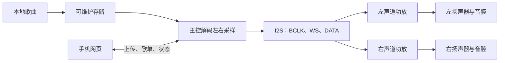

# 音频与存储专项

对应 F01、F11、F14，目标是先形成能离线播放、可上传更新、能验证左右声道的最小链路，再以音腔、功放、供电和扬声器试听提升音质。

## 已确认与边界

- 本体是通用本地播放器；无唱片时也能播放，音乐不存放在小唱片内。
- 左右独立声道是当前评估路线。两个单声道I2S功放必须分别选择左/右时隙并用测试音确认，两个都播放左右混合仍然是双单声道。
- 本地网页需要管理曲库、歌单、上传和保存；具体格式、容量、顺序/随机/循环和开机行为待验证。
- 模块阶段同步做音质比较，功能通过不等于成品音质通过。

## 候选比较输入

原型可比较带PSRAM的ESP32-S3开发板、主控直接读写microSD、两个可分别选声道的MAX98357A模块与真正双声道I2S功放。它们只是候选，必须核对准确板型、SD电平、功放MODE/SD接法、扬声器阻抗、供电和实测噪声。普通串口播放器可以做发声对照，但不能单独承担网页上传和本体曲库管理。

音腔要在模块阶段加入：用两只匹配单元和可调整试样，在相同文件、相近响度下记录人声、低频、底噪、失真、箱体共振、机械干扰、尺寸、功耗和费用。裸放扬声器的结果不能代表成品听感。

## 最小原型与通过条件

1. 先用已核对的主控、SD、功放和两只扬声器播放左右测试音；确认左右映射、WAV及实际MP3各自结果。
2. 断开互联网和手机持续连接，连续播放至少30分钟，记录断音、重启、底噪、温升和电流。
3. 通过网页上传并保存内容，重启后歌曲、歌单和绑定仍可用；中断上传不破坏旧内容。
4. 记录板卡、固件、接线、供电和音量条件，再比较扬声器、音腔、功放与电源。

正式芯片、音频格式、容量和成品单元由这些证据与价格性能比较后确定。实际工程进入 [firmware](../../firmware/README.md)、[hardware](../../hardware/README.md) 和 [web](../../web/README.md) 对话处理。
