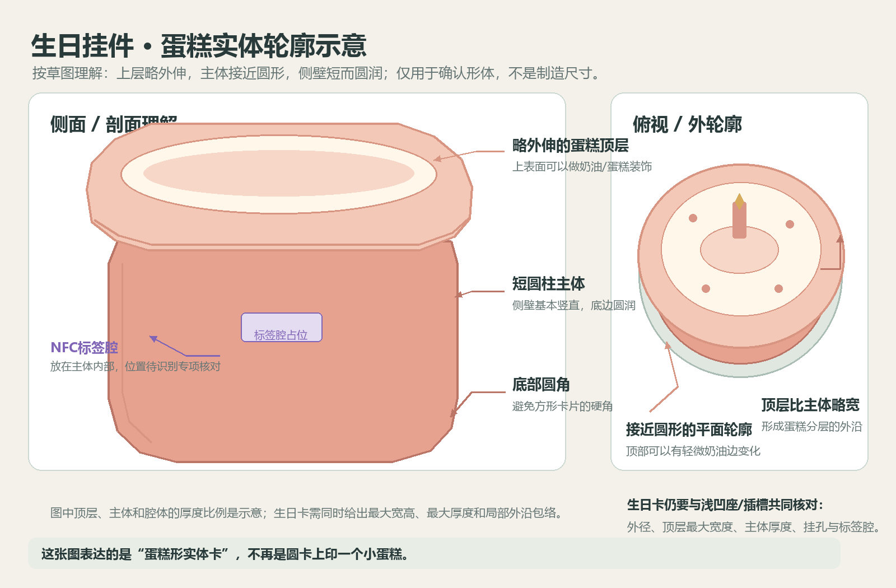
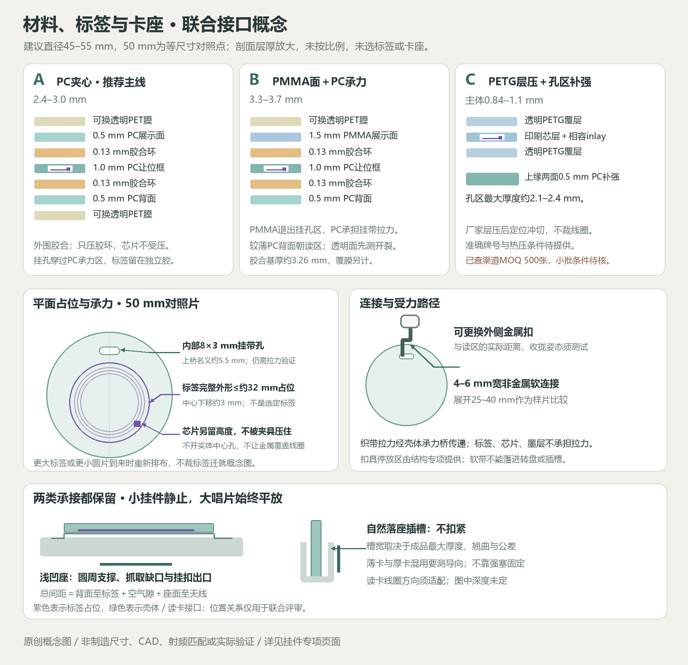
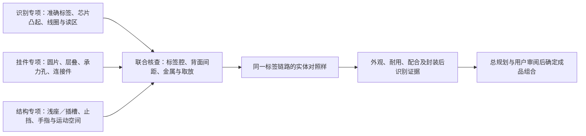

# 挂件外观、实体与材料专项

按D060独立规划八张以圆形为基础的挂件，生日卡依D065采用近圆形蛋糕轮廓；负责正反面、材料、封装、挂扣、耐用性与小批制造。首轮收敛日期：2026-10-08；阶段为P1。除本页明确记录的用户要求与已确认外观方向外，具体图案细节、规格、样片数量和测试门槛仍为本专项建议，尚无用户批准的成品材料、制造文件、完整挂件报价或实物验证。

## 首轮结论与已确认范围

推荐先比较 **A：PC夹心耐用方案** 与 **B：PMMA展示面＋PC承力夹心方案**。A作为八张卡的共同成品主线，B检验三张主题卡是否值得采用更厚、更透明的展示面；**C：PETG层压薄卡＋局部PC补强**保留为通用1–5的轻薄对照。C已查到的制卡渠道标注500张起订，与八张小批不匹配，取得少量定制样片条件前不推荐量产下单。三套不是增加正式卡片数量，也不是已经决定混用材料。

八张配置依D057：邓紫棋、汪苏泷各一张，通用1–5各一张，生日0一张。各卡可用不同材质；两张歌手卡与生日0重点关注外观和耐用。生日仍只有一张卡和一个菜单入口。挂件可携带，采用无电池NFC或类似电磁感应身份（D058），标签与读卡器未选。浅凹座平放、无需扣紧插槽均保留，大唱片始终平放（D056）。

2026-10-08的外观要求已登记D065：歌手图案由用户后续设计，通用卡不用明显大数字，生日卡采用下方示意图右侧的近圆形蛋糕轮廓，背面仅“生日快乐”。已确认的是轮廓与背面文字，实际厚度、内部结构、配色和装饰仍为建议；单卡图中“外观方案已确认”也按此范围理解，不表示制造设计完成。

初轮PC、PMMA、PVC/PETG和PCB材料比较及职责交接见[唱片识别专项](../records/README.md#挂件实体外壳与材料规划交接由总规划安排)。本页接续实体细规格；识别、绑定与在位事件仍由识别专项维护，卡座与整机由[结构专项](../enclosure/README.md#三维挂件承接对照)维护。材料规划不以全面库存盘点为前置。

## 八张卡的共同视觉与正反面

本轮改为每张卡独立维护正反面概念图，避免八张卡挤在一张总图中：

| 卡片 | PNG预览 | 可编辑SVG |
|---|---|---|
| 邓紫棋 | [单卡预览](../../assets/concepts/charm-card-gem.png) | [SVG](../../assets/concepts/charm-card-gem.svg) |
| 汪苏泷 | [单卡预览](../../assets/concepts/charm-card-silence-wang.png) | [SVG](../../assets/concepts/charm-card-silence-wang.svg) |
| 通用1 | [单卡预览](../../assets/concepts/charm-card-generic-1.png) | [SVG](../../assets/concepts/charm-card-generic-1.svg) |
| 通用2 | [单卡预览](../../assets/concepts/charm-card-generic-2.png) | [SVG](../../assets/concepts/charm-card-generic-2.svg) |
| 通用3 | [单卡预览](../../assets/concepts/charm-card-generic-3.png) | [SVG](../../assets/concepts/charm-card-generic-3.svg) |
| 通用4 | [单卡预览](../../assets/concepts/charm-card-generic-4.png) | [SVG](../../assets/concepts/charm-card-generic-4.svg) |
| 通用5 | [单卡预览](../../assets/concepts/charm-card-generic-5.png) | [SVG](../../assets/concepts/charm-card-generic-5.svg) |
| 生日卡 | [单卡预览](../../assets/concepts/charm-card-birthday.png) | [SVG](../../assets/concepts/charm-card-birthday.svg) |

共同要求聚焦实体配合：上缘内部设独立承力挂带孔，不增加外凸挂耳，**不打穿中心孔**；双面文字分别排版，不用镜像透印。通用卡保留黑胶唱片纹理与浅色中心标，不用大数字占据正面；正面不显示编号，背面只保留边缘小号1–5便于核对。生日卡以近圆形蛋糕外轮廓为主视觉，背面只写“生日快乐”，不加编号或感应说明。小编号不能与电子身份或绑定格式等同。歌手卡图案、配色和文字布局留待用户设计。图案不写死歌曲、歌单或网址。

| 卡片 | 正面具体方向 | 背面具体方向 | 色彩/表面建议 |
|---|---|---|---|
| 邓紫棋 | 用户后续设计；图中仅为空白占位 | 用户后续设计 | 不预设配色、人物/专辑元素或主题符号 |
| 汪苏泷 | 用户后续设计；图中仅为空白占位 | 用户后续设计 | 不预设配色、人物/专辑元素或主题符号 |
| 生日0 | 采用已确认的近圆形蛋糕外轮廓，顶面下方露出一小段蛋糕侧面；蜡烛、奶油及装饰细节仍为建议，不放编号 | 背面只写“生日快乐”四个字 | 暖白`#F4E7CF`、奶油白`#FFF8EA`、珊瑚粉`#D99586`为配色建议；外轮廓以专用示意图右侧为准 |
| 通用1–5 | 同一黑胶底与浅色中心标，数字不成为主视觉；本轮示意正面无数字 | 简化唱片纹与边缘小号1–5 | 中心标依次薄荷、蓝、紫、橘、灰白是助手建议；不强制仅靠颜色辨认 |

按直径50 mm审阅：通用卡背面小编号字高建议约2 mm，不占中心标；辅助字不少于约1.8 mm，歌手卡字级待用户图稿确定。生日卡背面四字按当前设计保留，不能再叠加编号或感应说明。印刷线条先按有色线≥0.3 mm、白线≥0.5 mm准备，这是已查加工商的文件要求[S4]，具体车间须重新核对。通用卡的实体唱片沟纹暂不加工，先用印刷线条表达。生日卡后续按已确认蛋糕轮廓检查下缘支撑、挂孔与标签腔，不预先用标准圆片支撑弧替换该轮廓；用最大宽高、局部外沿和实际支撑边核对浅座/插槽，不能仅用圆片名义直径表示完整包络。

[可编辑SVG示意图](../../assets/concepts/birthday-cake-profile-study.svg)。**用户已确认右侧“俯视 / 外轮廓”的形状作为生日卡外观方向**：近圆形蛋糕顶面、下方露出一小段侧面，外沿圆润。左侧较厚的圆柱及标签腔属于先前助手对草图的结构推断，未被确认为实际实体结构；后续不能据此锁定厚度。配色、装饰、标签腔、挂孔和卡座尺寸仍待设计与联合核查，图不作为制造尺寸。

## 三套完整组合

[可编辑SVG接口概念稿](../../assets/concepts/charms-round1-material-interface.svg)。层厚在剖面中放大，未按比例；图中的线圈只说明位置关系，不代表已选标签或天线设计。

以下直径均建议先用45–55 mm作为审阅区间，以50 mm作为等尺寸对照点。它不构成卡座或标签尺寸决定。质量采用计算假设：PC约1.20、PMMA约1.19、PETG约1.27 g/cm³，按“各层面积×厚度×密度”相加；这些值用于规划估算，不是所购批次的检验数据。50 mm圆片面积约19.6 cm²；A/B未扣腔体的基础层质量约5.3/7.7 g。表中宽范围考虑45–55 mm、开腔、补强、胶膜、油墨和覆层，连接件暂按另加4–8 g估算；最终用准确材料资料与样片称重替代。

| 项目 | A：PC夹心，推荐主线 | B：PMMA展示面＋PC承力夹心 | C：PETG层压薄卡＋PC孔区补强 |
|---|---|---|---|
| 用途与收益 | 八张均可采用；印刷藏在透明片内，优先验证携带耐冲击 | 三张主题卡的透明质感对照；受力路径继续由PC承担 | 通用1–5的轻薄对照；关注挂孔、弯折和实际小批门槛 |
| 材料/牌号建议 | 面片/背片各0.5 mm、让位框1.0 mm，优先询Covestro **Makrofol DE 1-1 060048**；官网列500–1000 μm双面光面PC薄膜[S1] | 正面1.5 mm **ACRYLITE Premium (FF)**挤出PMMA为牌号参考[S2]；中间1.0 mm和背面0.5 mm沿用A的PC。国产替代需提供制造商、牌号与板厚公差 | **制卡级PETG芯层＋同体系透明PETG覆层**；具体牌号、软化/层压条件和耐候资料待厂商提供[S5]。不能把普通PETG板材或3D打印耗材当作制卡覆层 |
| 名义层叠 | 0.5 PC／0.13胶／1.0 PC让位框／0.13胶／0.5 PC；基础约2.26 mm | 1.5 PMMA／0.13胶／1.0 PC让位框／0.13胶／0.5 PC；基础约3.26 mm | 透明覆层／印刷芯层与NFC inlay／透明覆层；由厂家安排芯片缓冲与局部让位，不预设家用热压参数 |
| 覆层与建议成品厚度 | 两面可更换透明PET耐刮膜，各约0.08–0.15 mm，含胶厚度需实测；整体建议2.4–3.0 mm | 展示面可加同类可更换膜，背面按需要；整体建议3.3–3.7 mm | 薄卡主体建议0.84–1.1 mm；孔区两面各0.5 mm PC补强＋胶，局部最大约2.1–2.4 mm；报价分别写主体厚度与局部最大厚度 |
| 圆片质量；含连接件总质量 | 本体约4–8 g；含软连接及外扣约8–16 g | 本体约6–10 g；完整约10–18 g | 本体及补强约2–4 g；完整约6–12 g；不能用薄卡轻量推定能驱动在位开关 |
| 切割/边缘 | 薄片刀切或CNC/铣切框层；刀口修整、圆滑倒边，挂孔内壁抛顺。PC不默认采用CO₂激光切割 | PMMA比较激光或CNC，PC层用A工艺；首样优先机械修边，胶合边不作火焰抛光。PMMA不跨挂孔承力桥 | 印刷后层压、再按inlay位置冲切/铣切圆片；冲切不能切到线圈。孔区补强片圆角，清除毛刺 |
| 印刷与连接 | 透明片内侧反向UV彩印＋白底；留3–4 mm无油墨胶合环。优先模切 **3M 9472LE** 0.13 mm压敏转移胶[S3]，贴在洁净PC表面，不将其当作已验证结构胶 | PMMA内面印刷，透明外圈约3–4 mm；PMMA只作展示面，PC框与背片形成承力孔。同胶膜先做PMMA/PC粘接对照，确认不发雾、不裂、不开边 | 胶印/数字印刷、白底和配套覆层；厂家热层压封装，局部PC补强采用单独验证的压敏胶。首轮不采用金属铆眼 |
| 标签固定/芯片让位 | 现成薄标签固定在背片内侧，框层全包络开腔，芯片处另留高度余量；只压外围胶合环，不压芯片 | 同A；背面仍为较薄PC，标签朝背面读区。透明图案窗口不意味着裸露芯片 | 采用厂家相容的裸inlay与缓冲结构；普通背胶贴纸不直接送入热压。由识别专项核对芯片/线圈及封装工况 |
| 挂扣承力 | 上缘内部圆角挂带孔穿过全部PC层，织带受力分散到壳体，不接触标签腔 | PMMA在孔区局部退让；挂带只接触PC承力桥，正面不承担挂孔拉力；共同孔位不代表三层都打同一个孔 | 穿孔仅在无线圈上缘，两面PC补强分摊拉力；补强片与PETG粘接及剥离是关键试验。若不通过，不用金属环补救代替重设计 |
| 主要取舍 | 未硬化PC仍会刮花；边缘胶合和贴膜需要维护，耐冲击方向须实测 | 更厚、更易出现应力裂纹和展示面碎裂；多一种材料和加工设置，不因透明漂亮直接选定 | 局部薄卡强度、翘曲、补强分层与不同图案起订量；目前500张MOQ渠道不适合八张 |

两套胶合方案均先验证胶对实际油墨、PC与PMMA的相容性。未经样片，不采用瞬干胶、溶剂灌封或整腔环氧滴胶：透明雾化、应力开裂、固化收缩与芯片受压会使问题难以定位。原厂运输保护膜不是成品耐刮膜；可更换膜也不是已获得硬度等级的硬涂层。若改用硬化PC面片，需另核准确牌号、可印面及胶合面，重算厚度与费用。

PVC作为C的制卡供应替代继续留在原比较，不新增第四套；PVC/PETG不可在未核实胶层和热压条件时混叠。FR-4 PCB外观本轮不进入样片主线：铜图案、自研天线、芯片焊接和板边封装会增加识别及制作任务。若用户喜欢电路图案，优先在A的非导电印刷层表达，再评审是否有必要使用真PCB。

## 标签、挂扣与卡座共同接口

建议以圆片中心为平面原点，12点方向为挂带孔；背面为优先读区。先用**完整标签外形直径不大于约32 mm、中心向6点方向偏3 mm**作概念占位，保留20–32 mm标签的比较空间。这里指完整基材/胶层外形，不只是铜线圈；矩形、较大或较厚标签到来后重新排布，不能裁标签来迁就概念图。

| 接口字段 | 本轮建议输入；仍需联合确认 |
|---|---|
| 挂带孔与受力区 | 50 mm对照片拟用约8×3 mm圆角孔，孔中心距圆心约18 mm；最薄上桥约5.5 mm。45 mm片不能直接缩放此孔，须重算桥宽与标签间隙。名义桥宽不是强度保证 |
| 标签腔 | 外形每侧先留0.3–0.5 mm装配余量；1.0 mm框层对照样仅在实际标签最高点＋固定胶＋至少0.2 mm自由高度能装下时采用。芯片处不能被面片、挂孔或装配夹具压住 |
| 安装方向 | 正反面图案的上下方向一致，识别辅助文字/小编号可放背面；比较正面朝上/朝外与翻面放置，不默认为只认一种翻面。标签线圈平面与对应读卡线圈平行条件由识别专项验证 |
| 有效识别间距 | 分别记录标签线圈至背面外表面、读卡天线至座面、装配空气隙；三者构成总间距。A/B约0.5 mm背片只是其中一项，不以挂件总厚度推导读取距离 |
| 连接件 | 优先4–6 mm宽软织带/圆滑非金属连接段，展开长度先比较25–40 mm，再接可替换外侧金属扣；软段尺寸是样片建议。不用金属链绕卡，扣具不得落在线圈上。金属距离没有通用安全毫米数，按实际包络和收纳姿态扫描验证 |
| 浅凹座 | 以圆周或非标签承力面支撑；须有手指缺口、软带出口和外扣停放区。比较整卡贴合、局部悬空与翻面，不能依靠卡片重量默认触发开关；座深和止挡由结构专项提供 |
| 无需扣紧插槽 | 下缘自然落座，挂孔/补强区留在外露上部；槽宽按成品最大厚度、翘曲和加工公差共同计算，不能等于名义层厚。A/B厚卡与C薄卡混用时验证导向/可换非金属适配件；不通过就不采用该混搭，不默认宽槽能稳住薄卡 |
| 完整包络 | 同时提供卡片、孔区局部厚度、软带及外扣自由摆动包络；生日轻微异形额外给最大宽高与连续支撑弧，复核胶合边/标签腔余量；软带与扣不得进入水平大唱片、轴、皮带、电机或手指拔出路径。整机位置由结构专项确定 |
| 表面与装饰 | 首轮使用普通非导电色墨/透明聚合物膜；不覆盖金属箔、金属化全息膜、金属粉涂层或金属中心盘。抗金属标签/铁氧体仅在识别专项定位出需要后比较，新增厚度重回联合接口 |

### RC-03A标签与读卡天线试验交接（2026-10-09）

识别专项本轮推荐`PN7160_MINI_I2C`，其**读卡端天线**为25×10 mm和50×40 mm，两者是本体部件，不是应塞进挂件的标签；测试时每次只接一副。挂件身份层优先使用NTAG213类无源标签，原20–32 mm完整标签外形范围仍是概念包络，准确圆标签材料、供应商和线圈/芯片最高点、封装后总间距及国内小批报价未核实。40×25 mm矩形NTAG213可作协议对照，但不应代替20/25/30 mm圆形尺寸组合或直接收敛正式卡片厚度。

向识别专项交接两款可调整承接结构共用的样片表：标签完整外形、线圈方向、芯片凸起/背片到读卡线圈总间距、挂扣金属位置、偏心/倾斜及生日卡实际连续支撑弧；标签更换或材料封装后，需重新验证读区与B离座稳定性。与大唱片转动区隔开，不能通过削切完整标签或把线圈压在挂扣下迁就外观图。

## 实现对话的样片与验证安排

推荐第一批物理对照样为 **A两片、B两片**：每套一片透明诊断样看标签腔/胶边，一片同图彩印样比较外观和印墨相容性；均使用同一标签型号、同一对照直径和同类连接件。另备胶合/孔区小试条供破坏试验。C先询1–2张圆形定制样的条件；只有接受少量订单且牌号、层压封装及识别链路相容时加入。正式八张仍按D057，测试样不算正式交付。

A按片材裁切、框层开腔、去毛刺、内面印刷、无墨环模切贴胶、放标签、只压外围、按胶厂条件静置后测试。B在相同步骤中改PMMA展示面并让其退离孔区，先用小试条判断雾化/应力裂纹；C由制卡方提供准确层叠和inlay对位后再冲切，补强胶合单独验证。每片保留材料/胶批次、实际厚度、腔高、芯片方向、质量和加工条件。这里是规划顺序，CAD、加工文件、采购和制作由独立实现对话执行。

下表均为**工程筛查建议，非已通过结果或认证**。同一方案的耐用试验可按顺序在一片上累积；出现失败后用独立复样定位根因，不能把一个累积失败归因于最后一次试验。破坏后的样片不作为正式卡交付。

| 验证 | 条件与记录 | 建议进入下一轮的判据/方案重点 |
|---|---|---|
| 外观与印刷 | 歌手卡和生日卡先做1:1纸样；实体在白底、深底与常用室内光下看正反面、透边、胶边及斜光；照片同时放毫米尺。检查歌手卡留白、蛋糕轮廓、通用卡唱片纹和背面小编号；用户审阅风格 | 无影响阅读的偏位、明显胶溢、白底缺口或大气泡；图案好看由用户审阅，不能由识别成功替代。B重点看透边雾化；C看芯片鼓包 |
| 尺寸与取放 | 各片测外径、最大厚度、孔区厚度、翘曲与质量；两种卡座各做50次自然取放，带外扣、翻面、轻偏斜；记录卡住/晃动/刮痕 | 不需要扣紧，无卡住和外扣干涉，姓名/编号可见；实际配合尺寸由结构复核。C不能依靠夹紧实现稳定，A/B不能靠强塞入槽 |
| 跌落 | 完整挂件从1.2 m落到明确记录的硬质地面，正面、背面、边缘各2次；每组检查并重读标签 | 无裂口、锐边、脱层、脱扣或标签失效；A看胶边开口，B看展示面及孔区开裂，C看鼓包/折痕；失败则调整材料/承力再测 |
| 刮擦与图案耐久 | 干净棉布往返200次；另用同一枚圆滑钥匙、约2 N载荷划20次，记录接触面与可更换膜；正反面各拍斜光对照 | 不露出标签、图案不脱落且编号可读；允许牺牲膜轻划痕，但记录换膜后本体是否损伤。不将此手工对照换算为铅笔硬度等级 |
| 挂孔与连接件拉力 | 每套小试条及完整件分别做20 N保持60 s、10 N往返100次；观察孔桥、胶边、织带和扣。保护夹具固定壳体，避开标签腔 | 无孔桥裂纹、层间滑移/张口、织带割伤或扣脱开；记录孔延伸和残余变形。B确认PMMA不受挂带点压；C看补强片剥离。测试值须与携带用途联合审阅 |
| 分层/湿热 | 常温干燥基线对比40°C、约75%RH、24 h筛查及湿布擦拭；记录实际环境，恢复2 h再检查和拉力/读取。胶合试条对比干态与处理后剥离，记录失效在胶、油墨还是基材 | 不出现持续扩展的开边、芯片周围鼓包或新裂纹；不宣称防水或长期耐候。B重点温差/溶剂接触裂纹；C重点热层压与补强层分离 |
| C的额外弯折 | 在避开芯片局部点压的夹具上按约50 mm弯曲半径往返100次，记录正反方向；之后重读 | 不出现裂线圈、芯片失效、永久折痕或补强翘起；半径依据准确inlay允许值调整，不把普通制卡耐弯宣传当成本项目结果 |
| 封装前后识别 | 同一标签先裸读、装腔未封、封装后再读；两类卡座各测正反方向与读区边界，外扣自然垂放/靠近/收拢、7张邻片、运动停止/启动；耐用试验后复测 | 与识别专项共用取放事件测试，建议每组合先50次有效放入/取走，记录成功率、延迟、漏读/错读；身份不得串成邻片，同片在位不重复启动。具体读区/延迟通过线由识别专项和总规划确认 |

“读到身份”与“确认在位/取走”分别记录；任何材料、背片、贴膜、连接件或铁氧体改变后，重测受影响的识别条件。图示、裸标签读取及某一张样片通过，都不等于八张完成耐用/端到端验收。

## 可公开来源、加工渠道与费用边界

核查日期均为2026-10-08。以下区分原厂材料资料、加工商公开条件和本项目待询价；未联系商家、上传文件、取得书面定制报价或下单。只读核查的外部宣传不等于本项目样品能力。

| 来源 | 本轮已核实的内容 | 适用范围/仍待核实 |
|---|---|---|
| [S1 Covestro Makrofol DE 1-1 060048](https://solutions.covestro.com/en/products/makrofol/makrofol-de-1-1-060048_000000000000327075) | 官网说明PC挤出薄膜、双面光面和标准保护膜；标准厚度500–1000 μm | A/B片材牌号参考；不是硬化PC。国内零切/小片供货、颜色、批次和价格待询 |
| [S2 ACRYLITE挤出板厚度公差](https://www.acrylite.co/resources/knowledge-base/article/what-is-the-thickness-tolerance-of-acrylite-r-extruded-ff-acrylic-sheet) | 官方表中1.5 mm档对应0.060 in，厚度范围0.054–0.066 in（约1.37–1.68 mm） | B的PMMA参考；说明不能按名义板厚配紧槽。国内替代、修边公差和实际厚度待询，不混用铸板公差 |
| [S3 3M 9472LE转移胶](https://www.3m.com/3M/en_US/p/d/b40071705/) | 官方产品为300LSE体系转移胶，5 mil/0.13 mm；说明异材粘接和抗翘起用途 | A/B无墨胶合环初样候选；不保证透明光学外观、结构承力、PC/PMMA/墨层适用或防水。国内原材、模切和胶合工况待核 |
| [S4 Vograce双面透明亚克力挂件](https://vograce.com/products/custom-clear-acrylic-keychains) | 产品资料MOQ 1件、CMYK；50.8 mm、双面不同图、无附加工艺公开选项价 **US$2.97/件**；文件要求300 dpi、1000像素以上、白线>0.5 mm/色线>0.3 mm | 可买印刷对照样，**不是B的夹层NFC挂件**；不含自定义标签腔、PC承力背、胶合和补强验证。是否接受分层零件/孔区要求、牌号与板厚待核 |
| [S4a Vograce交期/运费计算器](https://vograce.com/pages/shipping-production-time-cost-calculator) | 交期/运费需选产品、规格、目的地及数量；确认效果稿时间不计生产时间，超过5件可在2–5工作日提供效果稿后安排生产 | 本轮未取得选定目的地的计算结果，生产/运输天数和运费待核；2–5日是效果稿时间，不是制造交期 |
| [S5 创新佳PETG RFID卡](https://www.nfctagfactory.com/products/rfid-petg-smart-card.html) | 供应商页列PETG、13.56 MHz、85.5×54×0.84 mm或定制、**MOQ 500张**；可申请免费样品 | C存在制卡渠道及起订门槛；免费样品是否定制、圆形/八图起订规则、牌号、inlay/层压、交期和价格未核。不采用其通用读取距离宣传作本项目依据 |
| [S6 嘉立创一站式制造入口](https://www.jlc.com/) | 官网列面板定制、CNC、PCB等服务与在线计价入口 | A/B裁片/框层询价入口；是否接受0.5–1.5 mm薄塑料片、可用PC/PMMA牌号、UV印刷/分层装配待核，不能由“有CNC”推定可一站完成 |

外部商品图未复制入概念稿；本轮引用公开产品事实及链接。方案图为原创表达；后续采用照片/专辑或供应商素材时再核查来源与可公开范围。

### 同口径费用表

完整成本记为 **材料＋切割/开腔＋印刷/白墨＋胶膜/覆层＋标签＋织带/扣具＋装配/检验＋一次性设置＋运输/税费＋明确的复样损耗**。标签型号与单价由识别专项输入，不能用外壳裸价代替总价。各渠道分别报价“1张完整样片”“八种图各1张、共8张”“补做1张”；A/B图案不同可共用切割轮廓，不默认能免印刷设置费。

| 路线 | 打样口径与当前费用 | 八张小批口径与当前费用 | 单张/补做费用 | MOQ与交期 |
|---|---|---|---|---|
| A | 推荐2张完整对照样＋小试条；金额待询 | 八种双面图、8张完整封装；材料/加工/设置/标签/装配/运费均待询 | 边际材料/加工与再次开机费分开，待询 | 裁片和模切各自MOQ、生产及运输日待核 |
| B | 推荐2张完整对照样＋PMMA/PC试条；金额待询 | 全B的8张与“B三主题＋A五通用”分别询，混批可能增加两套设置；金额待询 | PMMA片、承力层、印刷与补做设置分开，待询 | 普通印刷挂件有1件MOQ渠道，本组合MOQ/交期未核 |
| C | 1–2张定制圆形封装样＋孔区试条；免费标准样不能当定制报价 | 八图各1张与局部补强金额待询；不按500张采购来凑八张 | 需重新制卡/冲切或按小批收费，待询 | 已查标准MOQ 500张；少量定制例外与交期待核，暂无八张适用报价 |
| 外观参考S4 | 普通50.8 mm亚克力挂件1件公开选项价US$2.97 | **US$23.76＝8×2.97**仅为未计数量折扣的同规格商品价算术参考；八图合单规则待核 | US$2.97页面价，非定制NFC补做价 | MOQ 1；生产、运费/税费、配件价与最终结算待核 |

当前不能给出三套完整挂件的人民币总价或确定成本排序。工程判断是A能共用材料/轮廓，B增加展示面和一种加工设置，C可能因起订/冲模抵消薄卡节省；待同口径报价检验。首批不推荐注塑开模、烫金、金属化全息膜或整腔滴胶，先用普通非导电印刷和片材组合验证必要收益。

### 后续询价的有效条件

实现对话使用审阅后的轮廓和层叠文件询价，注明：直径/允许公差、双面八种图、各层牌号/厚度/公差及实际最大厚度、无墨胶合环、标签完整包络/芯片凸起、芯片禁压、非金属孔区承力、普通色墨/可更换膜、去毛刺与样片验收方法。明确标签由谁提供/装配、能否按批准inlay制作，不经审阅不得换芯片/材料。

报价拆分1/8/补做1张、同图与混图MOQ、余料归属、模具/开机/印刷/模切/装配/检验、挂扣、税运、废品/复样责任、效果稿/实物确认、生产日/运输日及有效截止日期。商品起价、原材零售价、免费样片、免费PCB券或“可定制”宣传均不能成为本项目有效总价。

## 需其他专项提供的接口与待用户审阅项

| 对方 | 需要提供的具体输入 | 本专项返回/联合检查 |
|---|---|---|
| 唱片身份与识别 | 准确标签/inlay与读卡器，完整基材/胶层/线圈尺寸、芯片坐标/最高点、可弯区域、封装温压条件、读区/方向/总间距、金属影响及事件测试口径 | A/B/C层叠与芯片让位、背面间距、孔位及软带/外扣包络；同链路封装前后、邻片及耐用后识别对照 |
| 结构与声学 | 浅座/插槽的支撑/导向/止挡/公差、手指与挂扣出口、外扣停放位置、读卡天线距座面、转盘运动包络 | 实际外径/最大厚度/翘曲/质量、孔区局部厚度及连接件；验证混材共用卡座，不能靠扣紧或强塞 |
| 总规划 | 收拢标签与卡座暂选接口，协调测试通过线、样片及后续八张费用审阅 | 本页首轮推荐及未核实项；接口到位后进入独立样片实现，不由本专项定标签、卡座或整机尺寸 |

待用户审阅的实质性取舍：

- 两张歌手卡等待用户图稿；生日卡外轮廓和背面“生日快乐”已确认，配色、奶油/蜡烛等正面装饰细节仍待审阅；通用卡背面小编号的保留方式继续按示意审阅，不重复确认已选方向。
- 是否先做A/B同尺寸样片对照。推荐A为八张共同主线，B仅在透明质感收益、耐用及卡座配合均支持时考虑三主题；C须先解决小批条件。
- 获得有效报价后，再审阅“八张全A”与“B三主题＋A五通用”的外观收益和费用差；本轮不替用户确定额外花费。

只维护本页及专用概念图。样片CAD、加工文件、电路、采购与制作另开实现对话；Git由总规划协调。
