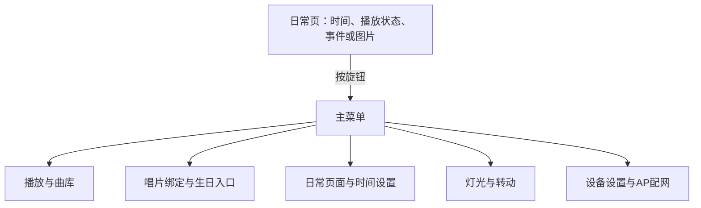

# 显示与本体交互专项

对应 F03、F04、F15、F16。首版日常显示已确定为时间/日期、播放器状态、事件页面和静态图片切换，离线可用；显示器件和控件仍待核对。

## 墨水屏候选

按D059，以既有墨水屏参考方案作为原型基线，不先全面盘点旧材料；接入时核对屏/驱动板型号、黑白或三色版本、供电/逻辑电平及排线引脚。公开参考作品记录了2.9英寸296×128屏、STM32F103CBT6、DS1302和VC02；拥有参考方案材料不代表全部沿用，主控、RTC与语音仍按本项目需求评审。原作使用STM32 HAL GPIO，不能直接把固件烧到ESP32-S3。局刷/全刷时间仅属于原作条件，需在本项目实测；来源见[参考记录](../../references/sources.md)。

墨水屏适合静态页面和按需刷新。刷新任务不能阻塞音频，低光可读性、中文曲名、RTC保持和联网校时需要分别验证。天气、歌词、动画和原作VC02语音不因参考作品而纳入首版。

## 本体菜单范围

本体离线覆盖基本全部首版功能：播放/暂停、切歌、音量、歌单选择、已有内容与唱片绑定、生日入口、灯光/转动开关、事件查看与编辑、静态图片切换、时间设置、网络状态、进入AP和必要的保存/清除操作。原可按压旋钮、播放/暂停与返回键仅为候选概念；按D070，实际按键数和功能未冻结，开关机方式也待比较。网页提供批量编辑入口。

## 本轮操作概念草案

2026-10-08提出D051控件概念与D052开机已放片规则；2026-10-09明确实体控件仍可更改。以下映射仅是原型草案。

候选台架可用可按压旋钮及两键验证菜单，但不锁定成品按键。开机已有片先识别等待显式启动；运行中新放片按D066–D069规则处理。

| 控件或页面 | 推荐行为 |
|---|---|
| 日常页旋转旋钮 | 调节音量；直接作用于声音，数值显示的刷新节奏另行验证 |
| 按压旋钮 | 日常页进入菜单；菜单内确认当前选项 |
| 菜单内旋转旋钮 | 移动选项或调整当前字段；编辑页面明确显示字段与保存入口 |
| 播放/暂停键 | 各页面均控制当前播放；无已选内容时显示内容选择入口 |
| 返回键 | 返回上一层；菜单退出后回到此前日常页，首页不触发隐藏动作 |
| 日常页 | 时间/日期、播放器状态、事件或图片页面按已有需求组织；电量与网络状态按屏幕空间评估 |

菜单层级、切歌快捷操作、开机无唱片的恢复规则、唱片与网页入口切换、事件中文标题输入和离线文件导入继续评审；不能以已选控件为由将本体编辑功能改成必须通过网页完成。

## ABC界面接口：2026-10-09

本体离线界面应能显示电子身份对应的A/B/C类型、目标、当前模式和识别故障。有效主动选歌先退出旧B/C，暂停、音量与模式内切歌不退出；手动退出B/C后原片仍在位不得自动重启。建议有明确模式退出和本体身份映射编辑入口，具体实体按键及操作方式未定。灯光暂不与ABC强制关联。

### RC-05A · 本体模式状态的提示要求（2026-10-09）

建议界面区分“正在播放/已暂停”和“B/C模式仍活动”，不能以音频暂停推断模式退出；尤其C已经取走却仍运行时，应继续显示锁存模式标记。对B已真实取走而新卡未绑定的场景，必须显示旧B已结束与新卡无效两个事实；读卡器故障/在位不确定不得显示成“唱片已取走”。本体主动选新曲目用`SELECT_TRACK`语义，模式内部切歌用`MODE_NEXT/PREV`语义；实体按键数量和手势仍不冻结（D070）。长期读卡故障安全策略、STOP按钮动作和断电恢复状态依RC-05A的U2–U5后续确认。

## 通过条件

- 断网和无手机持续连接时，屏幕可显示歌曲、播放、电量/充电和已选日常页面。
- 刷新不造成可听断音；实际中文文本、图片导入和保存行为可重复。
- 低光下屏幕与控件可用，夜间灯光和转动可独立关闭。
- 时间掉电保持、手动校时、事件边界、图片格式与存储容量分别记录证据。

显示规则与整机状态回写 [product/interfaces.md](../../product/interfaces.md)；屏幕代码进入 [firmware](../../firmware/README.md) 对话。
