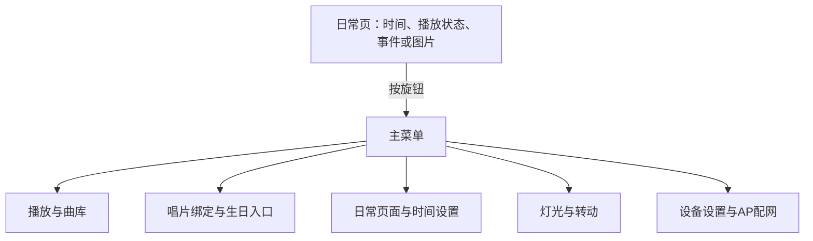

# 显示与本体交互专项

对应 F03、F04、F15、F16。首版日常显示已确定为时间/日期、播放器状态、事件页面和静态图片切换，离线可用；显示器件和控件仍待核对。

## 墨水屏候选

优先盘点此前墨水屏项目的实物，记录准确型号、分辨率、黑白/三色、接口、驱动板、排线、外形和完好状态。公开参考作品说明了2.9英寸296×128屏、RTC、事件和换图功能；它使用STM32 HAL GPIO，不能直接把原固件烧到ESP32-S3。局刷/全刷时间仅属于原作条件，需在本项目实测。

墨水屏适合静态页面和按需刷新。刷新任务不能阻塞音频，低光可读性、中文曲名、RTC保持和联网校时需要分别验证。天气、歌词、动画和原作VC02语音不因参考作品而纳入首版。

## 本体菜单范围

本体离线覆盖基本全部首版功能：播放/暂停、切歌、音量、歌单选择、已有内容与唱片绑定、生日入口、灯光/转动开关、事件查看与编辑、静态图片切换、时间设置、网络状态、进入AP和必要的保存/清除操作。控件概念按D051采用可按压旋钮、播放/暂停键和返回键；开关机单独安排，具体器件与手势待比较。网页提供批量编辑入口。

## 本轮操作概念草案

2026-10-08已确认D051的控件概念及D052的开机已放片规则。以下操作映射与页面层级仍是推荐草案；器件、尺寸、接线与界面实现交由对应专项比较。

本体采用可按压旋钮加播放/暂停键、返回键，旋钮负责音量和菜单操作，开关机单独安排。开机时唱片已在位，先识别并等待按播放；正常运行后新放片仍按D046立即播放。

| 控件或页面 | 推荐行为 |
|---|---|
| 日常页旋转旋钮 | 调节音量；直接作用于声音，数值显示的刷新节奏另行验证 |
| 按压旋钮 | 日常页进入菜单；菜单内确认当前选项 |
| 菜单内旋转旋钮 | 移动选项或调整当前字段；编辑页面明确显示字段与保存入口 |
| 播放/暂停键 | 各页面均控制当前播放；无已选内容时显示内容选择入口 |
| 返回键 | 返回上一层；菜单退出后回到此前日常页，首页不触发隐藏动作 |
| 日常页 | 时间/日期、播放器状态、事件或图片页面按已有需求组织；电量与网络状态按屏幕空间评估 |

菜单层级、切歌快捷操作、开机无唱片的恢复规则、唱片与网页入口切换、事件中文标题输入和离线文件导入继续评审；不能以已选控件为由将本体编辑功能改成必须通过网页完成。

## 通过条件

- 断网和无手机持续连接时，屏幕可显示歌曲、播放、电量/充电和已选日常页面。
- 刷新不造成可听断音；实际中文文本、图片导入和保存行为可重复。
- 低光下屏幕与控件可用，夜间灯光和转动可独立关闭。
- 时间掉电保持、手动校时、事件边界、图片格式与存储容量分别记录证据。

显示规则与整机状态回写 [product/interfaces.md](../../product/interfaces.md)；屏幕代码进入 [firmware](../../firmware/README.md) 对话。
