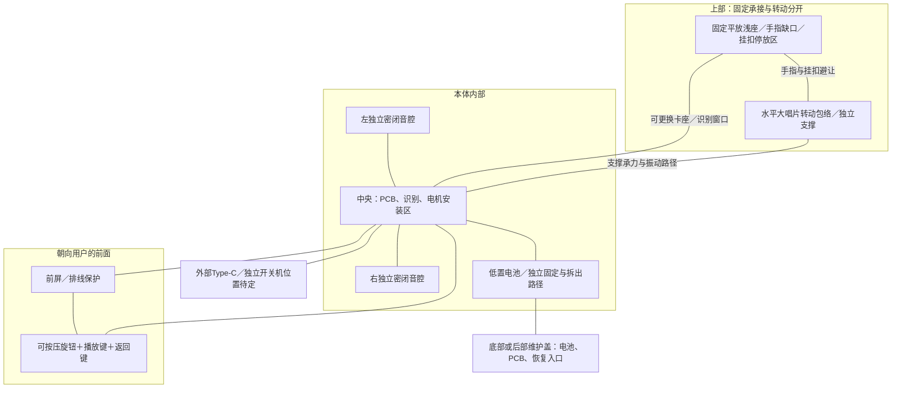
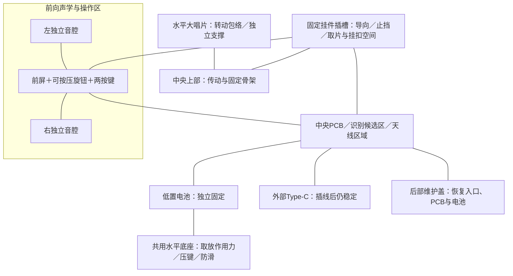

# 结构、音腔与成品材料专项

对应 F03、F06、F14，以及整机体量和音质目标。结构规划必须把挂件、识别线圈、左右音腔、前屏、电池、PCB、Type-C、运动间隙和维护路径放在同一布局中检查。

当前阶段主控为S3模块验证、S31成品主线（D063），参考开发板尺寸不作为成品主板尺寸。音频与结构按D064共同验证音质/性价比两套声音模块、约1米听距；按D065核对近圆形蛋糕生日卡的最大宽高、实际支撑边、挂扣与标签包络，不能只用标准圆片直径代替卡座配合。

## 推荐布局方向

先用纸板、泡沫板或现成盒体做台架；推荐低矮水平本体，左右扬声器分别留出可调整音腔，顶部大唱片始终平放转动，小唱片挂件由独立静止卡座承接，前面安排屏幕与控制器。旧概念图和15厘米级占地只是探索，不是外壳尺寸上限。

2026-10-08用户澄清：平放与插槽比较的是小唱片挂件的承接方式，大唱片确定平放。两种卡座均固定在本体上，与大唱片转动区分开；比较取放、挂扣空间、在位/身份检测、对内部空间的占用与维护。大唱片竖立不属于当前候选。

### RC-03A读卡天线与卡座交接（2026-10-09，未制造）

首轮读卡台架暂选PN7160 MINI V1主板26.937×20.066 mm及两种**外置读卡天线**25×10、50×40 mm（各带约10 cm线）；模块、线束、连接器弯折空间、天线及独立识别区须分别占位。这些是P2试验材料而非成品PCB或卡座已选尺寸。两副天线应分别在浅座和自然插槽验证线圈方向及读区，不能默认相同放置结构能得到相同效果；金属挂扣、扬声器、盘电机和固定件进入联合偏差扫描。小天线可能减小邻片串读，也可能降低小标签读取裕量，最终凭实测决定。

## 必须检查

- 音腔容积、密封、网罩、材料刚度和箱体共振；装入最终结构后重新试听。
- 挂扣和小唱片与大唱片、电机、线圈、扬声器磁体及金属件的距离。
- 屏幕开窗、旋钮/按钮可达性、Type-C插拔、电池固定与更换、存储和调试接口。
- 天线净空、散热、线缆弯折、底盖拆装、PCB固定和成品装配顺序。
- 成品材料相对试验材料带来的声学、耐用、触感、加工和维修收益与费用。

正式CAD和打印/加工文件进入 [mechanical](../../mechanical/README.md) 对话；概念图片不代表可制造模型。

## 首轮规划：结论与输入缺口

日期：2026-10-08。以下是P1候选研究和P2试验建议，尚无装配、试听、机械噪声、温升或维护操作的实测结果。

推荐采用**大唱片平放的低矮水平本体＋左右可拆独立密闭音腔**作为共用台架，分别制作小挂件平放浅座与插槽的纸板占位对照。两种卡座共用同一对音腔、音频链路和控件，便于区分承接结构影响与扬声器差异；成品尺寸与材料等证据形成后再收敛。小唱片静止卡座与大唱片运动机构分开承力，控件固定在刚性骨架上，电池和电路置于独立维护区。

| 依据 | 本专项已确认的要求 | 仍缺的输入 |
|---|---|---|
| D018–D020、D035–D036 | 紧凑、音质不能静默牺牲；评估左右声道；模块阶段同步改善声音 | 扬声器型号、参数、声学目标、常用听距与响度；没有成品厘米数上限 |
| D017、F06及2026-10-08本专项用户澄清 | 希望转动；大唱片始终平放，小挂件比较平放或插槽 | 大唱片直径/质量、转速、支撑和传动；挂件厚度/全包络、插入方向和识别窗口；F06仍需可行性验证 |
| D021、F09 | 内置电池、Type-C边充边用、续航尽量长 | 电池完整封装尺寸/质量、保护与测温、功耗和散热数据 |
| D025、D042、D045、D051、D070、F03 | 前屏与离线操作；旋钮/两键仅原型概念，按键数量与功能未冻结 | 屏/驱动板包络及经审阅的控件空间、按压行程和开关设计 |
| D037、D039、D041 | 目标为一块主板集中功能；成品PCB和外壳共同收敛；成品采用更好的材料 | 板卡包络、连接器/天线区域、准确制造报价与材料试样 |
| D053、F14 | 预留固件更新和烧录接口 | 所选主控的USB更新、恢复模式、复位和恢复连接器/焊盘要求 |

按D059，显示以既有墨水屏参考方案作原型基线，其他功能按新模块准备准确尺寸与制作条件，不以全面库存盘点为前置。下述公开型号均是尺寸/成本参考，不是已采购器件或批准BOM；挂件造型、封装和挂扣由[挂件专项](../charms/README.md)维护，身份与标签由[识别专项](../records/README.md)维护，本专项负责本体卡座、承力、识别窗口和运动避让的配合。

## 三条候选路线

比较先保持大唱片平放、低矮水平本体、左右分别出声、前屏、旋钮与两按键、电池和维护入口这些共同条件。A/B比较小挂件承接结构，C比较声学组件；C可与任一种挂件卡座组合。

| 比较项 | A：挂件平放浅座＋自制可调音腔，建议作为基线 | B：挂件插槽＋自制可调音腔 | C：共用水平本体＋现成带壳扬声器对 |
|---|---|---|---|
| 能力与空间 | 前向左右单元，中间屏幕/控件，顶部水平转盘及固定浅座；净音腔容积可独立调整 | 复用相同本体与水平转盘，固定浅槽容纳挂件下缘；槽体/识别部件置于中央固定区，不侵占音腔 | 声学组件外包络较明确，保留原壳体；减少初期制箱变量，容积/单元难独立调整 |
| 尺寸依据 | 由两个音腔、中央功能区、盘径、挂件平放及挂扣/手指包络、线缆和维护路径反推；未核实能装入 | 除共同输入，还需挂件厚度、插入深度、露出高度、导向/止挡及拔出路径；未核实能装入 | S1每只30×70×17 mm；这只是两只组件包络，不能推出整机尺寸 |
| 取放与控件 | 从上方放下/拿起，浅座设置手指缺口；需避免挂扣垂入转盘、遮挡屏幕或妨碍旋钮 | 插入后可能更易固定姿态；需验证导向、防卡、挂扣外露与取片手指空间，不能靠晃动本体拔出 | 与采用的卡座方案共同验证；组件摆放不能遮挡出声面、屏幕或取片区域 |
| 声音 | 音腔、障板、网罩可迭代；密封与刚度取决于试样 | 同一单元/容积下主要比较槽体对密封、壁面刚度和振动的影响；插槽不能通向音腔 | 原壳体保留完整；网页没有充分的频响/失真数据，不能预判音质更好 |
| 重心与机械声 | 电池低置，水平转盘与卡座分开承力；挂扣和挂件需避免振动敲击 | 同样低置电池、水平转盘；挂件露出增加局部高度，槽内间隙可能产生松动异响，需验证取放作用力 | 原壳体固定点明确，但安装到本体后仍可能共振；运动机构问题与A/B共同验证 |
| 价格 | 音腔板材、密封、骨架和浅座待询价；参考圆形单元对的网页价见S2/S3 | 可复用相同音腔与骨架；槽体、导向/止挡及识别配合件的加工费用待询价 | S1成对US$7.50，另加骨架/固定/卡座；整机费用待其他专项汇总 |
| 功耗 | 被动卡座/音腔/骨架无独立电源负载；相同听感响度下所需功放功耗须实测 | 被动槽体无独立电源负载；识别/在位检测功耗依准确方案，水平传动仍须实测 | 被动扬声器不增加控制板；3 W额定值不是系统平均功耗或续航依据 |
| 软件与工具 | 纸板占位和手工台架无需专用软件；后续参数化CAD可评估S5，未定工具链 | 同A；识别/在位规则由唱片专项负责，不能仅凭插入推定识别成功 | 扬声器组件无专用驱动软件，仍依赖音频专项选择的功放；现成壳体没有可编辑声学模型 |
| 供货与阶段 | 通用板材易替换，准确规格/加工渠道未核实；适合P1/P2探索 | 占位材料可共用，最终槽体公差和识别配合取决于实物；适合可更换卡座对照 | S1网页可加入购物车；本地供货、到货时间及批次一致性待核实；适合快速尺寸/声音基线 |

建议先以A建立取放与声音基线，再换装B比较定位、占位和识别配合。A浅座较容易裁改，B可能减少挂件在顶部的平面投影并稳定位置，但需容纳槽体深度、露出高度及导向公差；这些收益尚未验证，卡座方式未定。C是减少制箱变量的对照，不能用“自带壳体”替代试听。

### 公开尺寸、价格与能力证据

访问日期均为2026-10-08。美元价格保留原币种，未计运输、税费或换算；它们是公开零售参考，不是本地采购报价。以下均为**扬声器实物/组件**，不是功放模块或芯片价格。只摘录参数并链接来源，未复制图片或模型。

| 来源 | 核实内容 | 价格、供货及证据边界 |
|---|---|---|
| S1：[Adafruit 1669](https://www.adafruit.com/product/1669)，Stereo Enclosed Speaker Set | 两只带壳扬声器，4 Ω、网页标注3 W；每只30×70×17 mm、25 g；安装孔直径3.1 mm，孔位矩形24×64 mm | 1–9对US$7.50/对，网页有Add to Cart；没有核实库存数量、国内渠道、壳内净容积、密封形式、T/S参数和声学曲线。共享插头须由音频专项核对左右线对与功放兼容性 |
| S2：[Adafruit 3968](https://www.adafruit.com/product/3968)，40 mm圆形单元 | 整体直径40 mm、高20 mm、27.3 g，4 Ω；可用作自制音腔的尺寸参考 | US$4.95/只，两只US$9.90；网页缺货。标题写5 W、描述写3 W及以下，关联链接又写4 W，功率存在冲突，待供应商/数据表核实；缺T/S、频响及失真证据，不因功率标题推荐采购 |
| S3：[Adafruit 6486](https://www.adafruit.com/product/6486)，36 mm单元 | 网页标注8 Ω、2 W及以下，带简单圆形塑料壳；直径36 mm；其描述明确定位为小型音乐/道具用途 | 1–9只US$1.95/只，两只US$3.90，网页In stock；深度、质量、背部结构和密闭状态待核实，不能当作裸单元直接重新封箱。适合占位/发声基线，不据此认定满足本项目音质 |
| S4：[Elliott Sound Products：Loudspeaker Enclosures](https://sound-au.com/articles/enclosures.htm)，2.2及箱体相关章节 | 密闭箱需要匹配单元参数；箱内支撑/单元占据容积；箱体刚度、吸声和材料影响结果 | 技术参考，不是本项目测量；其家用音箱论述需结合小单元和实际试样，不照搬箱体尺寸 |
| S5：[FreeCAD](https://www.freecad.org/) | 官方说明为开源参数化建模器，可调整尺寸并形成工程图，无软件授权费 | 仅为后续CAD工具候选；本轮未安装、建模或验证导出。加工费用与软件费用分开计算 |

S2/S3只是圆形尺度参考。正式扬声器、功放与声学目标交给[音频专项](../audio/README.md)比较，不因本表锁定品牌、阻抗或功率。

## 布局概念与尺寸反推

### 三维挂件承接对照

按2026-10-08用户澄清绘制：两侧本体都采用水平大唱片，比较的对象是小挂件卡座。上排为外观，下排为剖视；[公开提示词和生成参数](../../assets/concepts/charm-placement-study-3d-v3-prompt.md)记录几何参考与上游`gpt-image-2.5-sunburst`重绘。壳体、单元、PCB、电池和接口均为概念占位，图示不验证尺寸、识别方式、音腔密封或装配；最终位置仍按下面的分区约束与实物核对。

三维图目前仅用于审阅挂件取放与外观。当前重绘已按以下标准检查：每侧格栅与单元共享同一前障板位置；音腔隔板和顶部封闭边界连续；中央运动支撑、PCB与电池各有固定区且无穿插；卡座与槽体避开音腔和转盘；同一部件在不同视图中形状与位置一致。图中的“左前出声”“右前出声”指向正面两侧格栅，剖视对应其后的两个单元。

以下图是空间分区和配合关系，不按比例绘制，不代表已经装下。左右音腔的内部不放电池、电路、卡座或电机；它们与中央维护区用实体隔板分开。中央区允许按真实部件叠层，不能占用左右净音腔。

### A：小挂件平放浅座，大唱片平放

左右单元先朝前比较，使常用坐姿能同时听到两声道；声道间距受整机宽度限制，不承诺宽阔声场。顶部承力骨架跨过中央区，不能把薄屏框或音腔活动后壁当作转轴支撑。卡座优先放在不跨越旋转区的固定边沿，其确切位置等挂件及识别窗口输入后确定。

### B：小挂件插槽，大唱片仍平放

这里仅改变小挂件的承接：下缘进入固定浅槽，上部和挂扣外露，具体角度/深度待唱片全包络与识别输入。大唱片保持与A相同的水平转动方案。插槽底部、导向与识别窗口放在中央固定区，不能贯穿左右音腔；评估挂件与转盘的径向/高度避让、手指拔出路径以及插槽清理与更换。挂件取下后，开口内部不直接暴露运动件、电池或易受碰触的电路。

### 计算规则

- 所有模块记录三个尺寸、安装方向、孔位、质量、连接器突出量、排线最小弯曲要求和插拔/工具路径；尺寸来自准确图纸或实测，候选区用明确占位标签。
- 每侧净音腔 `Vb = 内部几何容积 − 单元背部 − 支撑/密封凸台 − 其他箱内实体`。吸声材料及其影响单独记录，不拿外壳总体积当音腔容积。左右目标容积保持一致，实测差异记录到结构版号。
- 水平排列时，本体宽度至少覆盖左音腔外宽、中央区外宽、右音腔外宽；再与唱片转动包络和控件排布取较大值。深度/高度按各分区最大需求及叠层计算，加外壁、隔板、脚垫和必要通道；只有实际叠层成立时才能复用投影空间。
- 两种方案的大唱片均水平，总高取本体/转盘叠层与小挂件露出/挂扣包络中的最大需求。插槽的内部深度、外露高度和拔出手部空间分别检查，不能只按槽口宽度判断可装入。稳定性用实测质量、重心投影与取放/按压作用力检查，不能由外观推断。
- 旋转半径应包含盘半径、径向跳动、偏心与装配公差；高度/轴向空间包含翘曲、轴向窜动和定位件。网罩到振膜的距离由最大位移、罩体变形和装配公差决定，当前不写固定毫米值。
- 例如空箱内部50×80×50 mm只有200 mL几何容积，放入单元后净容积更小；这只是算术示例，既不是推荐音腔，也不是成品尺寸承诺。

## 可调整音腔台架

首轮建议采用**两只相同单元＋左右分别密闭、可移动后壁的刚性试箱**。纸板/泡沫板用于整机占位与取放；声音对照用较刚性的现成盒体或板材箱，逐条核实接缝、后壁和穿线口。原壳体不明的单元先查清背部声学结构，S1整壳组件保持完整，不套进第二层密闭箱来冒充同一对照。

| 音频专项需提供的输入 | 用途与缺失时的处理 |
|---|---|
| 单元完整外形、孔位、极性、阻抗曲线/标称阻抗、质量、背部通气位置 | 确认安装及驱动；背部通气和接线不能被固定结构堵住 |
| `Fs`、`Qts`、`Vas`，可用时再补最大位移及厂家箱体建议 | 据参数选密闭箱初始容积；参数缺失时只做经验对照，不宣称已调谐或有确定低频截止 |
| 频响、灵敏度及测量条件、可用响度下的失真/功率限制 | 选试音范围和增益，避免用不同测试口径的灵敏度排序 |
| 实际音乐/人声片段、常用听距与目标响度、功放与供电条件 | 在相同条件比较声音与功耗；不是由结构专项另定音乐格式或功放 |

台架用可换前障板适配单元，用螺钉/夹紧和密封条固定后壁；移动后壁改变容积时，单元、前障板、出声方向和试听位置保持一致。穿线口独立密封，吸声材料远离振膜、背部通气和运动件，不能用塞满材料掩盖壳体振动。

有厂家容积建议时，先比较其附近三个容积，例如建议值的0.75、1.0、1.25倍；没有建议时，按单元深度与实际可用空间选三档，记录净容积。0.15/0.30/0.45 L每侧仅可作为可调范围的示例，是否适用等待单元输入；后壁滑动范围不能先锁定这些数值。

先比较密闭箱，原因是可减少孔道、调谐和漏气变量。倒相孔/被动辐射器需要单元参数、调谐、占用体积及实际频响证据；若密闭路线无法满足已审阅的声音目标，再由音频与总规划评审是否加入。这不是放弃低频目标或提前锁定成品箱型。

## 最小材料与用途

下表为下一阶段所需材料，不代表库存或采购授权。两种布局尽量复用同一套音腔和功能模块；先完成占位，再确定要制作的刚性台架及报价。

| 材料/工具 | 最小数量或形式 | 用途及归属 |
|---|---|---|
| 纸板/泡沫板/现成盒体、可移除胶带 | 两种占位外形，可拆用同一批材料 | 检查屏幕、控件、手指、挂扣、盘包络、线缆和维护；费用/本地供货待核实 |
| 已核对的一对匹配单元与音频链路 | 一对；由音频专项提出 | 左右测试音及后续试听；不重复采购主控/功放 |
| 刚性试箱、可换障板、可调后壁、隔板 | 左右各一套 | 扣除实体后的净容积比较；现成箱或板材加工报价待核实 |
| 密封条、穿线密封、少量吸声材料、螺钉/夹具 | 按实际周长、孔位与后壁面积计量 | 分别验证漏气、吸声和装配；不预先按未知尺寸开采购数量 |
| 可拆中央骨架、脚垫、分开的电池托与电机安装片 | 一套复用；分别换装平放浅座/插槽试样 | 分开声学、电子和运动区；隔振先比较刚性安装与弹性安装，水平盘轴定位保持可靠 |
| 屏幕/控件/板卡/电池/插头包络模型 | 每个准确候选一份；实物可替代模型 | 未知尺寸标待输入；稳定性用实际质量或明确标注的模拟配重，不把模型重量当电池实测 |
| 卡座占位与挂扣停放模型 | 两种布局可复用 | 等唱片专项提供全外形、取放方式和识别窗口；先不定挂件造型 |
| 尺、卡尺、秤；音频与电源测量条件 | 各一套按可用条件核实 | 记录尺寸/质量、相对试听、平均/峰值功耗与温度；手机可记相对噪声，不能冒充校准dBA |

## 加工材料、装配与维护比较

材料结论是工程建议，厚度、牌号、表面处理和成品报价均待试样。本轮未读取有效加工订单报价，不能给出整壳实际价格。

| 材料路线 | 声音、触感与加工要点 | 装配维护、代价与适用阶段 |
|---|---|---|
| 纸板/泡沫板或通用盒体 | 便于裁改，适合空间与手部占位；柔性壁面/接缝影响声音，不能把占位壳试听当成成品结论 | 低门槛、可拆改；本地规格/费用待核实，用于P1和非承力概念检查 |
| 木质刚性试箱，如胶合板/MDF | 便于制可调箱；较厚板材/支撑可减小壁面振动，但增加质量与占用；表面封闭与密封须验证 | 适合P2音腔台架；螺钉与可换后壁便于复用，板材切割/表面处理费用待询价 |
| FDM塑料或SLA树脂定制壳 | FDM接缝/层间密封与螺柱强度、SLA脆性/热性能取决于具体材料；可实现细节，不直接保证声学或温升更好 | 后续小批候选；CAD、加工公差、密封、螺钉嵌件与表面工序增加成本；选工艺后查材料数据表/报价 |
| 木质声学内箱＋可拆塑料外壳 | 可分别优化刚度、外观与维护，但双层壁和固定件占空间/质量，跨层连接可能传振 | 成品候选，不能因“更好材料”自动选择；先证实相对单层壳的声音/触感收益，再由总规划比较费用 |

建议成品装配顺序为：声学箱体与密封检查、安装中央骨架、安装电池/PCB及独立连接线、安装屏幕和控件、安装卡座及运动支撑、接线检查、关闭维护盖。若顺序无法在候选外形内完成，修改布局再出制造模型。

扬声器和电池有独立固定及可拆连接，正常更换电池不破坏音腔密封，不依赖拆下屏幕玻璃。维护盖开启后能看到接口标识并操作工具；拆盖本身不拉扯排线或电池线。散热通路位于中央电子区，不以给密闭音腔开通风孔解决充电温升；天线/近场识别窗口的金属避让按准确模块资料及组合实测确定，不虚构统一净空距离。

## 试验步骤与建议通过条件

全部为待审阅、待执行建议；对应T01/T02/T03/T06/T07/T10。不在本轮进入接线、固件、制造CAD或采购。

| 步骤 | 操作和应保留的证据 | 建议通过条件 |
|---|---|---|
| E1 输入与占位 | 建立准确部件包络表；做A/B纸板布局，包含真实插头、排线、取放与工具路径；未知件显式标注 | 已知部件和运动/手部包络无干涉；未知项形成缺口清单，未齐时不能声称整机装下 |
| E2 音腔与声道 | 同一对单元分别装箱；验证左右测试音，记录净容积、密封、障板/网罩、吸声与固定方式 | 左右映射正确；无漏气异响、罩体碰膜或松动振动；左右采用相同目标容积和配置 |
| E3 三档声学比较 | 同一文件、供电、听距/摆位，比较三个容积；可用测量条件下匹配响度，例如中频相差不超过1 dB；记录人声、低频、破音及功耗 | 在审阅的常用响度下无可听破音/结构异响；至少有可复现的选优依据。未校准的手机结果仅用于相对比较，不报绝对频响/声压达标 |
| E4 操作与稳定 | 每种布局建议连续取放挂件20次、按压/旋转控件20次；加插线状态，观察底座、挂扣和读屏；核对全部已审阅离线操作的物理可达性 | 不擦碰运动件、不夹住挂扣；按键不顶压屏幕；本体不倾倒、不因操作持续滑移；成功与误操作次数逐项记录 |
| E5 运动与识别联测 | 安装已选候选运动/识别模块，比较停转/转动、刚性/弹性固定；记录盘跳动、电流、低音量机械声和卡座识别 | 实测包络内无接触/防脱失效；低音量时无盖过人声的机械声；取放规则满足唱片专项建议测试，不能只验证静止标签 |
| E6 充电与热 | 在可承力、可测温的稳定台架上，由电源专项执行预期负载和边充边用测试；记录环境温度、电池/充电器/功放及表面热点 | 符合准确器件/电池工作限制及双方审阅的表面温度目标；与T06同步验证，不把开敞台架温升当作封闭成品结果 |
| E7 更新与维护 | 演练不拆壳连接数据线；应用失效条件下通过维护盖操作恢复模式/接口；拆装电池及关键模块 | 正常更新无拆壳要求；内部恢复无需破坏外壳或音腔、无需拆卸屏幕；线缆/排线不受拉，接口操作成功有实际记录 |

**主要声学比较听距按D064约1米**，同曲段、同摆位、相近响度比较音质与性价比两条路线；0.5米可作为额外近场补充测试，不能取代或混入1米主验收口径。最终音量和机械噪声容忍度仍由体验审阅落实，不设未经确认的低频下限或绝对噪声限值。失败先定位密封、固定、跳动、传振或电源干扰，再改变方案；不同时更换单元、音腔和电机后宣称单项收益。

结果记录至少包含结构/模块版号、部件输入表、净音腔容积、试听位置与响度方法、平均/峰值功耗的测量条件、噪声/干涉现象和照片。实际结构证据后续随版号放入 `mechanical/`，本页引用；照片检查隐私与素材授权。

## 共享接口请求：交总规划协调

本节为建议，不修改其他专项或 `product/` 的契约；准确引脚、毫米数和电源轨等待候选输入。

| 对方专项 | 需要其提供 | 本专项提供/共同检查 |
|---|---|---|
| 音频 | 一对匹配单元的完整尺寸/参数、增益/响度、功放热与连接器需求 | 分侧净音腔、障板/网罩、固定/穿线密封、相同条件的声音与功耗结果 |
| 显示/交互 | 屏幕、驱动板、排线、固定禁区；旋钮轴/按压行程、两按键及独立开关器件；操作覆盖 | 开窗、读屏角度、手指空间和刚性控件承力；按旋钮不能通过屏幕玻璃传力 |
| 唱片 | 挂件含挂扣的全包络/质量、取放方向、标签/触点/标记窗口及在位检测需要 | 可更换静止卡座、导向/止挡、挂扣停放、识别距离/金属避让联合试样；不代定挂件身份路线 |
| 灯光/运动 | 盘径/质量、轴与防脱、跳动、转速/启动电流、传动/安装点和灯光发热 | 支撑与运动包络、隔振/传振路径、遮光与可维护性；建议小唱片保持静止供识别 |
| 电池/电源 | 电池包封装/质量、保护/NTC、允许固定方式、温度限制、充电发热和输入线缆 | 独立电池托/拆出路径、电子区散热、Type-C插拔、重心与封闭壳体联合温升证据 |
| 主板/固件 | 原型/成品板外形、孔位/连接器、天线资料；正常更新/失效恢复的准确工具、控制与供电流程 | 中央维护区、插头/工具包络和维护盖；一块主板集成目标保持，原型模块堆叠不等于成品尺寸 |
| 总规划 | 汇总声音目标、桌面占地/高度、续航/电池、成品材料报价及重要体验取舍 | A/B占位和同条件比较证据；建议在P3联合核实尺寸，再进入成品PCB/结构收敛 |

### F14接口的结构要求

**正常固件更新入口**建议在外部不拆壳可用，优先比较Type-C兼顾电源与所选方案需要的数据；Type-C外形不证明支持USB更新。端口周围要包含线头、手指和线缆弯曲空间，接入线缆不能迫使本体倾倒、盖住控件或侵入转动区域。固件专项明确更新对音乐、绑定、设置的影响，结构不替它决定擦除策略。

**内部恢复烧录入口**经独立维护盖可达，应在应用无法正常运行时仍能操作所选主控的下载/复位机制和恢复连接器或焊盘。接口、地参考、必要电源关系和模式操作标识清楚；探针/插头有定位与工具空间，不要求全部UART/SWD/JTAG同时预留。恢复过程不以卸下电池、破坏音腔或焊脱线束为日常步骤；具体电路是否需电池隔离由电源/主控专项核定后反映到可达性设计。

## 需要用户落实的重要取舍

首轮可先做两种占位图和共用音腔台架，不必在没有试听/包络证据时锁定成品外形。下列事项在依赖它的制作或成本决定前，由总规划呈现证据并使用结构化选择；本页不新增D编号。

| 待决定事项 | 当前推荐及取舍 | 做决定前所需证据 |
|---|---|---|
| 小挂件承接方式 | 大唱片平放已明确；以平放浅座建立基线，再比较插槽的定位/占位收益与公差、清理和识别代价 | 挂件全包络、两种卡座试样、挂扣/手指空间、取放/识别和与水平转盘的避让 |
| 体量、低频/响度与电池 | 先确认可接受声音再压缩占地，比较电池容量对体量/续航的实际收益；不由结构专项指定上限 | 同条件试听、净音腔、完整电池尺寸/质量与实测功耗 |
| 转动与安静 | 继续验证转动，希望保留；若可用机构在常用低音量下明显影响声音，提交隔振/机构改进代价或体验调整，由用户选择 | 盘启停、机械声、识别干扰、功耗和改进费用；不能静默删除F06 |
| 成品材料升级与费用 | 先证明相对试箱的密封、触感、耐用和维修收益，再比较单层定制壳与复合壳 | 材料数据、声学/温升试样、加工报价；不得从“更好材料”推定具体工艺 |

交总规划汇总的本轮用户澄清：**大唱片始终平放，平放/插槽比较只针对小挂件**。建议将“输入齐备后的部件包络表、两种固定卡座与水平转盘不干涉、分侧音腔与电子区隔开、控件承力、正常更新和内部恢复可达”作为P2/P3联合评审输入；共享接口与整机验收由总规划维护。下一阶段制作继续在对应实现对话执行。
