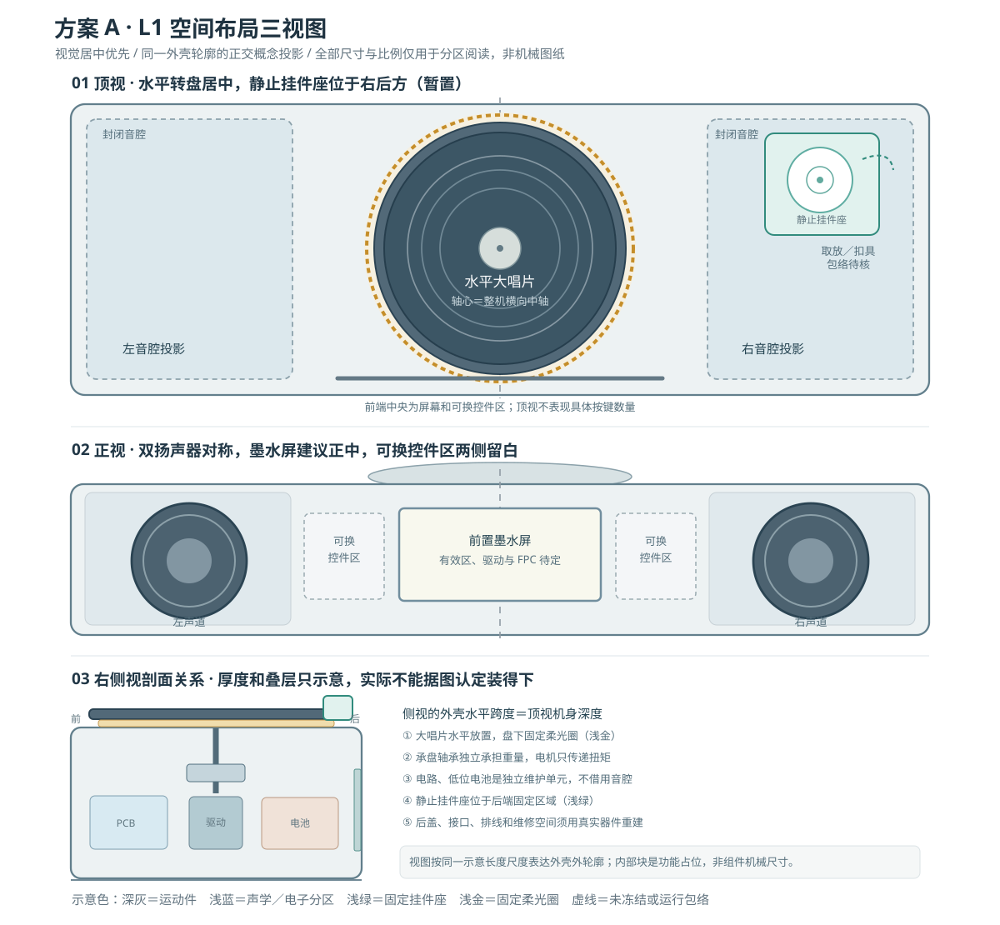
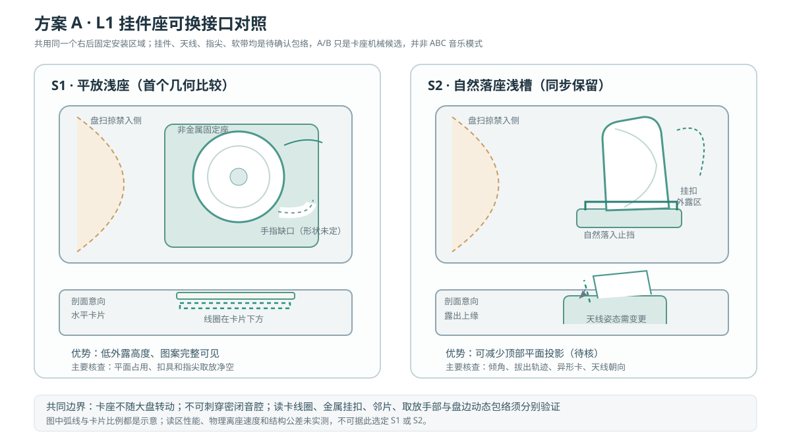

# RC-LAYOUT-A / L1 · 视觉居中优先的整机布局深化（v0.2）

> **状态：待审阅的 L1 布局提案｜2026-10-10。** 用户本轮选择“**方案 A 视觉居中优先**”作为深化方向。这只确定**草图的布局优先级**：不代表批准新尺寸、器件、材料、按键或卡座位置；**不新增 D 号正式产品决定**。本轮只做规划／示意图，没有实施 CAD 改动、实物验证或购买。工作分支：`plan/product-next-stage`。
>
> 前一轮：[L0 空间架构与 K01–K06](concept-layout-a-v0.md)。共同约束以 [决策记录](../../product/decisions.md)、[结构专项](README.md)、[灯光与转动](../lighting-motion/README.md)、[显示交互](../display/README.md)、[音频](../audio/README.md)、[识别](../records/README.md) 和 [挂件](../charms/README.md) 为准。

## 1. 本轮选择的真正含义

- **用户明确的偏好**：正面视觉对称和顶部唱片居中，优先于压缩最后一点机身宽度。允许隐藏的内部件非对称，不能靠牺牲音腔、播放可靠性和可维护性换取表面的绝对对称。
- **本轮建议（仍未确认）**：从 A1 继续深化。大唱片轴线与**整机横向视觉中心线**重合；两只前向扬声器中心相对该中心线镜像；前屏可视区优先居中；在前屏左右各留**可换控件占位区**，不画成已经决定的实体按键。
- **右后角静止挂件座只是候选**：不能为保持视觉居中把挂件座强塞到转动扫掠、扬声器密闭腔或 NFC 金属干扰区域。若卡座影响右音腔／取放，先在固定后边沿、独立侧缘、可换浅座与浅槽之间调整，不率先偏移唱片。
- **不变**：整机为独立本地播放器；大盘水平；左、右音路各自声学验证；固定柔光圈在大盘边缘下方；小挂件不参与大盘运动；音频／交互／ABC 产品行为依原 D 号继续。

## 2. L1 主布局：顶视、正视、右侧视

[打开可缩放的 SVG 三视图](../../assets/concepts/layout-a-l1-three-views.svg)

图内**三视图的外壳轮廓采用相同的示意长度尺度**：正面机身宽与顶视宽对应、侧视机身深与顶视深对应、正面／侧面机身高度对应。整套图展示的是**假设的轮廓比例**，不代表选定宽深高；内部矩形和圆形只标功能区，不是准确模块几何，更不是满足了安装公差的机械正投影。

| 视角 | 优先形成的布局关系 | L1仍无法消除的冲突 |
|---|---|---|
| **顶视** | 外框中线、大盘轴心、前屏视觉中心同线；左右音腔投影镜像；右后静止小卡座不随转盘运动；光圈固定在盘外缘之下 | 卡座与盘扫掠／挂扣／指尖相撞；右音腔上盖被迫打孔；后方线圈受附近磁性、金属件干扰 |
| **正视** | 左右前向音腔／单元布置对称；墨水屏建议中央；控件区域在两边对称预留**空间**，不确定控件实体数量 | 正面有限宽度是否容得下真实屏幕外框、喇叭安装边界、真实手部动作与音腔隔板 |
| **侧视** | 顶层水平承载盘＋独立轴承／传动；固定柔光圈不随动；中层主控、维护走线；低位电池独立固定；后部维护盖可达 | 低机身与转轴、电机、充电保护／散热、后盖拆装冲突；盘跳动和灯槽间隙未实测 |

### 可计算但还不能填入数字的几何约束

以下只用于未来真实包络校核，不是当前尺寸数据：

- 令壳体最外轮廓宽为 `W`、深为 `D`、高为 `H`，几何横向中线为 `x=W/2`。第一轮**建议**大盘中心 `x_disc=W/2`；正面扬声器目标为 `x_L+x_R=W`，墨水屏窗口中心优先 `x_screen=W/2`。
- 大盘动态半径为 `R_effective = R_platter + eccentricity + radial_runout + assembly_margin`；最终 `R_effective` 只能依据精确盘／轴与样机测量。手、软带、金属扣和小卡不得进入这个**扫掠包络**；只看盘静态外边界不足以放行。
- 小卡座不为视觉完整性突破音腔气密面：若右后区域投影落在右音腔屋面上，需有**独立固定支撑、非穿透安装或另设实体验证的隔离结构**，并验证封闭声学边界、取放挠度和 NFC 读区；不能把音腔顶部当读卡走线的自由通道。
- 屏幕只有可视区不是完整结构尺寸，需包含真实模块外框、玻璃禁压边、FPC 转折及驱动板包络；控件区两边保留是**位置探索**，不能宣称已决定双侧旋钮／按键。
- 机身总宽至少受左音腔外宽、中央工作区外宽、右音腔外宽之和约束，并与唱片和小卡座的联合包络取更大者；总深度与总高度同理按实际层叠及服务净空反推，**不从该 SVG 提取毫米值**。

## 3. 两种静止小挂件座：S1 / S2

[打开可缩放的卡座对照 SVG](../../assets/concepts/layout-a-l1-seat-options.svg)

| 比较项 | S1 平放浅座 | S2 自然落座浅槽 |
|---|---|---|
| 视觉 | 低矮、完整显示挂件正面；顶部占地可能较大 | 挂件竖起或倾斜，外露轮廓更强；可能破坏低矮感 |
| 取放 | 需要抓取缺口、软带／扣具收纳区；轻薄卡有时不易捏起 | 需要导向止挡、露出可抓边、异形蛋糕卡不挂住 |
| NFC | 平放卡片与座下线圈大体相对，仍需确认真实标签朝向／金属影响 | 卡片姿态改变，线圈方向／读区不能直接复用 S1 |
| 结构 | 上方若是声腔封闭顶板，安装座和走线不得破坏密封 | 深度与角度叠加侧向力，需检查槽底隔离、清洁与拆换 |
| 现阶段角色 | **先画 S1 的同框轮廓**作为第一套对照，非最终选定 | **保留等权的取放、识别对照**，不可提前排除 |

本轮建议采用**相同的可换卡座安装界面**进行比较；但真实托架固定孔位、接头、线圈方向及后壳轮廓仍需准确材料才能定义。同一安装界面不意味同一 NFC 天线位置无须重新测量。

## 4. L0 冲突 K01–K06 的 L1 评审记录（不是测试通过）

| 冲突 | 这轮的设计处理 | 当前状态／下一验证输入 |
|---|---|---|
| **K01 大盘 × 小挂件／手** | 大盘维持中轴、卡座静止并尝试安排在右后固定区域；动态边界单独标 | **未消除**：需盘径与跳动、软带、扣具、手指取放扫掠 |
| **K02 音腔 × 其他器件** | 左右音腔对称且封闭；中央只承担运动、电路、电池；卡座若投影位于音腔顶不得穿孔 | **未消除**：音质单元安装图、各档净容积、连续密封面 |
| **K03 NFC × 金属／电机／扬声器** | 卡座独立固定；浅座与浅槽分别记录线圈平面和金属区 | **未消除**：真实天线与小标签、邻片、读区和离座物理测试 |
| **K04 高度 × 传动／维修** | 独立轴承承载，电机只传扭；传动和后盖作为不同可拆单元 | **未消除**：电机轴向、联轴、轴承支撑、线头与工具包络 |
| **K05 正面交互 × 布局** | 两侧扬声器镜像；屏幕居中为优先草案；左右控件保留可调空间 | **未消除**：屏外形／驱动／FPC、实体操作方案与自然手位 |
| **K06 接口 × 电池／音腔** | Type-C、存储、固件恢复拟走中央后维护路径；侧腔保持封闭 | **未消除**：实际电源包与保护、接口板、拔插净空／维修流程 |

上述没有一项是通过实物测试；先前简化 CAD 的“占位无干涉”仅针对其已有虚拟简化模型，**不自动迁移为 L1 真实器件验证**。

## 5. 交给 L2 的输入清单（各专项并行，不重新做已确认产品决策）

| 责任专项 | L2 必需的准确输入 | 输入前禁止声称 |
|---|---|---|
| **音频＋结构** | 两条声音路线的喇叭外框、安装／背部净空，左右独立腔目标净容积与边界；密封／隔振方式 | 不能说同尺寸外壳已兼顾两路线音质 |
| **运动＋灯光** | 承载盘直径、质量、轴承、独立轴向约束、电机、联轴／皮带、灯槽全包络 | 不能说低矮比例已能承盘或灯环均匀 |
| **识别＋挂件** | 8 张卡最厚最薄、生日异形连续支撑边、标签位置／方向、扣具和真实天线包络 | 不能说右后挂件座位置可读、可可靠离座 |
| **显示／交互** | 墨水屏外框、有效区、驱动板、FPC 和本体菜单最小操作路径 | 不能按草图冻结两侧按键形式或数量 |
| **主控＋电源** | 真实台架与成品候选模块外形、PCB 天线禁区、供电轨及电池／保护包络、维修与下载入口 | 不能由 S3 开发板尺寸或电池裸包络推出 S31 成品主板和机身尺寸 |

## 6. L1 的阶段结论与下一轮建议

**本轮可保留为评审基准的关系**：大盘视觉居中；前向左右对称出声；前置墨水屏建议中置；静止挂件座通过可换件独立于转盘和封闭音腔；固定柔光圈围绕大盘外缘；中央区域可独立维护。优先用 **A1 + S1** 起画装配包络，**S2 并行对照，不删**。这是减少第一轮建模分叉的执行建议，**不是用户选定卡座 S1**。

**不冻结**：外观最终轮廓与颜色、长宽高与厚度、唱片直径/质量/转速、扬声器与净音腔大小、声学路线、卡座位置与装入方式、NFC 模块、材料厚度、控件数量与映射、屏幕型号与角度、电池/PCB层叠、USB口和维护盖位置、器件／BOM、PCB或开源参考实现。D001–D088 中已确定的 ABC 与内容逻辑均保持原样。

**进入 L2 的门槛**：用准确版号建立部件实体／安装／线头／运动／手部／维护包络表，在这个假设居中轮廓上求出矛盾项；若出现冲突，应明确究竟调整外壳长宽深、卡座位置、音腔配置还是机械叠层，并返回审阅，不能静默改成偏心盘或缩小音腔。随后再做 1:1 占位和真实声学／识别／维护验证。此阶段未授权采购或开始最终机壳和 PCB 制造。
