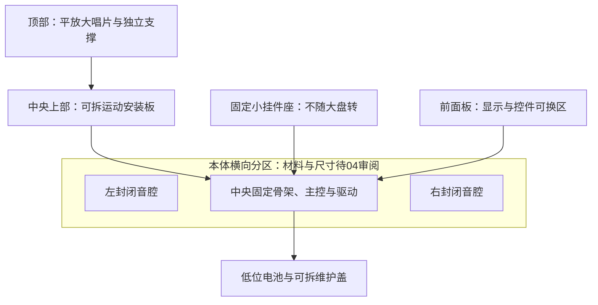
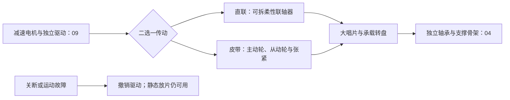

# 灯光与唱片运动专项

对应 F05、F06。灯光和大唱片转动是桌搭体验，不能成为本地播放的单点故障；两者均应可独立关闭。

## 首轮结论与边界

日期：2026-10-09。本轮形成硬件候选、共享输入和台架安排，尚无灯光、转动、噪声或负载实测。先用S3验证模块，成品沿用S31主线；具体模组、灯数、盘径/质量、转速、电机、驱动和采购均未冻结。

按本轮追加的单件DIY要求，推荐顺序调整为**先转动小模块，再材料与箱体布局，最后灯光**。先试独立轴承转盘与低速减速电机直联，评估直角出轴的安装收益；皮带保留为噪声、高度或维护条件需要时的对照。改变的是首轮制作顺序与比较重点，电机及传动没有定稿。2026-10-10用户审阅两种亮灯效果后明确偏向**唱片外缘下方固定柔光圈**，后续以此为主要灯光方向；前侧短灯窗不再作为默认外观。RGB与暖白仍按下表比较，整圈灯数、色温与动态效果未冻结。推荐不代表已经证明安静、能带动目标唱片或满足续航。

| 类别 | 本轮依据与处理 |
|---|---|
| 用户要求 | 大唱片平放，希望能转动；音乐独立工作，灯光和运动分别可关闭；采用打印件与亚克力的外观方向，灯光偏向唱片外缘下方柔光圈；当前只规划，不进行实物验证 |
| 已核实资料 | 下述公开商品、手册的电平、标称负载、外形与页面价格；只对应列出的型号和条件 |
| 估算与推荐 | 灯数范围、漫射试样间距、试验转速、惯量例子及费用小计；均用于比较，不作为成品规格 |
| 待对接 | 依据现行产品行为评估暂停/恢复是否停转、可选唱片灯效和夜间模式入口及恢复策略；依D070灯光不与ABC强制绑定，控件数量和映射仍为候选 |
| 职责 | 本专项负责灯光硬件、运动链路与驱动输入；04结构负责整机承力、安装、空间和声学，03电源负责供电能力，07主控负责资源与控制实现 |

**D070只冻结灯光不与ABC强制绑定，不等于已决定电机必须如何随音乐暂停/退出联动。** 大唱片转动应能独立关闭，后续依据结构/噪声和实际交互验证决定联动。

推荐由独立支撑和低速电机驱动大唱片，比较直接联轴和皮带等传动的振动、噪声、启动电流、停机可靠性和维护性。当前建议小唱片挂件静止识别，挂扣与运动件保持明确间隙；具体配合机构尚未定稿。暂停/恢复时的转盘联动及转速须经后续审阅与实测；音乐恢复规则沿用产品行为，夜间停转仍为建议。

## 单件DIY修订：先机构、再箱体、再灯光

2026-10-09追加要求：从网店相似商品的实际机构与可获得工艺出发，不把成品效果图作为制作前提。用户可采用3D打印与亚克力加工，并在审阅木箱示意图后明确偏向这两种工艺；后续外观讨论以打印件与亚克力组合展开。材料厚度、整机布局和最终结构仍为建议，交04联合审阅。下面仅更新本专项输入，不修改结构专项或产品决定。

### 相似商品和制作实例：证据能说明什么

| 查到的对象 | 已核实内容 | 本项目可借鉴与限制 |
|---|---|---|
| 京东旋转唱片类音箱及Emperie迷你唱片音箱商品 [S12][S13] | 有售卖“唱片旋转＋氛围灯”的装饰型音箱；Emperie商品页宣称唱片随音乐旋转，但没有电机/传动图。京东查到的具体商品详情访问受限 | 只作为商品形态参考，不能认定内部采用直联、皮带或按节拍变速，也不能以宣传的音质/续航作为本项目证据 |
| Sony PS-LX310BT及官方皮带安装指导 [S14] | 官方规格明确皮带驱动；安装指导把皮带套在转盘下方并拉到电机皮带轮，转盘放在独立主轴上 | 可借鉴“承重支撑与驱动力分开”的运动链及皮带维护。该产品是真正拾音的唱片机，其速度、唱臂、铸铝盘、体量与费用不搬进本项目 |
| BrainJar的3D打印迷你唱片播放器 [S15] | 公开作品说明列出N20电机约3 V/16 rpm，建议直角出轴以便安装；另列50 mm玩具唱片、DFPlayer和小扬声器。当前读到的是转载作品说明，原站附件未能核实 | 证明已有低速电机配打印壳的小型DIY思路；不能据50 mm试例推定本项目大盘的驱动能力。材料表未给独立支撑、完整传动和测量结果，不声称已核实其内部直联机构；不采用其播放器架构替换S3/S31 |
| Coocaa Live-time拆解 [S16] | 唱片是手动FM调频旋钮；转盘周边有滚珠支撑、橡胶阻尼及导光结构，拆解显示注塑壳和铜螺母 | 借鉴旋转件的独立承接和局部导光；它不能作为自动转盘电机实例。商用品的专用注塑结构不直接要求DIY复刻 |

这些证据足以支持运动链路的比较，尚不能给出某款装饰型商品的内部电机BOM。保留两条有用途的传动路线：**低速输出轴直联独立转轴**与**侧置电机通过皮带驱动独立转盘**；不从漂亮商品图反推未知结构。

### 首轮运动模块推荐

推荐先在一块可拆安装板上实现：**轻质装饰唱片＋轻质承载盘、金属独立轴/轴承支撑、现成低速减速电机、可拆联轴、打印电机架**。现成电机负责减速，打印件用于适配与固定，首轮不自行打印齿轮箱。电机架与轴承座固定在同一基准上；轴承承担盘重与取放载荷，电机轴只传扭矩。轴径、支撑跨度和联轴长度先依据准确盘与电机确定。

装配细化建议：唱片在承载盘上可取放，以中心定位件与薄软垫控制偏心和摩擦；承载盘经轮毂固定到金属转轴。轴承组件必须有核实的轴向承载及定位方式，例如配合轴肩/锁紧环，不能仅把光轴穿过普通轴承就宣称能托盘。联轴器只连接电机输出轴与独立转轴，不充当承重支撑。旋转件与固定顶板、灯槽及线束留出按盘跳动实测确定的净空。

直角出轴电机值得检查：它允许电机本体横放、输出轴竖直，可能降低中心堆叠高度，但这是布局推断，必须取得准确尺寸图。国内商品中的“N20/1218/1812”有多种绕组、轴与蜗轮蜗杆组合，泛称不能代替型号；换成直角电机后，不复用后文Pololu直轴电机的0.36 A、质量和包络。[S17] 蜗杆机型可能难以反拖，关闭后的停止表现、静态盘使用和可拆联轴需另核对。

先试直联是为了少做皮带轮、张紧件及中心距调整，适合验证装配；不代表其噪声更小。若直联传振明显、选定电机不适合中心高度，或需要把电机移到侧边，再用同一独立支撑盘比较皮带。最终传动按负载、声音、可制作性和维护结果选择。大盘直径/质量仍未知，不能确定电机、转速、支撑尺寸或声学结果。

### 材料与布局建议，交04核定

结合用户最新反馈，推荐**3D打印框架/侧件＋不透明亚克力顶板与前面板＋打印内部固定件**。打印件负责小圆角、安装柱、隔板和电机/轴承座，亚克力负责平整的可拆外表面；顶板下方另有承力框架，运动模块不只固定在薄面板上。外观保留板与框的明确接缝及普通打印层纹，螺钉可集中在底部或可拆区域。两侧扬声器朝前、各有自己的封闭音腔，中央运动与电子区留可拆入口。整体颜色和比例只供外观审阅，不作为尺寸或材料规格。

| 可制作材料组合 | 优点及必要工序 | 取舍与用途 |
|---|---|---|
| 打印框架/侧件＋亚克力顶板与前面板，当前推荐 | 平板外包切孔，打印安装框架、隔板、电机架、卡座和灯槽；前板/底盖可拆。平整面板与小圆角框形成清楚的接缝 | 检查框架刚度、接缝密封、板件配合和螺孔应力；首样可询2–3 mm亚克力，仅为试样范围，承力与厚度仍由结构核定；薄顶板不直接承轴 |
| 全3D打印箱体，工具条件最单一的备选 | 分块打印、螺钉装配、音腔接缝密封；可直接用打印纹理作为外观 | 大平面层纹、翘曲、气密性、打印时长和壁振需处理；材料/壁厚/打印参数由结构试样收敛。若追求前图那种平滑曲面，增加打磨底漆/喷涂或树脂打印报价，不能当作打印默认效果 |
| 胶合板/桦木夹板箱体＋打印适配件＋局部亚克力，补充选项 | 平板外包切割、拼接与密封；打印内部固定件。现成预切MDF音箱套件也说明板件拼箱路线可用 [S18] | 木箱由本专项提出，用户未采用；不继续作为主外观方案。仍需检查板件平整、拼接与密封，套件声学结论不套用本项目 |

材料外观不代表声学结果；声音仍取决于净容积、刚度、密封和单元匹配。打印与亚克力组合也需要检查音腔及运动支撑，不能据效果图宣称已满足这些要求。整块金属CNC或注塑不是本轮起步工艺。

建议布局为**左右音腔＋中央可拆运动/电子区＋固定小挂件座**：电机/轴承在中央上部可拆板上，主控/驱动在其下方或侧边的固定层，电池在固定低位单独安装；03与04核间隙、热、重心和维护后才确定各层。打印电机架、卡座和灯槽能各自更换，不为调整一个件重做整个箱体。尺寸从唱片包络、左右净音腔、电池和维护净空建立，不先套用效果图的宽高。

### 主要灯光方向：唱片下方固定柔光圈

2026-10-10用户比较亮灯3D效果图后，明确更偏向**唱片外缘下方的一圈柔光**。这是本轮认可的发光位置与外观方向；暖白是图中的展示色，颜色、亮度、灯数及是否随音乐变化仍待审阅。后续外观图以盘下光圈为主，不继续默认绘制前侧短灯窗。

结构建议为**固定的打印环形灯槽＋乳白亚克力圆环＋遮光边**：可见发光窗口位于唱片边缘下方，灯珠和导线全部固定在机身上，唱片本身不发光。04需预留灯槽、混光空间、导线出口和可拆路径，避让轴承/联轴及盘的轴向、径向跳动。光圈与转盘保持间隙，不能以效果图的紧凑比例直接确定高度。

先做与目标光圈截面相同的一小段弧形灯槽试样，比较灯到窗口距离、可见颗粒和侧向漏光，再扩展为整圈。**图中的连续光圈不代表4–8颗灯必然足够**；整圈灯数应按盘径、灯距、混光空间和实测均匀度确定，负载与高度重新交03/04核对。下表少量灯珠及费用例子用于台架比较，不是整圈BOM或功耗结论。

前侧短条灯＋打印遮光槽＋乳白窗口保留为备选资料。用户尚未决定同时设置两处灯；若柔光圈试样出现难以解决的问题，先反馈结果再审阅取舍，不自动切回前侧短灯窗。

若采用音乐强弱效果，建议从播放器已解码的音频取得短时强弱，经平滑与亮度限制后控制光圈整体明暗，不额外用麦克风收环境声；数据接口由07与音频专项对接，操作规则由总规划按[产品行为](../../product/README.md)协调。这是效果建议，不将其描述为已确认的节拍识别或分段频谱。分段频谱需另有分隔光腔、可见分段与灯数安排；本专项不冻结播放暂停联动。

目前能确定的是可用单件工艺把功能和接缝做整齐；前图的无缝圆角壳、表面细腻程度、整圈均匀光及紧凑比例，都依赖额外结构和工艺验证。下一轮外观图应依据选定传动、真实板件和打印接缝绘制，不继续以未知内部结构生成光滑成品壳。

## 灯光：两条有限候选

网页和本体应能设置亮度或关闭，具体操作方式与现行产品行为对接，实体控件映射依D070仍待审阅。灯光关闭包含熄灭与供电关断；写入黑色只能熄灭像素，不能证明待机电流为零。

| 比较项 | L1：可寻址RGB，灯型验证候选 | L2：暖白，低亮对照候选 |
|---|---|---|
| 起步材料 | 台架可用4–8颗或一块8颗NeoPixel Stick #1426验证灯型；光学试样另用适合环形布置的灯板/灯条，整圈数量与型号未定 [S1] | 台架可用2–4颗#1758暖白LED小板对照，一包5颗；每板自带100 Ω电阻。整圈采用数量及布置未定 [S4] |
| 主控资源 | 1路RMT TX/数据输出＋1路慢速`LIGHT_EN`；不要求声音采样参与灯效 | 1路LEDC PWM＋关断控制；不占RMT，但较现有草案多用1路PWM，是否合并PWM与关断请求由实现核对 |
| 电平与电源 | 灯轨暂按5 V；3.3 V数据经AHCT缓冲。TI SN74AHCT125的推荐VCC为4.5–5.5 V、VIH最低2 V，不能按普通5 V CMOS缓冲器或随意3.3 V供电处理 [S3] | #1758在3.3 V时页面给出约5 mA/颗。以可切断的3.3 V支路和支持3.3 V控制的开关器件驱动，不能把全部灯负载直接交给GPIO，也不能将5 mA套用于5 V供电 [S4] |
| 亮度调节 | 每色8位码值；小码值有量化、偏色或闪烁风险。限制总亮度，比较实际最低可用档，不以“1%”承诺舒适 | 外部PWM占空比调节；频率、分辨率和最低脉宽需核对。没有逐颗颜色能力，暖白色温与一致性仍看实物 |
| 全关与复位 | 灯轨关断、数据保持低、缓冲输出禁止；上电先保持黑色再启用。断电侧信号必须无反向供电或瞬闪 | PWM和使能默认低，关断LED电流支路；检查开关漏电、主控复位与慢速扩展器保持状态 |
| 夜间体验 | 遮挡直视灯珠，低亮比较单色与合成白；RGB混白不等于暖白灯。保留全关选项 | 暖白低亮更值得作为夜间对照，但舒适度、可见颗粒和闪烁仍需观察；保留全关选项 |
| 静态负载 | 像素黑色时仍有控制电流，准确灯珠/批次的静态值未核实；硬关断后测整支路漏电，包含缓冲和电源开关 | N颗全亮约`N × 5 mA`，2–4颗约10–20 mA、0.033–0.066 W；这是3.3 V页面值的估算。全关后剩余开关漏电待测 |
| 峰值负载 | Adafruit指南以每颗60 mA作全白最坏估算：4–8颗约0.24–0.48 A、1.2–2.4 W，另加缓冲/开关及电容充电峰值；不是当前灯珠的保证上限或常用平均值 [S2] | PWM导通瞬间仍是约10–20 mA，平均随占空比变化；实际最大值取决于电压容差、LED压降、电阻和开关，不以平均值代替脉冲峰值 |
| 采用条件 | 有颜色需求且最低亮度、功耗、RMT并发通过；目前沿用这一候选方向 | 单色氛围足够，或L1低亮体验不合适时再审阅取舍；不自动删除颜色能力 |

#1426页面明确可能交付WS2812B或SK6812，商品名不能代替准确灯珠版本；起步时记录板版号、灯珠资料和批次。现阶段的60 mA仅用于保守预留，不能用旧版WS2812数据证明新灯的静态电流、PWM频率或电平。[S1][S2]

### 漫射与遮光

| 有用途的方式 | 建议试样与安装输入 | 取舍与选择依据 |
|---|---|---|
| 乳白窗口：PMMA/PC＋白色反射腔＋遮光边，优先 | 先比较1/2 mm厚试片，灯到窗口试验间距3/6/10 mm；这些是试样点。04预留固定边、窗口及可更换小腔，不让灯珠直接朝常用坐姿视线 | 能对照距离/厚度对光斑的影响，容易拆换；透光率和腔深决定亮度损失。不能因光斑明显就直接增加灯数，先比较漫射和间距 |
| 漫射型材：现成乳白硅胶套/短段型材，仅作装配对照 | 与L1实际板宽、高度相容，固定在静止结构；记录完整型材、端盖、线口及支架包络 | 安装较快，但透光率、发黄、散热和最小弯曲半径看材料；只在型材适配、可隐藏点光源时继续，不把通用套管当成任意灯条均适用 |

两种灯型用同一可见面积、同一观察位置比较，分别调到相近观感后记录功率；不能直接比较同一亮度百分比。漫射件和导线不接触转盘/皮带。夜间先验证低亮与全关，是否自动停转或调用灯效留待行为对接。

## 转动：两条传动路线

转盘由独立轴承/轴套与承力骨架支撑，轴向重量、用户取放作用力及皮带张力不交给电机输出轴承担。电机只提供驱动力；轴承型号、骨架、底座稳定性和整机隔振由04核定。小挂件卡座保持静止，与大唱片、挂扣和识别区域的完整包络分别核对。

| 比较项 | M1：低速减速电机直联，DIY首轮先试 | M2：侧置减速电机＋皮带，保留对照 |
|---|---|---|
| 用途与候选例子 | 中心竖轴、柔性联轴器驱动独立转轴；资料例子为Pololu #1596，1000:1 LP 6 V [S7]。这里“直驱”指输出轴直接联轴，不是无齿箱直驱电机 | 电机与转盘轴平行，主动轮驱动独立轴上的从动轮；资料例子为#992，100:1 LP 6 V [S8]。首轮只比较这一类皮带，不再扩充摩擦轮/多种电机路线 |
| 速度与调节 | 6 V空载典型13 rpm；有载约束、PWM最低可启动点待测。台架建议先比较5/10 rpm，不冻结成品转速 | 6 V空载典型130 rpm；从动/主动轮有效半径比建议从约8–12做试验，按实际有载速度重算。轮径比与PWM共同调节，不能把空载比值当最终转速 |
| 支撑与负载 | 独立轴承承重，联轴器只传扭矩；检查同轴度、轴向浮动、偏心、齿隙与电机支架刚度 | 独立轴承承重并承受皮带径向力；电机轴允许径向载荷、轮悬伸、包角、预紧力和滑移均需资料或试验 |
| 启动与堵转 | 从零加速、静摩擦与联轴偏心可能使电流高于运行值；禁止用堵转扭矩作长期工作指标 | 张力过大增加轴承摩擦，过小打滑；堵盘与打滑可能表现不同。皮带打滑不等于经过验证的保护机构 |
| 机械声与振动 | 齿箱、电刷、轴承、PWM及联轴器均可发声；同轴传动有直接振动路径，柔性联轴器不保证隔离 | 侧置电机和皮带有调整隔振的空间，但齿箱仍发声，皮带接头、轮偏心与张紧也可能产生周期声；不承诺比直联安静 |
| 包络与维护 | 径向占位较少，轴向叠加电机、联轴器、独立轴承及转盘；中心下方高度必须满足。拆电机不应拆左右音腔 | 增加平面占位、皮带通道及调整长孔；可拆皮带后更换电机。维护盖必须能接触张紧件，线缆不能穿越运动通道 |
| 失败时 | 撤销驱动，停盘方式由实际传动决定；若换蜗杆机型，不据此承诺自然滑停或手动转盘。台架须验证可拆传动后静态使用 | 驱动关断后测自然滑停；皮带可拆，静态盘仍由独立支撑承重；不要求音乐随运动故障停止 |

### 质量、扭矩与选型输入

必须先获得大唱片与承载盘**各自的直径、厚度、质量、材质、质量分布、中心定位和偏心允许值**，再加入轮、轴、联轴器的转动惯量；电机/驱动/支架质量作为静态结构负载另外登记。水平盘的重量首先影响轴承承载与摩擦，不是简单的`质量 × 重力 × 盘半径`驱动扭矩。

均匀实心盘可用`J = Σ(m × r² / 2)`估算惯量；环状或明显非均匀盘需重算。启动角加速度为`α = (2πn / 60) / t`，盘端需要`T = Jα + T摩擦`。直联按实际输出轴扭矩核对；皮带按`n盘 ≈ n电机 × r主动 / r从动`、`T盘 ≈ T电机 × r从动 / r主动 × η`估算，η、打滑和径向载荷需验证。

仅作计算例子：直径200 mm、质量200 g的唱片，加直径180 mm、质量100 g的均匀承载盘，忽略其他转动件时`J ≈ 0.001405 kg·m²`；3 s加速到10 rpm，仅惯量项约0.49 mN·m。例子不是用户给定尺寸，实际选型还缺轴承启动/运行摩擦、偏心、带张力及裕量，不能据这个小数直接判断电机足够。

| 公开资料，均在6 V条件下 | #1596直联例子 | #992皮带例子 |
|---|---|---|
| 空载转速/电流 | 13 rpm / 40 mA，典型 | 130 rpm / 40 mA，典型 |
| 最大效率工作点 | 10 rpm、1.2 kg·cm、90 mA | 100 rpm、0.17 kg·cm、100 mA |
| 堵转外推 | 5.5 kg·cm、0.36 A；厂家注明堵输出轴可能损坏齿箱 | 0.74 kg·cm、0.36 A；不是允许持续工作点 |
| 电机质量 | 10.5 g | 9.5 g |

厂家标注空载速度典型值约±20%、空载电流约±50%；工作点不是本项目转盘实测。[S7][S8] 1000:1齿箱另有25 kg·mm、约0.245 N·m的负载限制，不能拿5.5 kg·cm外推堵转值当可用持续扭矩。[S9]

### 驱动、启停和关闭

推荐以带电流采样/限流、睡眠使能和故障输出的DRV8833模块作两条传动的共用候选。Adafruit #3297页面默认限流约1 A，**这高于上述小电机0.36 A的6 V堵转外推值，不能直接保护该电机堵转**；需按准确电机允许负载、启动条件和保护时长重新核对限流配置。[S5][S6]

DRV8833的VM范围2.7–10.8 V；普通逻辑输入VIH最低2 V，`nSLEEP`最低2.5 V，支持3.3 V控制；`nFAULT`是开漏，回读上拉至主控3.3 V。`nSLEEP`内部约500 kΩ下拉，仍要核对模块是否加了默认上拉。芯片在5 V时睡眠典型1.6 µA/最大2.5 µA，唤醒且不驱动典型1.7 mA/最大3 mA；整模块LED、上拉和其他器件损耗另测。[S5]

单向起步资源为1路PWM、1路独立使能，另一方向输入及未用桥输入保持确定的关闭电平。建议PWM先对照20/25 kHz，测试分辨率、起步能力、温升和电磁干扰；高于可听范围不代表齿箱或结构安静。速度未闭环时，负载变化会影响实际转速。

| 情况 | 建议硬件/控制结果 | 验证缺口 |
|---|---|---|
| 上电、下载、复位、关机 | PWM和`MOTOR_EN`默认关；运动启动必须由控制请求明确使能 | S3草案使能经扩展器，主控复位时扩展器可能保持原输出，必须核对复位/系统关断的硬件禁止路径；不能仅靠软件初始化或弱下拉 |
| 启动 | 有限时长加速与电流限制；先测正常最差启动，再定斜坡、启动超时及阈值 | 斜坡过缓可能卡在静摩擦区；低占空比不能代替启动电流测量 |
| 持续堵转、过温或驱动故障 | 撤销使能并保留故障状态；不无限重复起转。故障后可静态放片和独立播放，恢复条件交回主控/行为审阅 | 芯片过流/过温恢复会自动重试；还需覆盖电机堵转而驱动未报错的情况，不把芯片OCP当转盘堵转检测 [S5] |
| 皮带脱落/打滑 | 有转盘侧反馈时能区分“已请求”与“实际未转”；无反馈时只能报告驱动状态 | 若需要自动识别失转，预留1路转盘侧光电/霍尔脉冲输入；仅电机编码器或电流检测不能证明皮带后的盘在转 |
| 用户关闭/关机 | 先撤销驱动，停止表现由准确传动决定；测停止时间和母线反冲，再确认供电关断顺序 | 蜗杆机型不承诺自然滑停或手动反拖；主动制动会增加电流与反冲，现阶段不冻结为默认 |

## 交回07/03/04的接口输入

下表是本轮建议，供总规划整合；沿用[主控资源草案](../platform/resource-allocation.md)，不在这里分配最终GPIO，也不改其他专项文件。

| 接收方 | 本轮可交回 | 尚缺或需联合核对 |
|---|---|---|
| 07主控：灯光 | L1用1路RMT TX＋新增1路慢速`LIGHT_EN`，3.3 V控制；缓冲禁止状态与电源关断联动。L2用1路额外LEDC PWM并核对关断请求 | 现草案只有灯数据，未计灯轨使能；是否需要独立缓冲OE、扩展器启动/复位保持状态及S31移植需重核 |
| 07主控：运动 | 沿用1路LEDC PWM＋1路慢速`MOTOR_EN`；建议增加1路`MOTOR_FAULT`直连输入，开漏上拉3.3 V；失转检测可选再加1路盘侧脉冲输入 | 即时保护由硬件承担；使能经扩展器不能代替复位关断。FAULT不等于失转，脉冲阈值/计时与准确传感器待定 |
| 03电源：L1 | 建议可关断5 V灯支路，与电机分别受控；4–8颗全白估算1.2–2.4 W＋缓冲/开关；黑色静态值未知 | 灯珠版本/容差、低亮平均、硬关断漏电、电容充电峰值和持续时间均待测；不能把亮度限制当成已验证电源保护 |
| 03电源：L2 | 建议可关断3.3 V灯支路；2–4颗页面估算0.033–0.066 W＋开关损耗 | 对准确LED/电阻/轨容差测峰值与低亮；比较是否值得占用3.3 V稳压余量 |
| 03电源：运动 | 建议先评估5 V `VM`支路可否满足有载启动，轨与容差待03确认；台架可用独立可限流电源在5/6 V比较。两例电机6 V空载0.24 W，堵转外推2.16 W，驱动损耗另计 | 6 V资料不能直接变成5 V启动能力；5 V仅电阻模型外推堵转约0.30 A，不是实测或保证上限。启动峰值/时长、有载平均、保护阈值、关断反冲均缺；不据此要求整机新增6 V轨 |
| 03电源：并发 | 灯轨和VM分支布线/回流、去耦与峰值控制；正常并发覆盖音频、灯亮、电机启动、网络和屏刷新 | 用W统一预算不同电压轨；确认低输入/低电时是否可降低灯光或关运动，由总规划落实策略；不能让附加负载故障拖垮音乐 |
| 04结构：承力 | 独立轴承承受唱片＋转盘＋轮轴质量及取放载荷；M2额外提供皮带张力、轮径、中心距、轮悬伸和电机支架反力 | 盘径/质量/惯量、重心/偏心、摩擦、轴承和底座刚度未知；灯条/电机数据不能决定整机尺寸或侵占左右净音腔 |
| 04结构：安装/维护 | 电机、驱动、灯条、漫射窗口均可拆；皮带/联轴可断开后静态使用；隔开运动区、静止小挂件/挂扣、NFC线圈、线缆及电池 | 确认手指/挂扣完整扫掠空间、拆装工具方向、散热及隔振材料；磁体/金属和电机噪声与识别、声学共同复验 |

### 包络基线与占位规则

| 资料候选 | 可用于首轮占位的尺寸/质量 | 不能漏掉的部分 |
|---|---|---|
| #1426 RGB灯条 | 51.10 × 10.22 × 3.19 mm，2.57 g [S1] | 焊线、插头弯折、安装边、漫射腔、遮光边；4颗分散方案需另取准确小板包络 |
| #1758暖白小板 | 每板4 × 9 × 2 mm [S4] | 2–4颗的排布、引线、开关及漫射件；质量待核实 |
| #3297驱动板 | 板体26 × 18 × 3 mm，1.5 g [S6] | 端子、排针高度、线缆、采样/限流外围和散热；不能把板体高度当装好后的包络 |
| #1596/#992电机 | 正面截面10 × 12 mm，3 mm D轴；2024-04-03官方图第4页给出不含前输出轴的OL最大29.1/25.6 mm，前轴伸10 mm，约合轴向39.1/35.6 mm [S10] | 另加端子焊线、固定架、联轴/轮及拆装空间。商品规格表与尺寸图的长度不同，正式安装按准确版本图纸及实物复核，不混用编码器/延长轴版本 |

直联的轴向空间按电机总长、联轴、轴承座、转盘厚度和间隙建立尺寸链；皮带按主动/从动轮有效直径、中心距、带宽、预紧调整范围及各轴承座建立包络。两者都需要完整旋转扫掠空间和固定底座，04收齐输入后再给实际尺寸。

## 最小台架材料与费用口径

第一阶段先准备一套可拆独立支撑盘、一条传动及驱动；通过模块输入后再做箱体和灯光试样。同一支撑/试样用于对照，不采购两套整机。下表Pololu/Adafruit材料及美元小计保留为公开资料计算例子，不是要求采购这些海外器件；国内对应规格、完整机械材料与到手报价尚未落实。准确版本、负载与报价经审阅后，才进入实现。

| 材料 | 最小数量与用途 | 已核实来源价或费用缺口 |
|---|---|---|
| S3验证平台 | 共用主控台架1套，测试RMT/PWM、复位和播放并发 | 主控专项统一，费用不在本专项重复计入 |
| L1灯条＋AHCT电平缓冲 | #1426一条8颗＋SN74AHCT125一颗/适配板；验证低亮、颜色与数据电平 | #1426 USD 5.95；#1787 AHCT125商品USD 1.50，仅芯片，不含适配板 [S1][S11] |
| L2暖白对照 | #1758一包5颗，使用2–4颗；3.3 V控制开关/调光材料1套 | 一包USD 3.95；开关材料待准确型号及报价 [S4] |
| 灯支路关断与漫射试片 | 独立电源开关/使能、去耦、必要数据保护和短线；乳白窗口两种厚度及可调间距，漫射型材仅适配时加入 | 准确电源开关、元件、材料牌号和加工数量待询价；不把电容储能当电源能力，也要测上电充电峰值 |
| 独立支撑及可替换盘 | 轴/轴承座、止推/轴向约束、承载盘、固定底座各1套；已记录直径/质量的惰性试样 | 04共同给出规格和加工报价；不能用无承力连接的纸板直接运行转盘 |
| M2传动 | #992一只，主动/从动轮、皮带、张紧安装件1套；验证有载速度、摩擦及打滑 | 电机USD 23.95；皮带/轮/支架未报价 [S8] |
| M1对照增量 | #1596一只、适配3 mm D轴的可拆联轴与安装件1套，替换M2驱动同一盘 | 电机USD 35.95；联轴/支架未报价 [S7] |
| 共用驱动与保护材料 | #3297一块，准确采样/限流配置及受控关断1套；验证故障/默认关断 | 驱动USD 5.95；保护/采样及外围材料待方案/报价 [S6] |
| 连接与检测 | 短线、可拔端子、固定件；若要自动判断失转，增加盘侧脉冲传感器1套 | 规格/报价待定；不默认购买编码器电机 |
| 共用测量工具 | 可限流可调电源、万用表、电流波形采样、秤/卡尺、转速测量及声音记录工具 | 借用或增购由台架准备核实；工具与项目耗材分列，慢速USB电流表不能代替启动峰值波形 |

费用日期均为2026-10-09，采用**单套购买、USD页面标价、未含税运/进口费用、未作汇率换算**的相同口径。它们是公开可核实的参考价格，不是国内有效到手报价；国内替代必须匹配电机绕组/减速比、灯珠、驱动板和默认状态，不能按“N20”“WS2812”“DRV8833”三个泛称比较价格。

| 相同共用台架下的组合 | 已报价器件小计 | 尚未计入 |
|---|---|---|
| L1＋M2 | 5.95＋1.50＋5.95＋23.95＝USD 37.35 | 电平适配板、灯轨关断、保护/检测、独立轴承/盘、皮带/轮/支架、漫射件、连接、加工、税运及损耗 |
| L1＋M1 | 5.95＋1.50＋5.95＋35.95＝USD 49.35 | 同类共用缺项＋联轴/直联支架，去掉M2皮带套件；不能由器件小计断言哪条整套更便宜 |
| 完成两组对照的增量 | 相对L1＋M2另加M1电机35.95及L2五颗包3.95，共USD 39.90 | 联轴/直联支架、L2开关材料等；共用支撑和驱动不重复计价 |

完整台架总价及成品费用仍缺机械和国内报价。后续记录每项准确规格、购买数量/包装量、商家、报价日期、税运、加工、损耗和实际支出；本轮不补写没有来源的人民币区间，也不将参考价格解释为批准采购。

## 后续实物验证表

以下均为计划，结果待填。先独立灯光/运动，再与音乐、电源和结构联合验证；完整试验工程留在本机，公开仅发布审阅后的必要来源与脱敏证据。台架通过后，S31及成品安装变化仍须重验。

| 编号 | 条件与步骤 | 必须记录 | 通过/选择依据 |
|---|---|---|---|
| LM-01 低亮与全关 | L1/L2使用相同窗口面积、位置；暗环境从最低档逐级调整，比较乳白窗口的间距/厚度；分别测试写黑与断电 | 实际版本、亮度码/PWM、距离/坐姿、可见光斑/闪烁/色偏、平均电流及硬关断漏电 | 不直视灯珠；最低可用档和全关确实可用。舒适亮度需用户审阅，不能仅靠照片曝光或PWM百分比判定 |
| LM-02 灯光峰值/启动 | 从关断上电、低亮到允许最大亮度，并单独受控测全白预算工况；检查断电信号回灌 | 轨电压范围、瞬时峰值/时长、静态黑色和常用负载、控制与断电时序 | 负载在03预算内、无瞬闪/异常供电；原始波形与平均值分开，不以亮度限幅代替测量 |
| LM-03 支撑与传动 | 同一已称重唱片/承载盘、同一轴承底座，比较M1/M2；先确认稳定固定与干涉，再受控起转 | 各件质量/惯量模型、盘径、轴向/径向跳动、手动启动力矩、空载/有载转速、带张力 | 独立承重、完整扫掠无碰触；有载可靠转动。建议每个工况10次冷/热启动，次数仅为首轮安排 |
| LM-04 启动/堵转与失转 | 在受限电流、可立即关断的台架上，测最差启动；短时受控阻挡；M2另测脱带/打滑，禁止长时间堵转 | 启动峰值与持续时间、VM跌落、关断延迟、限流阈值、故障锁停、绕组/驱动温度、反馈是否代表盘运动 | 保护覆盖准确电机的热/齿箱条件且故障不无限重启；若无盘侧反馈，只能宣称驱动可关断，不能宣称自动识别失转 |
| LM-05 默认关断与停机 | 分别复位主控/扩展器、进入下载、执行灯关/转动关和系统关机；关断后正常播放 | 实际使能电平、复位保持、盘滑停时间、VM反冲、故障回读、关闭后耗电 | 上电/复位不自转不闪灯；灯/运动可分别关闭；附加模块关闭或故障时音乐正常 |
| LM-06 噪声与音频干扰 | 静音测机械声，低音量音乐测影响；相同盘、转速、支撑、约1 m听距比较M1/M2和停转基线 | 背景噪声、相同录音增益/位置、机械周期声、PWM声、扬声器底噪/破音及听感，结构版号 | 低音量不被机械声遮盖人声；相对停转无新增明显底噪/破音。机械声与电源耦合分别定位，记录工具不足时不伪造dBA结论 |
| LM-07 并发与热 | 音乐持续播放，同时运行灯光/运动，叠加上传、屏刷新及电机启动；覆盖USB、电池/低电边界 | 各电源轨平均/峰值/时长、音乐异常/复位、模块和材料温度、环境温度、运行时间与安装版本 | 不破坏播放、不超03预算和准确器件/材料温限；测量后交电源换算功率及续航，不凭电机标称值承诺时长 |
| LM-08 可拆与成品复验 | 灯/电机/皮带或联轴分别拆换，确认故障可退回静态放片；迁移S31和更换壳体/支撑后复测相关项 | 拆装顺序、工具净空、连接可靠性、磨损/带松、维护后跳动/声音 | 不借用音腔作为维修入口或承力件；静态播放可用；台架结果不自动等于成品通过 |

进入实现前先落实准确灯珠、主验证电机/驱动版号、盘质量与轴承/传动材料，以及03/07确认的供电和默认使能。04/09共同核定唱片/承载盘包络、质量与独立支撑，09交回传动/驱动/灯光的准确安装和负载输入；03核峰值轨与保护，07核新增GPIO和资源。暂停联动与可选唱片灯效交总规划协调，沿用现行ABC与独立灯光边界，本专项不另设播放规则。

## 公开来源

本轮查阅日期均为2026-10-09。仅引用公开链接和必要事实，未复制外部工程；网页价格和供货状态后续采购时重核。

- [S1：Adafruit NeoPixel Stick #1426](https://www.adafruit.com/product/1426)：8颗RGB、板体尺寸/质量、灯珠可替换声明和USD标价；页面未固定灯珠版本。
- [S2：Adafruit NeoPixel供电指南](https://learn.adafruit.com/adafruit-neopixel-uberguide/powering-neopixels)：每颗60 mA最坏估算及供电/去耦说明；不是本项目平均负载证据。
- [S3：TI SN74AHCT125手册](https://www.ti.com/lit/ds/symlink/sn74ahct125.pdf)：SCLS264R，2024-02，第5页推荐条件，4.5–5.5 V供电、2 V VIH。
- [S4：Adafruit暖白LED Sequins #1758](https://www.adafruit.com/product/1758)：五颗包装、100 Ω、3.3 V约5 mA、板体尺寸及USD标价。
- [S5：TI DRV8833手册](https://www.ti.com/lit/ds/symlink/drv8833.pdf)：SLVSAR1E，2015-07，第6页电平/静态电流、第10页限流、第11页睡眠与保护恢复；输出能力依封装、PCB和热条件。
- [S6：Adafruit DRV8833模块 #3297](https://www.adafruit.com/product/3297)及[引脚说明](https://learn.adafruit.com/adafruit-drv8833-dc-stepper-motor-driver-breakout-board/pinouts)：模块默认限流、尺寸/质量、USD标价和SLP/FLT；商品不能代替准确板版号核对。
- [S7：Pololu #1596](https://www.pololu.com/product/1596)及[规格](https://www.pololu.com/product/1596/specs)：1000:1 LP 6 V、速度/电流、外推堵转、效率点、质量及单只USD价格。
- [S8：Pololu #992](https://www.pololu.com/product/992)及[规格](https://www.pololu.com/product/992/specs)：100:1 LP 6 V，同口径资料与单只USD价格。
- [S9：Pololu Micro Metal Gearmotors系列说明](https://www.pololu.com/category/60/micro-metal-gearmotors)：不同绕组的电流差异、齿箱负载限制及轴尺寸，不能据“N20”泛称外推。
- [S10：Pololu官方尺寸图](https://www.pololu.com/file/0J949/micro-metal-gearmotors-dimensions.pdf)：2024-04-03，第4页LP/MP/HP无编码器版本；用于区别机身长度、前轴伸和端子。
- [S11：Adafruit AHCT125商品 #1787](https://www.adafruit.com/product/1787)：USD 1.50芯片参考价；电气范围以S3原厂手册为准。
- [S12：京东旋转音响类目](https://www.jd.com/chanpin/571074.html)：查到装饰型旋转唱片音箱及具体商品入口；类目标题不证明机构，详情访问受限，不据此记录价格或驱动BOM。
- [S13：Emperie迷你旋转唱片音箱商品](https://emperie.com/mini-retro-bluetooth-speaker-with-rotating-vinyl-design-ambient-lights/)：商品称自动旋转与氛围灯，未公开内部传动；只引用卖方描述，不作为实测。
- [S14：Sony PS-LX310BT官方规格](https://www.sony.com/electronics/support/audio-components-turntables/ps-lx310bt/specifications)及[官方皮带安装指导](https://www.sony.com/electronics/support/audio-components-turntables/ps-lx150/articles/00027169)：规格确认皮带传动，通用安装指导说明独立主轴、盘下皮带与电机轮；不复制其拾音/自动唱臂机构。
- [S15：BrainJar作品说明转载](https://3dgo.app/models/makerworld/1172801)及[原MakerWorld作品入口](https://makerworld.com/en/models/1172801-mini-vinyl-record-player-turntable-spins-plays)：转载列低速N20、直角出轴安装建议与50 mm玩具盘；原站及完整附件未核实，不引用未知支撑/传动细节，也不复制模型。
- [S16：Coocaa Live-time原始拆解](https://www.52audio.com/archives/43067.html)：手动调频唱片、滚珠支撑、橡胶阻尼、导光与注塑壳；不是电机自动转盘实例。
- [S17：京东微型蜗轮蜗杆电机类目](https://www.jd.com/jiage/98558051edc0b7afad77.html)：可见N20/1218类多电压、多转速商品，仅作为国内候选存在的线索；准确模块/版号、绕组、轴、负载与报价未核实。
- [S18：Parts Express MK KIT预切板音箱套件](https://www.parts-express.com/MK-KIT-Bookshelf-Speaker-Kit-Pair-with-Knock-Down-Wooden-Cabinet-300-7149)：商品说明采用MDF拼装箱体；仅支持板件拼装路线，不把套件音质、尺寸或售价当成本项目结论。
