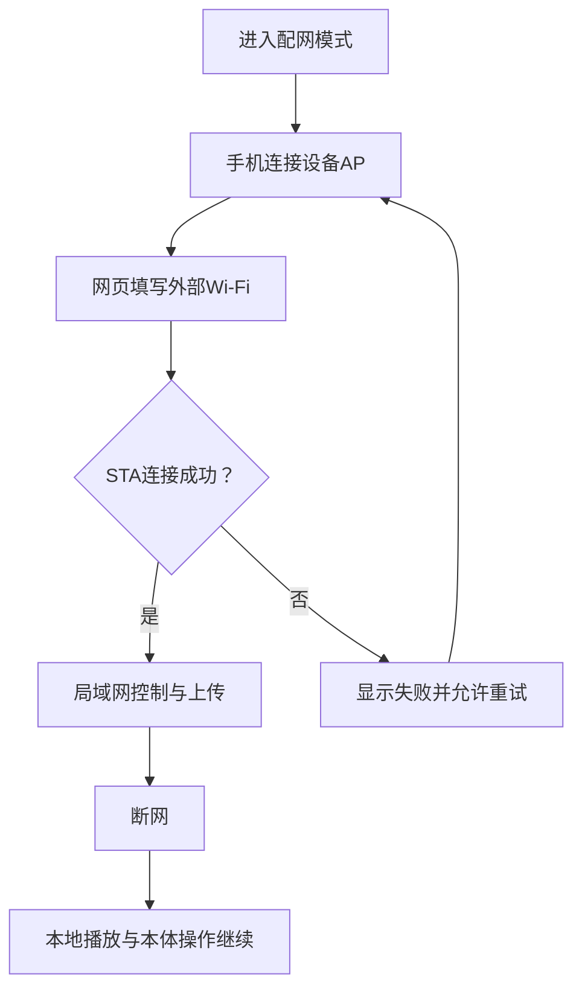

# 网络与网页专项

对应 F07、F08、F11；F12天气和F13 AI属于后续独立评审。目标是让本体离线可用，网页在设备AP或同一局域网中提供控制和内容管理。

## 配网与断网

设备首次或手动进入AP，手机连接设备热点并打开本地网页，填写外部Wi-Fi或手机热点信息。设备尝试STA连接并显示结果、访问地址和重试入口。外部网络断开时，本地音乐、唱片互动、基础显示和本体操作继续；设备AP可再次进入管理页面。网络密码只存在受控运行配置，不进入公开记录。

## 网页范围

首版网页包括播放/暂停、切歌、音量、灯光、曲库/歌单、歌曲上传、唱片绑定、事件和静态图片的管理，以及网络状态和保存反馈。本体与网页显示同一播放状态；上传结束才报告成功，中断或失败不能破坏已有内容。容量、格式、删除当前歌曲、并发播放和重启保存规则需在接口契约中确认。

## AI边界

AI用途尚未确定，首版不采购麦克风、蜂窝模块或服务商，不承诺离线通用问答。后续若有明确场景，再单独比较网页输入、按键语音、播报/屏幕呈现、网络费用、延迟和音乐恢复。

