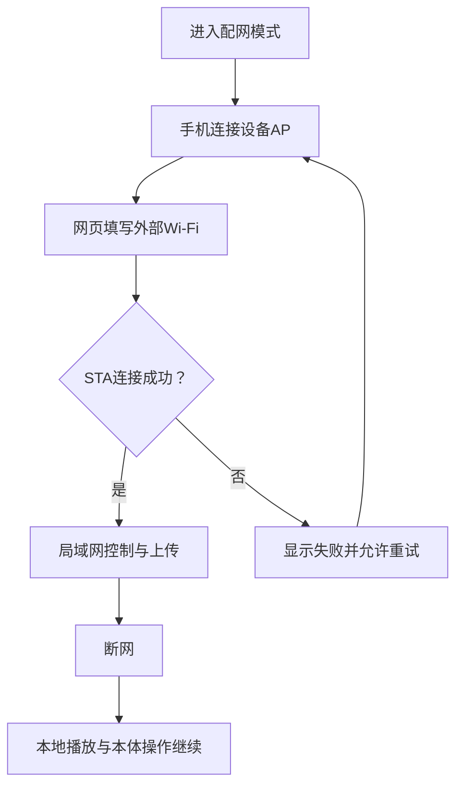

# 网络与网页专项

对应 F07、F08、F11；F12天气和F13 AI属于后续独立评审。目标是让本体离线可用，网页在设备AP或同一局域网中提供控制和内容管理。

## 配网与断网

设备首次或手动进入AP，手机连接设备热点并打开本地网页，填写外部Wi-Fi或手机热点信息。设备尝试STA连接并显示结果、访问地址和重试入口。外部网络断开时，本地音乐、唱片互动、基础显示和本体操作继续；设备AP可再次进入管理页面。网络密码只存在受控运行配置，不进入公开记录。

## 网页范围

首版网页包括播放/暂停、切歌、音量、灯光、曲库/歌单、歌曲上传、唱片绑定、事件和静态图片的管理，以及网络状态和保存反馈。本体与网页显示同一播放状态；上传结束才报告成功，中断或失败不能破坏已有内容。容量、格式、删除当前歌曲、并发播放和重启保存规则需在接口契约中确认。

## ABC唱片与本体映射

无源挂件只提供数字身份，ABC类型与目标由本体依据身份解释。网页可管理本体映射，但本体仍需有离线入口；具体API和保存格式待定。B/C音乐循环，B取走退出清空，C取走保持，手动退出后需重新真实取放。

本体/网页主动选择其他歌曲先退出B/C再点播；仅调音量、普通暂停或模式内切歌不退出。网页状态须与本体一致，并区分识别故障、当前模式和歌曲播放。ABC不强制控制灯光，D054上传不中断播放要求保持有效。

### RC-05A · 网页与本体操作的命令分类（2026-10-09）

界面控件的文字可能都叫“下一首”或“选歌”，但**控制器命令必须消除歧义**：

| 交互含义 | 建议统一命令 | 对活动B/C的已确认效果 |
|---|---|---|
| 当前B/C歌单内上一首/下一首 | `MODE_PREV` / `MODE_NEXT` | 模式继续，按会话内列表切换 |
| 主动浏览曲库，点选另一首独立歌曲 | `SELECT_TRACK(track_id)` | 先退出当前B/C，再播放新歌曲 |
| 调音量、普通暂停/恢复 | `SET_VOLUME` / `PAUSE_RESUME` | 模式不退出 |
| 明确结束当前模式 | `MODE_EXIT` | 模式退出清理；实体仍在位不自动复活 |
| 操作仍放着的唱片的UID映射 | `UPDATE_CARD_ACTION` | 建议仅保存配置，不伪造新一次放片；需确认 |

网页、本体必须发一致的语义命令，不依赖歌曲名称、按钮位置或判断“是否与当前列表同名”来推断是否退出。D074已确认请求预检无效时保留尚未因物理离座结束的旧模式；读卡器故障提示按D072区分保护性退出，版本化保存仍待实现验证；并发命令按会话版本处理，避免旧响应覆盖新状态。

### RC-06 · 曲库/歌单/绑定管理与统一状态（2026-10-09，规划草案）

建议网页首版在本地AP或局域网提供四类互相独立的操作：**曲库文件上传/重命名/删除；歌单增删/排序；数字身份查询/编辑ABC类型及目标；播放与模式控制**。在网页保存绑定或歌单时不模拟CARD_INSERTED，也不能因为刷新网页触发STOP后音频重播。本体有等价的基础离线入口，数量/手势不预设。

建议播放与配置API分离：命令携带`request_id`防重复，并由设备按D085报告最后成功保存的提交顺序与当前配置版本，服务端以单一状态版本向网页/本体反馈`saved_revision`、`active_session`、`audio_state`、`card_presence`、`last_error`。HTTP路由/认证/AP/STA与数据格式尚未定稿，不能据此宣称已有网页。

删除操作按D076展示卡片、歌单、当前播放/会话快照引用并拒绝删除，直到解除关联或结束使用。运行中更改歌单内容按D077仅保存新版本，当前快照不变；本体/网页同时修改同一绑定按D085以后一次成功保存覆盖并同步两端，旧页面请求不因此自动拒绝。新增歌曲完整上传、有效校验及持久化成功前，不放入可播放目录。D054上传期间继续播放，允许上传降低速率；断网上传、存储满、断电需要清晰反馈并保持旧曲目与映射。

明确区分本体/网页的`SELECT_TRACK`（独立点歌，退出旧B/C）、`MODE_NEXT`（模式内部切歌）、`PAUSE_AUDIO`、`STOP_AUDIO`、`MODE_PLAY`（STOP后显式从停止时歌曲0:00重播，D079）、`MODE_EXIT`和`UPDATE_BINDING`。同一歌曲显示名称并不能决定一条命令是“模式内”还是“独立点播”。生日唱片/菜单共享一个逻辑内容条目。

#### RC-06正式规则同步：D076–D081

网页删除曲目必须先显示被哪些唱片、歌单或当前播放引用；被引用时禁止直接删除，不提供未经审阅的强制删除绕过路径。修改歌单和在位唱片绑定只保存新版、当前B/C会话保持快照，页面反馈“已保存，下次启动模式生效”；可通过用户明确执行新绑定，而非模拟取走/放入。STOP后明确PLAY从停止时那首曲目的开头重播（并继续原模式歌单）；运行中坏曲跳过并记录，全部不可播报错停音频、不退出模式。

复杂批量重命名/删除、歌单批量排序优先网页操作；本体仍可离线创建歌单、添加/移除歌曲与管理唱片绑定。设备AP网页无需外网；D054上传不主动中断音乐仍适用。具体操作权限、版本冲突和文件目录实现仍待验证。

### RC-07 · 本地AP网页的已确认交互反馈（D082–D085）

| 情景 | 页面与设备行为 |
|---|---|
| B/C已STOP_AUDIO后模式内NEXT | D082：只更新选曲、保持静音；显式PLAY才从当前选曲0:00播放 |
| 删除仍被唱片、生日入口或活动B/C引用的歌单 | D083：拒绝删除并展示全部引用；先解绑/结束模式；删歌单不删歌曲文件 |
| B/C坏曲修复上传成功 | D084：须完整校验且成功发布后才自动恢复本会话该曲可播资格；下一次正常轮到才试，不立即插播 |
| 整份歌单因全坏已停止音频 | D080+D084：修复成功仍保持音频停止，必须明确PLAY；模式继续 |
| 本体和网页同时编辑绑定/歌单 | D085：**设备最后成功保存的配置生效**，两端刷新到此版本；旧页面点击保存也可以覆盖较新配置，不默认拒绝 |
| 网络同一请求多次重试 | D085：相同`request_id`重复提交只返回原结果，不能重新保存抢占更晚配置；失败保存不报告成功 |

建议设备生成单调成功提交序列`commit_seq`及状态版本，并在网页和本体共享；迟到响应不能使UI倒退。**放弃“旧expected_revision导致VERSION_CONFLICT自动拒绝”的旧提案**，而不是让实现者在服务端自行选择两种冲突策略。所有实际存储失败、AP断线、媒体发布必须提供明确错误反馈；网页离线资源不依赖互联网或公用CDN，D054上传不主动中断播放仍有效。

## AI边界

AI用途尚未确定，首版不采购麦克风、蜂窝模块或服务商，不承诺离线通用问答。后续若有明确场景，再单独比较网页输入、按键语音、播报/屏幕呈现、网络费用、延迟和音乐恢复。

