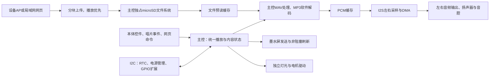
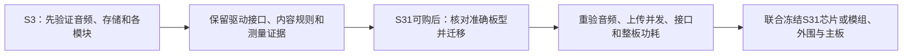

# 主控与系统架构选型专项

首轮比较日期：2026-10-08。按D061负责平台、计算/解码分工、准确原型板及资源建议。D063已确认：**先用ESP32-S3验证模块功能，最终设计以ESP32-S31为主**；用户反馈当前所查渠道买不到S31，不等于已核实所有渠道无货。S3准确开发板/内存配置及S31成品芯片、模组、封装与外围仍待收敛。

## 首轮结论与推荐

**推荐首版原型采用ESP32-S3-DevKitC-1-N8R8、PCB v1.1、ESP32-S3-WROOM-1-N8R8模组，8 MB Flash + 8 MB PSRAM，由主控软件解码。** 配合主控统一管理的microSD、外置左右音频输出、既有墨水屏参考方案及一个16位I2C GPIO扩展器形成整机台架。板卡版号与模组后缀须在交付前核对；同名兼容板、无PSRAM版本及v1.0不能直接套用本页资源表。[P1]

推荐依据是首版有适用的官方解码/存储/网络驱动，能使用统一文件与播放模型，且无需新增独立解码器。按下述预算，S3还可保留3路直接GPIO、共享I2C及SPI扩展条件。这个余量适合低速模块和有限串行扩展；若已明确要再接并行屏、摄像头或第二套高速存储，应重新核算，不能凭扩展器宣称资源足够。

**ESP32-S31是用户指定的成品主线，后续验证台架优先核对ESP32-S31-Korvo-1 V1.1主板。** 官方指南标明16 MB Flash + 16 MB PSRAM、双声道ES8389/两路NS4150B、4位microSD，并有可复用的LCD排针。它已有ESP-IDF v6.1稳定版文档与官方音频组件的支持声明。待准确板型可购后，验证连接器复用及真实MP3、SD上传、显示、识别并发；这些条件当前尚无本项目实测。成品以S31为主不等于继续安装整块Korvo大板，也不等于已冻结N16R16V模组或板载音频链路。[P3][P4][P5][P6][P7]

S31并非S3的开发板后缀。其芯片/模组接口与外部内存余量更大，但内部共享SRAM仍为512 KB；不能用240/320 MHz的比值推算多任务能力、音质或续航。S31 Function-CoreBoard-1有29路GPIO列入排针表，其中还包含板载与启动信号，不直接等于60路扩展；其音频是单声道，需外置立体声输出，故本轮不优先推荐它作为整机扩展台架。[P2][P3][P8]

这里的两条完整平台是S3和S31，S31的两个板型另作内部核对。独立VS1053解码仅在测得CPU解码瓶颈时作为条件变更；它不能解决SD写入长延迟，亦没有更好音质或更低整机功耗的现有证据。准确音频链路由[音频专项](../audio/README.md)联合选择。

## 需求与系统分工

范围以[整机规划](../../product/README.md)、[决定](../../product/decisions.md)和[接口](../../product/interfaces.md)为准。首版离线运行，本体可独立完成基本全部功能，网页承担控制、上传、保存与绑定；AI后续，不预设本地大模型、麦克风或蜂窝模块。显示沿用参考方案作原型基线，接入时核对实物，不要求沿用STM32、DS1302或VC02。

| 需求 | 对平台的实际要求 | 本轮处理与证据边界 |
|---|---|---|
| D013、D015、D042、D051 | 无唱片/无网络可播放；旋钮A/B、按压及两键；本体内容管理 | 主控持有状态机，旋钮边沿直连，其余按键可经扩展器；菜单由显示专项制定 |
| D019、D020、D035 | 音质优先，评估左右声道 | 同条件试听和左右测试音；软件解码后的PCM进入I2S，SoC型号不直接决定音质 |
| D045、D059 | 前置墨水屏：日期时间、状态、事件和静态图 | SPI发送和BUSY等待由独立任务处理；参考296×128，1位帧为4,736 B，具体色型/驱动待核 |
| D024、D054 | AP配网、STA网页；上传新歌持续播放，可限速 | 主控独占文件系统，音频优先；两平台都须实测SD读写最长阻塞及欠载 |
| D052、D058、D066–D069 | 挂件独立电子身份由本体解释ABC；A/B/C取走分别继续/退出清空/继续，开机已放片等待显式启动 | 读卡有界超时、身份与在位分离；八张卡不需要八条GPIO，准确器件待选 |
| D021、D053、D055 | 电池、Type-C边充边用、有线更新与失效恢复 | USB数据与电源路径分别核对，保留下载/复位与恢复供电；板载USB不证明边充边用 |
| D004、D056 | 大唱片平放，灯光/转动可关闭 | PWM/RMT等时序直连，独立驱动供电；转速、负载和噪声交运动/电源/结构验证 |
| D062 | 后续额外硬件扩展 | 分开高速接口、低速I2C、缓存和功率预算；扩展用途尚未具体化 |

图中为建议分工，不是已运行固件。文件服务必须串行化共享文件系统操作；音频消费PCM优先，网页按缓存水位限速。屏幕等待BUSY、NFC等待响应、HTTP大块写入都不能在音频供数路径中同步阻塞。第二个CPU核可用于任务分工，但中断、总线、内部内存和Flash写入仍是共享资源。

## 两个平台的完整方案

以下外围是资源与费用口径，尚非批准BOM。读卡器、电源、音频输出和RTC不由本专项单方面冻结。

| 项目 | A：S3软件解码，当前模块验证 | B：S31软件解码，成品主线准备 |
|---|---|---|
| 主控系列 | ESP32-S3，双核Xtensa LX7，最高240 MHz，512 KB内部SRAM | ESP32-S31，双核32位RISC-V，最高320 MHz，512 KB共享SRAM；模组资料另列32 KB低功耗SRAM，不作实时音频堆使用 |
| 准确原型板 | ESP32-S3-DevKitC-1-N8R8，PCB v1.1，WROOM-1-N8R8 | ESP32-S31-Korvo-1 V1.1主板；指南为WROOM-3、16 MB Flash + 16 MB PSRAM，交货核对完整后缀；数据表对应候选为N16R16V |
| 外部内存 | 8 MB Quad Flash + 8 MB Octal PSRAM，内部堆与PSRAM分别预算 | 16 MB Flash + 16 MB PSRAM；SoC提供250 MHz 8位DDR PSRAM接口，不代表原型默认配置或本项目带宽 |
| GPIO口径 | SoC45；WROOM-1最多36，其中N8R8的35–37被内存占用；DevKit排针表36；扣USB/恢复/启动/RGB后保守24路 | SoC60；WROOM-3为54；CoreBoard J2为29路，Korvo J14为25路含共享信号；实际可规划池见下表，不能直接使用60或54作余额 |
| 解码与文件管理 | WAV/MP3软件处理，microSD由S3唯一读写 | WAV/MP3软件处理，microSD由S31唯一读写；ES8389是PCM ADC/DAC，并非MP3解码器 |
| 存储起点 | 独立3.3 V raw microSD转接，先1位SDMMC，3信号；SPI卡座作为接入条件备选，4信号 | 板载4位microSD，GPIO20–25，另有GPIO39供电控制；SPI NAND为替代改焊功能，不能同时当第二套可用存储 |
| 音频输出 | 一路I2S带左右时隙，外置双声道DAC/功放或分别选L/R的两个MAX98357A；先核对准确模块 | 板载ES8389 + 两路NS4150B输出；官方要求ES8389用TDM，须配置时隙、增益并测L/R；可比较第二I2S外接音频链路，但要另核引出 |
| 网络 | 2.4 GHz Wi-Fi b/g/n，AP/STA；Bluetooth LE，首版不使用蓝牙音频 | 2.4 GHz Wi-Fi 6，AP/STA；BT 5.4 LE及Classic、802.15.4；新增协议当前无首版用途，不据此增加验收 |
| 显示与识别 | 外置墨水屏，独立SPI；读卡优先比较I2C，保留SPI/UART改配可能 | 同样外置墨水屏、读卡器；复用空置LCD排针的GPIO与板载I2C，需转接和上电状态核对 |
| 本体、灯光、运动 | 旋钮A/B、灯光数据、电机PWM直连；16位I2C扩展器承接按键及慢速使能 | 同样的控件/运动分工；板载四键不是已确认旋钮加两键的替代，仍需外接 |
| USB维护 | 双Micro-USB，分别转串口与原生USB；BOOT GPIO0/EN，UART0 GPIO43/44，USB GPIO19/20保留 | USB-C UART可更新/恢复，GPIO58/59、BOOT GPIO61/EN保留；另一USB-C仅电源。USB-A为高速Host，不能据接口外形直接作为电脑更新口 |
| 软件支持 | ESP-IDF、官方I2S/SDMMC/HTTP/Wi-Fi、`esp_audio_codec`；显示/NFC库需移植接口和有界等待 | 已核实ESP-IDF stable v6.1、双I2S与SDMMC文档；音频组件兼容表从v2.5.0支持S31；显示/NFC仍需实际移植 |
| 电源/包络 | 开发板供电选USB、5 V排针或3.3 V排针，官方规定这些方式互斥；逻辑3.3 V。尺寸基线62.74×25.40 mm来自音频专项已查机械图，完整模组/排针/插线包络接入时复核 | 5 V台架输入，板上3.3 V系统/音频轨及摄像头附加轨；PCB官方机械图106.50×89.20 mm，另计器件高度与插线。初测不接LCD子板，不启用录音/摄像头，不据关闭功能推断电流为零 |
| 阶段用途 | 首版外设能分配，板较窄，统一内容管理直接，先获得各模块证据；扩展直连余量有限 | 按用户方向准备成品平台，音频/SD台架完整、外部RAM更大；板大、外围更多，实际供货/功耗/移植结果未确定 |

### S31板型不能混用的事实

| 核对项 | Function-CoreBoard-1，尺寸图丝印V1.0 | Korvo-1 V1.1 |
|---|---|---|
| 内存准确性 | 指南只写WROOM-3，没有冻结Flash/PSRAM后缀；采购前必须确认，不能自动当16+16 MB | 指南明确16 MB Flash +16 MB PSRAM；到板核对后缀并启动读回 |
| 板载音频 | ES8311 + NS4150B为单声道；新增外置立体声DAC/功放才满足左右评估 | ES8389双声道DAC与两路NS4150B，需TDM驱动和左右证据 |
| GPIO入口 | J2共有40针、其中29路GPIO，其余电源/地；GPIO4还接以太网INTN；板载音频用GPIO50–57，不在J2中 | J14 LCD接口40针，25路GPIO，含共享I2C GPIO0/1；屏/摄像头连接器不是空闲GPIO的无条件保证 |
| 保守可规划池 | 避开UART58/59、启动GPIO38/39/40/60/61、以太网共享GPIO4后为21路；其他板载连接、上下拉按原理图复核 | 不接LCD子板并避开启动GPIO38/40/60/61后，25路中2路用于共享I2C，余19路候选GPIO；GPIO33/34如保留原生USB Serial/JTAG再扣2路 |
| 首版增量资源 | 外置I2S/SD/屏/控件后，按A同口径约占21路，余量很小；4位SD再多3信号 | 音频及SD已在板上，按下表外接12路后约余7路；若保留GPIO33/34则余5路。ADC能力与启动波形仍需核对 |
| 空间 | PCB65×55 mm，官方图左侧接口另伸出6 mm，平面至少71×55 mm；另计RJ45/USB高度、插线、天线及接头 | PCB106.5×89.2 mm；原型板占位不等于将来WROOM集成主板尺寸 |
| 额外物料 | 另加卡座、两路音频输出、GPIO扩展与所有首版外置模块；RJ45/PHY/USB Host未被本项目利用 | 音频输出与卡座已含；另加GPIO扩展、J14转接、屏/识别/控件/电机等；需确认销售套装是否强制含LCD/摄像头 |

CoreBoard的29路来自[P8]排针表，GPIO4共享及音频GPIO50–57来自[P9]原理图；启动限制同时参考[P3]板表。Korvo的J14计数依据[P10]第3页与机械图，复用仍要核对输入保护、电平、默认上下拉和实板。**S31 SoC的60 GPIO、WROOM的54 GPIO、CoreBoard的29路、Korvo J14的25路是不同口径。** 不建议为了获得未引出的GPIO在现成板上飞线到模组焊盘。

## 计算、内存与存储预算草案

官方`esp_audio_codec` README已列MP3/WAV支持；ESP32-S3R8、44.1 kHz双声道MP3表为28 KB解码堆、8.17% CPU占用，且只统计解码堆，不含任务栈、网络、文件系统、显示或DMA。这是官方测试示例，未披露成套本项目工况；不能外推S31或认定系统只需8.17%的算力。[P7]

下表为建议起始分配和观察条件，不是实测占用，也不是声明的最低配置。两平台按相同软件功能测试，分别记录CPU时间、最长调度间隔和卡写阻塞。

| 资源 | 建议起点或计算 | 限制/验证重点 |
|---|---|---|
| 内部SRAM | 音频DMA约8–16 KiB；解码按官方MP3 28 KB堆作线索；解码任务栈先16–24 KiB，最终按栈高水位配置 | Wi-Fi/HTTP、系统、其他任务另占内部内存；建议验收观察最低空闲内部堆及最大连续块，低于64 KiB/32 KiB分别触发检查，这两个数为调试门槛建议，非已批准验收 |
| PCM缓存 | 起步配置依音频页约192 KiB PCM、64 KiB压缩预读及64 KiB上传/文件缓冲；后续单项比较256/512 KiB PCM，在48 kHz下分别约1.37/2.73秒 | 单项扫描不是外部缓存总预算，PCM增大后重新汇总其他缓冲。内部DMA段接续PSRAM，按低水位/最长阻塞调整；缓存长度不证明覆盖全部写延迟，DMA与实时栈按驱动限制分配 |
| 压缩预读 | 先64–128 KiB PSRAM；320 kbps时64 KiB约1.64秒文件数据 | CBR计算不能替代VBR峰值；WAV与MP3走不同供数预算，记录低水位 |
| 上传缓冲 | 16–32 KiB分块，可放PSRAM，单上传任务起步；音频低水位时减速 | 分块、限速和优先级共同验证；只增加缓冲不能消除驱动/文件系统锁长时间持有 |
| 屏幕缓存 | 296×128、1位一帧4,736 B；双色双平面至少9,472 B；双缓冲另翻倍 | 中文字体/解码工作区另算；图片逐张/流式处理，避免把完整曲库图片加载进RAM |
| 内容索引、任务栈与网络 | 索引分批加载，网页静态资源放Flash或SD；实现阶段报告最低余量、失败分配、每任务栈余量 | S3的8 MB和S31的16 MB PSRAM都不代替512 KB内部SRAM；总量足够不证明连续DMA块足够 |
| Flash | S3 8 MiB草案：2个约2.5 MiB应用分区用于更新，约1 MiB网页/资源，约0.25 MiB配置/诊断，其余给启动分区与余量；S31按构建产物再分配 | 只是容量算账，具体地址、OTA启用和字体大小实现时确认；有线恢复不依赖OTA。实际镜像超限时先核查资源放置，不静默换内存配置 |
| 内容存储 | microSD建议先8–32 GB、FAT32做台架；四分钟320 kbps MP3约9.6 MB，44.1 kHz双声道16 bit WAV约42.3 MB | 容量未定稿，歌曲不挤入应用Flash。单文件系统所有者，上传临时文件完成后再发布；断网、满卡和写入断电单独验证 |

平时配置写入内部Flash也可能影响实时任务和PSRAM访问；播放中保存绑定/设置需评估写入时机与内部缓存，不只测试SD上传。PSRAM限制按实际IDF版本核对。[P11]

## GPIO与总线资源草案

### A：S3 N8R8 v1.1

官方排针引出36路GPIO，扣除N8R8内存占用35–37、原生USB19/20、UART恢复43/44、启动脚0/3/45/46、板载RGB38，留下24路保守通用池：`1、2、4–18、21、39–42、47、48`。v1.0 RGB用48，池需改为38；此处不占用外部JTAG的39–42，调试以原生USB为主。若要同时外部JTAG，应另扣4路。[P1][P12]

| 用途 | 主控直连信号数 | 总线/扩展分工 |
|---|---:|---|
| 左右I2S输出 | 3 | BCLK、WS、DOUT；不默认MCLK，若音频选定DAC要求MCLK，再扣1路 |
| microSD，1位SDMMC | 3 | CLK、CMD、D0独立于屏幕SPI；若SPI卡座改4路，或4位SDMMC改6路，分别再扣1/3路 |
| 墨水屏SPI | 5 | SCK、MOSI、CS、DC、BUSY直连；RST可经扩展器。模块若有更多信号须重算 |
| 共享I2C | 2 | NFC、RTC、电源管理与GPIO扩展器；地址和容性负载联合检查，NFC超时不能拖住其他设备 |
| NFC IRQ预留 | 1 | 即使暂用轮询，也保留驱动选择余量；RST经扩展器，SPI/UART版重新分配 |
| 旋钮A/B | 2 | 直连GPIO/计数外设，保留边沿与必要唤醒条件 |
| GPIO扩展器INT | 1 | 按压、播放/暂停、返回及故障输入；可作为待机唤醒来源，完全关机唤醒交电源另核 |
| 灯光数据 | 1 | 直连RMT/SPI时序；5 V灯串电平转换另配 |
| 转盘电机 | 1 | 单向PWM直连；驱动EN/可选DIR经扩展器；若闭环测速另占信号 |
| 电源保持/关断控制 | 1 | 预留给电源方案，不能依赖尚未上电的I2C扩展器才能启动 |
| 电池/负载模拟量预留 | 1 | 限定ADC1可用脚；分压、电量计或其他测量由电源选型，不能直接接电池电压 |
| 合计/余额 | **21 / 3** | 音频需要MCLK或SD改SPI会减少余额；4位SD会耗尽这3路 |

建议扩展器候选为3.3 V、16位、带中断的TCA9535，先核对准确板、地址、上电输入/输出状态及IDF驱动；未列为已批准器件。约9路慢速需求为三键、屏RST、NFC RST、电机EN、音频静音/EN、电源故障与可选在位输入，按准确模块可合并或删除；其余约7路为低速扩展余量。关键使能外部上下拉必须在主控失效/复位时仍有合理状态，不由I2C输出承担高速波形。

**推荐实际预留**：一组共享3.3 V I2C、至多一组UART TX/RX（从3路直连余额中分配）、可利用屏幕SPI的MISO/片选扩展，以及受控电源/地。UART和新SPI资源不是同时各预留一整套：余额为3路，新SPI需MISO+CS占2路，UART也占2路。新高速SPI器件可能需要独立控制器、布线和带宽，应按用途重评。

**RC-03A资源增量（2026-10-09，尚待板级复核）：** 优先试验`PN7160_MINI_I2C`，共享S3现有I2C两线和已计入的NFC IRQ，但另需可独立驱动的VEN复位/使能。为避免I2C被从机持续拉低时无法通过同一GPIO扩展器恢复读卡器，建议VEN直连主控，当前21直连/3余额估算将增加1路控制需求（条件不变时变成22/2），并重新核对启动默认电平。官方ESP32-S3 SuperMini样例GPIO8/9/4/5**不是**DevKitC接线许可；I2C地址`0x28`、总线速率/上拉和模块3.3 V逻辑均需与屏、RTC和电源专项核对。若后续增加独立在位传感器，须再计GPIO、供电和装配。S31平台也应将VEN新增直连列入迁移重验表，不直接继承S3结论。[MINI接口资料](https://www.elechouse.com/docs/pn7160-mini-v1-i2c/datasheet.html)。

### B：S31 Korvo-1 V1.1

板上音频用GPIO2–7、I2C0/1；microSD用20–25及控制39；UART58/59与BOOT61/EN保留。空置J14可共享I2C0/1，并提供19路避开启动脚的候选：`8–19、33–36、43–45`。摄像头的46–57不计默认扩展资源；要复用须确认摄像头断开、电源/保护及转接。[P3][P10]

| 外接功能 | 新增直连数 | 预算条件 |
|---|---:|---|
| 墨水屏 | 5 | 独立SPI5信号，RST经扩展器 |
| 旋钮A/B | 2 | 两路直接GPIO |
| NFC IRQ、扩展器INT | 2 | I2C共享0/1，不重复扣GPIO |
| 灯光数据、电机PWM、电源保持 | 3 | 其他使能/按键经同类16位扩展器；电量优先由电源专项给I2C方案 |
| 合计/余额 | **12 / 7** | 如同时保留GPIO33/34的USB Serial/JTAG，余额为5；电池ADC若确需直连，先核ADC引出，不把数字GPIO计作模拟输入 |

这比S3草案多出若干可直连接口，但依赖空置LCD连接器的实板核对。它仍不是60路空闲GPIO。第一轮不加LCD子板，不将RGB并行屏/摄像头/USB Host全部启用，再据此宣称首版留有余量。

### 扩展器能补什么

| 后续需求 | 可用方法 | 平台选择影响 |
|---|---|---|
| 更多按键、状态输入、慢速使能、I2C传感器 | I2C扩展器/共享总线，核地址、IRQ与延迟 | S3通常可先保留此类扩展，供电仍须重新预算 |
| 一个UART模块或低吞吐SPI模块 | 分配剩余直接GPIO，核共享SPI时序与MISO释放 | S3有限余额能承担一种组合；S31 Korvo草案余量较多 |
| 第二套I2S、摄像头、并行屏、高速存储 | 对应SoC外设、DMA/内部内存、实际引出及布线 | 单靠普通GPIO扩展器不可实现；有明确需求时优先评估S31准确板/成品模组 |
| 大图片/大量内容缓存 | PSRAM/SD、流式处理与调度 | S31的外部RAM更多，但512 KB内部SRAM约束仍在 |
| 更大功放、电机、灯串、外接USB设备 | 独立驱动、电源轨、限流、热与电池容量 | 与GPIO数量/主频无直接对应，USB Host接口也不证明电源足够 |

## 供电、功耗与结构输入

以下数字为资料或台架能力建议，全部不是本项目平均/峰值测量。整机续航暂不能定量比较。

| 项目 | A：S3 | B：S31 | 交电源/结构的约束 |
|---|---|---|---|
| 主控轨与逻辑 | 3.3 V主控/数字接口；开发板原型可5 V供电 | WROOM资料3.0–3.6 V、3.3 V逻辑；Korvo以5 V输入产生各轨 | 5 V不直接进GPIO，SD/屏/NFC模块标注5 V供电不代表信号5 V兼容 |
| 主控台架供电能力建议 | 3.3 V主控支路可先按1 A供电能力准备；板载稳压器能力另核，不由排针给功放/电机供电 | 同口径先按1 A主控支路能力准备；S31模组v0.7表6-4列3.3 V、25℃、11b 1 Mbps/20 dBm TX峰值375 mA，其他工况不同 | 1 A是测试电源能力/预算包络建议；375 mA是指定RF资料条件，均不等于音频上传整机平均电流 |
| 功放、SD及附加轨 | 功放2.7–5.5 V仅对候选MAX98357A；raw SD与主控3.3 V；其他模块另核 | Korvo功放/音频稳压及摄像头附加轨按原理图；不要把模组J5电流当整板电流 | 相同扬声器、音量、灯光与电机条件量平均/峰值和持续时间；分轨换算W，不能直接相加电流 |
| 无线与低功耗 | 音乐、NFC轮询时不能任意深睡；空闲时的Wi-Fi/读卡策略待验证 | 同样受实时输出与识别约束；Wi-Fi 6及低功耗宣传不证明整机续航更长 | AP开、STA开、仅本地播放、识别寻卡、屏刷新、上传分别测，再做最坏同时工况 |
| USB与边充边用 | 双Micro-USB台架不锁定成品口；保留原生USB及UART恢复 | Korvo正常恢复走USB-C UART；纯供电USB-C不能更新，USB-A Host不能直接接电脑Host | 成品外部Type-C共口为联合建议，核输入限流、USB数据/充电检测冲突、反向灌电、低电恢复和可达性 |
| 空间与天线 | 窄板台架，另计卡座/功放/扩展器 | 大板台架，已有音频/卡座但多附加外围；CoreBoard虽较小仍有RJ45/PHY | 原型分立模块不决定最终主板面积；交连接器高度、线缆弯折、天线净空、NFC读区与独立音腔占位 |

较长续航既受功放/扬声器响度、电机和灯光影响，也受识别轮询、Wi-Fi状态和稳压损耗影响；没有同条件整板电流前，不能宣称任一平台更省电。S31模组电流数据来自预发布v0.7，仅作电源准备依据。[P2]

## 费用与供货：当前缺口和同口径清单

2026-10-08尚未核实可下单的国内准确板型、版号、数量1件含运税报价和到货日期。搜索摘要出现价格不是采购证据；国内页面访问/明确报价不足，因此这里保留待询价，不编造人民币区间。候选资料可以形成技术推荐，采购应在下面缺口补齐后审阅。

| 费用组成，均按1套首版台架 | A：S3 N8R8 v1.1 | B：S31 Korvo V1.1 | S31 CoreBoard对照 |
|---|---|---|---|
| 主控开发板 | 待国内准确板型/版号报价；音频专项已查Adafruit #5336为US$19.95且当时缺货，仅海外参照 | 待国内报价及是否含LCD子板/摄像头的套装范围 | 待板卡准确内存后缀、报价和交期 |
| 音频输出与卡座 | 外置卡座、两路输出模块均需报价；音频专项旧同渠道参考为SD US$7.50+两MAX98357A US$11.90 | 指南的卡座/ES8389/两PA已含，不能重复加同类模块价；外置对照链路另计 | 需外置立体声输出与卡座，单声道板载输出不能充抵两路费用 |
| GPIO扩展与转接 | 16位扩展器模块及可靠连接，待国内报价 | 同类扩展器 + J14连接/转接，待报价 | 同类扩展器、接口转接，待报价 |
| 共用首版外围 | 屏/驱动板、RTC、NFC读卡器、标签、旋钮两键、驱动/电机/灯光、电源/电池、扬声器/音腔、卡及线材 | 同左；不把板载麦克风/摄像头成本计作首版新增功能收益 | 同左 |
| 可比较小计 | 既有海外板+卡座+两MAX参考US$39.35，未含扩展器和共用外围；**不是国内到手价** | 无可靠完整同口径报价，小计待核 | 无可靠完整同口径报价，小计待核 |

国内询价需返回：完整商品URL/供应商、官方或兼容身份、PCB版号、模组后缀/Flash/PSRAM、裸板或套装范围、数量1件单价、税/运费、现货数量、承诺交期及查询日期。S3兼容板若改USB/稳压/排针/RGB脚，应以其原理图重算，不作为官方v1.1等价品。

S31官网有Get Samples入口和开发板指南，这是样品询购渠道证据，尚不代表现货。用户反馈目前所查渠道买不到S31，作为先用S3验证的现实输入；本轮未独立证明所有渠道无货。供货恢复后核对准确板型/后缀与交期，再安排S31台架，不因官网支持就确认国内可立即交付。

## 原型验证与选择条件

本轮没有编译、烧录或实物验证。以下计划用于下一实现对话，不将资料标称/库兼容声明记作通过。

| 阶段 | 操作与记录 | 进入下一步的建议条件 |
|---|---|---|
| 板型与维护 | 拍摄脱敏板号/模组后缀，读回Flash/PSRAM；固定IDF/组件版本、原理图版本；应用故障后用BOOT/RESET和有线工具恢复 | 准确配置符合候选，下载不依赖应用；USB和外部供电关系明确 |
| 最小声音/存储 | 独立台架供电；同一对单元与音腔；44.1/48 kHz双声道PCM WAV、MP3 CBR128/320及VBR；左/右测试音 | 声道/时隙正确、声明格式完整播放；S31 ES8389 TDM尤其确认，不以默认示例替代左右测试 |
| D054并发 | AP/STA分别上传新歌，同时播放WAV和MP3；加入墨水屏全刷/局刷、NFC取放、旋钮和灯光/运动 | 建议连续30分钟，欠载0、无不明重启/可听断音；允许上传降速。记录卡阻塞、缓冲低水位、CPU任务时间、内部堆/连续块和PSRAM余量 |
| 离线操作与保存 | 无手机/互联网，绑定、事件、图片和本体操作；开机已放片仅识别等待，运行取放按D066–D069 | 所有入口用同一状态；保存后重启重读；Flash配置写入也不破坏音频 |
| 异常与恢复 | 上传断网/满卡、坏文件、读卡器超时；低电、仅USB、电池存在、应用失效时维护 | 原有内容可保留/恢复，异常不把NFC故障当取走；恢复接口可达，擦除范围明确 |
| 电源/扩展联合 | 各平台同功能关闭多余外围，量整板/分轨功耗；复核可规划GPIO、I2C地址和未来明确模块的资源 | 取得可复现功率、峰值与热/空间输入，再冻结成品变体及外围 |

若出现断音，依次定位供电掉压、SD最长阻塞、文件系统锁、调度与缓存，再判定是否为解码CPU瓶颈。SD路径问题先在本方案内修复；VS1053卸载只在实际解码瓶颈证据支持时另行评审。S31迁移按已确认阶段方向推进，不能把迁移前的断音全部归咎于S3，亦不能把D054降成暂停播放上传。

S31台架到位后同样从最小声音/存储开始验证；采用其稳定版文档不等于整机支持已通过。阶段平台方向已明确，准确配置与成品外围最后依证据联合冻结，不要求在模块验证开始前完成成品设计。

### S3验证到S31成品主线

| 可沿用的验证成果 | 到S31必须重新核对 |
|---|---|
| 歌曲/绑定/事件/图片的数据规则，本体与网页状态，唱片取放行为 | 目标IDF版本、编译目标、解码组件实际包/版本、RISC-V工具链；不把S3二进制直接烧到S31 |
| 同一对扬声器/可调整音腔、屏幕和读卡器的准确规格及试验材料 | I2S/TDM时隙、MCLK、GPIO映射、SDMMC专用IO、启动脚、I2C地址/电平和连接器 |
| 上传分块/缓存/错误恢复策略及测量方法 | 实际吞吐、卡最长阻塞、内部DMA块、任务栈与PSRAM余量；S3测试通过不替代S31并发测试 |
| 外设自身的供电/峰值/空间与功能证据 | S31模组及整板平均/峰值、USB共口/恢复、天线与NFC布局、电池续航和温升 |

实现时将板级引脚、音频设备、SD总线宽度和电源控制作为明确配置，应用功能通过既有驱动API调用；只为实际S3/S31差异做适配，不提前制作一套通用多平台框架。最终仍以一块集成主板为目标，S31成品模组候选可从WROOM-3的16 MB PSRAM配置核起，但准确Flash/PSRAM、封装与供电不在本轮冻结。

## 交给其他专项的输入与待审阅项

本页表格是资源基线草案，公共接口、决定与控制卡由总规划汇总维护；具体固件、电路、接线、PCB和制作另开实现对话。

| 接收专项 | 本轮可用基线 | 需补齐的关键输入 |
|---|---|---|
| 音频 | A：N8R8、3线I2S、1位SDMMC；B：Korvo16+16、ES8389 TDM/双PA、4位SD | 最终格式集合、DAC是否MCLK、准确卡座电平/引出、左右链路、噪声与存储最长写阻塞；软件版本、实际内存与功耗 |
| 网络 | 唯一文件服务、分块上传、可限速，AP/STA本地网页 | 上传分块/限速策略、曲库规模、静态资源大小、失败保存契约；与音频共同量D054 |
| 显示/本体 | SPI5信号+扩展RST；旋钮A/B直连，三键扩展；帧缓冲计算 | 准确屏/驱动板色型/版本、BUSY/复位、供电/逻辑、RTC选择与备份、字体/图片内存、刷新时间与离线编辑 |
| 身份识别 | 优先比较共享I2C+1 IRQ、RST扩展；身份状态不阻塞音频 | 准确读卡器/频段/驱动、地址/电平/轮询耗时与峰值、NFC单独在位是否可靠、额外在位信号及读区 |
| 电源 | 主控3.3 V、台架1 A支路能力建议；USB、恢复、外设另轨 | 平均/峰值W与时长、开关/唤醒/保持控制、VBUS共口/输入限流、I2C电量方案；S31整板附加负载不能只量模组 |
| 灯光/运动 | 灯光时序1线、电机单向PWM1线，慢速EN扩展 | 灯串电平/数量、电机驱动、启动/堵转电流、测速/方向信号是否必要；噪声与启停时序 |
| 结构 | S3窄板、S31两板准确平面尺寸与连接器限制；原型尺寸非成品尺寸 | 允许中央电子区、所有连接器高度/插线、天线/NFC净空、音腔、电池和维护入口包络 |
| 总规划 | D063已登记S3模块验证、成品以S31为主；板型与资源余量仍为推荐，国内采购与本项目实测仍缺 | 汇总新增硬件用途与跨专项资源冲突，不把准确板型/外围候选写为已批准BOM |

**已确认阶段方向**：先用S3验证模块功能，最终设计以S31为主，不再把二者作为互斥长期路线重复询问。**待审阅的准确配置**：S3 DevKitC-1-N8R8 PCB v1.1及本页资源草案，S31后续台架板型与成品配置。后续新增硬件用途可随功能逐项补充；提问的目的是量化接口/缓存/功率余量，不要求现在决定一份未来功能清单。新需求涉及摄像头、第二高速存储、并行显示或多路音频时再做专项资源核算。音质优先、长续航、D054和首版离线范围继续作为共同要求。

**仍未验证**：国内价格/现货/交期、实板GPIO与电平、解码/SD上传/屏/识别联合并发、软件编译/移植、音质、整板功耗、续航、所有模块高度/插线包络及成品USB共口电路。已核实的是下列官方资料、连接关系及资源算账，不是实物性能。

## 本轮公开依据

日期均为2026-10-08；仅摘录必要参数和引用链接，未纳入第三方代码。组件/驱动版本在实现时固定，许可随准确版本核对。

| 编号 | 来源与版本 | 支持的结论及边界 |
|---|---|---|
| P1 | [S3 DevKitC-1 v1.1指南](https://docs.espressif.com/projects/esp-dev-kits/en/latest/esp32s3/esp32-s3-devkitc-1/user_guide_v1.1.html) | N8R8 8+8 MB、双USB、供电方式、GPIO35–37限制、v1.1 RGB38/v1.0 RGB48、排针表；未量实板 |
| P2 | [S31 WROOM-3/3U数据表](https://documentation.espressif.com/esp32-s31-wroom-3_datasheet_en.pdf)，Pre-release v0.7，PDF第1–3及45页 | 54 GPIO、512 KB共享SRAM/32 KB低功耗SRAM、模组后缀/内存、22×30×3.5 mm模组、3.0–3.6 V与指定RF电流；预发布参数不等于量产或整机数据 |
| P3 | [S31 Korvo-1指南](https://docs.espressif.com/projects/esp-dev-kits/en/latest/esp32s31/esp32-s31-korvo-1/user_guide.html)，V1.1 | 16+16 MB、ES8389 TDM、两PA、4位SD、GPIO映射、USB口用途与板版差别 |
| P4 | [S31 ESP-IDF stable入门](https://docs.espressif.com/projects/esp-idf/en/stable/esp32s31/get-started/index.html)，页面明确v6.1 | 已有稳定版S31官方开发文档和工具链步骤；未安装/编译，不能认定本项目驱动成熟 |
| P5 | [S31 I2S驱动](https://docs.espressif.com/projects/esp-idf/en/stable/esp32s31/api-reference/peripherals/i2s.html)，v6.1 | 双I2S、标准/TDM、DMA支持；未验证ES8389配置和播放 |
| P6 | [S31 SDMMC Host](https://docs.espressif.com/projects/esp-idf/en/stable/esp32s31/api-reference/peripherals/sdmmc_host.html)，v6.1 | 两个专用IO槽、1/4线SD模式等；不据总线标称速度证明卡最长写延迟或D054 |
| P7 | [官方音频组件README](https://github.com/espressif/esp-adf-libs/blob/master/esp_audio_codec/README.md)，已读对应raw正文 | MP3/WAV、S3R8解码示例28 KB/8.17%、兼容表v2.5.0起支持S31；本轮未核到注册表最新版本/实际二进制包，不把master当固定依赖 |
| P8 | [S31 CoreBoard指南](https://docs.espressif.com/projects/esp-dev-kits/en/latest/esp32s31/esp32-s31-function-coreboard-1/user_guide.html) | J2 29路GPIO、ES8311单声道、USB-C串口及USB Serial/JTAG、USB-A Host、模组电流测量点；内存后缀未明确 |
| P9 | [CoreBoard原理图](https://dl.espressif.com/schematics/esp32-s31-function-coreboard-1-schematics.pdf)，V1.0，2026-05-13，第2/3页；[机械图](https://dl.espressif.com/schematics/esp32-s31-function-coreboard-1-dimensions.pdf) | 已抽取并渲染核对：音频GPIO50–57、GPIO4以太网共享、J2、65×55 mm及6 mm接口外伸；未改焊/实板验证 |
| P10 | [Korvo原理图](https://dl.espressif.com/schematics/esp32-s31-korvo-1-schematics.pdf)，V1.1，2026-05-13，第2/3页；[机械图](https://dl.espressif.com/schematics/esp32-s31-korvo-1-dimensions.pdf) | 已渲染核对J14 25路GPIO、共用I2C、供电/USB连接、106.5×89.2 mm；不保证全部连接器脚无冲突 |
| P11 | [ESP-IDF外部RAM指南](https://docs.espressif.com/projects/esp-idf/en/stable/esp32s3/api-guides/external-ram.html)，本轮另读官方源文档 | 内外RAM能力分配、DMA/栈、缓存关闭条件；实现采用版本需再对照，不混用master配置 |
| P12 | [ESP-IDF v5.5 S3 GPIO源文档](https://github.com/espressif/esp-idf/blob/v5.5/docs/en/api-reference/peripherals/gpio/esp32s3.inc) | SoC 45 GPIO、启动0/3/45/46、内存与USB保留；与P1板表共同计算24路池 |
| P13 | [S31产品页](https://www.espressif.com/en/products/socs/esp32-s31)；[开发平台](https://esp32-s31.espressif.com/en) | 双核RISC-V、60 GPIO、DDR PSRAM、Wi-Fi 6/BT功能及板/SDK入口；产品页仍写will be supported，软件状态采用P4–P7更具体资料；社区MP3项目只作为线索，未核实现 |
| P14 | [音频专项既有比较](../audio/README.md)；[Adafruit #5336](https://www.adafruit.com/product/5336)、[#254](https://www.adafruit.com/product/254)、[#3006](https://www.adafruit.com/product/3006) | 既有开发板尺寸及海外模块参考价，非本轮国内库存/到手报价；本页没有新增采购结论 |
| P15 | [S3 WROOM-1/1U数据表](https://www.espressif.com/sites/default/files/documentation/esp32-s3-wroom-1_wroom-1u_datasheet_en.pdf)，v1.8，PDF第1/2页 | 模组最多36 GPIO、双核LX7、512 KB SRAM、3.0–3.6 V；结合P1/P12扣除N8R8内存和板级保留资源 |

公开共同事实仍由总规划写入`product/`及`references/`。实际库存、本机路径与私人材料不写入本页。
