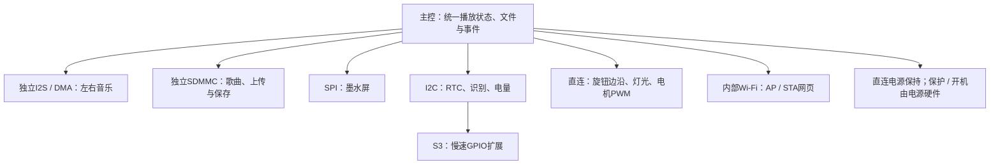

# S3 / S31 硬件资源对比与初步分配

日期：2026-10-09。输入为总规划已确认的首版功能，以及音频、显示、识别、网络、灯光运动和电源专项的当前接口需求。按D063先用S3验证模块，成品以S31为主线。本页给出**推荐的资源安排和候选GPIO编号**，不是批准采购、实物接线或通过测试的记录。

S3编号只对应官方N8R8 PCB v1.1参考条件。兼容板或音频板按自己的原理图与板载占用重映射；例如板载RGB使用GPIO48时，本表GPIO48电源保持分配不可直接采用。测试使用的板型、实际内存与接线在对应原型工程记录。

## 本轮推荐

- S3验证基准：官方DevKitC-1 N8R8、PCB v1.1；三线I2S、1位SDMMC、独立屏幕SPI、共享I2C，慢速输入/使能由16位GPIO扩展器候选承接。
- S31成品基准：WROOM-3模组，16 MB Flash +16 MB PSRAM作为容量候选；保留第一卡4位SDMMC，慢速信号优先直接GPIO，不强制安装扩展器。
- 两条声音路线共用同一主控和存储，分别验证输出、单元与音腔。生日入口、事件、图片、绑定、歌曲设置和网页共享已有显示/存储，不重复计GPIO。

与[S31 Korvo台架](README.md)区分：本页S31候选引脚面向成品模组；Korvo的GPIO还受板载音频、摄像头、LED及连接器约束，不能把本表直接接到Korvo上。

## 平台资源对比

| 资源 | ESP32-S3 | ESP32-S31 | 本项目采用方式 |
|---|---|---|---|
| 主处理器 | 双核Xtensa LX7，最高240 MHz | 双核32位RISC-V，最高320 MHz | 主控软件处理WAV/MP3，迁移重新编译和测并发，不用主频比值承诺性能 |
| 内部SRAM | 512 KB，另有16 KB RTC SRAM | 512 KB高速SRAM，另有32 KB低功耗SRAM | 音频DMA、实时任务和网络分别核算；低功耗RAM不计作普通音频堆 |
| 外部内存候选 | N8R8：8 MB Flash +8 MB PSRAM | WROOM-3-N16R16V：16 MB Flash +16 MB PSRAM | Flash放应用、配置与适量资源；PSRAM放缓存；歌曲主要存microSD |
| GPIO标称/模组 | 芯片45；WROOM-1最多36 | 芯片60；WROOM-3引出54 | 模组/板级保留先扣除，不能用芯片总数当余额 |
| 音频控制器 | 2路I2S | 2路I2S | 预约1路TX，左右声道共用一组BCLK/WS/DOUT；第二I2S暂不占GPIO |
| 通用SPI | 2路，不含Flash/PSRAM总线 | 2路，另有低功耗SPI；不含Flash/PSRAM总线 | 1路给墨水屏，另一控制器保留；引脚仍从剩余GPIO分配 |
| I2C | 2路 | 2路常规I2C，另有低功耗I2C | 起步1路共享，另1路保留给确有阻塞/电平冲突的器件 |
| SDMMC | 2槽，信号可经GPIO矩阵分配 | 2槽、1/4位，专用IO；第一卡GPIO20–25 | 起步只用1张卡；S3先1位，S31布线预留4位，速度实测收敛 |
| 旋钮计数 | 可用PCNT | 可用PCNT | 预约1个计数单元的A/B输入，不占两套计数单元 |
| 灯光/电机 | RMT、LEDC、MCPWM | RMT、LEDC、MCPWM | 灯环预约1个RMT TX；低速单向电机预约1个PWM输出 |
| ADC | ADC1主要在GPIO1–10 | ADC1在GPIO42–49 | 各预留1个低速电池分压输入；不把电压测量当完整电量计 |
| USB/维护 | 全速OTG、Serial/JTAG，GPIO19/20 | 高速OTG专用USB_DP/DM；Serial/JTAG为GPIO33/34 | 先保留有线更新/恢复，不因S31高速USB能力新增首版用途 |
| 网络 | Wi-Fi b/g/n、BLE | Wi-Fi 6、BLE/Classic、802.15.4 | 首版用AP/STA本地网页；其他协议无当前资源占用 |

S31手册的简介与外设正文对PCNT/PWM总数量存在表述差异，本轮仅预约1个计数单元和1个PWM输出，不依赖争议数量。S31 RMT正文为4TX/4RX，DMA只适用于指定通道；不要把任意RMT通道都当作可DMA。[R2]

## 资源池与维护保留

| 扣除步骤 | S3官方N8R8 v1.1 | S31 WROOM-3成品模组 |
|---|---|---|
| 模组GPIO集合 | `0–21、35–48`，36路 | `0–25、33–40、42–61`，54路；没有GPIO26–32或41 |
| 内存占用 | N8R8的GPIO35–37，扣3 | 模组Flash引脚没有列入54路，不能重复扣除；PSRAM按模组变体核对 |
| 原生USB维护 | GPIO19/20，扣2 | Serial/JTAG GPIO33/34，扣2；专用高速USB数据对另保留 |
| UART恢复 | GPIO43/44，扣2 | GPIO58/59，扣2 |
| 启动配置 | GPIO0/3/45/46，扣4 | 暂避开GPIO36–40/60–61，扣7 |
| 当前板载占用 | v1.1 RGB GPIO38，扣1 | 成品板尚未增加板载功能；新增内容从下述余额扣 |
| 候选应用池 | **24路：`1、2、4–18、21、39–42、47、48`** | **43路：`0–25、35、42–57`** |
| 推荐应用占用 | **21路 +扩展器9路慢速信号** | **32路直接GPIO** |
| 条件余额 | **3路：GPIO10/14/15** | **11路：GPIO47–57** |

S31启动配置资料冲突仍未解决：芯片手册第36页、模组第18页列36/37/60/61；IDF GPIO页另列38/39/40。本表保守避开两者并集。[R2][R3][R5]

GPIO数不含电源、地、EN复位线或专用高速USB数据对。外部JTAG如需要：S3另保留39–42，S31另保留54–57；本稿以USB Serial/JTAG调试为起点。S3改用v1.0或兼容板时需重新核对LED、USB和板载占用。

## 按功能分配

### 外设控制器安排

| 控制器/服务 | 预约用途 | 共享/并发条件 |
|---|---|---|
| I2S0 TX | 连续输出左右PCM | 时隙、电平及功放声道选择按实物配置；不在播放期间借给其他任务 |
| SDMMC的一个槽 | 音乐、图片、绑定、事件和上传文件 | 一个文件系统服务管理读写，播放预读优先；上传分块限速 |
| 通用SPI2 | 墨水屏发送 | RST/CS/DC/BUSY仍单独计信号；刷新等待不长时间占住音频任务 |
| 通用SPI3 | 暂不使用 | 只是控制器余量，没有自动多出一组引脚 |
| I2C0 | RTC、读卡器、电量/充电管理、S3扩展器 | 地址、电平、总上拉/负载及超时联合核对；重复地址未解决前不接同一总线 |
| I2C1 | 暂不使用 | 读卡器阻塞或地址冲突时可考虑拆分，仍需另外2路GPIO |
| PCNT的一个单元 | 旋钮A/B计数 | 接点去抖/毛刺过滤由实现验证；按压不走PCNT |
| RMT的一路TX | WS2812候选灯环数据 | 通道号/是否DMA按目标驱动和灯数验证，不先锁死DMA通道 |
| LEDC的一路PWM | 单向低速转盘电机 | 驱动使能与保护由独立驱动电路承担；如换闭环/双向方案重新核算 |
| ADC1的一路单次采样 | 电池分压备用监测 | 分压、滤波、可测范围及校准另核对；可被I2C电量计替代 |
| Wi-Fi/AP/STA、HTTP | 配网、控制、上传 | 不增加GPIO，消耗内部RAM、Flash、CPU时间与卡带宽 |

### 候选GPIO编号

下表按前述候选平台算账。S3 I2S/SD编号沿用音频专项的条件草案，其他行由本专项建议；S31为重新分配。屏幕、NFC和电源的准确模块尚未定型，不能据此直接接线。[R6]

| 功能 / 信号 | S3候选GPIO | S31成品候选GPIO | 说明 |
|---|---|---|---|
| I2S BCLK / WS / DOUT | `16 / 17 / 18` | `2 / 3 / 4` | 两功放可共用数字总线，各自选L/R；MCLK另计 |
| SD CLK / CMD / D0 | `12 / 11 / 13` | `24 / 25 / 20` | S3为GPIO矩阵；S31为第一卡固定IO |
| SD D1 / D2 / D3 | `14 / 15 / 10`，暂不接 | `21 / 22 / 23`，预留 | S3启用即耗尽当前3路余额 |
| 墨水屏 SCK / MOSI / CS | `4 / 5 / 6` | `12 / 11 / 10` | 与SDMMC分开；未预留屏幕读回MISO |
| 墨水屏 DC / BUSY | `7 / 41` | `9 / 8` | BUSY必须是输入，极性按准确屏驱动核对 |
| 共享I2C SCL / SDA | `1 / 2` | `6 / 7` | 不锁定I2C地址；所有器件须满足选定总线的3.3 V电平 |
| NFC IRQ | `21` | `13` | 起步保留1输入；SPI/UART读卡器须重排 |
| 旋钮 A / B | `39 / 40` | `14 / 15` | 直接接入PCNT或GPIO，不经过扩展器 |
| 扩展器 INT | `9` | 不需要 | S3 GPIO9有RTC能力；睡眠唤醒还需核对供电、上拉和有效电平 |
| 灯光数据 | `42` | `16` | 电平转换、灯串供电与数量由灯光专项核对 |
| 电机 PWM | `47` | `17` | 独立驱动，不能直接驱动电机 |
| 电源保持 / 关断命令 | `48` | `18` | 不经扩展器；有效极性/复位默认状态待电源方案确认 |
| 电池ADC备用 | `8`，ADC1_CH7 | `42`，ADC1单端channel0 | S31单端通道需按目标驱动确认，不能照搬S3 ADC脚 [R7] |
| 旋钮按压 / 播放暂停 / 返回 | 扩展器`P00 / P01 / P02` | `0 / 1 / 5` | S31三键位于LP/RTC GPIO范围，可供睡眠唤醒评估 |
| 墨水屏 RST | 扩展器`P03` | `19` | 慢速输出，复位极性按模块核对 |
| NFC RST | 扩展器`P04` | `35` | 候选模块可能不需要该脚，未选定前保留 |
| 电机 EN | 扩展器`P05` | `44` | 复位/故障时的关断由驱动侧硬件默认状态保障 |
| 音频共用 EN / 静音 | 扩展器`P06` | `45` | 假设两路可共用一个控制信号；不能直接用驱动输入极性互异的两个模块 |
| 电源状态 / 故障通知 | 扩展器`P07`，有条件 | `43` | S3仅用于硬件已自主保护后的状态回读；需立即响应时移到直连GPIO10 |
| 可选独立在位输入 | 扩展器`P10` | `46` | 为可能的在位传感器保留，不等于已选择传感器或必须安装 |

S3常用主控GPIO21路；候选扩展器9路，剩7路低速端口。S31对应32路直接GPIO。S31 GPIO0/1若后来接32 kHz晶振需重排三键；当前使用I2C RTC的草案不占该晶振接口。

S31的LP/RTC GPIO范围为0–7；候选三键在此范围，但当前NFC IRQ13与在位46不能据此承诺Deep-sleep唤醒。若有明确的挂件睡眠唤醒需求，优先重排到LP脚。**真正断掉主控电源后的开机/唤醒由始终供电的电源电路承担**，不能由已断电GPIO完成；电源保持输出是否跨睡眠保持同样需验证。

### 余额和改配影响

| 模块或功能变化 | S3影响 | S31影响 |
|---|---|---|
| 当前推荐草案 | 21直连 +9慢速扩展，余3 | 32直连，余11；还未扣其他板载功能 |
| 功放/DAC需要MCLK | 新增1直连，余2 | 新增1直连，余10 |
| 两功放需独立EN | 另用1个扩展端口；时序必须直连时再扣GPIO | 新增1直连，余10 |
| SD改SPI | 独立SCK/MOSI/MISO/CS共4路，比1位SD多1，余2 | 第一卡接口重新评审；不用GPIO矩阵任意搬SDMMC |
| S3 SD升4位 | 多3直连，余0；不能同时再承诺UART等扩展 | 已在32路中预留4位，无新增 |
| microSD机械卡检测CD | 新增1输入，可直接占余额或经扩展器评估 | 新增1输入，余10 |
| 电源故障需主控及时处理 | GPIO10直连：22直连 +8慢速扩展，余2 | 已直连，合计不变 |
| 独立开关键只作用于电源电路 | 不新增MCU GPIO | 不新增MCU GPIO |
| 主控还需读取独立开关键 | 新增1输入，不能假设可复用三键 | 新增1输入，优先留睡眠唤醒能力 |
| 读卡器由I2C改独立SPI | 原共享I2C仍供RTC/扩展器使用，通常新增4个总线信号；IRQ/RST另核 | 新增SPI总线信号，按实物核对；不释放整个共享I2C |
| 读卡器改UART | 原I2C仍保留，通常新增TX/RX两脚；IRQ/RST另核 | 可在余额内重配2脚，原共享I2C仍保留 |
| RTC沿用DS1302三线方案 | 原I2C仍需服务其他器件，新增3直连会耗尽余额 | 新增3直连；本轮建议优先I2C RTC |
| 电机增加方向 / 测速 | 方向可评估慢速扩展，测速须直连并预约计数资源 | 从余额分别扣输出/输入，追加实际计数/捕获资源 |

这些变化累计计算，不把同一组余额多次承诺。S3 GPIO14/15可作UART扩展，GPIO10可用于额外片选/中断；这与4位SD扩展互斥。S31 GPIO47–57是候选扩展池：可评估额外串口、I2C、SPI或音频，但专用功能/ADC/JTAG和电源预算仍逐项核对。

## 内存、DMA和并发

| 资源 | 起步规划 | 核实条件 |
|---|---|---|
| PCM缓存 | 192 KiB；48 kHz、双声道16 bit为192,000 B/s，约1.02秒 | 不是覆盖所有SD写延迟的保证；根据低水位与欠载调整 |
| 压缩预读 | 64 KiB | CBR320 kbps约1.64秒，不能代替VBR峰值实测 |
| 上传 / 文件缓存 | 合计64 KiB，上传接收先32 KiB、写块先8–16 KiB | 明确缓冲包含关系；音频低水位时减速，单个上传起步 |
| 外部缓存总额 | 上三项合计320 KiB，先预算320–512 KiB | 放PSRAM的具体部分按驱动能力确认；屏/字体/索引另计 |
| 内部音频预算 | 解码、实时栈、I2S/DMA、卡驱动暂96–160 KiB | 网络、系统、界面和索引另计；不是最低剩余内部内存 |
| 屏幕帧缓冲 | 296×128、1位一帧4,736 B；双色两个平面至少9,472 B | 仅对应参考规格；实际色型、字体、解码与双缓冲另计 |
| Flash | S3 8 MB、S31 16 MB为候选容量 | 应用镜像、中文字体、网页资源及更新分区按构建结果分配；歌曲不挤入应用Flash |
| 任务优先关系 | 音频供数优先；存储/解码有缓存；屏幕、识别、上传有界等待 | 本轮不固定核绑定或优先级数字，用实际最长阻塞、栈高水位和断音证据收敛 |

I2S先预约一个TX方向的DMA资源；屏幕SPI按所用驱动核对TX/RX DMA分配，RMT是否DMA按灯光时序验证。**SDMMC使用自身IDMAC，不与I2S/SPI直接共用一笔GDMA通道计数**，但仍竞争存储访问、内存带宽与调度；内部DMA缓冲和PSRAM能力须按目标IDF版本复核。[R8]

并发验收仍是播放中上传新歌，同时显示与识别正常工作；允许上传变慢，不能改成暂停播放上传。建议起步连续30分钟，记录PCM低水位、欠载、卡最长写阻塞、内部堆/连续块、PSRAM及任务栈余量。该整机候选分配尚无联合构建、烧录、并发运行或功耗证据；本机音频板基础工程的编译状态另见[验证索引V014](../../product/validation.md#v0142026-10-09-音频基线工程准备)，不能代替此分配的实测。

## 进入接线前要收敛的接口

| 输入方 | 必须返回的准确资料 | 对本表的影响 |
|---|---|---|
| 音频 | 卡座版号/电平/上拉、功放或DAC是否MCLK、两路EN/声道选择 | I2S3/4线、SD3/4/6线、使能1/2线及支路负载 |
| 显示 | 屏/驱动板型号、色型、SPI信号、BUSY/RST极性、RTC型号 | SPI及复位是否可扩展、是否I2C RTC、帧缓冲与刷新工况 |
| 识别 | 准确读卡器、I2C/SPI/UART模式、地址、IRQ/RST、轮询超时、在位机制 | 共享总线是否成立、IRQ/RST/额外在位是否需要 |
| 电源 | 硬件开关/保持逻辑、复位默认状态、状态/故障信号、充电/电量I2C及USB数据路径 | 开关是否新增输入、故障是否直连、USB/外供隔离与关机恢复 |
| 灯光 / 运动 | 灯型/数量/电平，电机驱动EN/方向/测速及峰值 | RMT/PWM、慢速EN、额外输入/输出和电源轨 |

主控与数字接口起步3.3 V；功放、灯光、电机的电压和峰值由各专项与电源联合核对，不从开发板3.3 V引脚默认供给全部负载。保护、复位期间的使能默认状态和独立开机不依赖应用正常运行。完成上述接口核对后，再把候选表变为准确板型的接线稿并进入实现。

## 官方依据

| 编号 | 来源与核对范围 |
|---|---|
| R1 | [S3芯片数据手册v2.2](https://www.espressif.com/sites/default/files/documentation/esp32-s3_datasheet_en.pdf)，第3–5、25、57/58页；[WROOM-1/1U v1.8](https://www.espressif.com/sites/default/files/documentation/esp32-s3-wroom-1_wroom-1u_datasheet_en.pdf)，第3、11/12页；[官方DevKitC-1 v1.1指南](https://docs.espressif.com/projects/esp-dev-kits/en/latest/esp32s3/esp32-s3-devkitc-1/user_guide_v1.1.html)，内存、排针、USB及RGB |
| R2 | [S31芯片数据手册预发布v0.5](https://documentation.espressif.com/esp32-s31_datasheet_en.pdf)，第5/6、30/36、48、66–70、74–76、79/80页，含CPU/内存、外设、固定SD IO与启动/ADC/唤醒范围 |
| R3 | [S31 WROOM-3/3U预发布v0.7](https://documentation.espressif.com/esp32-s31-wroom-3_datasheet_en.pdf)，第3、14/15、18页，模组内存变体、54路GPIO及启动条件 |
| R4 | [S3 SDMMC驱动](https://docs.espressif.com/projects/esp-idf/en/stable/esp32s3/api-reference/peripherals/sdmmc_host.html)，GPIO矩阵；[S31 SDMMC驱动](https://docs.espressif.com/projects/esp-idf/en/stable/esp32s31/api-reference/peripherals/sdmmc_host.html)，API公共文字含其他芯片描述，S31位宽/IO以R2为准 |
| R5 | [S31 GPIO驱动页v6.1](https://docs.espressif.com/projects/esp-idf/en/stable/esp32s31/api-reference/peripherals/gpio.html)，启动脚集合与R2/R3冲突，暂避开并集 |
| R6 | [音频专项的接口与条件GPIO草案](../audio/README.md#给主控专项的计算内存与接口输入)，三线I2S、1位SDMMC和缓存预算；另核对[显示](../display/README.md)、[识别](../records/README.md)、[网络](../network/README.md)、[电源](../power/README.md)、[灯光运动](../lighting-motion/README.md)的当前需求 |
| R7 | [官方IDF v6.1 S31 ADC通道映射](https://github.com/espressif/esp-idf/blob/v6.1/components/soc/esp32s31/include/soc/adc_channel.h)，GPIO42单端映射；[RTC GPIO映射](https://github.com/espressif/esp-idf/blob/v6.1/components/soc/esp32s31/include/soc/rtc_io_channel.h)，低功耗能力实现时与R2再次核对 |
| R8 | [官方SDMMC事务源码v6.1](https://github.com/espressif/esp-idf/blob/v6.1/components/esp_driver_sdmmc/src/sd_trans_sdmmc.c)及[S31 SDMMC驱动](https://docs.espressif.com/projects/esp-idf/en/stable/esp32s31/api-reference/peripherals/sdmmc_host.html)，硬件IDMAC与通用DMA预算分开；实际驱动/依赖版本在实现时固定 |

本轮只维护主控专用规划，共享决定与其他专项文件由总规划汇总。资料规格、规划估算、候选分配和实测证据分别处理，不将GPIO余额当作整机性能或续航证明。
