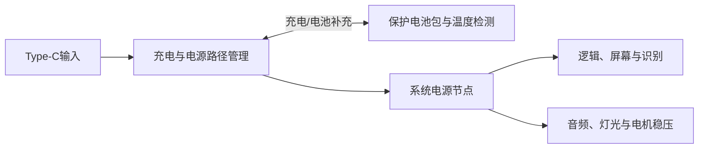
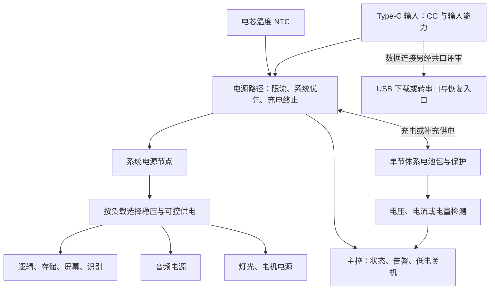

# 电池与电源专项

对应 F09。用户要求内置较大容量电池、Type-C插入时同时使用和充电、续航尽量长。容量和时长不能在实测前承诺。

## 当前推进安排：2026-10-08

用户确认先确定具体功能模块，电源电路设计与制作随后推进；当前只整理可复用的开源工程备用。下文架构、芯片和模块推荐保留为候选，不代表当前开始实施或已经选定电源方案。

本地已保留 [12 项备用开源参考](#本地备用候选库12项)，覆盖充电与稳压、电源切换、温控和电量计。第一批三个工程的详细能力见[开源工程比较](#可复用候选与实际证据)，新增项目的文件入口、版本、作者测试范围、许可与缺口见候选库。暂不采购、复制工程或进入电源原理图/PCB制作。

启动电源设计前，由各功能专项提供暂选准确模块的电源轨及容差、平均/峰值电流和峰值持续时间、启动与待机条件，并由总规划汇总同时运行工况、USB维护需求和结构占位。先以资料估算和已有原型数据形成预算，电源原型再验证联合负载；不要求先完成全部功能的最终成品实测。届时重新筛选参考工程，确定原型电源方案，并结合体量、续航和报价审阅电池容量、输入能力与芯片。

## 电源路径

优先比较带Power Path的单节锂电充电管理、电池保护、温度检测、系统稳压、电量检测和Type-C输入。BQ25895是候选示例，不是定稿；普通TP4056加电池直接带负载不能作为边充边用证据。功放、电机和灯光的峰值负载必须纳入预算，不能从开发板3.3 V输出取电。

## 验证顺序

在预期播放、屏幕、灯光和运动负载下测试插拔Type-C不重启/不断音、同时使用和充电、输入功率不足、电池补充、充满结束、低电处理、保护和温升。分别记录平均与峰值电流、充电时间、容量、实际尺寸、重量和完整放电时长。输入CC、电流能力、NTC与电芯资料需要逐项核对；需要PD时另行比较。

## 取舍

续航尽量长与整体不要太大、音质不能牺牲存在直接空间和重量取舍。应同时展示电池容量、质量、尺寸、声音/灯光/屏幕功耗和费用，让用户在实测数据基础上决定，不用标称容量替代验收。

## 首轮细规划：2026-10-08

本轮对应 F09、配合 F14，依据 D007、D018–D021、D035–D041、D053。以下器件能力来自公开资料，价格是查询日的商品页标价；续航、热限值和通过条件均为规划建议，尚无本项目实测结果。按D059以新电源模块和电池选型推进，接入前核对准确规格与测量条件，不以全面库存盘点为前置。

**推荐方向：优先评估单节体系的开关型电源路径，并在系统节点后按实际负载生成电源轨。模块原型可先评估现成 5 V UPS，再以可测的 BQ25895 电源路径方案验证集成可行性。** BQ25895 仍是候选；现成 UPS 的尺寸和电池架不约束成品。准确输入能力、电芯温度检测和低电状态的输出能力核实后，才能暂选试验模块。BQ24074 路线适合较低负载的功能验证和可观察的充电基准。

### 已确认需求与缺口

| 项目 | 已确认要求 | 首轮需要补齐的证据 |
|---|---|---|
| 电池 | 内置较大容量、续航尽量长 | 容量、可用能量、允许充放电电流、尺寸、重量、温度范围；具体电芯及预算未定 |
| 边充边用 | Type-C 插入后系统可继续使用并充电 | 系统优先供电、输入限流、电池补充、负载存在时正常充满结束；不能仅凭有充电灯判断 |
| 音质与体量 | 音质不能牺牲，整体尽量紧凑 | 各负载平均/峰值功耗、稳压纹波与声音、热与装配空间的联合证据 |
| 日常运行 | 音乐、前屏、本体操作、AP 配网属于首版 | 连续播放、屏幕刷新、识别、灯光、电机和 Wi-Fi 并发时的供电能力 |
| 维护 | 首版预留更新、烧录及恢复入口 | 充电和 USB 数据共口是否可行，电脑端限流，电池与开发板 USB 的反向供电边界 |

“边充边用”分两个可测条件：输入功率足够时，系统工作且电池净充电；输入不足时，优先维持系统、降低充电电流，必要时由电池补充并明确显示状态。后一种状态可能使电池净放电，不能显示为正在补充电量。

### 三条候选路线

| 比较项 | A：开关型电源路径＋独立稳压 | B：线性电源路径＋独立稳压 | C：现成 5 V UPS 模块 |
|---|---|---|---|
| 准确比较对象 | TI BQ25895；已确认存在 BQ25895EVM-664 评估板 [S1][S2] | Adafruit #4755，BQ24074 充电板 [S3][S4] | Waveshare UPS HAT (D)，SKU 25567 [S5][S6] |
| 电池与路径 | 单节锂电体系，NVDC 电源路径、输入动态管理；芯片充电电流最高 5 A | 单节 4.2 V 锂电体系，DPPM 系统优先、独立检测充电终止；芯片最高 1.5 A 充电 | 两只 21700 并联，单节电压体系；厂家声明有开关充电、电源路径、电池补充和保护 |
| 系统输出 | SYS 不是恒定 5 V；按负载增加 5 V 升压及逻辑稳压。芯片的 3.1 A OTG 升压指标不能代替充电时 SYS 后的系统电源能力 | LOAD 插电时不高于 4.4 V，电池供电时随电池下降；需要 5 V 升压。商品页标注最大负载 1.5 A，不是 5 V/1.5 A 成品输出 | 商品选型表标注 5 V、最高 2.5 A；Wiki 另写满电且插电时约 4 A，两者条件不同，本轮按 2.5 A 规划上限并要求低电实测 |
| 温度、保护、电量 | 芯片有电芯 TS 检测、内部热调节、ADC 和状态；ADC 不是完整电量计。模块是否接出 TS/SYS、是否带电池保护必须核对 | THERM 默认旁路；按官方方法启用外接 10 kΩ NTC。有 PGOOD/CHG/CE；没有完整电量计，电池包保护需单独落实 | 厂家列过充、过放、过流、短路保护；电芯 NTC、充电芯片准确型号/配置未核实。INA219 与 MCU 提供监测，百分比算法须审查 |
| 尺寸与质量 | 裸芯片 WQFN-24、4×4 mm；EVM 外形、质量待核实；外围电感、保护、稳压和连接器占地另算 | 裸芯片 VQFN-16、3×3 mm；#4755 板外形见官方 Fab Print，数值及质量待核实；升压板另占空间 | 板面 56×85 mm；商品页重量 0.069 kg，统计口径待核实；含电池、支架的总厚度和质量另测 |
| 功耗与热 | 开关充电适合较大功率；官方典型效率随工况变化，不能直接当整机效率；待机、运输模式、外部稳压损耗需测 | 线性充电发热约与输入/电池压差及电流成正比，负载和热调节会压低充电速度 | 固定升压与板载 MCU/指示灯带来损耗；官方未给出本项目可用的效率/静态电流证据 |
| 软件依赖 | I2C 配置输入/充电限流、状态、故障和看门狗；须核对上电默认值。TI PC 调试流程依赖 EV2400，另购；主控直接 I2C 方案需要移植核验 | 电阻/跳线设电流，无充电寄存器驱动；GPIO 读取 PGOOD/CHG、控制 CE；稳压、电量计另行管理 | 官方示例针对 Raspberry Pi；电压/电流及 MCU I2C 协议需移植到实际主控。无需采用 Raspberry Pi，供电可经已核对的输出端连接 |
| 原型价格与供货 | EVM、EV2400、合格小模块及裸芯片单价均待询；官方页面混有库存模板，不能据此确认现货 | #4755 模块 1–9 件单价 USD 14.95，官网显示有货；稳压、电量计、NTC、电池另计 | 模块单件标价 USD 24.99，电池不含；页面可加入购物车，实际地区库存和交期待核实 |
| 适用阶段与限制 | 便于测清 SYS/BAT/输入关系，适合后续主板评估；暂不以来源不明的“5 A BQ25895 板”替代 | 简单、温度入口明确，适合低负载验证；不优先承担大音量＋灯光＋电机的整机高峰值 | 最快获得可比较的 5 V 整机原型；体积较大且关键热保护细节未明，暂不作为成品选型 |

价格查询日期为 **2026-10-08**，数量档如表，均为模块公开美元标价，未含运输、税费、电池或外围件；不换算成未核实的人民币到手价。裸芯片价格与模块价格分开，国内渠道、准确板版号和交期仍待询价。仅使用数据页不涉及复制外部设计；若采用源码或板图，另核对对应许可并交总规划补来源记录。

路线 A 的芯片在充电与内部升压之间切换工作模式，升压输出节点也不能与 SYS 混同。不能把“支持 OTG”和“支持充电”相加，推断有同时充电时持续的 5 V 系统输出；播放器负载应放在可核实的 SYS 后，所需恒压轨由独立稳压提供。EVM 是台架评估板，也不等于带 Type-C、保护和所有电源轨的成品模块。

路线 B 在低电池电压时输出能力明显受限。例如假设 LOAD 可连续提供 1.5 A、升压效率 85%、电池 3.2 V，5 V 输出约为 `3.2×1.5×0.85/5≈0.82 A`，且充电、线材和热条件可能进一步限制。此算式用于筛选，不是 #4755 的实测能力。

### 共用电源组成与模块准入

| 组成 | 模块原型要求 |
|---|---|
| 电池与保护 | 采用准确规格的 1S 保护电池包，或经核对的电芯架与保护组合；大容量不能替代持续/峰值电流指标。路线 C 的并联电芯按模块和电芯厂家要求匹配，不能将其他电池包视为直接可插替代品 |
| 电芯温度 | NTC 贴近电芯、匹配芯片要求的阻值/曲线并检查旁路设置；芯片结温保护不能替代电芯温度检测。路线 C 若不能确认有效的温度检测与停充路径，须先补齐再接实物充电 |
| 逻辑稳压 | 根据 SYS 或 5 V 输入及低电范围选择 3.3 V 等实际轨；需保证最差输入时仍满足逻辑最低电压。不能默认一个 3.3 V LDO 在全放电范围都可用 |
| 音频、灯光、电机 | 按各专项反馈确定轨；可能共用 5 V，但额定电流、去耦与回流需独立核对。电机堵转和功放脉冲不能从开发板 3.3 V 输出取得 |
| 电量与状态 | 首先准确区分电池供电、净充电、已充满、输入不足、低电和温度故障。电压估算仅粗略显示并标可信度；持续在负载下显示百分比时，比较独立单节电量计、配置成本与校准证据 |
| 关机与待机 | 用户开关机入口已要求单独安排，具体体验待交互评审。比较逻辑休眠与硬件关断的实际静态电流，保留插电充电及有线恢复能力；不能把停止播放视为整机关机 |

模块准入至少取得准确型号/板版号、公开原理或手册、输入/系统/电池端定义、输入限流及默认充电配置、温度检测和保护状态、低电输出能力。卖家只给“支持边充边用”或“最大 5 A”不足以入选。TP4056 电池端直接并接系统负载不进入这三条路线。

### 容量、尺寸、质量与续航假设

下面用可查商品作为容量和占位参照，**不是库存、批准采购或最终电芯推荐**；三者是不同产品，不能按容量线性外推质量和尺寸。路线 C 还需另取得匹配 21700 电芯及电池架的实物数据。

| 参照电池包 | 标称能量与尺寸 | 商品页质量、单件价与供货 | 电流/温度约束和用途 |
|---|---|---|---|
| Adafruit #328，2500 mAh [S7] | 3.7 V，约 9.25 Wh；50×60×7.3 mm | 50 g；USD 14.95；官网有货 | 页面建议充电不超过 1.2 A；用于较小容量的占位/续航对照，不表示已满足“较大容量” |
| Adafruit #353，6600 mAh [S8] | 3.7 V，约 24.42 Wh；69×54×18 mm | 155 g；USD 24.50；官网有货 | 正文建议持续放电低于约 1.3 A，线材额定 2 A；技术表另列 3.3 A，口径需核实，暂按更保守值筛选；通常不适合高功率整机直接套用 |
| Adafruit #5035，10050 mAh [S9] | 3.7 V，约 37.19 Wh；66.6×55.3×18.7 mm；最小容量 9500 mAh | 148 g；USD 29.95；官网有货 | 标注持续放电/最大充电 3 A，但自带线材额定 2 A；按整条连接链最小额定值限制。页面列充电 0–45°C，包无内置热敏电阻 |

上述能量按 `标称电压×容量` 计算。厂家尺寸/质量存在测量和版本差异，最终以准确批次及包含连接器的装配测量为准；保护截止电压与电芯测试截止电压可能不同，不能把标称容量全部当作系统可用容量。电池舱还要加入保护板、NTC、线材弯折、固定和维护空间，不与音腔占用重复计算。

续航估算采用明确假设：稳压效率与可用放电比例的乘积取 **0.70–0.85**；平均功率是各稳压轨输出功率之和。`续航小时≈标称 Wh×有效比例÷平均功率 W`。如果测量的是电池端平均功率，就直接用可用能量除以该功率，不再重复扣稳压效率。

| 假设电池容量 | 轻负载 2–3 W | 常规组合 4–6 W | 高负载 8–10 W |
|---|---|---|---|
| 2500 mAh / 3.7 V | 约 2.2–3.9 h | 约 1.1–2.0 h | 约 0.6–1.0 h |
| 6600 mAh / 3.7 V | 约 5.7–10.4 h | 约 2.8–5.2 h | 约 1.7–2.6 h |
| 10050 mAh / 3.7 V | 约 8.7–15.8 h | 约 4.3–7.9 h | 约 2.6–4.0 h |

负载分档仅用于计算范围，并非实测或用户指定时长：轻负载可代表低音量、低亮或关灯、停转、按需刷新及网络空闲；常规组合和高负载分别改变音量、灯光、转动、刷新和网络活动。尚无证据证明这些操作实际落在表中瓦数。高负载行只比较能量，**不证明上表电池包、线材和模块能提供对应电流**。

例：5 V/2 A 输出为 10 W；假设电池 3.2 V、升压效率 85%，电池电流约 `10/(3.2×0.85)=3.68 A`。这已经超出示例电池的 2 A 线材能力，所以不能因“10050 mAh”直接认定适配。

充电时间也单独估算。若平均净充电接近 1 A，按容量除以电流后加 20%–50% 尾段余量，6600 mAh 约 8–10 h，10050 mAh 约 12–15 h；只是空闲、室温和未触发限流时的规划范围。播放、温度调节和输入不足会延长时间，必须记录净电池电流。采用较大电池后是否接受较长充电时间，留待实测与成本一起审阅。

### Type-C 输入与 F14 共口建议

先比较 **5 V 输入**，暂不以 PD 快充作为首版前提。Type-C 连接器本身不能证明支持 3 A、PD 或数据烧录。需要核实两个方向的 CC 检测/下拉、源端声明的电流、线缆压降、输入限流、反向电流、插拔空间；若模块只带固定 CC 下拉，不能直接假定它会识别 1.5 A/3 A 的供电声明。

输入预算建议按 `所需输入功率≈系统输出功率/供电效率＋电池电压×净充电电流/充电效率` 检查。仅以路线 A 举例：系统 5 W、供电效率 85%、电池 4 V、净充电 1.5 A、充电效率 90%，约需 12.6 W；系统升至 10 W 时约需 18.4 W，超过 5 V/3 A 的理想 15 W。以上效率、电流和功率均是假设；实际还要考虑线缆和输入余量。因此建议比较 5 V/3 A 输入的可行性，同时保留低能力输入下安全限流和电池补充，不能承诺所有 Type-C 电源都能边播放边增加电量。

向总规划/F14 提交以下共同评审事项：

- 优先比较一个外部 Type-C 同时承接充电及所选主控的原生 USB 下载或 USB 转串口；路线 B 官方有 D+/D− 焊盘，路线 C 的充电口数据可达性待核实。
- BQ25895 有 D+/D− 输入类型检测；若与主控 USB 共线，需核实检测时序、数据隔离/切换和 USB 枚举兼容性。不能直接把两个功能并接后视为已可用。
- 电脑端按其已声明能力限流；烧录时停止电机/高亮等大负载的具体行为需和体验联合审阅。模块原型另接开发板 USB 时，先核对板上 VBUS 路径，避免两个 5 V 输出相互灌电。
- 保留不依赖应用正常运行的下载/复位或维护接口，电池存在、低电、仅 USB 输入及应用失效时都能恢复；不能让电源自动启停策略挡住恢复操作。

### 最小模块材料与用途

下表是试验需求清单，数量是一次台架试验的建议，不是已有库存或采购单。A/B/C 只暂选一条主路线，不要求同时购买全部方案。

| 材料或工具 | 建议数量 | 用途与选取条件 |
|---|---|---|
| 已通过准入核对的电源路径模块 | 1 | A 选 SYS、BAT、输入和温度可测的模块/EVM；B 为 #4755；C 为 UPS HAT (D)。价格及缺项见候选表 |
| 适配电池包或匹配电芯组合 | 1 套 | 先核实容量、4.2 V 充电兼容、持续/峰值电流、保护及连接器；C 为两只匹配 21700，不能按其他参照包直接代入 |
| 电芯 NTC 和固定材料 | 1 套 | 验证温度检测与停充；B 官方要求启用 THERM，A/C 按准确模块确认；阻值曲线不能仅凭“10 kΩ”匹配 |
| 系统稳压模块 | 按最终轨需要 | A/B 至少比较逻辑稳压与 5 V 升压；C 已提供 5 V，逻辑轨可先借准确开发板稳压，但按全部负载能力核对 |
| 电量检测 | 1 个或模块已有监测 | 获取电池电压/电流/状态；需可信百分比时再选独立电量计。首轮不定型号，模块成本待核实 |
| Type-C 输入、电源和数据线 | 各 1 套 | 有清楚额定值的 5 V 电源与足够线径的线；C–C、A–C、电脑数据线按计划覆盖，原型转接板的数据/CC 能力另核对 |
| 配电、开关及测量连接 | 1 套 | 短线、可靠端子和适当保护；充放电大电流不穿普通面包板触点。预留输入、SYS、BAT、各输出轨和地的测量位置 |
| 可调限流直流电源与电子负载 | 各 1；可借用 | 电源不足、阶跃负载和稳压能力测试；初测充电管理可用支持吸收电流的电池模拟器，普通不能吸收电流的台式电源不能充当电池 |
| 万用表、USB 功率记录、示波器及测温 | 各 1 套；可借用 | 测电池净电流、输入功率、插拔瞬态、纹波和温升；USB 表不能代替电池端电流测量或判断充电终止 |

目前可核实的电源板基础费用仅 B 的 USD 14.95 或 C 的 USD 24.99；A 和其余外围、国内电池、电源线材及借用条件未报价，**尚不能给出完整原型总价**。待暂选负载与峰值预算明确后形成电源原型材料及费用，采购由总规划处理。

### 建议验证步骤与通过条件

全部为待执行方案，承接 T06、配合 T01/T07/T10。先用模拟负载测电源，再接实际模块；每步记录准确板卡/模块、输入、电池、线材、固件、环境温度和负载状态。

| 顺序 | 操作与记录 | 建议通过条件 |
|---|---|---|
| PWR-01：资料与基础输出 | 核实端口、保护、NTC、输入/充电默认限流和关机唤醒；测轻载、额定预期平均与峰值阶跃，在满电和接近低电的输入范围进行 | 各轨满足实际器件电压/电流限制；没有反向灌电；峰值不触发保护或重启。模块最大标称值不直接作为合格工作点 |
| PWR-02：Type-C 插拔 | 电池高/中/接近低电各档，在播放＋刷新＋灯光/电机启动时各插拔 20 次；测 SYS、逻辑轨、音频轨和电池电流；C–C/A–C 两方向覆盖 | 0 次非预期开关机/重启、无可察觉断音，状态正确更新；瞬态不越器件界限。听感、日志及可用音频采集分别记录 |
| PWR-03：边用边充与弱输入 | 足够输入下至少连续运行 60 min，证明电池净充电；然后限输入电流或使用已知较弱源，观察充电降额、电池补充和电压 | 足够输入时电量上升；不足时不超输入能力、不反复充停/复位，准确反馈电池是否净放电；恢复输入后正常充电 |
| PWR-04：充满结束 | 从中低电持续充至结束，正常播放负载保持；记录电池支路电流、实际充电状态和电压，再观察 2 h | 电芯不超允许充电电压；在准确芯片规定的电池终止电流/时间条件下正常结束，不因系统负载而无法终止；无异常反复再充。不能只看输入电流或 CHG 灯熄灭 |
| PWR-05：低电及恢复 | 自然放电或合适的电池模拟条件下观察低电提示、停止写入/播放和关断，随后插电恢复；存储写入和音频并发条件覆盖 | 建议在硬件保护之前留出保存和关机余量；阈值/滞回按压降实测确定，不连续复位，不损坏歌曲/绑定/设置；关机后的充电、开机和恢复烧录路径均可达 |
| PWR-06：温度与保护 | 最差正常播放/运动组合叠加充电至少 60 min，记录电芯、充电芯片、稳压器、连接器与外壳的稳态温度；用 NTC 等效电阻验证冷热、开路等故障，不靠加热电芯模拟 | 原型室温 25±5°C 下建议电芯不高于 40°C、可触表面不高于 45°C，并始终服从准确电芯/器件更严格限制；温度越界按规定停充/降额并恢复。限流及保护恢复不形成振荡；不对电芯直接短路试验 |
| PWR-07：完整续航与声音 | 固定曲目、音量、灯亮、转速、屏幕刷新、Wi-Fi 状态，各代表工况至少完整放电一次；固定音量在电池、插电、充满状态比较底噪和电机启停干扰 | 获得可复现的实际小时数、平均/峰值电流和可用 Wh；没有供电引起的可察觉噪声/断音。复测离散后再拟定用户认可的时长，不用估算表宣称通过 |
| PWR-08：F14 有线维护 | 共口方案确定后，覆盖首次烧录、正常更新、应用无法启动时恢复，以及电池有/无、低电和不同电脑输入能力 | 恢复入口有效，USB 数据与充电检测互不妨碍，不向电脑 VBUS 倒灌；擦除范围和内容影响符合已审阅更新规则 |

量化限值最终由各器件手册、试验压降和用户认可的体验共同确定。实测记录包括输入 V/I/P、电池 V/净 I、各轨平均/峰值及峰值持续时间、纹波/最低电压、温度、起止状态、实际放电时长和异常；INA219 等平均采样不能替代示波器观察快速峰值。证据随后续实际原型保存到 `hardware/prototype/` 的对应版本，本轮不生成运行通过记录。

### 共享接口请求与总规划建议

| 对方专项 | 需要提供的输入 | 电源专项据此输出 |
|---|---|---|
| 音频/存储 | 开发板与功放实际轨、允许电压/纹波、典型音量平均电流、最大预期音量峰值与持续时间、存储读写峰值、静音/启动行为 | 稳压能力、输入预算、低电压降边界、供电噪声比较条件 |
| 显示/本体 | 逻辑与屏驱动轨、刷新峰值/时长、RTC 备份要求、休眠电流、开关机手势及低电显示需要 | 屏幕刷新预算、关机余量、待机目标与电源状态字段建议 |
| 唱片识别 | 供电轨、读卡/轮询平均与峰值电流、可休眠时机 | 常驻负载预算和唤醒约束 |
| 灯光/运动 | 灯数/亮度限制、灯轨电压及最大电流，电机启动/运行/堵转电流与时长、驱动保护和停转方式 | 峰值余量、独立供电控制、输入不足时可协商的负载策略 |
| 网络/主控 | AP/STA、上传和双角色活动的平均/峰值电流、USB 下载能力、I2C 电平/地址资源、开发板 VBUS 电路 | 电源管理通信约束、电脑限流、数据共口和恢复供电建议 |
| 结构/声学 | 电池舱可用空间/质量、声腔占位、热隔离、Type-C 插拔、维护和测温位置 | 电池与电源模块占位、温升反馈和可维护性建议 |

统一请求各项测量的 **准确模块版本、电源轨与容差、平均电流、峰值电流及持续时间、启动/关闭/休眠电流、测试电压和使用状态**。不同电压轨先换算成 W 再加总；不能把 3.3 V 与 5 V 的电流直接相加。启动电机、Wi-Fi 发送、屏幕刷新和音频峰值的同时性由联合试验确定。

向 `product/interfaces.md` 建议补充电源状态、输入存在/允许电流、充电/充满/故障状态、VBAT、净电池电流、温度、SOC 与可信度、低电告警，以及经确认的充电使能/关断/唤醒控制。字段和接口均待评审，不预定 GPIO、I2C 地址或具体电量计。建议将 T06 细化为上述 PWR-01–07，并在 T10 纳入 PWR-08；由总规划汇总，本轮不直接改产品文档。

### 需要用户决定的实质性取舍

现有“较大容量、续航尽量长、紧凑且不牺牲音质”的方向继续有效，本轮不替用户定容量、预算或最低小时数。以下选择须在准确材料、平均/峰值和装配报价可审阅后，由总规划发起结构化选择；它们不阻塞当前调研。

| 取舍 | 提交选择前应给出的具体结果 |
|---|---|
| 续航与重量/空间 | 至少两个可装入、峰值合格的电池方案，实际尺寸/质量、同工况续航与价格；大电池不能静默挤占音腔 |
| 输入功率与充电时间 | 5 V 输入能否在常用负载下净充电、低能力电脑/适配器的表现；若需 PD，给出增加的器件、热与费用，再决定是否升级 |
| 低电/弱输入体验 | 是保持当前播放到提示关机，还是自动降低灯光/停止转动来延长运行；不先默认降音量来牺牲音质 |
| 原型投入 | 现成 UPS 与可测电源路径模块/EVM 的实际到手报价、缺口和借用条件；推荐先选足以验证的一条，避免采购全部路线 |

当前下一步是接收暂选模块的供电资料、估算负载与峰值，并核对上述候选的外围缺项及费用。输入齐备后形成暂选电源材料与独立实现任务，不要求等待全部功能完成最终实测。

### 公开证据来源

均于 2026-10-08 查阅；数据手册/商品页是器件和报价证据，不是本项目运行证据。页面未明确的数值已标待核实。

- **[S1]** [TI BQ25895 产品页](https://www.ti.com.cn/product/cn/BQ25895)：5 A 开关充电、NVDC、输入限流、TS/ADC、OTG、4×4 mm 封装；链接数据手册 Rev. C。
- **[S2]** [TI BQ25895EVM-664](https://www.ti.com/tool/BQ25895EVM-664)：系统电源路径评估、测试点、I2C 与 EV2400 依赖；价格和地区库存未获得可靠报价。
- **[S3]** [TI BQ24074](https://www.ti.com/product/BQ24074)：1.5 A 线性充电、DPPM、系统与电池充电独立监测、3×3 mm 封装；链接数据手册 Rev. N。
- **[S4]** [Adafruit #4755 商品页](https://www.adafruit.com/product/4755)、[模块引脚说明](https://learn.adafruit.com/adafruit-bq24074-universal-usb-dc-solar-charger-breakout/pinouts)、[原理图及 Fab Print 入口](https://learn.adafruit.com/adafruit-bq24074-universal-usb-dc-solar-charger-breakout/downloads)：USD 14.95、有货、LOAD 范围、1.5 A 负载、默认 1 A 充电、THERM 启用及 D+/D− 焊盘。
- **[S5]** [Waveshare UPS HAT (D) 商品页](https://www.waveshare.com/ups-hat-d.htm)：SKU 25567、USD 24.99、56×85 mm、两只 21700 并联、5 V Type-C、电源路径及保护；选型表写最高 2.5 A。
- **[S6]** [UPS HAT (D) Wiki](https://www.waveshare.com/wiki/UPS_HAT_(D))：I2C/INA219/MCU 示例、保护激活及低电高负载限制；满电插电约 4 A 描述不作为全电量保证。
- **[S7]** [Adafruit #328，2500 mAh](https://www.adafruit.com/product/328)：USD 14.95、有货、50 g、50×60×7.3 mm、建议最大充电 1.2 A。
- **[S8]** [Adafruit #353，6600 mAh](https://www.adafruit.com/product/353)：USD 24.50、有货、155 g、69×54×18 mm、2 A 线材、正文与技术表的持续电流口径差异。
- **[S9]** [Adafruit #5035，10050 mAh](https://www.adafruit.com/product/5035)：USD 29.95、有货、148 g、66.6×55.3×18.7 mm、最小容量 9500 mAh、3 A 持续电流与 2 A 线材、充电温度 0–45°C。

## 开源电源工程补充检索：2026-10-08

用户提出优先寻找可复用的开源模块。本轮在嘉立创开源广场找到下列三个工程，均在实际渲染页面确认了原理图、PCB、BOM 及“在编辑器中打开”入口。此时确认的是源工程入口和作者公开说明，尚未克隆、下载附件、逐网核对电路或制作实物。

**备用参考的审阅顺序建议：先看“5V紧凑UPS不间断电源”的电源分区，再以第二项比较接口和监测。** 这能复用已有的充电、电源路径、稳压和布局组织，减少从零设计的工作；ETA6003/ETA6002 加入与 BQ25895 同类架构的候选比较，不把 BQ25895 固定成前提。待具体功能模块确定后，按本项目电池、峰值负载、温度与 USB 更新需求决定是否采用。这里推荐的是备用来源的优先级，尚未确定正式芯片或板版号。

### 可复用候选与实际证据

| 工程及来源 | 已核实的公开内容 | 作者给出的费用/能力 | 对本项目的用途与缺口 |
|---|---|---|---|
| **[5V紧凑UPS不间断电源](https://oshwhub.com/kjpig/while-punching-and-discharging-u)**，作者喵喵的帕斯；更新 2025-11-06 | `MCU_Version`、`Normal_Version` 两个设计分支，原理图 `P1`、PCB `PCB1_1`、BOM；ETA6003 电源路径＋TPS61088 升压，两个 18650 并联，描述列 BQ29700 电池保护；MCU 版加 CH32V003、INA219，并链接 [控制程序](https://github.com/MeowKJ/MeowUPS-CH32) | 页面复刻成本约人民币 25 元；作者称充电设置 2 A、稳定工作约 10 W，并给出 5 V/200 mA、5 V/1 A 及放电纹波测试内容；同时明确没有大功率负载测试 | **优先参考主电源分区。** 作者明确未使用 NTC，需补电芯测温与充电控制；额定能力、板外形、Type-C CC、USB 数据可达性及低电高负载仍要核实。约 10 W 是作者说明，不是本项目已测能力；不能按 TPS61088 的芯片额定值推断整板功率 |
| **[支持热插拔及IIC检测电池电量的电源模块](https://oshwhub.com/smnkneemls_eda/power-modules-supporting-hot-swa)**，作者 smnkneemls_eda；更新 2025-04-16 | `Board1` 下原理图 `P1`、PCB `PCB1`、BOM；ETA7014 输入过压保护＋ETA6002 电源路径＋TPS61230 输出＋INA219 监测；附件可见 `INA219.py`、`STM32_INA219.rar` 和断电切换演示视频 | 页面复刻成本约人民币 20 元；作者称电池 3.3 V 时可输出 5 V/2.1 A，默认最大充电 2 A；给出插针间距 47.2 mm。作者列 ETA6002 2.71 元、ETA7014 4.45 元、INA219 4.54 元、TPS61230 8.12 元，均为其原文历史价格 | **用于比较模块接口、输入保护与测量方案。** INA219 测电压/电流，不等于经过校准的剩余容量计；主控端要补 I2C 上拉，逻辑电平和分流位置需核对。3.3 V 轨能力、电芯 NTC/保护、Type-C 数据及板外形尚未核图；TPS61230 焊接依赖回流/热风等条件 |
| **[【已验证】ETA6002锂电池充电测试板](https://oshwhub.com/legend-tech/eta6002)**，作者传说哥；更新 2023-07-20 | `Board1` 下原理图 `P1`、PCB `PCB1`、BOM；Type-C 输入和多种电池连接接口。作者解释系统与电池充电的独立分配，说明无电池/欠压电池时后级可启动 | 未获得板级复刻成本；作者称已打板、仅验证小容量电池的基本功能，并明确大容量/大功率没有试过 | **适合拆开研究电源路径、充电终止和 SYS 输出。** 后级随电池/输入变化，不是完整恒定 5 V 供电板；需另配系统稳压、电池保护与温度方案。标题“已验证”仅代表作者披露的测试范围 |

价格查询日为 2026-10-08。20 元、25 元是作者填写的板级复刻估算，是否包含 PCB、贴片、连接器、运输和电池并未完整说明；不能替代现行 BOM 报价。第二项的元件价格是该项目页面历史记录，也未重新向商城询价。板外形、准确持续/峰值电流和供货仍需依据所选版本进一步核实。

三项页面均标注 **GPL 3.0**。源工程与附件采用时应核对实际许可文本、适用范围和版本，保留作者、来源与修改说明；平台通用“知识产权声明&复刻说明”另写不含商业使用，商业授权不能只凭 GPL 标签推断。本轮仅记录链接和事实，未复制外部工程或代码；采用后的公开来源记录交总规划汇总。

### 从参考工程到本项目电源分区

复用时优先保留已经合理组织的充电/电源路径及开关电源关键电流回路，再按本项目需要修改。电感、输入输出电容、功率地、反馈线与散热焊盘的位置关系要连同电路一起审查，不能只抄原理图后任意缩小布局。参考板通过不意味着合入主板后的纹波、温升和音质通过。

| 后续核对项 | 本项目需要形成的结果 |
|---|---|
| 电池与电流设置 | 按准确电池及输入能力设置充电限流，核对保护阈值、连接器、线材和最差低电时的峰值供电；不照搬作者默认 2 A，也不把其“容量应至少两倍充电电流”的经验作为通用电芯规格 |
| 温度检测 | 第一项启用并核实 NTC 和停充路径；第二、三项明确电芯测温及保护方案，不能用板温或芯片热调节替代 |
| 系统电源轨 | 核对 SYS、5 V 和实际逻辑轨的电压范围、平均/峰值与待机损耗，区分电池支路电流与稳压后输出电流 |
| Type-C 与更新 | 核实 CC、输入声明/限流和 D+/D−。第二项 BOM 的连接器名称写 16PIN、封装字符串写 6PIN，数据线是否真实接出必须检查工程；不能据 Type-C 外形确认可烧录 |
| 电量与开关机 | 核实 INA219 测量位置、I2C 电平/上拉、状态算法与低电关机；选择 MCU 版是否必要，以实际主控职责和静态功耗为依据 |
| 证据 | 对选定工程先完成逐网核图、官方手册对照和准确 BOM，再用 PWR-01–08 覆盖本项目负载；大容量、充满结束、热与音频干扰是原工程证据不能替代的部分 |

另外查到 [温感保护锂电池边充边放电路](https://oshwhub.com/ryths/project_gsnmppka)，使用 TP4056＋路径选择＋TMP390/TMP709 温控，页面标注 CC BY-NC-SA 4.0。它针对 500 mAh 电池、固定 3.3 V 输出，作者也说明电路复杂和验证局限；可参考温控思路，暂不作为大容量播放器主电源基线。这同时说明 TP4056 加合适的独立路径电路可以形成新的候选，此前排除的是普通充电模块将负载直接并在电池端的接法。

## 本地备用候选库：12项

核查日期：2026-10-08。用户要求先扩充本地候选，等待具体功能模块确定后再做电源。本轮新增 8 项记录（O04–O09、O11–O12），连同原有三个工程与温控参考共 12 项。编号只用于本页来源索引，不是选型决定或批准 BOM。

下表“原理图/PCB/BOM”表示已在实际渲染页面看见对应设计及编辑器入口、BOM 表；附件名称表示已核实文件条目存在。尚未下载附件、克隆工程、核对全部网络和测量实物。TPS、BQ、ETA 等芯片名称及板级参数按公开工程说明记录，采用前仍要与准确手册、工程版本对照。

### 候选索引与资料入口

| 编号 | 工程、作者与页面最近更新 | 电路与可复用范围 | 已确认的源资料 | 页面许可与作者填写费用 |
|---|---|---|---|---|
| O01 | [5V紧凑UPS不间断电源](https://oshwhub.com/kjpig/while-punching-and-discharging-u)，喵喵的帕斯；2025-11-06 | ETA6003＋TPS61088，电源路径、5 V 升压、电池保护；MCU 版有 INA219 | `MCU_Version`/`Normal_Version`；原理图、PCB、BOM；控制程序来源见上文 | GPL 3.0；约 25 元 |
| O02 | [支持热插拔及IIC检测电池电量的电源模块](https://oshwhub.com/smnkneemls_eda/power-modules-supporting-hot-swa)，smnkneemls_eda；2025-04-16 | ETA7014＋ETA6002＋TPS61230＋INA219，输入保护、稳压与监测 | `Board1`；原理图、PCB、BOM；C/MicroPython 驱动及切换演示附件 | GPL 3.0；约 20 元 |
| O03 | [【已验证】ETA6002锂电池充电测试板](https://oshwhub.com/legend-tech/eta6002)，传说哥；2023-07-20 | 单节充电、电源路径与 SYS 输出；另配后级稳压 | `Board1`；原理图、PCB、BOM | GPL 3.0；费用待核实 |
| O04 | [BQ25606锂电UPS【已验证】](https://oshwhub.com/urs_22003130105/li-dian-chi-gong-dian-xi-tong)，☆DOTABATA/★DOTABATA；2026-05-11 | BQ25606 电源路径、BQ29700 保护、BQ27441G1A 电量计、5 V/3.3 V 输出及 PD/QC 输入，适合完整架构对照 | `Board1` 下 `P1`、`PCB1`、BOM；`bq27441g1a.c`、`bq27441g1a.h` 附件 | GPL 3.0；费用待核实 |
| O05 | [电源&通讯模块_BQ24074](https://oshwhub.com/jie326513988/dian-yuan-tong-xun-mo-kuai-_bq24074)，甘草酸不酸；2025-02-13 | BQ24074 电源路径与 Type-C 通讯；作为较低负载及维护接口参考 | `MOD_BQ24074` 原理图、PCB、BOM；`充电管理模块503530-V2.zip` 附件，作者说明包含结构源文件 | GPL 3.0；约 20 元，采用拆机件的成本不可直接套用 |
| O06 | [UPS不间断电源](https://oshwhub.com/windskys/project_bauvubrs)，windskys；2026-04-13 | ETA6003＋TPS61088，作为 O01 同架构的另一份布局和功能参考 | `6003&61088` 下 `P1`、`PCB1`、BOM；`test.zip` 附件，作者称为 UPS 功能测试 | CC BY-NC-SA 4.0，另标“未经作者授权，禁止转载”；费用待核实 |
| O07 | [4.2V锂电池UPS电源 无缝电源路径切换过压过充过放保护](https://oshwhub.com/123456789zdy/project_dnvggcvw)，疏风轻影；2026-06-17 | TP4055 充电＋LN2220 升压＋DW01/8205A 保护，二极管切换；简单供电路径对照 | `Sheet_1 copy` 原理图、`PCB_单节电池UPS电源TP5400 copy copy` PCB、BOM；外壳/盖子 STL 条目 | MIT License；约 40 元；克隆来源链采用时另核对 |
| O08 | [基于TP5400 可边充边放 5V输出 的 18650电池模块](https://oshwhub.com/rushairer/tp5400-18650)，阿笨；2024-07-02 | TP5400 充放电与 5 V 输出，作者列 IP3005A 过放关断；资料不完整的低优先级备选 | 已确认 `Battery` PCB 与 BOM；当前页面没有显示独立原理图条目，不能记作完整原理图/PCB 工程 | GPL 3.0；费用待核实 |
| O09 | [[已验证] 树莓派单锂直流UPS【低成本方案】](https://oshwhub.com/muyan2020/IdealDiode_copy_copy_copy_copy)，muyan2020；2024-04-28 | MOS 电源切换/理想二极管思路；局部切换电路参考，不作为已验证的整板电源 | `理想二极管UPS copy` 原理图；`PCB_单锂MOS直流UPS【2A方案】`、`PCB_MAINBOARD` 等 PCB 与 BOM | Public Domain；费用待核实；克隆自另一工程，原始来源与许可需追溯 |
| O10 | [温感保护锂电池边充边放电路](https://oshwhub.com/ryths/project_gsnmppka)，ryths；2026-06-29 | TP4056＋路径切换＋TMP390/TMP709 温控，只参考温控与充电使能 | 本轮补核 `V1.0` 下 `main` 原理图、`PCB1` 与 BOM；`cold-disable.mp4` 附件 | CC BY-NC-SA 4.0；约 30 元 |
| O11 | [BQ27441电量计（已验证）](https://oshwhub.com/xifenghuyang/bq27441-fuel-gauge-verified)，xifenghuyang；2026-02-13 | 独立电量计、I2C 与采样电阻；为带电源路径的方案补充 SOC 计量参考 | `BQ27441` 下 `P1`、`PCB3` 与 BOM；`BQ27441电量计.epro2`、`BQ27441.zip` 附件；作者说明使用 Arduino 库 | MIT License；约 30 元 |
| O12 | [BQ27542-单节阻抗跟踪电池电量计开发板](https://oshwhub.com/yizhidianzi/bq27542-g1-kai-fa-ban)，博丽灵梦；2024-10-14 | 电池侧电量计、I2C/HDQ、采样与温度检测；适合比较配置和学习流程 | `BQ27542开发板` 原理图、`PCB_BQ27542开发板` 与 BOM；数据/技术参考手册和学习方法 PDF 附件 | CC BY 3.0，另标“未经作者授权，禁止转载”；费用待核实 |

上表人民币费用均为作者页面中的复刻估算，不是 2026-10-08 新询出的价格。PCB、贴片、工具、运输、电池和最低购买量是否计入未完整说明；未给费用的项目不补造报价。实际板外形、厚度、质量、芯片现货和交期未从这些入口完成核实，不用封装大小、排针间距或图片比例替代。

### 新增候选的关键缺口

| 编号 | 作者说明/当前已核实事实 | 后续筛选时的处理 |
|---|---|---|
| O04 | 作者建议输入功率不超过 15 W，5 V/3.3 V 长时间输出电流在 1 A 以内以免过热；默认充电设置 1.5 A、输入限流设置 3 A。作者明确 NMOS 导通内阻偏低，无法实现预期过流保护；电量计只提供读取程序，主机配置尚未解决而使用 EV2400；完全掉电后需重新配置 | 值得参考完整架构，**保护部分不能原样采用**。重新核对保护阈值、MOS 与电池电流、两轨同时负载的热限制，解决主机上电配置；电芯 TS/NTC、USB 数据与快充检测关系仍要核图。作者提出的 8000 mAh 电量计容量限制需对照准确手册，不据此先定本项目容量 |
| O05 | 原项目适配 503530、500 mAh 电池；作者说明 ESP32-C3 相关引脚的 UART 通讯复用，评论解释输出在电池供电时随电池、无电池插电时约 4.3–4.4 V | 不是恒定 5 V 输出方案；需要本项目后级稳压与充电限流。USB 下载与 UART/I2C 的接法、切换方式和 NTC 必须核图；原作者的软件与管脚安排不能直接套给另一主控 |
| O06 | 项目有 UPS 测试附件；BOM 明确为 `TYPE-C 6P(073)`，说明内容未给出持续功率、温升及完整充满结束条件 | 作为 O01 的布局对照，功率和温度能力待测；该 6P 充电连接器不能作为本项目 USB 数据烧录共口，需要另行设计维护入口或更换接口方案 |
| O07 | 作者称电池供电约 5 V/2 A，但插电时输入经 SS34，输出只有约 4.5 V；充电电流设置 300 mA，明确无反接和过热保护。PCB 名含 TP5400，而当前描述实际写 TP4055＋LN2220 | 仅作为简单路径方案的低优先级对照；不能满足需要稳定 5 V 的负载就排除。不能因标题的保护字样认定完整热保护；采用前核对真实网络、芯片与克隆版本，充电速度不直接套给大容量电池 |
| O08 | 作者称电池低于 3 V 关断、高于 3 V 输出 5 V，已用于 AbenFan Pro；评论引用 TP5400 手册的最大升压输出 1.8 A，没有完整板级负载与切换量化证据 | 只保留 PCB/BOM 备查；需补原理图、实际电源路径、保护与温度、低负载关机和插拔瞬态资料后，才评估能否进入原型。芯片最大值不能当整板持续能力 |
| O09 | 标题写“已验证”，正文明确整体未打板，只有模块间连接测试；作者称主副电源切换不瞬间掉电 | 作为 MOS 切换局部参考。充电、电池保护、温度、稳压能力和切换门限都需另核对；不能把正文限定的模块测试扩大成整板验证 |
| O11 | BOM 确认 `BQ27441DRZR-G1A`，正文“BQ47441”与之不一致；有工程包与 Arduino 库附件，但未核实具体库版本、配置代码与电池学习记录 | 以准确 BOM/手册/工程核对器件；参考计量接口与配置实现，不提供充电或保护。须验证容量初始化、掉电恢复、采样电阻功率和 SOC 的实际准确度 |
| O12 | 作者称已验证、可计量至 14500 mAh；明确电量计不包含电池保护。页面给出 EV2400＋bqStudio 配置/校准/学习流程，要求主控端上拉，NTC 示例为 10 kΩ、B3435 | 适合计量原理与校准参考，**不能替代电池保护或充电管理**。核对电芯化学参数、容量范围、主控电平、完整电池电流流经采样电阻及配置工具成本；不把示例热敏电阻参数直接当本项目定稿 |

O01–O03 的缺口沿用上文，不因候选增加而视为已解决。O10 的温控对象是原项目 500 mAh 电池，传感器位置、冷热阈值和降额电流必须按实际电芯重选；板上温控测试不能代替本项目电芯热验证。

### 备用使用顺序

当前建议先对照 **O01/O02/O04** 的系统电源架构，再按实际负载选择：O01 的现有 NTC 缺项、O02 的监测及接口、O04 的保护与电量配置问题分别明确。O03/O05 作为充电与系统供电分区的简化参考；O06 是同架构第二份布局，O07/O08 仅在其输出和资料缺口可接受时继续比较。O09 用于切换电路，O10 用于温控，O11/O12 用于电量计，不把这四项算成独立完整供电方案。

每次实际采用时记录 **源工程版本、许可文本、保留电路、修改内容、目标电源轨和本项目验证结果**。GPL、MIT、CC 与 Public Domain 标签只代表页面声明；克隆来源、附件和软件库许可需分别核对。O06/O12 的许可标签同时带禁止转载文字，本轮只保留链接与事实摘要；复制或公开衍生工程前需落实授权条款，当前不将外部原文件纳入本仓库。

检索中还发现 [UPS升压电源（3A）](https://oshwhub.com/264xry/ups-sheng-ya-dian-yuan-3a) 和 [类UPS锂电池3.7V升压充电一体电路](https://oshwhub.com/Aknice/leiups-li-dian-chi3-7v-sheng-ya-chong-dian-yi-ti-dian-lu)，暂不加入上述 12 项：前者具体芯片尚未核实，页面将 Type-C 外形与“可过 5 A”关联，不能作为输入能力证据；后者作者明确 5 V/1 A 已吃力。其当前信息不足以提高本项目主电源候选质量，保留链接方便后续查阅即可。
