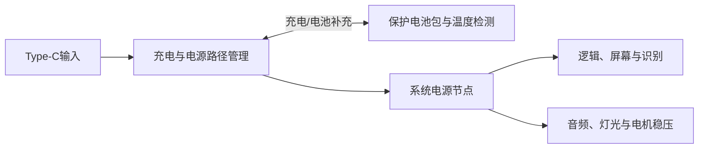

# 电池与电源专项

对应 F09。用户要求内置较大容量电池、Type-C插入时同时使用和充电、续航尽量长。容量和时长不能在实测前承诺。

## 电源路径

优先比较带Power Path的单节锂电充电管理、电池保护、温度检测、系统稳压、电量检测和Type-C输入。BQ25895是候选示例，不是定稿；普通TP4056加电池直接带负载不能作为边充边用证据。功放、电机和灯光的峰值负载必须纳入预算，不能从开发板3.3 V输出取电。

## 验证顺序

在预期播放、屏幕、灯光和运动负载下测试插拔Type-C不重启/不断音、同时使用和充电、输入功率不足、电池补充、充满结束、低电处理、保护和温升。分别记录平均与峰值电流、充电时间、容量、实际尺寸、重量和完整放电时长。输入CC、电流能力、NTC与电芯资料需要逐项核对；需要PD时另行比较。

## 取舍

续航尽量长与整体不要太大、音质不能牺牲存在直接空间和重量取舍。应同时展示电池容量、质量、尺寸、声音/灯光/屏幕功耗和费用，让用户在实测数据基础上决定，不用标称容量替代验收。
