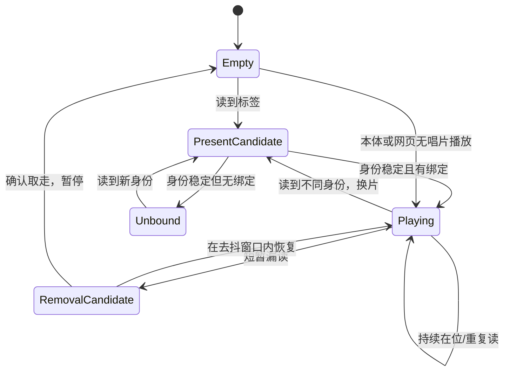

# 唱片挂件与身份识别专项

对应 F02、F10。这里统一负责挂件实体、身份识别、在位/取走判断、换片去抖、内容绑定与播放触发；不能把“读到标签”直接等同于“唱片仍在位”。

## 已确认体验

- 三类常规唱片对应可重设的内容；另只保留一张生日唱片和一个生日菜单入口。
- 小唱片为无源挂件，插入或表面放置均可；当前推荐静止浅凹座或半露浅槽，避开大唱片运动区。
- 放入已绑定唱片即播放，取走暂停，换片播放新绑定内容；同一张持续在位不重复启动。无唱片仍可从本体或网页播放。

## 必须区分的状态

识别设计至少要区分：新身份、持续在位、短暂漏读、确认取走、换片、未绑定、绑定内容缺失。短暂漏读不应立即暂停；持续未读也不能在没有确认在位机制时把无唱片播放误停。状态机、超时和线圈位置随器件和壳厚实测确定。

## 原型与证据

先用PN532或库存中准确型号的NFC/RFID模块、三张常规标签、一张生日标签和一张未绑定测试标签，在拟定标签壳厚、线圈、扬声器磁体、电机和金属件同时存在的台架上测试。每张已绑定标签建议取放20次，记录识别距离、响应时间、漏读、误切和停留不重复触发；这是建议标准，不是已通过结果。

挂扣、标签、唱片图案和卡座要一起设计，挂件脱离本体后仍能安全携带。生日内容复用同一绑定机制，不能在公开规划中加入私人日期或人物背景。
