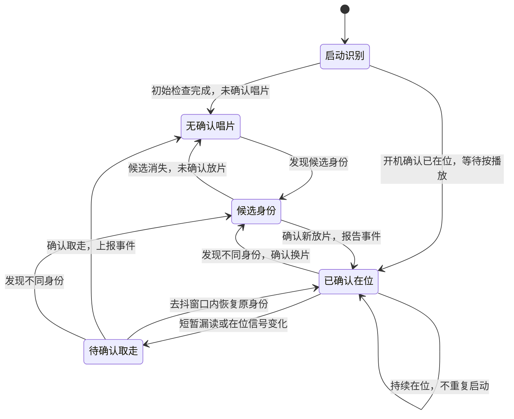
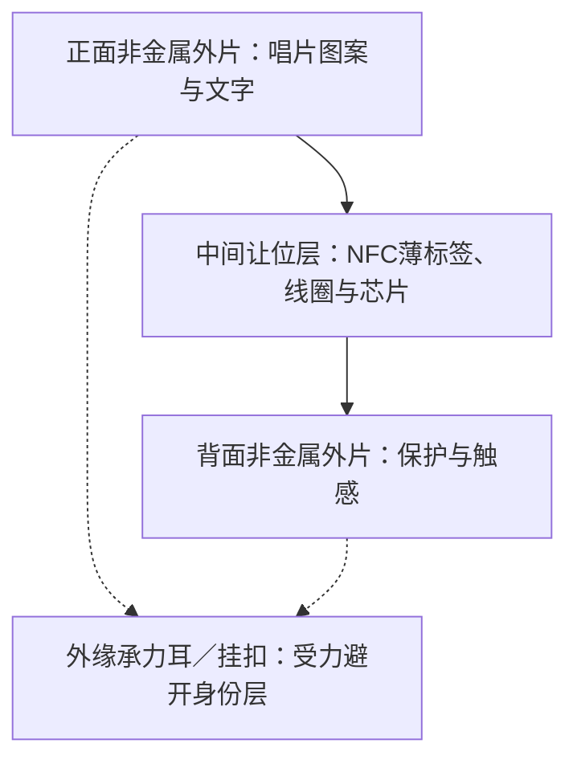
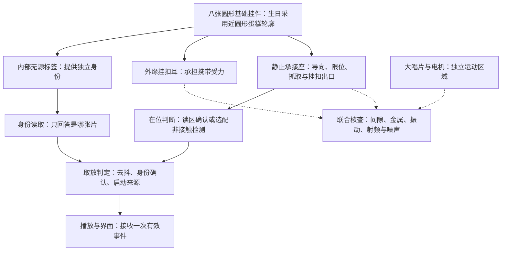

# 唱片挂件与身份识别专项

对应 F02、F10。本页负责标签兼容、身份识别、在位/取走判断、换片去抖、内容绑定与播放触发；实体、封装和挂扣细规格由[挂件专项](../charms/README.md)维护。不能把“读到标签”直接等同于“唱片仍在位”。

## 已确认体验

- 首批共八张以圆形为基础的卡片：邓紫棋、汪苏泷各一张，通用1–5各一张，以及生日0一张；D065将生日卡细化为近圆形蛋糕轮廓，仍只有一张卡和一个菜单入口。可见编号不等于电子身份，具体图案与封装见挂件专项。
- 小唱片可挂在书包上，插入或表面放置均可；采用无电池的NFC或类似电磁感应技术，具体标签、读卡器及承接结构仍待验证，对应D058。
- 唱片按D066–D069分为A单曲点播（取走继续）、B驻留模式（确认取走停止清空）、C锁存模式（取走继续）。B/C音乐循环，持续在位不重复触发，没放片仍可从本体/网页播放。
- 开机时唱片已放好，识别后等待按播放，不因开机扫描而自动播放；正常运行后新放片仍立即播放，对应D052。
- 每个挂件具有自己的编号，编号可关联不同歌曲、歌手对应的歌单或已纳入范围的模式；身份识别按电磁感应方向调研，不用外形、光学图案或重量编码身份。具体标签与读卡器仍待验证。
- 全部以圆形为基础设计图案，生日卡依D065细化为近圆形蛋糕轮廓，通用卡造型为小唱片；不同卡片可使用不同材质。多个外壳方案并行规划，两张歌手卡和0号生日卡尤其重视好看与耐用；具体材质尚未定稿。

### 2026-10-09：ABC现行产品行为

下文历史技术比较中的“A NFC / B触点 / C光学”是**身份读取技术路线**，与此处A/B/C三种**唱片行为类型**不同，不可混淆。

| 类型 | 有效放入 | 确认取走 | 其他规则 |
|---|---|---|---|
| A 单曲点播 | 播放本体映射的单首歌曲 | 继续播放 | 同次放置不重复启动 |
| B 驻留模式 | 执行单曲/歌单/特殊行为模式 | 退出，停止清空所属播放任务，再放入从模式起点启动 | 音乐循环；手动退出须重新真取放 |
| C 锁存模式 | 执行单曲/歌单/特殊行为模式 | 模式继续运行 | 音乐循环；手动退出须重新真取放 |

有效新A及本体/网页主动选择其他歌曲，先退出旧B/C；调音量、暂停、模式内切歌不退出。标签仅给数字身份，ABC和目标由本体管理；灯光独立、实体控件未定稿。开机已有片仍先识别等待显式启动。

识别层只报告可信物理事件，不直接控制音频。建议对每次有效放置使用`placement_id`，对行为会话使用`session_id`。纯NFC能否同时满足快速退出和低误判必须实测，若无法可靠区分漏读与离座再比较独立在位检测；参数/器件尚未冻结。

## RC-03A · 第二轮NFC读卡与离座原型选型（2026-10-09）

**状态：P1候选收敛、试验方案可审阅；无本项目采购、接线、编译、烧录或实测。** 此处仅提出P2原型暂选，不分配新D编号、不冻结成品器件/天线/卡座/去抖阈值。A/B/C依D066–D070表示产品行为，不能与下面历史“身份读取技术A/B/C”混淆。

### 选型目标与结论

本体在**可信新放置**后按电子身份查ABC行为，A取走续播，B真实取走须快速退出并停止清空播放任务，C取走仍运行。单次寻卡失败不能冒充离座；读卡器故障、邻片串读、真实放入与半落座必须区别。原型重点不是最大读取距离，而是**可控读区、足够快且可判定的进/离座事件**。

**主验证候选：ELECHOUSE PN7160 MINI V1 — I2C，订货号`PN7160_MINI_I2C`。** 采用NXP在产PN7160，板体标称26.937×20.066 mm、最大模块厚5.5 mm，配50×40 mm和25×10 mm两种10 cm外接天线（每次只能连接一副）；支持13.56 MHz及NFC-A/ISO14443A。3.3–5.5 V模块供电，但I2C/IRQ/VEN只能接3.3 V逻辑。官方给ESP32-S3 Arduino-ESP32示例，未证明ESP-IDF或S31工程运行。[R03-01][R03-02][R03-03]

**对照/回退：DFRobot Gravity DFR0231-H（PN532）。** 大天线110×50 mm板体，I2C或UART，模块3.3–5.5 V供电、逻辑0–3.3 V；适合隔离NCI软件移植失败与射频识别失败，但大天线不能代表成品小卡座读区。NXP明确将PN532标为NRND并推荐PN7160，因而不得默认作为S31成品器件。[R03-04][R03-05] 若主方案无法按期跑通先排查NCI/供电与库版本，必要时才启用此对照，不要求同时采购两套。

**后续产品比较对象**为PN7160不同天线/模块实现；若主验证仍有读区与响应瓶颈，可按证据评估其他可控RF前端。不凭标签商品标称“读距更远”认定更优，正式S31接口、器件与天线匹配需迁移后重新验证。

### 原型硬件、软件与资源清单

| 项目 | 推荐的可复现基线 | 仍缺的证据或条件 |
|---|---|---|
| 主控 | 共用主控专项拟议S3 DevKitC-1-N8R8 v1.1，独立台架受控供电 | 确认真实板/模组后缀、Flash/PSRAM、固定SDK；不能将厂商ESP32-S3 SuperMini示例GPIO直接套给DevKitC |
| NFC主板 | `PN7160_MINI_I2C`×1，供电先试3.3 V、3.3 V逻辑 | 6芯1.25 mm匹配排线需另配；上电/射频峰值、国内价格与准确交期待核 |
| NFC读区 | 随模块附带25×10 mm、50×40 mm各1副、线长10 cm，分别单独测试 | 小天线不保证够读，小/大天线都不能直接等于成品尺寸；记录线圈朝向、连接器与线缆净空 |
| 无源标签 | NTAG213、ISO/IEC 14443A / NFC Forum Type 2作身份基线；初试可用Adafruit #4032（40×25 mm） | 该矩形样品只验证协议，**不能**代替20/25/30 mm完整小圆标签封装试验；需核标签完整外径、线圈、芯片凸起及国内小批现货 |
| 样本配置 | 8个不同电子身份（对应8张正式卡的测试身份）＋1个未绑定身份；另留可更换外壳/挂扣/金属隔距件 | 最终卡的ABC角色可由本体配置做交叉测试，不根据图案固定ABC；未绑定样本不占8张名额 |
| 测量 | 单调时钟日志、独立物理取放真值（同步视频或测试夹具传感器）、可调0/1/2/3 mm非金属间隔、可靠供电与电流测量 | 必须记录实际物理动作到事件/音频动作的时间；仅软件日志无法证明真实离座延迟 |

MINI接口为6P：SDA、SCL、IRQ、VEN、VCC、GND；7位I2C默认地址`0x28`，板载SDA/SCL各4.7 kΩ上拉，厂商建议400 kHz，可先按100/400 kHz分别核对共用I2C。IRQ表示NCI数据待主机读取，**不等于物理唱片在位传感器**。建议VEN由主控可恢复的直连GPIO控制（总线被拉低时不能依赖同一I2C扩展器复位NFC）；IRQ另需GPIO，后者已在当前平台资源草案计入。正式GPIO由主控专项统配。[R03-02]

MINI官方ESP32-S3入门样例使用的库为ELECHOUSE `ELECHOUSE_PN7150_PN7160` 3.1.3，资料注明源码修订`a9c0f71`；样例GPIO8/9/4/5仅属于该参考板，不能作为本项目接线表。先在独立小工程重现NCI连接、配置、开始发现、UID报告、离卡后再次发现和失败恢复；之后评估ESP-IDF组件化及S31编译、缓存/任务资源。Arduino示例与本项目IDF固件之间不能画等号。[R03-03]

厂商MINI参考：5 V供电且有卡时小/大天线平均电流约67/108 mA，模块推荐供电能力至少300 mA，启动/峰值未给出；这不是3.3 V原型的实测，也不是整机功耗。先用有独立限流和测流能力的3.3 V支路验证，不默认开发板3V3引脚可无条件负担NFC和其他负载。[R03-02]

### 当前可核对的报价和采购缺口

查询日：2026-10-09。价格仅为查询时公开商品页面标价，非订单、人民币到手价或批准BOM。

| 条目 | 已读页面与标价 | 完整费用/适用性边界 |
|---|---|---|
| 主候选PN7160 MINI V1，`PN7160_MINI_I2C` | ELECHOUSE US$29.80/件；页面显示可订购[R03-01] | 未取得国内1件含税运、6P排线、交期或本地替代报价；价格不直接按汇率折人民币 |
| NTAG213矩形对照标签，Adafruit #4032 | US$2.95/件，40×25 mm，7字节UID[R03-06] | 不代表小圆标签。对20/25/30 mm完整圆标签另找准确NTAG213供应商与报价 |
| 对照PN532 `DFR0231-H` | DFRobot中国官方页￥159/件，商品页显示有货[R03-04] | 110×50 mm大板，仅做必要时的诊断台架，不能代替紧凑成品天线 |
| 低价标签身份格式对照，DFRobot `FIT0313` | 中国官方页￥3/件，MIFARE S50、4字节ID[R03-07] | 不是NTAG213，也不是最终挂件默认芯片；用于验证UID长度与标签类别处理，不偷换9张主样品 |

**材料审阅门槛：** 主模块与匹配线束、电源/电平要求、至少9个可区分的主样本UID、圆片标签的真实包络、最少一副可调整卡座、测量工具、分项国内费用/渠道缺口和软件固定版本均具备再考虑采购；未获用户费用批准不下单。标签的4字节/7字节原始身份须连同技术类型和长度保存；UID用于选择内容，不承担防复制认证。

### 纯NFC识别与离座状态机制：原型验证提案

1. `BOOT_CENSUS`：开机或读卡器恢复做身份盘点，不自动触发ABC，沿用D052显式启动要求。
2. `EMPTY`→`CANDIDATE_INSERT`：只有稳定、可归属卡座的身份才可确认放片；读到附近UID、悬空标签或半落座不等于完成放片。
3. `PRESENT`：本次放置仅生成一次`CARD_INSERTED`及`placement_id`；重复读同UID不得重播，B/C手动退出后本次在位继续锁住自动触发资格。
4. `SUSPECT_REMOVAL`：短暂读不到进入观察，不调用B退出；返回原身份即撤销候选。持续无卡但通信层有故障时转`READER_FAULT`，不能凭故障补发`CARD_REMOVED`。
5. `CONFIRMED_REMOVAL`：必须是读卡器正常且实测通过的离座判据（必要时结合独立座位传感器），只发一次`CARD_REMOVED(placement_id)`；行为控制器据ABC确定A继续/B清空/C保持，旧放置事件不得停止新会话。
6. `SWAP_CANDIDATE` / `IDENTITY_CONFLICT`：持续在位却读到不同UID不能直接当换片；必须有可靠旧片离开、新片落座证据。若纯NFC无法在快换时分辨邻片，先保守拒绝切换并报冲突，再评估独立在位传感器。
7. `READER_FAULT`：记录NCI失联、I2C超时、IRQ异常、恢复次数；按D072，B短时故障继续、超经实测确定的保护阈值后故障退出清空，不伪造取走；读卡器恢复后不得因原UID再出现而自动重启，须确认真实空座与重新放入。具体阈值和可信证据待实测。

**时序与测量建议**：以25/50/100 ms作为事件观察/调度起始扫描候选，具体NCI发现周期和超时由驱动实际测量，而非宣称这些周期已经能稳定实现；在真实设备上记录单次读取和最坏等待时间。目标取自原T02：身份确认≤500 ms，放片到出声≤1 s，B确认物理取走到停止≤500 ms；关注p50/p95/最慢值及误触发次数。初始去抖窗口必须来自真实在位连续漏读长度与物理离座时延统计，不照搬独立传感器分支的300 ms。

### P2试验顺序（尚未执行）

| 关卡 | 操作/变量 | 需要记录的结果 |
|---|---|---|
| N0 接口与恢复 | 板型/固件版本/3.3V电平、两天线分别测试；断开/恢复NFC；NCI初始化与复位 | UID正确、读卡器故障与正常无卡区分；VEN恢复后不会将持续在位误作新放片 |
| N1 身份矩阵 | 8个已映射UID+1个未绑定；NTAG213对照与S50可选对照；重启/重复读取 | 技术类型、字节长度、原始值不混淆；0号正常，未绑定不触发默认行为 |
| N2 读区与几何 | 两副读卡天线×圆标签尺寸20/25/30 mm（如已取样）×新增0/1/2/3 mm间隔，随后测试偏心、倾斜、双面与半落座 | 真实线圈总间距、正确读区边界、误读悬空/邻片；找出最难读及最易串读组合 |
| N3 B型长期在位与取走 | 固定实物至少30 min、轻晃/挂扣摆动；实际取放与注入50/100/200 ms短时失联分别测试 | 0重复放片/0误退出；真实取走到退出的延迟分布，读卡器故障不算取走 |
| N4 快换与ABC行为 | A→B、B→C、C→A、手动退出再取放、读卡器恢复、网页主动点歌后旧事件 | 正常可信换片只执行新动作一次，未绑定/邻片不错误打断旧模式；旧事件不影响新会话 |
| N5 整机干扰与功耗 | 加外壳/软带/金属扣、扬声器占位、电池占位，电机启停、Wi-Fi上传，分别对比空座寻卡、在位、异常重试 | 误判与最差延时，平均/峰值电流及持续时间、内存/I2C占用；信号与机械干扰分开定位 |
| N6 扩展T02 | 八张卡各建议20次取放，共160次；两类卡座在可替换试样上做有代表性的对照 | 建议160/160正确、0误身份/误触发、0持续在位重启，完整失败样本留痕；不是长期可靠性统计保证 |

**分支准入规则：** 先检验两种天线/摆位是否满足B，若读区太大可比较小天线/调整线圈与机械限位；若读区不稳定先优化厚度、平行度、金属净空、RF配置和驱动耗时。只有仍无法将真实离座与短漏读可靠区分时，才进入“额外在位传感器”对照。浅座可比较短距离反射/遮光，插槽可比较有明确行程的光电遮断或低动作力方案；无论哪类均须验证不同颜色/透明度、灰尘、轻片和偏放，不以器件标称宣称通过。新传感器仅用于确认在位，不能替代电子身份读取。

### 联合交接与后续决策门槛

- **主控RC-01**：现有S3共享I2C+IRQ草案适用；MINI额外需要可独立恢复的VEN信号，若主控直连须额外扣1路GPIO并核对GPIO/I2C地址冲突、板级3.3V支路以及S31移植。不要照抄厂商SuperMini示例引脚。
- **挂件/结构RC-04**：原20–32 mm标签占位是概念范围；要以实际购买的标签完整基材、芯片厚度、两副读卡天线各自尺寸和线缆空间更新浅座/插槽。大唱片仍平放，挂扣不得进入运动区。
- **音频/网页RC-05**：识别只提供已确认事件，音频异步执行B清空/ABC切换；测试NCI重试、I2C共享占用与音频/上传并发，不允许为了稳NFC暂停音乐。
- **电源**：按真实供电与两天线、空座/在位/重试状态记录峰值；不用厂商5 V单场景平均电流推导3.3 V整机续航。
- **总规划决策门槛**：当前只提出暂选`PN7160_MINI_I2C`作为P2首试，需批准器件/费用后实施。待实测才能决定纯NFC是否足够、是否增设独立在位检测、成品读卡芯片/线圈以及最终卡座。

### 本轮新增可核对来源（2026-10-09）

- [R03-01] [ELECHOUSE PN7160 MINI V1商品页](https://www.elechouse.com/product/pn7160-mini-v1-i2c/)：订货号、两副天线、US$29.80页面标价、线束不包含及供货展示。
- [R03-02] [PN7160 MINI在线数据手册](https://www.elechouse.com/docs/pn7160-mini-v1-i2c/datasheet.html)：机械包络、接口地址/上拉、供电/电流、读距的特定测试条件。
- [R03-03] [MINI ESP32-S3接入指南](https://www.elechouse.com/docs/pn7160-mini-v1-i2c/quick-start.html)：示例引脚、Arduino环境、3.3V供电、ELECHOUSE库3.1.3及源码修订号；不代表本项目编译或ESP-IDF移植通过。
- [R03-04] [DFRobot DFR0231-H中国商品页](https://www.dfrobot.com.cn/goods-2029.html)及[模块Wiki](https://wiki.dfrobot.com/dfr0231-h/)：PN532、110×50 mm、I2C/UART、￥159页面标价与规格。
- [R03-05] [NXP PN532原厂状态](https://www.nxp.com/products/PN5321A3HN)及[PN7160产品页](https://www.nxp.com/products/PN7160)：PN532为NRND，新设计优先PN7160；产品状态不是成品电路通过证据。
- [R03-06] [NXP NTAG213/215/216原厂介绍](https://www.nxp.com/products/NTAG213_215_216)及[Adafruit NTAG213 #4032](https://www.adafruit.com/product/4032)：14443A/Type2标签、矩形样品/7字节UID及商品公开报价。
- [R03-07] [DFRobot FIT0313中国商品页](https://www.dfrobot.com.cn/goods-953.html)：￥3页面标价、MIFARE S50；不是NTAG213圆标签。
- [R03-08] [NXP PN532应用说明AN133910](https://www.nxp.com/docs/en/nxp/application-notes/AN133910.pdf)，第35页：PN532被动寻卡默认可能连续重试，须配置`RFConfiguration`限制重试/有界响应；仅在启用PN532诊断分支时适用。

## 2026-10-09 · 嘉立创开源广场相似工程与优先复用评估（RC-03A补充）

**规划判断：先核验他人可复现的整机参考，再决定RC-03B的实际读卡器、材料及实现顺序，不直接采购PN7160，也不改动已确认ABC产品行为。** 这与2026-10-09上文的PN7160 MINI原型推荐并不矛盾：该推荐仍保留为技术候选，**不再视为未经现成工程对照就应直接购买的唯一首试路线**。检索日期2026-10-09，来源为开源广场公开的项目介绍、附件列表及部分公开GitHub材料；未登录逐张核对在线EDA图页，未取得并解压相关固件ZIP、未编译或烧录，以下不能称作已复现。

| 工程 / 更新日期 / 声明许可 | 已查到的真实材料与作者说明 | 对Record Companion的价值及限制 |
|---|---|---|
| [卡片音乐播放器-终极版](https://oshwhub.com/lueer/card-music-player-ultimate-editi)，lueer；2024-12-25；GPL-3.0并有“未经授权禁止转载”标注 | ESP32-WROOM-32E、RC522、SD、PCM5102A＋PAM8403；作者说明Arduino IDE程序、SD卡网页资源、AP/STA设置，并称支持网页写入NFC。程序与附件实际内容尚未取得；不能声称编译或源代码质量已经验证 | **优先核实源工程与网页资源**：最接近“NFC＋本体歌曲＋网页”的完整运行结构；原型ESP32版本、音频电路、默认网络配置均不可原样套入S3/S31；网页修改NFC内容不符合“实体只给身份、本体解释ABC”的产品规则 |
| [NFC唱片机](https://oshwhub.com/yio-lab/record-player)，yio-lab；2025-12-12；GPL-3.0并有转载限制标注 | ESP32-WROOM-32E＋RC522＋SD＋MAX98357，作者展示实体、唱片感应、音量及电机，软件思路为读取标签内歌曲关键词找SD曲目；页面未见可复核的完整BOM或可直接编译源码 | **优先作模块接线与分工参考**：I2S数字功放更贴近当前两路MAX98357音频候选；但其标签关键词方案、现有操作件和转动结构不能当ABC/本体身份映射的成品实现 |
| [Minecraft我的世界唱片机](https://oshwhub.com/lo_startnet/project_zqmulhqj)，lo_startnet；2026-06-10；CERN-OHL-S-2.0并有转载限制标注 | STM32F103RCT6＋RC522(SPI)＋SDIO＋HT513(I2S)，公开附件列表含`JukeBox.zip`工程、固件、3Dobj.zip及工具脚本；作者描述NFC wake检测、裸机状态机、取放玩法，报告FatFs目录扫描HardFault和拨轮响应慢等缺陷 | **重点借鉴事件检测、故障记录与结构样片**；其MCU、单声道、在标签写入歌曲名/自定义NDEF与本项目不同，STM32固件不能直接烧入S3，所述wake轮询不保证B型取走快速可靠 |
| [北极熊NFC唱片机](https://oshwhub.com/yurix/project_nfhqsyjx)，yurix；2026-05-19；GPL-3.0并有转载限制标注 | STC15W408AS＋RC522读UID＋DFPlayer Mini串口音频，公开附件列表含`NFC唱片机程序.zip`、打印文件、器件购买清单；作者说明不同UID映射歌曲文件夹，也报告低价RC522模块一致性差 | **借鉴“UID仅识别身份→本体选内容”和实物取放布局**，不复用51固件、单声道DFPlayer或将作者的充电模块直接视为满足本项目边充边用 |
| [[已验证]PN7160 RFID/NFC调试器](https://oshwhub.com/19e2k67/nfc-pn7160-du-ka-qi-rfid-3-3v)，19e2k67；2026-08-03；GPL-3.0 | 作者称已打板验证；公开链接指向[硬件设计GitHub](https://github.com/zerobinhi/NFC-RFID-Reader-Design)与示例。已读到该仓库`PN7160/说明.md`的天线参数、`PN7160/software/SW6705.zip`文件名；**未解压ZIP/核对EDA网络、天线射频实测或ESP32-S3固件可编译性** | **PN7160后续硬件/天线参考**，不是完整ESP32音乐播放器；作者填报复刻成本约￥30，不是本项目已核对的采购报价 |

**复用范围分层**：第一优先是能读取的原理图/PCB与源代码、SDK版本、SD网页资源；其次是NFC→内容选择→I2S音频链路、状态机组织、异常记录及可加工结构；作者展示的功能、价格、续航和“已验证”仅属于作者条件。本项目仍需自行建立A/B/C语义、B真离座与误判控制、左右独立声道、S3→S31迁移以及D054上传不中断的试验证据。

**真实可复用性尚需补齐**：各工程页面普遍出现在线原理图未生成预览、BOM暂无的情况；附录ZIP文件名可见不代表源码已取得、完整或可编译。下阶段先检查附件实际字节/EDA可编辑原理图、PCB、BOM、源码及其依赖、许可证与公开授权；若无法读到，降为思路参考而非“可直接复刻”基线。部分页面同时标注开源许可、“未经作者授权禁止转载”和平台学习研究/非商用说明，公开分支当前**只记录链接与事实，不复制第三方程序、PCB、图片或私有素材**；正式再发布前须厘清许可/授权与署名。

### 据此调整RC-03B推进顺序（本轮规划，不代表代码/硬件已实施）

1. **R0留未来main主线执行，当前分支只保存任务目标**：将“卡片音乐播放器-终极版”Arduino/SD网页与EDA、“Minecraft我的世界唱片机”`JukeBox.zip`/结构、“北极熊”UID与PN7160参考的真实源码、依赖、许可、可复现性列为后续实施审查；不要求在当前产品逻辑规划阶段下载ZIP或编译，更不直接更改main。
2. **R1最小链路**：沿用已确认S3模块验证平台，优先借鉴完整工程来完成“UID→本体临时映射→选择单曲→SD读取→I2S发声”的模块原型，不直接复制ESP32-WROOM或STM32的GPIO、音频输出、电源和固件目标。保留本项目左右声道与D054并发要求作为后续联合门槛。
3. **R2检测路线筛选**：若RC522相关代码/模块易于验证，则把RC522作为**基线实物对照**，与已研究的PN7160 MINI候选比较同一标签、两种卡座、真实取放响应、连续漏读、邻片串读、故障恢复及GPIO/供电成本。不能仅因现成作品使用RC522就宣布其能可靠退出B，亦不能因为PN7160更新就认定其必然更好；不同时无目的采购多套芯片。
4. **R3 ABC与整机联合**：在R1与R2证据基础上接入`placement_id`/`session_id`事件与A/B/C模式，复测B取走停止清空、C取走保持、手动退出须重新取放和网页主动点歌接管。只有纯NFC的误判/延迟测试不过，才比较独立在位传感器；仍不直接启动成品主板。
5. **放行条件**：至少一套工程的可编辑电路/实际源码经过检查，或明确记录获取失败后采用官方驱动最小例程；准确S3板型、接口、电平、标签尺寸/版号、国内可购费用、实测计划和许可范围可审阅后，再让实现对话开展模块制作。用户未批准时不采购。

### 2026-10-09补充复用结论：不将PN7160暂选误认为最终方案

新增可读源工程的详情及许可证见[参考工程登记](../../references/sources.md#2026-10-09--nfc唱片机与实体音乐播放器参考工程登记)。从**实际源码**发现：GH-01读取间隔2000ms且无卡就停止播放，不能满足本项目B低延迟/抗漏读；GH-02有UID映射与网页模块，但使用`PICC_IsNewCardPresent()`的连续在位判断需要核对。作者工程展示“刷卡播歌”并不等同于本项目在浅座/插槽真实落座、快速取走、故障区分、ABC重放与S3/S31并发得到验证。

RC-03B现在优先准备**可复现源工程检查与两读卡链路的接口对照**，再按成本与测量能力选择一套首试；RC522是低门槛参考，PN7160 MINI仍是技术候选，两者均未冻结/采购。先不套用外部旧GPIO，S3的I2C/SDMMC/I2S/GPIO及USB恢复预算由主控复核。现有正式T02取放、N0–N6试验及ABC产品决策不变，检测参数仍须实物确定。

### RC-05A · NFC物理事实与ABC会话退出的两阶段关系（2026-10-09）

该节仅为行为与检测契约审阅，具体射频时序/去抖均待RC-03B实测。**确认旧B离座**不是“请求切换到新卡”，而是旧B模式自己的强制退出事实；不能因为新卡未绑定或内容缺失，就继续旧B。C本身已锁存，取走后仍运行；在没有有效新请求时，错误/未绑定的新卡不能强行清除C。

| 实际场景 | 检测层必须提供 | 行为控制器的预期及证据层级 |
|---|---|---|
| B正常取走，之后放入未绑定卡 | 可信`REMOVE(placement_B)` + 新卡识别失败 | **已确认规则推导**先结束B并清空任务；未绑定仅反馈，不启动新行为 |
| C取走，之后放入未绑定卡 | C的真实取走、新卡无效 | **建议**C保持运行，新卡不替换；C取走自身不会终止模式 |
| B旁边有另一卡被误读 | 稳定单座证据不足/多UID冲突 | **建议**不伪造旧B取走、新卡放入，不因邻片临时读到而切歌 |
| B快速换C，空座瞬间短于普通窗口 | 可信原B离开与新C占位/更替证据 | **建议**可以组成原B离座→新C放入两个原子序列；无离座证据不能仅凭UID变更“推理成功” |
| C已锁存运行、同片取走后再次放入 | 新物理placement_id但原C会话仍活动 | D071确认：不重新触发，不改变当前进度或音频停止状态，特殊行为不再重复执行 |
| B已被网页主动点歌退出，B之后取走 | 真实旧放置的确认取走 | **已确认的控制权原则**只能更新物理层；因B会话已关闭，不停止网页歌曲 |
| NFC读卡失败或硬件通信故障 | 将CARD_UNCERTAIN/READER_FAULT与可信无卡分离 | D072确认：短故障继续B并尝试恢复，长故障超阈值保护退出清空，提示故障，恢复后先确认真实空座再放入才可自动激活 |

推荐事件契约至少包含`event_seq`、`placement_id`、`card_id`或完整技术UID、来源`BOOT/RUNTIME`、检测证据级别和单调时间；每次稳定新放置一编号，真正离座后再允许自动重新激活。NFC纯检测是否满足单座换片和B可靠退出仍是**硬件待测事实**，本节不能将候选实现建议写成实测结论。

## 必须区分的状态

识别设计至少要区分：新身份、持续在位、短暂漏读、确认取走、换片、未绑定、绑定内容缺失。短暂漏读不应错误退出B；持续未读也不能在没有确认在位机制时把无唱片播放误停。状态机、超时和识别部件位置随器件与壳厚实测确定。

下图是唱片在位判断的建议草案，与音乐播放状态分开。本体或网页开始无唱片播放时，唱片状态仍为“无确认唱片”；不能因为一直读不到身份而暂停音乐。

## 原型与证据

当前按D058聚焦无电池电磁感应身份识别，推荐先用现成无源NFC标签验证，不再将触点或光学身份编码列为当前并行原型。下文保留其首轮历史对照依据，恢复采用须重新审阅体验取舍；是否额外设置在位传感器仍按误判证据评估。静止浅凹座或无需扣紧的半露插槽继续比较；PN532只是候选示例，不是定稿。

若采用NFC/RFID原型，使用已核对模块、八张对应正式卡片的标签和一张未绑定测试标签，在拟定标签壳厚、线圈、扬声器磁体、电机和金属件同时存在的台架上测试。额外测试标签不计入八张交付卡片。每张已绑定标签建议取放20次，记录识别距离、响应时间、漏读、误切和停留不重复触发；另验证开机已有片等待显式启动，正常取放按D066–D069分型处理。这些是建议验证项，不是已通过结果。未绑定和内容缺失时给出反馈，具体呈现及播放入口切换细则仍待审阅。

挂扣、标签、唱片图案和卡座要一起设计，挂件脱离本体后仍能安全携带。生日内容复用同一绑定机制，不能在公开规划中加入私人日期或人物背景。

## 首轮细规划：2026-10-08

本轮对应P1候选调研。下文器件/结构/参数是2026-10-08历史建议，现行行为按上文及D066–D070执行；旧D046通用取走暂停不再适用。公开商品页与软件文档已查阅，尚无实物识别、携带、功耗或取放试验结果。按D059以新识别模块与标签选型推进，不依赖全面库存盘点；按D060，后续挂件外观、封装、挂扣和制造细规格由[挂件专项](../charms/README.md)维护，本页保留初轮比较与识别接口输入。

推荐先验证无源NFC标签的电磁感应识别，用标签芯片的UID区分每个挂件。标签能封在挂件内部，身份与外形、正面图案及重量分开，符合本轮补充的方向。取走判断先验证限定读区与连续读取/失联确认；是否需要额外非接触在位检测由实际漏读与误判证据决定，不预设机械开关为必需。读卡线圈占位、轮询耗电和金属附近的可靠性仍需实测。PN532仅作为有公开资料的原型参照，最终读卡器、标签尺寸及是否进入主板尚未选择。

### 本轮补充：电磁感应与独立编号

用户表达的要求是每个挂件有自己的编号、编号能绑定不同内容，并倾向NFC或线圈式感应，不用物理外形、光学或重量判断身份。当前技术建议为“无源NFC标签＋设备端绑定表”；是否采用无源标签及具体型号仍待原型确认。

无源NFC标签包含线圈与芯片：本体读卡线圈产生交变磁场，挂件线圈感应取电，芯片返回自己的数字身份。挂件无需独立电池，本体读卡器需要供电。普通磁铁或磁环只能提供磁响应，本身不具有可读数字编号；这里的独立编号由标签芯片提供。

最新首批配置如下，替代此前四张概念样品和R01–R04的示意。0、1–5是卡面/界面的可见编号，实际识别保存每张芯片独立的原始UID。两张歌手卡按名称区分，可见编号尚未另行指定。歌手绑定由对应的本地歌单承接，同一个UID可以重新绑定；“模式”限定在整机已审阅的功能范围内。

| 卡片 | 数量 | 用户已明确的外观要求 | 内容绑定建议 |
|---|---|---|---|
| 邓紫棋卡 | 1 | 圆形起稿，好看且耐用 | 邓紫棋本地歌单 |
| 汪苏泷卡 | 1 | 圆形起稿，好看且耐用 | 汪苏泷本地歌单 |
| 通用卡1、2、3、4、5 | 5，每个编号一张 | 圆形小唱片，分别标1–5；材质可不同 | 各自独立绑定歌曲、歌单或已审阅模式 |
| 生日卡0 | 1 | 圆形起稿，标0，好看且耐用 | 唯一生日内容条目，与生日菜单入口共用 |

可见编号0是正常生日卡标识，不能作为“未绑定”“无唱片”或错误哨兵；这些状态单独表达。通用卡1–5分别有自己的UID和绑定，不能只因同属通用类就共用一个识别身份。

浅凹表放与不扣紧插槽都可以采用这一身份方法，外形只负责承接、定位与携带。需要验证线圈方向、总间距及邻近挂件串读；仅靠一次未读到UID不能认定取走。开机扫描迟到或读卡器恢复时先盘点并等待按播放，不把重新发现原有片当作运行时新放片。

### 编号绑定还是标签保存内容信息

推荐“读UID，设备查绑定表”。每个挂件提供稳定身份，本体把身份关联到本地内容ID或已审阅模式；切换编号对应内容仍使用同一个播放器，不需要为每张片另做一套播放程序。标签芯片的工厂UID和卡面/界面显示的0、1–5等编号分开维护。

| 比较项 | 只读取UID，本体保存绑定，推荐 | 标签写入歌曲名/内容信息 |
|---|---|---|
| 挂件保存什么 | 使用芯片已有UID，应用不必写用户存储区 | 写入少量名称、内容标识或约定记录，可采用NDEF等格式 |
| 修改歌曲或歌单 | 从本体或网页修改绑定，挂件保持不变 | 如果标签直接指定目标，换目标需重写标签；若仍由本体解释标识，就又需要本体映射 |
| 文件/歌单改名 | 绑定到稳定内容ID，由本体目录解析名称 | 直接用名字或路径定位会遇到重名、改名及目录变化，需要额外规则 |
| 换另一台本体 | 在新本体重新绑定或导入对应配置 | 挂件携带目标信息，但另一台仍须具备兼容规则及相应本地内容 |
| 软件与调试 | UID读取、统一绑定保存和错误反馈即可 | 另需写标签流程、数据格式/版本、读写失败与记录校验 |
| 适用判断 | 当前单台本地播放器、内容可重设的优先方案 | 有明确跨设备携带内容标识需求时再评审，当前不作为默认 |

两种方案的音乐文件都存在本体，挂件仅提供身份或少量文字。S02的NTAG213示例有144字节用户存储，但当前没有必要把歌名写入其中。可读名称来自本体绑定记录；歌曲、歌单或模式不会因标签存储区空白而不能绑定。

当前感应方案建议明确到“无源13.56 MHz NFC，优先ISO/IEC 14443A、NFC Forum Type 2标签”：挂件由感应场取电，芯片返回UID；NTAG213类标签是候选示例，读卡芯片、模块版号与具体天线尺寸仍待原型。此处是方案建议，不新增已批准器件，也不把普通磁铁/磁环作为编号载体。

### 需求覆盖与缺口

| 项目 | 已确认要求 | 本轮建议与待核实项 |
|---|---|---|
| 唱片种类与数量 | 邓紫棋、汪苏泷各一张，通用1–5共五张，生日0一张；共八张，生日菜单仍仅一个 | 八张身份与绑定分别核对，另用一张未绑定测试片；图案与材质不决定身份 |
| 携带与取放 | 可挂书包；插入或表放均可，尺寸未定 | 比较静止浅凹座与半露浅槽；重量、厚度、抓取余量、挂扣手感需样品比较 |
| ABC触发 | 运行中放片按本体ABC映射执行；A取走继续、B取走清空、C取走保持，持续在位不重触发 | 身份识别与在位判断分离，确认新放置才发送一次有效事件 |
| 开机 | 已放好的唱片先识别，等待按播放 | 开机盘点与运行时取放使用不同事件来源；延迟识别成功也不能把开机原有片当作新放片 |
| 无片播放 | 无唱片可从本体或网页播放 | 从未确认有片时，空座、未读到身份、读卡器故障均不能产生取走暂停 |
| 离线绑定 | 本体离线覆盖基本全部首版功能；网页也可管理 | 建议离线选择当前唱片与本地歌曲/歌单；具体操作映射交显示、网络和总规划评审 |
| 异常与入口切换 | 有效新A、本体/网页主动选其他歌曲先退出B/C；未绑定或内容缺失仍反馈 | 失败回退策略尚待审阅，不能任意触发默认模式 |
| 结构、电源与成本 | 整体紧凑、续航尽量长，先模块后选型 | 承接区与大唱片运动关系、壳厚、线圈净空、检测方式、实际电流及国内报价待核实 |

### 三条适用路线

比较的是完整身份路线；每条路线都另行判断是否真正落座。这里的价格是下面来源表中具体商品的公开参考价，不是国内到手价、最终BOM或批准采购。

本轮方向已聚焦A的电磁身份识别。B/C保留首轮比较依据，不作为当前并列推荐；重新采用触点或光学身份需另行审阅体验取舍。

| 比较项 | A：无源13.56 MHz近场标签 | B：触点编码 | C：静态反射光学编码 |
|---|---|---|---|
| 身份能力 | 以ISO/IEC 14443A、NTAG213类标签的UID作为原型身份；标签不存歌曲 | 建议4位数据＋1位校验＋公共端，共6个触点；保留无效码后足够区分八张唱片与测试片 | 背面4位黑白数据＋1位校验，5路反射传感器同时读；定向落座，无需相机 |
| 挂件侧 | 封装标签/线圈，无电池；主机维护UID与内容的映射，首版不要求写标签 | 编码导电片或小板，无电池；暴露或凹入触点，需接触压力 | 原创编码图案与保护面，无电池；可见黑色未必在红外下吸光，要测实际油墨与覆膜 |
| 主机侧示例 | PN532现成读卡板、匹配标签、独立在位传感器 | 弹簧触点、定位座、独立在位开关；无专用解码芯片要求 | QTR-1A类反射模块、遮光定位结构、独立在位传感器 |
| 尺寸依据 | S01读卡板、S02贴纸页有尺寸异常，见来源表；小圆标签与紧凑读卡模块尺寸待核实，不能按芯片封装推定整机空间 | S03探针本体直径1 mm、触头1.5 mm、未压缩长16.5 mm/压缩长14.5 mm；这款偏测试夹具，成品短针及总弹力另选 | S05单路裸板约7.62×12.7×2.54 mm；5路阵列加间隙、遮光、连接器另占空间 |
| 功耗依据 | 挂件无源；读卡板射频开启、寻卡、关闭场及休眠的实测电流待核。不能由芯片休眠值推定带稳压器/指示灯模块功耗 | 挂件无源；主要来自上拉导通、采样和在位检测，取决于阻值及占空比，尚无实测 | S05在5 V时单路17 mA，5路同时开约85 mA，仅为规格加和；间歇供电后的平均电流和响应待测 |
| 壳厚与落座 | 可穿过非金属外壳，但总距离包括两侧壳、胶层、凹座和空气隙；读到悬空标签不等于落座 | 身份触点要可达，壳体不能盖住导电接触面；导向、压缩行程、底部限位决定可靠性 | S05最佳距离约3 mm、建议最大约6 mm；这不是加壳后的识别保证，需光学窗口或露出编码面 |
| 干扰与耐用 | 金属环、金属颜料/覆膜、扬声器钢件、电机和电池附近可能改变线圈匹配或读区；邻近另一张唱片可能串读 | 灰尘、汗液残留、氧化、刮擦、弹簧压力与倾斜可能造成错码；校验不能替代去抖或机械定位 | 日光、桌灯、灰尘、磨损、反光膜及偏斜影响阈值；可用遮光和发光/不发光差分测量，效果待试验 |
| 软件与接口 | S07已有Arduino库，读到UID后由主机绑定；库说明支持I2C/SPI，硬件UART能力不等于该库支持。读卡调用需有界超时，不阻塞音频 | GPIO采样、稳定窗口、校验和无效码处理；无需专用库，仍需核对GPIO数量和输入保护 | 多路ADC或适当数字读出；S08有QTRSensors库与校准支持。S05是5 V模拟输出，不能直接假定兼容3.3 V主控ADC |
| 供货 | S01、S02商品页当日可购；国产兼容板的接口、电平、尺寸、库兼容和渠道报价另核 | S03、S04当日有货；短针、镀层触点、动作力与寿命规格尚未落实 | S06旧单路销售项停售；S05双只装标Active and Preferred且允许缺货下单，现货量与交期仍待询 |
| 最小识别侧参考费用 | S01一块＋S02九张（八张交付＋一张测试）＋S04一只：US$68.00 | S03一包10针＋S04一只：US$9.00，九个编码面等未报价 | S05三包共6块，使用5块＋S04一只：US$18.45，九个编码面等未报价 |
| 适用判断 | 封闭挂件与轻松取放的优先原型；射频/空间/续航不通过时重新比较 | 精确插槽、低功耗优先时的备选；需承担接触磨损与定位成本 | 能遮光、定向、保持表面干净时适用；当前不优先于A/B |

三组费用均不含共用主控、线材、承接结构、挂扣、外壳、运费、税费及改版损耗，币种不作未经核实的人民币换算。A采用有文档的品牌原型板价格，不能据此认定所有近场方案都比B/C贵。进入采购评审前，用同数量、同交付范围的国内模块报价重算；正式主板芯片、天线、外围与封装成本另外评审。

上述小计统一以S04开关台架作参考；表放座若改用遮光检测，检测器费用另询价，不能沿用该小计作为完整方案报价。

13.56 MHz只是频段，不代表任意RFID标签兼容；125 kHz标签不是本路线的替代品。原型只需识别身份，不依赖NFC手机功能或标签中的网络地址。

### 公开来源与报价

访问/查询日期均为2026-10-08。下列规格来自网页，尚未用实物复核；只引用公开信息，未复制硬件或软件工程。后续采用时固定准确模块版号、库版本/提交及相应许可。

| 编号 | 来源、对象与价格口径 | 本轮核实内容及限制 |
|---|---|---|
| S01 | [Adafruit #364 PN532 breakout v1.6](https://www.adafruit.com/product/364)，完整读卡板，1–9块US$39.95/块 | 页面显示70块库存；含13.56 MHz天线，硬件有3.3 V TTL UART/I2C/SPI。页面写51×117.7 mm，厚度同时写0.425英寸与1.1 mm，换算不一致；整组尺寸待用官方图纸/实物核对 |
| S02 | [Adafruit #4032 NTAG213 sticker](https://www.adafruit.com/product/4032)，完整带天线标签，1–9张US$2.95/张 | 页面显示有货；无源、ISO/IEC 14443A、7字节UID、144字节用户存储。描述写40×25 mm，技术栏却列卡片尺寸85.5×54×1 mm；实物尺寸待核，不能作为圆形挂件定尺寸依据 |
| S03 | [Adafruit #394 P75-LM3 pogo pins](https://www.adafruit.com/product/394)，10针一包US$7.50 | 页面显示有货；探针尺寸见比较表。尖头测试针只供台架比较，成品需短针/圆头、触点耐磨和动作力证据 |
| S04 | [Adafruit #818 two-terminal lever microswitch](https://www.adafruit.com/product/818)，单开关，1–9只US$1.50/只 | 页面显示8只库存；按压闭合、松开断开。供应商明确缺少完整规格，动作力、寿命及尺寸未核；不能直接作为成品开关 |
| S05 | [Pololu #2458 QTR-1A 2-Pack](https://www.pololu.com/product/2458)，两块反射模块一包，单包US$5.65 | 裸板尺寸、5 V供电、17 mA/路、模拟输出、最佳3 mm/建议最大6 mm均有文字规格；产品状态Active and Preferred，允许缺货下单，未获得确定交期 |
| S06 | [Pololu #958旧QTR-1A单只入口](https://www.pololu.com/product/958) | 页面写该销售项停售并改双只装，不能误写成QTR系列全部停产 |
| S07 | [Adafruit-PN532库说明](https://raw.githubusercontent.com/adafruit/Adafruit-PN532/master/README.md) | Arduino Library Manager可安装，依赖Adafruit BusIO；说明支持I2C/SPI并标BSD许可，具体版本、许可文件及主控移植尚未固定 |
| S08 | [Pololu QTRSensors官方文档](https://pololu.github.io/qtr-sensors-arduino/) | 文档版本4.0.0、发布日期2019-03-15，支持Arduino兼容板与旧/新QTR传感器；实际主控ADC并发、库版本及许可在实现前核对 |

芯片单价、国产紧凑读卡板、小圆标签、短弹簧针、成品检测器和国内运费目前没有有效报价；均为待核实，不把上述完整模块报价当作芯片报价。读卡器生命周期与稳定替代渠道也需在正式芯片选型时核对。

### 挂件、图案与承接结构

已补充的结构意图：表放采用浅凹槽或类似承接座，放上后识别；插入采用自然落座的插槽，塞入后识别，不要求扣紧。两种结构继续比较，尚未选定其中一种。槽位数量、是否仅一个槽识别而其余收纳，尚待明确；不默认多槽同时识别。

技术判断：两种结构可以共用同类无源近场标签、读卡模块和身份/绑定逻辑，但读卡线圈需分别适配平放或插入时的标签方向；共用技术不等于一个固定线圈同时覆盖两个位置。读区、机械定位及必要时选配的在位检测仍按各结构分别验证。

八张卡都从圆形起稿，通用1–5采用小唱片造型，歌手卡与生日0分别设计图案。不同卡片可以用不同材质；建议统一与承接座配合的直径/厚度范围和抓取余量，不要求材质完全相同。具体尺寸仍待样品与NFC总间距验证。身份层放内部或背面，绑定可重设，不随图案写死歌曲；生日仍只有一张卡，与菜单入口引用同一个逻辑内容条目。

#### 外壳材质与身份层

外壳材料和NFC身份载体是两层选择。现成NFC薄标签本身已含线圈与芯片，可夹在非金属外壳内；不要求挂件先做一块PCB。芯片处需要让位，封装不能挤坏芯片或把线圈折断。正式尺寸先按实际标签线圈、挂扣承力区及壳厚试验确定。

按本轮要求并行规划PC夹心、亚克力夹心与PVC/PETG薄卡夹层，不再要求全套卡片二选一使用同一种材质。推荐以“非金属外壳/夹层＋现成NFC薄标签”作为共用身份结构；两张歌手卡与生日0重点评审外观和耐用，通用卡也满足基础携带与识别要求。下表是工程判断，具体材料牌号、厚度、加工工艺与费用均待试样/报价；尚未确定各张卡的成品材质。

| 路线 | 形态与优点 | 真实取舍及适用判断 |
|---|---|---|
| PC塑料夹心，成品优先候选 | 正反外片或外壳夹住NFC薄标签，可做透明或印刷外观；通常比普通亚克力更耐冲击，适合书包挂件 | 仍需抗刮表面、挂耳强度与胶合/装配验证；小批CNC、成型或其他加工的价格与条件待核，不预设注塑开模 |
| 亚克力PMMA夹心 | 圆形正反片加中间让位层，透明质感好，便于展示芯片/线圈或唱片图案 | 跌落、应力集中的挂孔/挂耳可能开裂；需要圆滑边缘及承力样品，不能只凭透明漂亮定成品 |
| 银行卡式PVC/PETG薄卡夹层 | 在卡片层之间压合NFC inlay，轻薄，双面印刷，不必做厚硬外壳 | 依赖合适制卡/层压工艺与圆形定制供应；薄卡挂孔承力和反复弯折需验证；银行卡外观并不能确定其实际塑料牌号 |
| 圆形FR-4 PCB＋NFC芯片/铜箔线圈 | PCB可同时做刚性载体、天线及丝印图案，适合刻意保留电路外观 | 自研天线需要匹配与读区验证，增加芯片焊接/封装工作；板边、挂孔和表面要处理，不把裸板自动视为适合长期挂包 |

PC夹心提供耐冲击方向，亚克力夹心提供透明饰品质感，PVC/PETG制卡提供轻薄方向，三条路线可同时比较，再按每张卡的外观与耐用证据选择。多个外壳方案指并行候选与样品，不自动增加八张正式卡片的交付数量。圆形PCB保留作电路外观备选。四条路线尚无有效成品报价，不能给出确定单价或厚度。

以下是层次概念，未确定材料、尺寸或粘接方法，不是制造模型：

图案采用不影响读区的印刷/覆层；金属箔、金属化膜与大面积金属装饰单独验证，不直接覆盖天线。薄标签只负责身份，挂扣的拉力由外壳承力区承担。这里提出挂件材料方案；与本体承接座、槽宽、运动间隙的配合交结构专项和总规划联合评审。

挂扣建议位于外缘独立耳位，受力由挂件壳体承担，避开标签线圈、触点和光学编码区；边缘圆滑，身份层封装或凹入保护。书包上的环与扣要能单独更换；优先比较织带/非金属连接段加外侧金属扣，和全金属小环两种样品，记录摆动、勾挂、刮擦与识别差异。尺寸、材质和拉力目标待样品与携带体验落实。

| 概念 | 使用方式与优势 | 需要解决的配合 |
|---|---|---|
| 静止浅凹座 | 随手表放，留抓取缺口和挂扣出口；标签面与读卡线圈平行，正面图案可见 | 防滑、防倾斜和防悬空误触发；不能假定轻挂件仅凭自重就能压住微动开关，可比较挡光检测或几何驱动的小舌片 |
| 半露浅槽，不扣紧 | 抓住露出部分放入/取出；槽底与侧壁提供自然落座、定向及在位检测位置，同样可以近场识别 | 不以卡扣锁紧保证定位；间隙、倾斜、检测动作力与取片顺畅度要测。触点路线额外需要可靠压接力，不能让它反过来强迫用户扣紧 |

以下只表达功能层次，不是尺寸图、接线图或制造模型。小唱片静止、大唱片独立转动仍是推荐；承接区放在转盘内还是外侧交结构专项联合评审。

近场路线优先比较同轴平行线圈，按实际有效线圈面积确定读区；减小标签直径或让挂扣绕在线圈上都可能降低耦合。壳厚试验测量的是“读卡线圈到标签线圈”的总间距，不能只记外壳某一面厚度。金属导电件可能屏蔽或失谐；扬声器/电机的钢件位置和电机供电噪声分别测试，不把问题笼统归因于磁体。若试验定位为金属影响，再比较非金属隔距、合适铁氧体背衬或抗金属标签；加背衬后重新核查尺寸、匹配和功耗，不默认任意贴纸都适用。

挂扣从专用出口伸出，不能落进大唱片边缘、轴、皮带或电机；整个承接座有独立支撑，避免电机振动传到传感器或触点。邻近备用唱片也要参与射频串读试验，不能通过“桌面其他唱片必须移走”掩盖读区问题。

### 身份与在位检测的分工

身份编号由NFC芯片提供，在位判断不必因此预先增加另一只传感器。优先试验限定读区、连续稳定身份及多次失联确认能否满足取放规则；下表保留选配检测方式，机械开关和光学检测均未定稿。额外非接触检测也只判断在位，不能替代NFC的独立编号。

| 检测候选 | 提供的证据 | 限制与建议 |
|---|---|---|
| 落座微动开关 | 确认挂件到达规定位置，GPIO可检测原始离座沿 | 需要明确行程/限位和动作力；轻片自重可能不足。浅槽优先验证，开关损坏不能让无片播放被循环暂停 |
| 遮光式在位检测 | 独立遮光舌/光路判断落座，不需要裸露身份触点 | 表放座可比较；需要遮光结构、光路防尘和通道故障反馈，电流待核 |
| 磁体＋霍尔/干簧 | 不磨损的非接触落座信号 | 会加入磁体，需检查扬声器、电机及扣环影响；不作为首轮默认，避免只测裸台架 |
| NFC限定读区＋连续身份/失联确认 | 身份出现、更替或连续失联 | 当前优先试验；需验证悬空、邻片串读、运动和漏读。只有这些证据通过才可把它作为取放判断，不将一次读取成败直接等同于落座或取走 |

上文状态图继续作为事件概览；实现时“短暂漏读进入观察”不等于“确认取走”。只有曾经确认过唱片，且经过验证的离座判据通过去抖，才发取走事件；读取器故障单独反馈，空座长期没有UID不产生取走。若选配独立在位信号且它仍有效，身份失联只更新识别状态，不能靠UID超时暂停。NFC单独检测的失联窗口要由漏读试验确定，不能照搬独立传感器的离座窗口。

### 取放、绑定与异常规则建议

下面参数用于下一轮扫描，不是已确定时序。建议在位采样20–50 ms，身份扫描约100 ms；相同身份连续两次有效且落座稳定约100–200 ms后确认放片，离座连续约300 ms后确认取走。最终窗口依据模块有界读取时间、真实抖动和响应记录调整；不能用更长的暂停延迟掩盖射频或结构问题。

上述在位采样、300 ms离座窗口，以及下表的“在位信号一直有效”和“原始离座沿”，均对应选配独立检测分支。NFC单独检测先测连续漏读分布与读区，另定确认窗口；稳定UID更替必须同时通过邻片串读试验，才能用于换片判定。

| 观察到的情况 | 建议事件或反馈 |
|---|---|
| 开机盘点确认已有片 | 来源为开机，显示唱片及绑定；等待按播放。启动盘点期间放入的片也按此规则处理 |
| 开机有在位证据但身份迟到/读取器恢复 | 仍属于开机原有片，不能恢复后自动播放；先取走再新放入，才进入正常自动触发 |
| 运行时新片稳定落座且身份有效 | 本次放置只发一次确认放片；绑定与本地内容有效则立即请求播放 |
| 同片持续在位、重复读到同UID、手动暂停后仍留片 | 不发新播放请求，也不自动恢复手动暂停 |
| 短暂身份漏读、在位一直有效 | 保持本次放置与音乐状态；持续读不到时显示“唱片识别暂不可用”，不冒充取走 |
| 在位信号短抖动后恢复同片 | 取消离座候选，不暂停、不重新启动 |
| 离座稳定通过，随后空座 | 只上报一次取走；A不停止、B仅匹配本次放置才退出清空、C继续；空座不重复发事件 |
| A快速换B，空座短于暂停窗口 | 原始离座沿作为换片辅助证据，B稳定后只发一次换片请求；不要先切回A再切B |
| 一直在位却读到邻近不同UID，或多标签/编码不一致 | 标记身份冲突，保持当前已确认状态；核对落座/离座与单片读区证据后才能换片，不能任取一次读数播放 |
| 新片未绑定 | 显示“这张唱片未绑定”，提供本体绑定入口和网页绑定入口；不启动默认内容 |
| 绑定目标被删、存储不可用、歌单为空或文件不可播放 | 分别显示“绑定内容缺失”“存储不可用”“歌单为空”“文件无法播放”；保留绑定供修复，不静默改绑 |
| 新片异常、前一张已确认取走 | 前片按其ABC行为处理；异常片不生成新有效行为，具体失败回退另审阅 |
| 正在绑定/重新绑定且片持续在位 | 成功保存后显示绑定结果；建议提供明确“播放”操作，保存本身不伪装成新放片 |
| 无片，由本体或网页播放 | 保持正常音乐控制；空座和未读到身份都不产生暂停 |

建议绑定以稳定的逻辑唱片ID关联本地内容ID，原始UID/接触码/光学码作为身份入口，歌曲路径由内容目录解析，避免文件移动就丢失绑定。UID保留类型、原始字节及长度，不把不同技术或不同长度身份混成一个整数。同图案的不同实体不自动共享身份；换标签时提供重新关联操作。

绑定建议仅在经过验证的识别区内、身份稳定且无多片冲突时确认，保存失败保留旧绑定并反馈，不写到一半替换旧记录。唱片取走或身份冲突时停止本次绑定确认；网页、本体修改同一绑定时需版本检查/统一保存入口，避免后到写入悄悄覆盖。操作映射、内容删除行为与保存策略交相关专项联合评审。

生日片的绑定引用唯一生日内容条目，菜单入口也引用它；不增加第二张生日片、第二个生日页面树或专用私人字段。建议生日播放沿用同一播放器及取放规则，具体菜单返回方式交显示专项审阅。

### 最小模块材料与用途

以下是新识别原型的需求清单，准确模块与报价待选型审阅；不是已有材料、采购单或本轮制作安排。推荐先验证A的NFC原型；B/C材料仅保留首轮比较信息。

| 材料 | 建议数量 | 用途 |
|---|---|---|
| 与主控专项一致的开发板、稳定供电及调试线 | 共用1套，型号未定 | 采样、事件时间戳、日志及后续播放联合验证；不另选主控 |
| 可替换身份层的非金属挂件占位样品 | 八张已绑定样品＋1张未绑定测试片 | 覆盖两张歌手卡、通用1–5和生日0；按不同材质比较握持、图案、身份隔离与异常，厚度/直径用可调整样品落实 |
| 可调整承接座；额外在位传感器按试验评审选配 | 每个试验台1座，传感器数量待定 | 先核对NFC读区能否可靠判断取放；额外检测不预设为机械开关 |
| A路线：核对过电平/接口的近场读卡模块、匹配无源标签 | 1块、9张（含1张测试标签） | 测读区、UID、壳厚、邻片串读及射频功耗；紧凑模块与小圆标签待有效规格/报价 |
| B历史身份对照：弹簧触点、编码面/小板与定位样品 | 不纳入当前原型材料；原比较为至少6针、9个编码面 | 与D058电磁身份方向不同，重新采用需重新审阅 |
| C历史身份对照：反射传感器与编码面、遮光罩 | 不纳入当前原型材料；原比较为5路、9个编码面 | 光学身份不属当前路线；独立在位传感器的需要另行判断 |
| 非金属间隔片、挂扣/连接段、可替换金属件 | 按试验组合 | 测总间距、挂扣受力及金属位置影响；先保留可调整条件 |
| 万用表/电流测量条件、尺、稳定机位 | 工具条件待核 | 记录平均/峰值电流、间距和取放证据；没有峰值测量条件就明确缺口 |
| 最终候选扬声器、电机/驱动、电池与金属结构占位 | 与其他专项共用 | 测真实干扰和运动间隙；裸读卡台架通过不能代替联合结果 |

### 下一轮试验步骤与建议通过条件

先记录准确模块/标签版号、主控与软件版本、供电、电平、壳材料、线圈/传感器位置、检测方式、挂扣及大唱片静止/转动条件。记录每次取放的实际结果与时间，保留失败样例；以下步骤均尚未执行。

| 步骤 | 方法与记录 | 建议通过条件 |
|---|---|---|
| 1. 裸模块与身份核对 | 对九个样品读取身份、重启后复读；光学/触点记录校验和阈值；测空座、悬空、半落座 | 八张正式卡身份互不混淆，0号不被当作空座或无效码；未落座、无效码和邻片不能触发自动播放 |
| 2. 总间距与定位扫描 | 以0/1/2/3 mm新增非金属间隔为扫描起点，记录实际线圈总间距或光学距离；取居中、偏移和倾斜样例 | 拟采用壳厚和制造/落座偏差全部通过；0–3 mm是测试起点，不是承诺范围或最终壳厚 |
| 3. 金属、声音与运动配合 | 分别加入挂扣、扬声器、电池及金属占位，再测电机静止/启停/转动、不同播放响度与网页上传 | 可定位影响来源；最终候选组合无误身份/误取走、识别调用无播放卡顿，转动无挂扣干涉 |
| 4. 常规取放，扩展T02 | 八张已绑定片各20次，共160次；覆盖各成品材质，交替A/B、慢放、偏放后落座与停留各10分钟 | 建议160/160最终正确触发、0误身份/误切、0持续在位重复触发；落座到身份确认≤500 ms，落座到实际出声≤1 s，取走到暂停≤500 ms |
| 5. 启动与去抖 | 八张正式卡均覆盖开机已放片；总计至少10次启动；注入50/100/200 ms身份漏读，在位短抖≤100 ms，并测持续身份失联 | 开机0自动播放；恢复识别仍等待按播放；漏读/短抖0误停；在位持续有效但身份失联时不当作取走 |
| 6. 快换与邻片 | 快速A→B至少20次，包括空座短于300 ms；备用片靠近承接区至少20次 | 每次可信换片只启动B一次；邻片0串读触发。无法证明换片时应反馈冲突，不能静默播放错误内容 |
| 7. 绑定、异常及无片控制 | 未绑定10次、内容缺失10次；重绑后重启；无片分别从本体/网页播放；在位时手动暂停；测试保存失败和绑定中取走 | 正确反馈、旧绑定不被失败保存破坏；无片不误停，持续在位不恢复手动暂停；生日片与唯一菜单内容一致 |
| 8. 携带与耐用 | 挂扣拆装/日常摆动；建议200次取放后再做20次复测、1 m高度跌落到木地板3次、挂扣承受样品自重5倍静载60 s | 建议无脱扣、裂开、身份层松动或伤手毛刺，复测仍正确。数量/跌落/载荷是原型筛查建议，最终承载重量、织物磨损及成品耐用标准待确认 |
| 9. 电流与调度 | 空座寻卡、在位、漏读重试、场关闭及可用休眠分别测，记录采样/扫描周期和平均/峰值电流；比较两档扫描策略 | 首先满足去抖/响应，再把实测负载交电源专项；本轮不凭空定整机续航或识别功耗上限 |

识别状态可立即交界面；墨水屏可见反馈时间与刷新策略由显示专项验证，不让整屏刷新成为播放启动的前置条件。上述160次等是原型门槛建议，不是可靠性统计保证；若失败，先定位读区、接触、光学、检测行程或软件超时原因，再调整同一受影响试验。

### 共享接口需求与总规划评审建议

以下仅提出契约需求，不固定GPIO、电源轨、总线地址或软件实现；本轮不修改共享产品文档。

| 接收方 | 本专项提出的需求 |
|---|---|
| 主控/固件 | 分离身份采样与在位采样；事件含单调时间、事件序号、本次放置序号、开机/运行来源、身份类型/长度/原始值和可信状态。身份丢失、读取器故障与取走使用不同事件；I2C/SPI/UART/GPIO/ADC资源按暂选模块评审 |
| 音频/播放 | 接收确认放片、确认换片、确认取走、开机已在位等待等事件；以事件序号/放置序号避免重试造成重复播放。反馈当前内容、播放状态、播放来源和关联放置序号，区分仅确认识别与实际出声 |
| 显示/本体 | 显示ABC类型、当前模式、未绑定/缺失/冲突/识别异常，支持离线配置与手动退出；按键数量和功能都未冻结 |
| 网页/存储 | 共用逻辑唱片ID、内容ID、绑定版本及统一保存入口；提供当前稳定身份/在位/错误状态与绑定结果。保存失败、内容删除及并发修改规则联合评审 |
| 结构/运动/声学 | 提供承接区、挂扣出口、线圈/传感器占位、检测行程和总间距要求；拿到扬声器、转盘、电机、金属及电池实际位置后做联合读区/间隙测试 |
| 电源 | 根据实测提供空座寻卡、持续在位、重试、休眠与峰值负载；讨论可控射频场/传感器供电、唤醒条件和稳压器损耗，不能停扫后遗漏新放片 |

2026-10-09已确认：有效新A或本体/网页主动选其他歌曲时，先退出旧B/C再播放（D068）；取走按A继续、B退出清空、C保持处理（D066）。识别层仍须上报可信物理事件，不能直接控制播放；旧事件的过滤机制属于待测试接口建议。

还建议总规划合并评审：开机等待状态下按播放的目标、在位重绑后是否显式播放、绑定缺失时旧播放的处理、生日菜单与唱片共用条目，以及读卡器故障对界面和电源策略的影响。建议未绑定/缺失不产生新播放，已有片取走照既定规则处理，不静默改播默认内容。

### 重要取舍与下一步

| 事项 | 推荐与理由 | 当前状态 |
|---|---|---|
| 表放还是插槽 | 两种结构都作候选，分别核对取放、定位、挂扣与在位判定 | 已明确浅凹表放和不扣紧的自然落座插槽两种意图；尚未二选一，槽位数量/用途待明确 |
| 电磁感应与独立编号 | 2026-10-09推荐P2先评估PN7160 MINI V1、两副可换天线与NTAG213身份基线；电子编号由本体解释ABC，PN532仅作必要时诊断对照 | 只是原型暂选，采购/国内报价与测量尚未批准；纯NFC能否满足B真实离座仍是门槛 |
| 身份映射与标签 | 已确认挂件只提供电子数字身份，ABC及目标由本体解释；文件仍在本体 | 标签/读卡器、映射持久化与编辑规则待验证 |
| 挂件材质/挂扣与成品耐用 | PC、亚克力与PVC/PETG夹层并行规划，各卡可用不同材质；共用NFC身份体系，受力与身份层分开 | 八张配置与D065生日近圆形轮廓已明确；两张歌手卡与生日0重点要求好看、耐用，各卡材质与加工参数待选 |
| 跨入口切换与离座 | D068确认外部点歌先退出B/C；D066确认A/B/C不同取走行为 | 模式退出与迟到事件还须模拟和实物验证 |
| 模块成本与成品路线 | MINI官网US$29.80，NTAG213矩形基线US$2.95，DFR0231-H国内￥159仅备用，圆形主标签与六芯线束价格未齐 | 不能报本项目完整人民币可成交BOM，禁止把资料标称当成本项目实测 |

### 挂件实体、外壳与材料规划交接：由总规划安排

用户已按D060确认独立[挂件外观、实体与材料专项](../charms/README.md)，范围包括材质及实体结构，图案只是其中一部分。下表保留首轮交接要求，具体外壳方案此后由新专项维护；本专项集中负责识别、绑定及其对实体封装的接口要求。

外壳规划对象为八张以圆形为基础的挂件，而非播放器本体外壳：邓紫棋、汪苏泷各一张，通用1–5各一张，生日0一张；生日依D065为近圆形蛋糕轮廓。两张歌手卡与生日0同时重视外观与耐用，各卡可使用不同材质；不增加生日卡数量或菜单入口，不把私人背景写入公开资料。

每条候选路线应给出完整组合：材料与牌号、直径/厚度/重量建议、边缘与表面处理、加工和印刷工艺、NFC标签固定/芯片让位、夹层连接或封装、挂扣承力、卡座配合、耐用验证及小批费用。尚无样品或报价的项目标待核实，尺寸和工艺建议不冒充已确定制造参数。

| 交接项 | 建议交付及配合要求 |
|---|---|
| 外观与图案 | 三张重点卡分别给出圆形图案方向、正反面与挂扣关系；通用1–5给出小唱片造型与清楚编号，各方案以可审阅概念稿比较 |
| 材质与工艺 | 并行比较PC夹心、亚克力夹心、PVC/PETG薄卡夹层；比较材料牌号、厚度、重量、手感、抗冲击、抗刮与加工适用性，明确印刷/覆层/连接工艺及证据缺口 |
| 实体结构与封装 | 各路线给出层叠、边缘处理、标签固定、芯片让位与夹层连接方案；挂扣由承力区承担拉力，核对松动、开裂、分层及标签受损风险 |
| NFC接口 | 本专项提供标签类型、线圈外形和读取要求；外壳提供层叠总厚度、标签方向、芯片让位、挂耳承力及金属装饰位置；每种材质封装后均做识别验证 |
| 卡座配合 | 本体结构专项负责承接座/槽、运动与手指间隙；建议共同限定卡片配合尺寸范围，避免不同材质各自完成后无法放入同一卡座 |
| 外观与耐用证据 | 外观样稿由用户审阅，材料样品验证跌落、刮擦、挂耳与图案耐久；具体门槛待样品和用途落实，好看与耐用分别给出证据 |
| 小批制造与费用 | 按八张配置说明打样、定制、装配、最小订单量、交期与单张/整批费用；注明来源、日期、数量档与费用包含范围，未取得有效报价时不编造价格 |
| 文件与职责 | 本页维护NFC识别和绑定契约，八张配置以D057为准；外壳细规格维护在`features/charms/README.md`，本体卡座在结构专项，避免多个对话同时维护同一细规格 |

总规划同步建议：将八张数量、0/1–5的可见编号和不同材质并行要求纳入整机事实与T02覆盖；保留D014三类常规唱片及D031单生日范围，不在此处自行分配新的D编号。

下一阶段先落实承接体验、可用材料与模块/标签准确规格，形成可审阅的暂选原型材料和试验条件；再在实施对话执行本节试验。身份、在位与播放入口的共享契约交总规划汇总，正式器件和结构由原型证据及联合评审确定。
