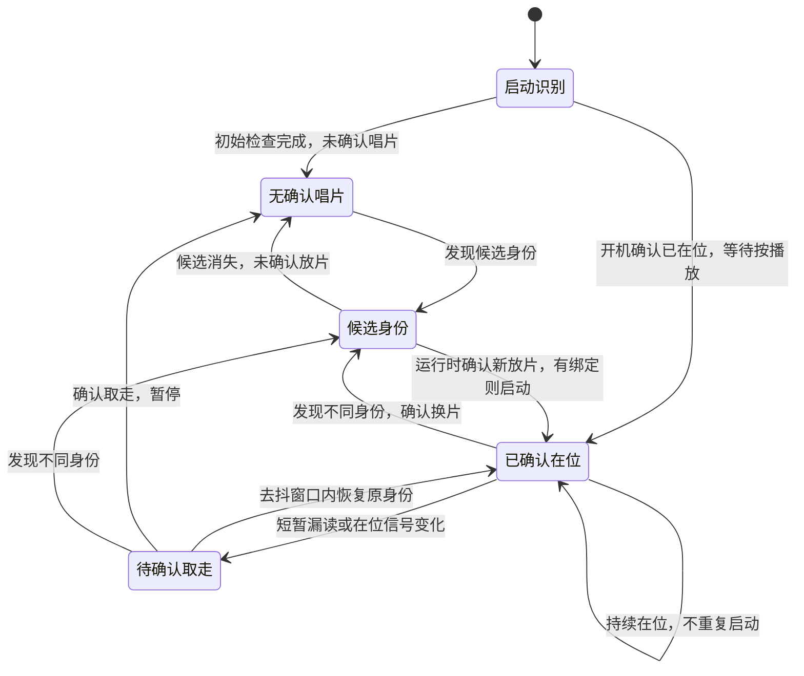

# 唱片挂件与身份识别专项

对应 F02、F10。这里统一负责挂件实体、身份识别、在位/取走判断、换片去抖、内容绑定与播放触发；不能把“读到标签”直接等同于“唱片仍在位”。

## 已确认体验

- 三类常规唱片对应可重设的内容；另只保留一张生日唱片和一个生日菜单入口。
- 小唱片可挂在书包上，插入或表面放置均可；是否无源、身份编码方式和承接结构尚未选择。
- 放入已绑定唱片即播放，取走暂停，换片播放新绑定内容；同一张持续在位不重复启动。无唱片仍可从本体或网页播放。
- 开机时唱片已放好，识别后等待按播放，不因开机扫描而自动播放；正常运行后新放片仍立即播放，对应D052。

## 必须区分的状态

识别设计至少要区分：新身份、持续在位、短暂漏读、确认取走、换片、未绑定、绑定内容缺失。短暂漏读不应立即暂停；持续未读也不能在没有确认在位机制时把无唱片播放误停。状态机、超时和识别部件位置随器件与壳厚实测确定。

下图是唱片在位判断的建议草案，与音乐播放状态分开。本体或网页开始无唱片播放时，唱片状态仍为“无确认唱片”；不能因为一直读不到身份而暂停音乐。

## 原型与证据

推荐先比较无源近场标签、触点编码和光学标记等身份路线，以及是否需要独立在位检测；静止浅凹座或半露浅槽也是结构候选。PN532只是近场路线的候选示例，不代表识别方法已选定。

若采用NFC/RFID原型，使用已核对模块、三张常规标签、一张生日标签和一张未绑定测试标签，在拟定标签壳厚、线圈、扬声器磁体、电机和金属件同时存在的台架上测试。每张已绑定标签建议取放20次，记录识别距离、响应时间、漏读、误切和停留不重复触发；另验证开机已放片等待按播放，随后正常取放仍按D046处理。这些是建议验证项，不是已通过结果。未绑定和内容缺失时给出反馈，具体呈现及播放入口切换细则仍待审阅。

挂扣、标签、唱片图案和卡座要一起设计，挂件脱离本体后仍能安全携带。生日内容复用同一绑定机制，不能在公开规划中加入私人日期或人物背景。
