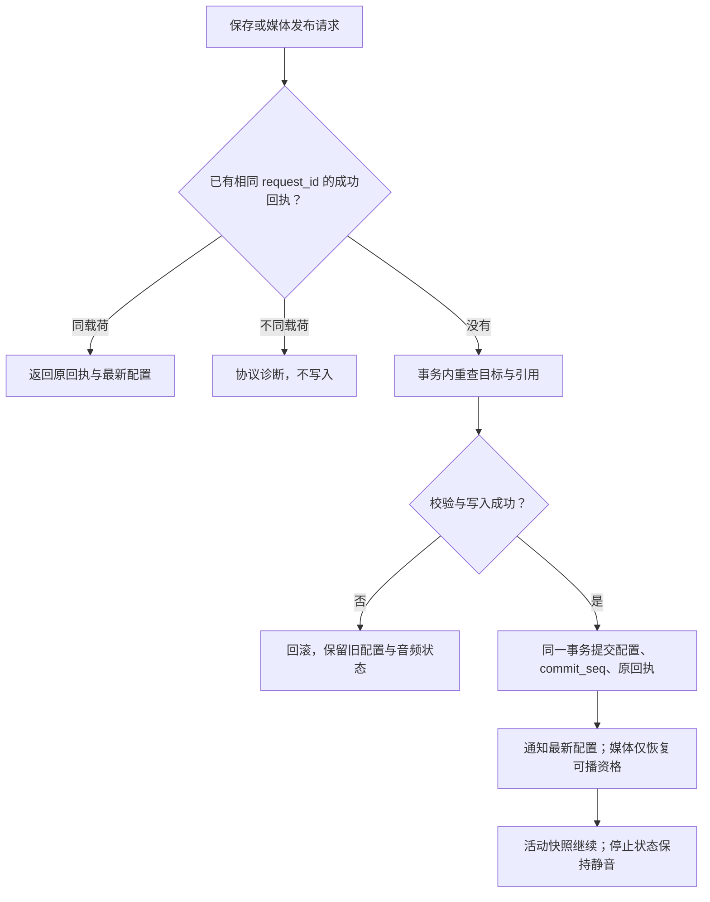

# 播放、内容与适配器接口交接

`0.2.2-batch2` 的 PC 语义契约；依据共同规格基线 `5262430cb385316403daadc68f4142c04d6f2259` 与 D052、D066–D085，并包含 2026-10-10 已确认的两项行为：新有效 B/C 完整替换旧模式，新模式结束不自动恢复旧模式；全坏停止后明确 PLAY 从当前选曲沿活动快照原顺序寻找可播曲，从 0:00 开始。

控制、内容与 PC 文件/进程层的 [已执行结果](evidence/summary.md) 为 47 PASS、0 FAIL、0 UNRESOLVED；真实 SD、适配器和 MP3 层仍为 DEFERRED。本文供控制器、音频、识别、存储和 UI 职责对接，字段、错误码与 SQLite 均为参考实现，尚未向真实板级工程发命令。

## 命令与事件

| 发起职责/事件 | 关键载荷 | 处理规则 |
|---|---|---|
| 识别 `CARD_INSERTED` | 完整技术类型、UID bytes/长度、可信 placement_id | 同一放置不重复；有效 A 接管；新有效 B/C 完整替换旧模式；目标预检失败保留旧模式；同一活动 C 按 D071 保留原会话 |
| 识别 `CARD_REMOVED` | 当前可信 placement_id | 仅结束仍拥有该放置的 B；A/C 继续；旧放置不能停止新播放 |
| 识别 `BOOT_HELD` | card、带启动代次的 placement_id | 识别后等待明确 PLAY，不合成运行中新放置；不恢复旧会话或音乐 |
| 识别 `UID_OBSERVED/CARD_UNCERTAIN` | 原始身份或不确定证据 | 原始扫描不触发；短漏读不伪造取走，邻 UID 不推断换片 |
| 识别 `READER_FAULT/RECOVERED` | 健康与恢复身份分开 | 短故障保持 B 并请求恢复；长期故障保护退出；恢复不重启，须可靠空座后新放置；1000ms 仅为测试参数 |
| 本体/网页 `SELECT_TRACK` | track_id | 预检失败保留旧模式；有效则先退出旧 B/C 再点播；首次实际启动失败停止，不回滚或自动重试 |
| 本体/网页 `START_CURRENT_CARD` | 明确用户意图 | 预检保存版绑定后执行，可显式应用新绑定；重复 UID 不调用；不能绕过 B 故障后的重新取放要求 |
| 模式 `PLAY/PAUSE/STOP/NEXT` | 可选 session_id | PAUSE 保进度；STOP 保模式、锁循环；STOP 后 NEXT 只选曲、静音；明确 PLAY 从当前选曲沿原快照搜索，找到可播曲从 0:00 播放，无可播曲仍停止；旧 session 拒绝 |
| 模式 `MODE_EXIT` | 可选 session_id | 停止并清选择、模式和失败屏蔽；消费在位资格；仍在位不自动重启 |
| 音频 `AUDIO_START/RESUME` | token、offset_ms | token 含 session_id、operation_seq、track_id、media_version；依有效代次执行，打开对应媒体版本 |
| 音频 `AUDIO_PAUSE/STOP` | token、invalidate_through（STOP） | 执行层保留代次与失效屏障；过时 STOP 不误停新音频；停止确认不重新决定模式 |
| 音频 `AUDIO_STARTED/START_FAILED/EOF/STOPPED` | 原 token、失败 reason | token 和状态匹配才接受；首次启动失败按 D074；已运行模式的下一首打开失败按 D080 跳过；迟到 EOF 不能解除 STOP/PAUSE |
| 音频 `TRACK_READ_ERROR` | 原 token、IO 原因 | 与 EOF 分开，仅接受当前 PLAYING 操作；屏蔽失败媒体版本，沿冻结顺序有界跳过；全坏停止音频、保模式；旧版本错误不影响已发布新版本 |
| 内容 `SAVE_BINDING` | request_id、card、Binding 或 None、可选 view_revision | None 为显式解绑；成功只保存，不合成物理事件或切模式；A 只能 Track；旧视图的新请求允许覆盖 |
| 内容 `SAVE_PLAYLIST` | request_id、playlist_id、tracks、可选 view_revision | 保存版创建/修改，曲目必须存在；不改变活动快照；重复曲目项未定义，参考实现返回 UNRESOLVED 诊断 |
| 内容 `SAVE_BIRTHDAY` | request_id、唯一 target 或 None | 只建模卡与菜单共用的唯一内容引用及删除保护，未实现生日效果 |
| 内容 `DELETE_TRACK/PLAYLIST` | request_id、对象 ID | 提交时重查卡、歌单、唯一生日、活动快照及音频占用；拒绝时返回具体 references；删歌单不删曲目文件；删曲目仅从目录移除，物理回收待落实 |
| 内容 `PUBLISH_MEDIA` | request_id、track_id、upload_id | 候选 WAV 完整校验、同步不可变文件后，事务提交目录版本与回执；半文件、格式错误、无空间或提交失败不解锁坏曲 |
| 内容 `MEDIA_PUBLISHED` | track_id、media_version | 只认可已提交且文件存在的版本；清旧失败资格，保持 token、选曲和停止锁；不插播，下次正常轮到用新版本 |

PAUSED、STARTING、STOPPED_ERROR 中 NEXT 的产品行为，以及 PREV、音量和特殊行为命令仍待落实。

## 回执、通知和失败

| 输出 | 字段与规则 |
|---|---|
| `CONTENT_REPLY` | outcome、replayed、原 receipt、latest_config；receipt 内含 request_id、kind、原 commit_seq 与对象 revision/媒体 version；原请求重试只回放原回执，显示使用最新配置 |
| `CONFIG_COMMITTED` | 仅本次新成功事务发出；配置包含实际 commit_seq；失败不发成功通知 |
| UI 状态 | 按设备 commit_seq 丢弃迟到旧通知；原 receipt 表示该请求结果，latest_config 表示当前权威状态；抽象 ClientView 已验证，HTTP/屏刷未验证 |
| `CONTENT_REJECTED` | reason 和具体 references，无成功 receipt 或新 commit_seq；包括 DELETE_BLOCKED_REFERENCED、TARGET_MISSING、PRECHECK_A_REQUIRES_TRACK、MEDIA_INCOMPLETE、MEDIA_VALIDATION_FAILED、NO_SPACE、STORAGE_FAILURE |
| ID 诊断 | REQUEST_ID_REQUIRED、REQUEST_ID_PAYLOAD_MISMATCH；同 ID 不同载荷不写入；成功请求跨进程重启可去重，处理中重复仅提交一次 |
| 媒体资格 | TRACK_FAILED 含 token、obsolete_media；TRACK_REQUALIFIED 含 track_id/version；全坏报 ALL_TRACKS_UNPLAYABLE；再失败重新屏蔽 |

## 状态与恢复边界

| 领域 | 字段/载体 | 恢复规则 |
|---|---|---|
| TagPresence | state/card/placement_id/consumed/requires_replacement/reader_health/fault_since_ms/boot_held | RAM，物理事实与健康独立；重启重新盘点 |
| ModeSession | session_id/kind/origin_card/owner_placement/binding_revision/snapshot | RAM，结构快照不可变；不恢复旧 B/C |
| TrackSelection | snapshot/index/track_id | RAM；STOP 保选曲，STOP 后 NEXT 只改变选曲 |
| AudioState | status/position_ms/token；STARTING/PLAYING/PAUSED/STOPPED/STOPPED_USER/STOPPED_ERROR | RAM；重启不自动恢复音乐 |
| 活动失败状态 | failed_tracks：track_id→失败 media_version；mode_music_started | RAM，版本隔离；重启不恢复旧屏蔽 |
| MediaVersion | track_id/version；目录含 file、validated | SQLite 权威指针；旧版本文件供已有句柄读完，下次打开使用新版本 |
| 保存配置 | bindings/playlists/tracks/birthday/commit_seq | SQLite 实文件；配置 JSON 与成功去重原回执在同一事务保存 |
| DeviceState | state_revision/presence/mode/selection/audio/last_error/commit_seq；保存/活动 revision、media_versions | 统一可观测状态；RAM 夹具 commit_seq=None，持久模型取已提交值 |

event_seq（串行输入）、state_revision（观察版本）、placement_id（物理放置）、session_id（模式生命周期）、operation_seq（音频代次）、commit_seq（成功持久提交）相互独立。硬件的 placement/session/operation 或整个回调信封须带启动代次，避免重启前排队事件撞上新编号；PC 假适配器的独立夹具从 1 起，未验证跨启动硬件保证。

PC 保存采用 BEGIN IMMEDIATE、synchronous=FULL；仅成功请求持久保存原回执。候选媒体先完整校验并同步为不可变版本，再提交目录指针；中断遗留的候选/孤儿不会被当成可播媒体。旧文件保留至已有句柄读完，自动空间回收不属于本轮实现。

## 各职责接入要求

| 职责 | 需提供的接口保证 | 仍需的实际证据 |
|---|---|---|
| 音频执行 | START/RESUME/STOP/PAUSE 代次与失效顺序；成功、EOF、IO 错误均回传原 token；媒体版本对应文件；区分首次启动失败与运行中失败；旧句柄释放确认 | WAV/MP3、音量、停音时延、失败原因、异步回调、旧句柄安全、声音与欠载 |
| 存储与发布 | 独立临时文件、完整长度/格式校验、sync/close、不可变版本与目录提交；配置及去重回执可恢复关联；提交成功才反馈已保存 | 真实 SD 阻塞、音频并发、无空间/断网、物理掉电、文件恢复；SQLite 是 PC 验证路线 |
| NFC 与在位识别 | 技术类型与完整 UID bytes/长度；可信放置/离座；BOOT 盘点与运行新放置分开；健康独立；恢复后可靠空座证据 | 真实取放、邻片、漏读、持续故障、恢复、保护阈值和误判率 |
| 本体与网页 UI | 共用语义命令及设备快照；显示保存版/活动版、commit_seq、选曲/STOP、引用和故障来源；显式执行新绑定单独表达 | 真实控件与屏刷、HTTP、通知乱序、断网重连后读权威状态 |

request_id 命名空间与保留期、失败请求是否持久回放、重复歌单项、未冻结命令、删除后的媒体回收仍需落实。PC 事务五个中断点、媒体三个中断点、真实旧句柄、进程重启与处理中幂等已有原始结果；真实适配器、MP3、SD/音频并发、物理掉电及平台迁移后的复测仍按各专项完成。
