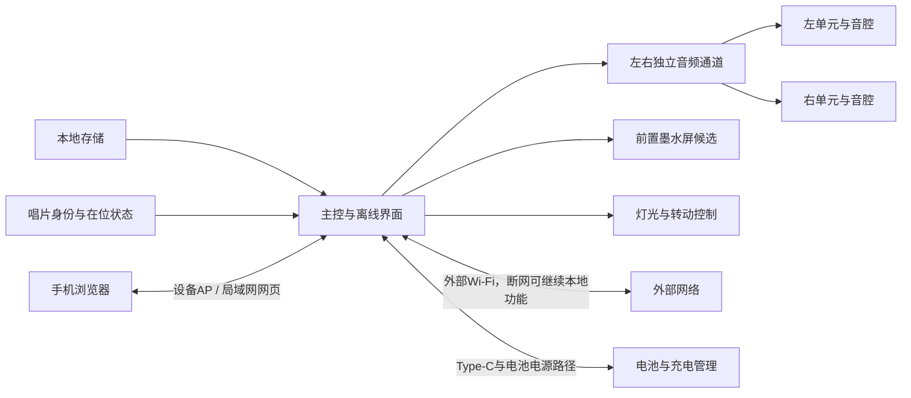
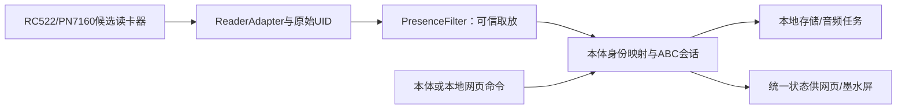
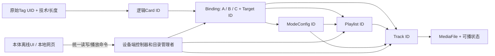

# 共享接口与整机约束

本文只维护跨功能的接口、资源、空间和状态约束。GPIO、封装和具体电源轨必须等准确板卡及模块核对后再确定。

按D063，先用ESP32-S3验证模块，成品以ESP32-S31为主线。准确开发板/内存、计算分工与资源草案由[主控子规划](../features/platform/README.md)提出，总规划协调联合审阅；具体成品芯片、封装与外围依验证冻结。N8R8 v1.1、Korvo-1及I2C扩展器均为推荐，GPIO余额仅在对应板型和外设假设下成立。

S3阶段保留数据规则、模块规格和测试方法；迁移到S31重新核对软件目标/依赖、GPIO、I2S/TDM/MCLK、SD宽度、内部DMA与缓存、USB恢复、音质及整板功耗。S3通过不替代S31通过，迁移清单维护在[主控专项](../features/platform/README.md#s3验证到s31成品主线)。成品以一块集成主板为目标，不要求装入整块参考开发板。

## 数据和信号

| 连接 | 规划约束 | 状态 |
|---|---|---|
| 存储到主控 | 本地歌曲、绑定、事件、图片和设置共用可维护的内容模型 | 需求；介质和格式待选 |
| 主控到功放 | I2S传输左右采样；双单声道模块必须分别验证左/右选择，不能把两个混音模块当作立体声 | 候选；准确模块待核对 |
| 主控到屏幕 | 屏幕刷新不能阻塞音频；以既有墨水屏参考方案作为原型基线，接入前核对屏/驱动板版本、供电和引脚 | D059；刷新与并发待验证 |
| 主控到识别 | 无源挂件提供独立数字身份；分离确认在位/取走、短时漏读、身份冲突及读卡器故障，由本体解释ABC | D058、D066–D069行为已定；硬件和参数待测 |
| 主控到网页 | 本地AP配网、控制、上传和绑定，状态与本体一致；上传时保持播放，允许上传变慢 | D054需求；并发能力与接口契约待验证 |
| 主控到灯光/电机 | 可独立开关，不与ABC强制绑定；测峰值电流、噪声与启停 | D070已确认；驱动未定 |
| Type-C到系统 | 充电、电源路径、输入限流和系统负载共同验证；不能用普通充电模块直接推断边充边用 | 需求；电源模块待选 |
| 外部烧录工具到主控 | 预留后续固件更新与烧录入口，兼顾电平、供电和装配后的可达性 | D053已确认；接口形式和引脚待选 |

## ABC模式与识别事件接口：已确认原则、待验证实现

已确认：A单曲点播取走继续；B驻留模式确认取走后退出、停止并清空其播放任务；C锁存模式取走后继续。B/C的单曲/歌单循环，手动退出后同一次在位不重复启动。有效新A、本体/网页主动选择其他歌曲都先退出旧B/C；音量调整、普通暂停与模式内切歌不退出。灯光独立、实体按键未冻结（D066–D070）。

**待测试的实现建议：** 身份/在位检测输出`CARD_INSERTED`、`CARD_REMOVED`、`CARD_UNCERTAIN`、`READER_FAULT`，事件携带原始UID类型、字节长度、单调时序与`placement_id`。本体映射查ABC类型和目标，统一行为控制器用`session_id`关联播放/模式、过滤迟到事件；新动作应先验有效再退出旧会话。音频和显示不直接响应原始NFC漏读；所有行为执行仍待模拟和实物验证。

单活动模式策略、NFC扫描/离座窗口及是否另加独立在位传感器仍待验证；启动失败、C断电恢复、持续读卡故障与停止音乐的产品行为已由D072–D075确定。先比较纯NFC的快速响应和误判，再决定是否增加传感器。

### RC-05A · ABC行为状态机与冲突消解草案（2026-10-09）

**证据层级：D066–D075已确认为产品行为；实现细节若标注“建议/待审阅”仍不构成新决定，也尚无固件或实测。** 本节只定义领域逻辑，不决定PN7160/RC522、GPIO、按键数量或延迟阈值。

#### 独立状态变量（避免“暂停=退出”“漏读=取走”）

| 维度 | 建议状态 | 关键规则 |
|---|---|---|
| 物理在位 | `EMPTY` / `CANDIDATE` / `PRESENT(uid,placement_id)` / `UNCERTAIN` / `READER_FAULT` / `BOOT_HELD` | 只有可信取放改变`placement_id`，NFC短时漏读、邻片UID不能直接生成取走/放入 |
| 活动模式 | `NONE` / `B(session_id,owner_placement)` / `C(session_id,origin_card_id)` / `EXITING` | 只有B、C是持续模式，B由原放置负责退出；C取走仍运行（采用单活动模式作为工程建议，待评审） |
| 音乐播放 | `STOPPED` / `PLAYING` / `PAUSED` / `STOPPED_USER` / `PLAY_ERROR`，附`track_id,playlist_id,owner_session` | STOPPED_USER音频停止且自动循环锁定、模式仍在；PAUSED也不退出，MODE_EXIT才关闭会话，异步EOF核对会话编号 |
| 触发许可 | 每次放置独立`placement_id`；已消费/手动退出的放置不再自动触发 | 同片重复读、短漏读恢复与绑定修改不构成再次放入；确认取走后新放置才重获自动资格 |

**架构纠正**：A是`PLAY_TRACK`的一次性触发来源，不需要`A_ACTIVE_MODE`常驻状态；A对应普通播放，取走与该播放无停止关联。B/C才需要建立`session_id`和循环/特殊行为的所有权。物理放置与模式会话必须能独立存活：C离座后模式仍运行，本体/网页主动点歌后原B可能仍物理在位但已失去模式控制权。

#### 事件→动作→不变量

| 事件或条件 | 确定行为（已确认原则 / 建议细化） |
|---|---|
| 新有效A放入 | **已确认**先退出原B/C，正常点播绑定的单曲；旧A如果正在播可被重新点播，A取走不会停止新歌曲 |
| 新有效B放入 | **已确认**进入驻留模式并循环其单曲/歌单；建议新建会话并绑定此次放置编号，模式内特殊行为按绑定执行 |
| 新有效C放入 | **已确认**进入锁存模式并循环音乐；取走继续运行；建议新建会话记录起源身份 |
| 确认取走当前B原放置 | **已确认**不论有没有下一张卡、下一张是否有效，B都停止、清空播放任务并退出；前提是旧取走确属仍活动B的`owner_placement` |
| B已经被网页/本体点歌替换，之后旧B取走 | **已确认的接管原则**旧B不再拥有当前播放；建议按`session_id`与`placement_id`丢弃对新播放的停止请求 |
| 确认取走A或C | **已确认**A普通单曲继续，C模式继续；取走事件仍送物理层，不隐藏 |
| C仍运行且同一张C确认重新放入 | **D071已确认**不重新启动原C，不改变进度或已停止状态，不重新执行特殊行为；新放置编号不自动创建第二个锁存会话 |
| C已退出，原片真实取走后再次放入 | **由已确认的重新取放规则推导**新放置可以重新激活；若C已离座且后来再次放入，该新放置也是新触发 |
| C保持运行时放入未绑定/目标缺失卡 | **D074预检规则**无效新请求只报错、不退出旧C；若B已独立确认真实取走，则B仍必须退出 |
| B在位时旁边出现其他UID、未确认旧B离座 | **建议**标记身份冲突、保持原已确认物理状态，不凭一次UID变化强制退出或新播；可信换片才生效 |
| 可信快速换片B→新卡 | **建议**原B离座/可靠替换成立即先结束B，再校验并执行新行为；新卡无效时保持B已结束并报错。不要求一定观测到长时间空座，但必须有可靠旧片离开证据 |
| 本体/网页`SELECT_TRACK` | **已确认**先校验目标，若有效则退出旧B/C再点播新歌；目标无效时按D074保留尚未因其他独立事件退出的旧模式 |
| `MODE_NEXT`/`MODE_PREV`、音量、暂停/继续 | **已确认**属于模式内控制，不退出B/C；进入普通歌曲选择界面的`SELECT_TRACK`则不同 |
| B/C收到本会话歌曲自然EOF | **已确认**循环单曲或歌单，模式不退出；建议仅当播放状态允许且会话编号仍有效时重播/进入下一首。暂停状态与旧EOF不得启动歌曲 |
| A普通歌曲自然EOF | **建议**遵守普通播放器的单曲结束行为，不因唱片仍在位产生重播；A不是B/C循环 |
| 手动`MODE_EXIT`且旧卡仍在位 | **已确认**结束模式、停止清空任务，禁止同次放置自动重启；只有可信取走再放入才重新激活，普通暂停不是退出 |
| `CARD_UNCERTAIN` / `READER_FAULT` | **D072已确认**B短时故障继续并尝试恢复；超保护阈值自动停止清空退出，记录故障而非物理取走；恢复后必须真实重新取放才可自动激活，阈值待实测 |
| `BOOT_HELD`与重启后发现旧片 | **D052+D073已确认**C旧会话不跨重启恢复；开机已有片先识别、等待显式启动，运行期真实新放入才自动触发 |
| 在位期间成功修改UID映射 | **建议，待审阅**保存行为仅改变下次新放置/显式选择所用目标，不伪造新的`CARD_INSERTED`，避免同片立即重复点播 |
| 有效请求预检通过但实际启动失败 | **D074已确认**报错、保持停止，不恢复旧模式、不因同次在位自动重试；允许用户显式重试或真实重新取放 |
| 用户按“停止音乐”而非“退出模式” | **D075已确认**STOP_AUDIO只停止音频并阻断自动循环，B/C会话与其他行为继续；MODE_EXIT才完全清理。重新播放须显式操作，起点待审阅 |

#### 优先级与并发原则：物理事实独立于新操作有效性

1. **已确认物理事实不能回滚**：`CARD_REMOVED(oldPlacement)`若匹配活动B，会结束B；即使下一张卡未绑定、内容缺失，也不让B继续。这是与“先校验新操作”不同的**独立退出路径**。
2. **请求型切换先校验再提交**：对尚未由离座事件退出的C/B，检查新卡映射、目标存在性与必要资源，再退出旧模式并启动；无效新卡/无效点歌不改变旧会话。
3. **同卡取放与持续在位分开**：重复扫描不是`CARD_INSERTED`；C真实重新放回时若原C会话仍活动，已按D071确认不重启。显式模式退出设本次放置“已消费”，不能让漏读恢复清除这一锁定。
4. **可信换片而非“不同UID=离座”**：只有能确认原物理持有者已离开/被取代，才把旧B的物理退出和新卡请求组成两个按序事件；若证据冲突，拒绝危险的猜测式自动切换，向界面显示需要重新落座。
5. **串行提交、会话归属与去重**：建议统一队列按已确认的事件顺序提交，命令生成新会话版本；旧`CARD_REMOVED`、迟到EOF、异步停止完成和重新绑定回调不得操作新版本。用户主动点播接管后的迟到旧B取走事件只能更新物理在位状态。
6. **模式所有权最小化**：仅清理由B/C持有的循环、音频队列和明确配置的专属界面/特效；默认不重置与ABC无关的灯光设置，日后可另审模式特效归还策略。

#### U1–U5确认后的状态与命令契约（D071–D075）

| 决策 | 确认的行为 | 工程未定项 |
|---|---|---|
| U1 | C仍运行，同片真取走再放入不重启、不改变进度 | 通过放置编号和会话编号过滤同片重触发 |
| U2 | B短时读卡故障保持、持续超阈值故障退出清空；恢复后须真取放 | 保护阈值和恢复后可信空座检测 |
| U3 | 关机/断电/重启不自动恢复旧C | 开机已有片按D052等待显式启动 |
| U4 | 预检失败保留原会话；启动阶段失败不回滚旧模式 | 显式重试与保存错误状态 |
| U5 | 停止音乐不退出B/C，禁止自动循环；显式退出才全部清理 | 停止后用户重新播放的起点策略 |

**暂停、停止与退出不能共用事件：** 建议PAUSE_AUDIO保留当前播放位置；STOP_AUDIO将音频置为STOPPED_USER并阻断该会话的EOF循环，B/C本身仍活跃，非音频行为继续；MODE_EXIT清理音频、循环与模式资源。B确认真实取走或B读卡器持续故障超阈值，均完整退出B，即使音频此前已停止。C取走再放入不解除STOP_AUDIO锁定。

**故障恢复门禁：** 读卡器恢复后看到同一UID不代表发生新放置。只有先在读卡器健康条件下确认空座，再确认新放入，才能重获自动激活资格；无法证明故障期间的取放时，提示用户先取走再放入。故障引发的保护退出不伪造CARD_REMOVED。

### RC-03A NFC主候选接口请求（暂选而非定稿）

识别专项2026-10-09优先推荐PN7160 MINI V1（`PN7160_MINI_I2C`）作P2原型：I2C默认7位地址`0x28`，3.3 V主机信号，需SDA/SCL、独立IRQ与VEN，模块供电3.3–5.5 V；官方整合有25×10 / 50×40 mm两副读卡天线供交叉测量。[准确资料](https://www.elechouse.com/docs/pn7160-mini-v1-i2c/datasheet.html)。PN532诊断对照不是未来S31成品定稿。

平台现有共享I2C和NFC IRQ已计数；VEN为了总线故障时仍可恢复，**建议额外占用一条主控直连GPIO**，因此需主控专项重算实际板型的GPIO、上下拉、启动默认状态及I2C总线兼容。仅用I2C扩展器控制VEN存在总线卡死时无法恢复的闭环风险。MINI的IRQ表示NCI数据可读，不能等同独立物理在位传感器；最终在位判据和扫描参数待原型实测，不能直接按IRC/IRQ边沿退出B。

### RC-PROT-01 · 面向复用原型的驱动/行为接口边界（建议，未实现）

将外部参考工程按模块职责拆开：`ReaderAdapter`（RF芯片/总线和原始UID）、`PresenceFilter`（离座候选/置信状态）、`CardActionResolver`（本体数字身份→A/B/C类型与内容ID）、`ModeSessionController`（会话、事件序号、模式切换）、`AudioService`（本地SD与左右I2S）、`WebBodyCommands`（统一命令和设备状态）。只是接口分工建议，未冻结源文件名、API签名或具体SDK。

**事件约束**：卡片UID须保留技术类型、长度和原始字节；一次确认有效放置只产生一个`placement_id`，每次模式新建`session_id`；旧取走/旧音频EOF事件不得操作新会话，设备故障和真离座分离。手动退出同次放置锁定、有效新A/本体网页主动点歌先退出旧模式、模式内切歌保持模式，均按D066–D070执行。绑定实际存储格式、单活动模式和失败回退仍须用户审阅，不将方案写成产品新决定。

**外设资源条件**：RC522使用SPI数据线及片选/复位，与显示SPI共享时须核时序仲裁、MISO和额外GPIO；PN7160 MINI使用I2C+IRQ+VEN，VEN优先独立复位。原ESP32-WROOM示例GPIO不能直接复用到S3 N8R8或S31。网络上传、显示刷新、NFC扫描不能阻塞I2S供数；并发以T04实测判定，不因参考工程支持网页就认定上传不中断。

### RC-06 · 曲库/歌单/绑定与统一控制的数据契约（2026-10-09，提案）

**已确认约束：** D069数字身份由本体解释；A只点单曲；B/C可为单曲/歌单/特殊行为；D071–D075已经规定同C重放、读卡故障、断电恢复、新动作失败及暂停/停止/退出的语义。本节数据字段、事务和编辑策略属于**待审阅的软件接口设计**，不是已定存储实现。

| 实体/关系 | 推荐字段（逻辑含义） | 不变量与未定点 |
|---|---|---|
| TagIdentity | `tech,uid_length,uid_bytes` | UID不能从可见卡号推测，也不靠标签用户存储区写死歌曲；识别硬件协议可更换，但逻辑卡片关联须经明确迁移 |
| Card与Binding | `card_id,tag_identity,action_type,target_kind,target_id,binding_revision` | 卡UID唯一映射到本体逻辑卡，A目标只能Track；B/C可指向Track、Playlist、ModeConfig；挂件数量八张不限制后续映射容量 |
| Track | `track_id,display_title,media_ref,codec,status` | 重命名/移动不改变track_id；不把文件路径、曲名或导入顺序当稳定身份，格式/时长等由实际读入解析 |
| Playlist | `playlist_id,name,ordered_track_ids,revision` | 引用track_id而不是复制音频；删除曲目、曲目重复及随机播放是否支持仍须审阅 |
| ModeConfig | `mode_id,mode_kind,target_id,optional_effects` | B/C可以是只有音乐、只有特殊行为或显式复合行为；灯光不默认因ABC强制联动 |
| ModeSession | `session_id,origin_card_id,owner_placement,binding_revision,playlist_snapshot,playback_state` | 已确认D077–D078：当前B/C会话继续使用进入时的绑定及歌单版本；快照的具体结构与资源释放尚待实现 |
| DeviceState | `state_revision,active_session,playback_state,tag_presence,reader_health,last_error` | 网页和本体订阅/读取同一状态；状态版本用于拒绝迟到响应，不把“已保存配置”当“当前已立即生效” |

**统一操作建议**：`SELECT_TRACK(track_id)`是独立点歌、需要退出旧B/C；`MODE_NEXT/MODE_PREV`是模式内部切歌；`PAUSE_AUDIO`只暂停；`STOP_AUDIO`停音频并禁止该模式自动循环；`MODE_EXIT`完整清理；`MODE_PLAY`显式解除STOP锁定，按D079从停止时那首曲目的0:00重播（不回歌单第一首）；`UPDATE_BINDING`与`EDIT_PLAYLIST`是保存配置命令，**不应在没有用户新播放意图时产生虚拟的CARD_INSERTED**。ModeSession与Card放置资格仍独立存在。

**目录一致性建议**：
1. 歌曲上传写到不可见的临时文件；检查完整长度、格式及必要元信息、关闭并同步写后才发布为可播曲目。播放、解码和SD读取任务不因为网页上传主动暂停（D054）；实际不中断要测SD最长写阻塞、缓存低水位、欠载和供电。
2. 设备端单一目录/文件写入管理者序列化曲库、绑定、歌单变更。建议操作带`expected_revision`与`request_id`，冲突则反馈“数据已变化，请刷新”，不默默覆盖本体或网页刚保存的修改；具体HTTP码/存储格式未选。
3. 保存采用版本化可恢复元数据和临时写入后校验，避免修改失败毁坏旧绑定。**FAT文件重命名不等于掉电原子事务**；断电中断场景要通过恢复扫描、副本及版本校验实测，不在P1宣称具备数据库事务。
4. 删除/重命名须按D076检查卡绑定、当前/活动会话引用和歌单引用；存在任何引用即拒绝删除并展示引用对象，先解除/移除/结束使用。删除歌单也建议检查卡绑定（待专项确认）。D077规定运行中B/C歌单编辑只影响下次进入。不可播或缺失内容必须显示，不得悄悄更换成其他歌曲。
5. D078确认：A/B/C在位重绑只保存，新绑定不得生成CARD_INSERTED或重启当前会话；B真取走再放生效，C需显式退出/重启才生效，同片重放仍按D071不重启；也允许用户显式执行新绑定。生日实体卡与菜单仍共用唯一内容引用。
6. 断网、本体网页同时操作、满卡、读卡器恢复、SD拔出/读取失败及固件异常恢复，要分别保留错误原因；错误不当作EOF去无限循环，也不改变D074“不回滚/不自动重试”的保证。

**RC-06产品语义已确认（D076–D081）**：删除被引用曲目受保护；B/C歌单快照在当前会话不变；在位重绑仅保存；STOP后明确重播当前歌开头；运行中遇单首坏歌记录后跳过，同一会话禁止循环重试坏曲，全部不可播则音频停止并反馈、模式仍活动；本体有基础离线曲库/歌单编辑，本地AP网页负责复杂批量管理。具体数据库/文件系统、掉电恢复、软件缓存/接口、独立模式数量仍待工程验证。

#### RC-06确定性时序：停止、编辑与跳过

1. 停止时若处于歌单第6首的02:00，记录`stopped_track_id`（会话内稳定曲目索引/ID），关闭该音乐的自动循环；模式仍活动。用户显式`MODE_PLAY`时从**该第6首00:00**开始，随后按当前**已激活的歌单快照**继续到第7首及后续曲目；`PAUSE/RESUME`则保留原歌曲时间点（D075、D077、D079）。
2. 正在播放B/C时保存歌单新版本或修改当前在位卡映射，只更新配置修订号，不改变当前`session_id`的绑定/顺序，也不触发播放；B下一次真取放、C显式退出再进入或用户明确执行新绑定时方读取新版本（D077、D078）。
3. 运行中发生`TRACK_READ_ERROR`时，将该曲记为本次会话不可播并记录错误，顺序寻找下一首可播曲；不得把IO错误伪造为正常EOF，更不得无界轮询坏曲。同一快照中若已无可播曲，进入独立的`STOPPED_ERROR`（建议命名），音频停止、模式继续；明确新操作仍受D074预检/启动规则约束（D080）。
4. 删除曲目前先查**已保存卡绑定、已保存歌单、当前播放及活动快照**的引用；返回可读占用原因并拒绝删除，直到取消相关引用/结束使用。检查与实际删除需在目录写入管理者串行提交，避免UI读到旧快照后产生“检查通过但后来又被绑定”的竞态（D076，工程锁策略待验证）。

### RC-07 · 停止态与内容引用的统一数据契约（规划）

建议设备状态明确分为六类：①活动模式会话和模式类型；②声音状态PLAYING/PAUSED/STOPPED_USER/STOPPED_ERROR；③当前选中歌曲ID及所属歌单位置；④活动会话的绑定/歌单快照版本；⑤设备已保存配置版本；⑥物理唱片与NFC读卡器健康状态。当前B/C音乐停止或歌单全部坏歌时，模式状态**不能**变成已退出。

**命令区别（现有D决定与候选交互）：**
- STOP_AUDIO（D075）只停止音频、禁自动循环，保留模式和已选曲目；显式MODE_PLAY（D079）从当前已选曲目的0:00重播。如果STOP状态按MODE_NEXT，是否只改变选曲且保持静音待Q-I01。
- SELECT_TRACK（D068）从曲库独立点播另一首歌，先退出旧B/C；EDIT_PLAYLIST/UPDATE_BINDING（D077–D078）仅保存新版，不改当前模式快照；“明确执行新绑定”是独立控制命令，不伪造CARD_INSERTED。
- DELETE_TRACK需在设备端最终提交时查询所有卡片绑定、持久歌单、当前播放及活动会话快照；有引用即返回可读占用列表并拒绝（D076）。DELETE_PLAYLIST若被引用是否类比保护待Q-I02。
- B/C发生坏歌IO错误按D080记录本会话已失败曲目ID，寻找下一首可播曲；全不可播进入音频错误停止而B/C保持。修复后是否本会话重新尝试待Q-I03。
- 所有编辑命令建议携带唯一request_id和expected_revision，防网络重复触发与旧页面覆盖新保存；冲突返回VERSION_CONFLICT而非自动合并/覆盖，交互选择Q-I04待审。

**工程风险**：删除检查与删除操作间若另一个客户端创建引用，需要单一文件目录管理者串行提交、提交时再次校验；上传暂存与曲目发布不能破坏已发布内容。FAT的rename不是完整掉电事务，所需日志/双副本、容量和恢复机制继续由存储专项选择，当前不指定文件格式或固件实现。

## 下一轮共享输入表

以下是各专项交回的设计输入，未知值标待核实；资料估算与实测分栏。总规划先汇总，再决定电源与集成方案，不由某个模块单方面锁定整机电压或尺寸。

| 输入 | 必要内容 | 提供与联合核查 |
|---|---|---|
| 模块身份与资源 | 准确型号/版号，通信总线、电平、信号资源与软件支持 | 各功能专项；总规划检查接口冲突 |
| 负载与供电 | 电源轨及容差、平均/峰值电流、峰值持续时间、启动/待机与同时运行工况 | 各模块提供；电源统一换算功率并评审余量 |
| 完整空间包络 | 外形、质量、连接器、线缆弯折、排线、天线与散热/维护空间 | 各模块提供；结构汇总，电池不默认挤占音腔 |
| 音频与存储并发 | 文件与格式、音频缓冲、存储最长阻塞、上传限速、刷新/识别并发与失败记录 | 音频、网页、显示和识别；保持D054体验 |
| 挂件与卡座 | 八张卡配置、壳厚/材质、挂扣承力、标签/线圈方向、读区与在位判断 | 挂件负责实体/封装，识别负责标签/读区，结构负责卡座；同电子链路对照两种承接 |
| USB维护与供电 | 数据下载、恢复入口、电池/USB切换、电脑输入限制、反向灌电及插拔空间 | 主控候选、电源与结构联合评审；共口仍是建议 |

挂件数字身份与可见编号分开；本体根据身份解释ABC类型和执行目标，不作为防伪凭证。设备内部映射的保存格式、修改流程和冲突处理仍待审阅，未确定标签芯片型号。

## 固件更新与烧录接口

D053确认首版预留便于后续固件更新与烧录的接口。以下是选型与结构评审建议，尚未确定具体器件或引脚：

- 优先比较复用外部Type-C作为充电及USB烧录入口，核实主控原生USB下载或USB转串口方案的支持、成本和软件依赖；Type-C连接器不能只有充电而没有所选方案所需的数据连接。
- 评估不依赖正常应用运行的恢复烧录路径，以及必要的下载模式、复位控制和板上焊盘/连接器。UART、SWD、JTAG等按实际主控支持和用途选择，不要求全部预留；后续若加入无线更新，仍保留有线维护路径。
- 原型板便于接线和测量，成品外部更新入口优先在不拆壳时可用，内部恢复接口经维护盖可达；同时核对数据线插拔空间、电平、电池与USB供电关系及接口占板面积。
- 固件工程记录准确工具、下载模式、复位方法、版本对应和擦除范围，区分应用更新与完整擦除对歌曲、绑定和设置的影响。具体电路、PCB走线和烧录实现另开对应对话。

## 空间、声音和网络

- 左右扬声器优先分别放入可调整音腔；小唱片承接结构、识别部件和挂扣避开运动干涉。若采用NFC等近场路线，再验证线圈与扬声器磁体、电机、金属及壳厚的配合。
- 电池、电路、屏幕开窗、天线净空、Type-C插拔、存储访问和可拆维护路径在同一布局中检查。旧的厘米数图只作历史占地参考，不是外壳尺寸。
- 主控按S3模块验证、S31成品主线安排，但不据平台能力承诺本地运行通用大模型；AI用途未定，不预先采购麦克风或蜂窝模块。
- 设备首次或手动进入AP，手机配置外部Wi-Fi；连接失败提供重试，断网时本地播放、唱片互动和基础显示继续。外部网络仅用于联网扩展。
- 电池容量、续航、输入功率、温升和充电时间均是待实测量。不得以标称功放功率代替音质或电池结论。

## 建议的第一阶段证据

各专项可独立获得网页保存、唱片识别、显示、电源、灯光或运动证据；音频先核对左右测试音、WAV及实际MP3播放。整合时检查播放并发、共享状态、电源和空间。每个模块记录准确板型、接线、供电、平均/峰值电流、版本和问题；完成跨模块接口评审后再画主板。
