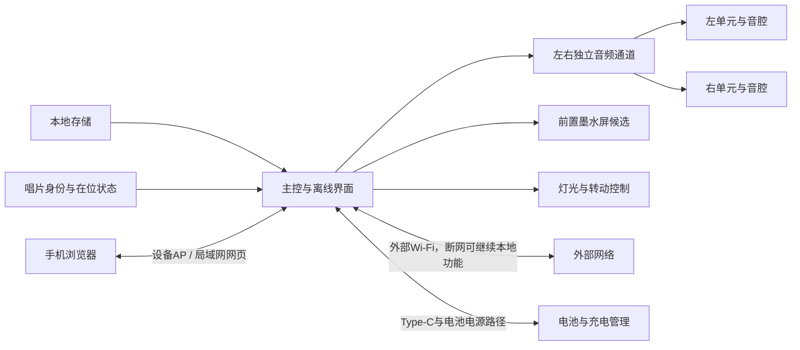
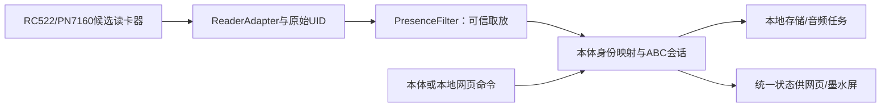

# 共享接口与整机约束

本文只维护跨功能的接口、资源、空间和状态约束。GPIO、封装和具体电源轨必须等准确板卡及模块核对后再确定。

按D063，先用ESP32-S3验证模块，成品以ESP32-S31为主线。准确开发板/内存、计算分工与资源草案由[主控子规划](../features/platform/README.md)提出，总规划协调联合审阅；具体成品芯片、封装与外围依验证冻结。N8R8 v1.1、Korvo-1及I2C扩展器均为推荐，GPIO余额仅在对应板型和外设假设下成立。

S3阶段保留数据规则、模块规格和测试方法；迁移到S31重新核对软件目标/依赖、GPIO、I2S/TDM/MCLK、SD宽度、内部DMA与缓存、USB恢复、音质及整板功耗。S3通过不替代S31通过，迁移清单维护在[主控专项](../features/platform/README.md#s3验证到s31成品主线)。成品以一块集成主板为目标，不要求装入整块参考开发板。

## 数据和信号

| 连接 | 规划约束 | 状态 |
|---|---|---|
| 存储到主控 | 本地歌曲、绑定、事件、图片和设置共用可维护的内容模型 | 需求；介质和格式待选 |
| 主控到功放 | I2S传输左右采样；双单声道模块必须分别验证左/右选择，不能把两个混音模块当作立体声 | 候选；准确模块待核对 |
| 主控到屏幕 | 屏幕刷新不能阻塞音频；以既有墨水屏参考方案作为原型基线，接入前核对屏/驱动板版本、供电和引脚 | D059；刷新与并发待验证 |
| 主控到识别 | 无源挂件提供独立数字身份；分离确认在位/取走、短时漏读、身份冲突及读卡器故障，由本体解释ABC | D058、D066–D069行为已定；硬件和参数待测 |
| 主控到网页 | 本地AP配网、控制、上传和绑定，状态与本体一致；上传时保持播放，允许上传变慢 | D054需求；并发能力与接口契约待验证 |
| 主控到灯光/电机 | 可独立开关，不与ABC强制绑定；测峰值电流、噪声与启停 | D070已确认；驱动未定 |
| Type-C到系统 | 充电、电源路径、输入限流和系统负载共同验证；不能用普通充电模块直接推断边充边用 | 需求；电源模块待选 |
| 外部烧录工具到主控 | 预留后续固件更新与烧录入口，兼顾电平、供电和装配后的可达性 | D053已确认；接口形式和引脚待选 |

## ABC模式与识别事件接口：已确认原则、待验证实现

已确认：A单曲点播取走继续；B驻留模式确认取走后退出、停止并清空其播放任务；C锁存模式取走后继续。B/C的单曲/歌单循环，手动退出后同一次在位不重复启动。有效新A、本体/网页主动选择其他歌曲都先退出旧B/C；音量调整、普通暂停与模式内切歌不退出。灯光独立、实体按键未冻结（D066–D070）。

**待测试的实现建议：** 身份/在位检测输出`CARD_INSERTED`、`CARD_REMOVED`、`CARD_UNCERTAIN`、`READER_FAULT`，事件携带原始UID类型、字节长度、单调时序与`placement_id`。本体映射查ABC类型和目标，统一行为控制器用`session_id`关联播放/模式、过滤迟到事件；新动作应先验有效再退出旧会话。音频和显示不直接响应原始NFC漏读；所有行为执行仍待模拟和实物验证。

单活动模式策略、启动失败回退、C断电恢复、NFC扫描/离座窗口及是否另加独立在位传感器未确定。先比较纯NFC的快速响应和误判，再决定是否增加传感器。

### RC-03A NFC主候选接口请求（暂选而非定稿）

识别专项2026-10-09优先推荐PN7160 MINI V1（`PN7160_MINI_I2C`）作P2原型：I2C默认7位地址`0x28`，3.3 V主机信号，需SDA/SCL、独立IRQ与VEN，模块供电3.3–5.5 V；官方整合有25×10 / 50×40 mm两副读卡天线供交叉测量。[准确资料](https://www.elechouse.com/docs/pn7160-mini-v1-i2c/datasheet.html)。PN532诊断对照不是未来S31成品定稿。

平台现有共享I2C和NFC IRQ已计数；VEN为了总线故障时仍可恢复，**建议额外占用一条主控直连GPIO**，因此需主控专项重算实际板型的GPIO、上下拉、启动默认状态及I2C总线兼容。仅用I2C扩展器控制VEN存在总线卡死时无法恢复的闭环风险。MINI的IRQ表示NCI数据可读，不能等同独立物理在位传感器；最终在位判据和扫描参数待原型实测，不能直接按IRC/IRQ边沿退出B。

### RC-PROT-01 · 面向复用原型的驱动/行为接口边界（建议，未实现）

将外部参考工程按模块职责拆开：`ReaderAdapter`（RF芯片/总线和原始UID）、`PresenceFilter`（离座候选/置信状态）、`CardActionResolver`（本体数字身份→A/B/C类型与内容ID）、`ModeSessionController`（会话、事件序号、模式切换）、`AudioService`（本地SD与左右I2S）、`WebBodyCommands`（统一命令和设备状态）。只是接口分工建议，未冻结源文件名、API签名或具体SDK。

**事件约束**：卡片UID须保留技术类型、长度和原始字节；一次确认有效放置只产生一个`placement_id`，每次模式新建`session_id`；旧取走/旧音频EOF事件不得操作新会话，设备故障和真离座分离。手动退出同次放置锁定、有效新A/本体网页主动点歌先退出旧模式、模式内切歌保持模式，均按D066–D070执行。绑定实际存储格式、单活动模式和失败回退仍须用户审阅，不将方案写成产品新决定。

**外设资源条件**：RC522使用SPI数据线及片选/复位，与显示SPI共享时须核时序仲裁、MISO和额外GPIO；PN7160 MINI使用I2C+IRQ+VEN，VEN优先独立复位。原ESP32-WROOM示例GPIO不能直接复用到S3 N8R8或S31。网络上传、显示刷新、NFC扫描不能阻塞I2S供数；并发以T04实测判定，不因参考工程支持网页就认定上传不中断。

## 下一轮共享输入表

以下是各专项交回的设计输入，未知值标待核实；资料估算与实测分栏。总规划先汇总，再决定电源与集成方案，不由某个模块单方面锁定整机电压或尺寸。

| 输入 | 必要内容 | 提供与联合核查 |
|---|---|---|
| 模块身份与资源 | 准确型号/版号，通信总线、电平、信号资源与软件支持 | 各功能专项；总规划检查接口冲突 |
| 负载与供电 | 电源轨及容差、平均/峰值电流、峰值持续时间、启动/待机与同时运行工况 | 各模块提供；电源统一换算功率并评审余量 |
| 完整空间包络 | 外形、质量、连接器、线缆弯折、排线、天线与散热/维护空间 | 各模块提供；结构汇总，电池不默认挤占音腔 |
| 音频与存储并发 | 文件与格式、音频缓冲、存储最长阻塞、上传限速、刷新/识别并发与失败记录 | 音频、网页、显示和识别；保持D054体验 |
| 挂件与卡座 | 八张卡配置、壳厚/材质、挂扣承力、标签/线圈方向、读区与在位判断 | 挂件负责实体/封装，识别负责标签/读区，结构负责卡座；同电子链路对照两种承接 |
| USB维护与供电 | 数据下载、恢复入口、电池/USB切换、电脑输入限制、反向灌电及插拔空间 | 主控候选、电源与结构联合评审；共口仍是建议 |

挂件数字身份与可见编号分开；本体根据身份解释ABC类型和执行目标，不作为防伪凭证。设备内部映射的保存格式、修改流程和冲突处理仍待审阅，未确定标签芯片型号。

## 固件更新与烧录接口

D053确认首版预留便于后续固件更新与烧录的接口。以下是选型与结构评审建议，尚未确定具体器件或引脚：

- 优先比较复用外部Type-C作为充电及USB烧录入口，核实主控原生USB下载或USB转串口方案的支持、成本和软件依赖；Type-C连接器不能只有充电而没有所选方案所需的数据连接。
- 评估不依赖正常应用运行的恢复烧录路径，以及必要的下载模式、复位控制和板上焊盘/连接器。UART、SWD、JTAG等按实际主控支持和用途选择，不要求全部预留；后续若加入无线更新，仍保留有线维护路径。
- 原型板便于接线和测量，成品外部更新入口优先在不拆壳时可用，内部恢复接口经维护盖可达；同时核对数据线插拔空间、电平、电池与USB供电关系及接口占板面积。
- 固件工程记录准确工具、下载模式、复位方法、版本对应和擦除范围，区分应用更新与完整擦除对歌曲、绑定和设置的影响。具体电路、PCB走线和烧录实现另开对应对话。

## 空间、声音和网络

- 左右扬声器优先分别放入可调整音腔；小唱片承接结构、识别部件和挂扣避开运动干涉。若采用NFC等近场路线，再验证线圈与扬声器磁体、电机、金属及壳厚的配合。
- 电池、电路、屏幕开窗、天线净空、Type-C插拔、存储访问和可拆维护路径在同一布局中检查。旧的厘米数图只作历史占地参考，不是外壳尺寸。
- 主控按S3模块验证、S31成品主线安排，但不据平台能力承诺本地运行通用大模型；AI用途未定，不预先采购麦克风或蜂窝模块。
- 设备首次或手动进入AP，手机配置外部Wi-Fi；连接失败提供重试，断网时本地播放、唱片互动和基础显示继续。外部网络仅用于联网扩展。
- 电池容量、续航、输入功率、温升和充电时间均是待实测量。不得以标称功放功率代替音质或电池结论。

## 建议的第一阶段证据

各专项可独立获得网页保存、唱片识别、显示、电源、灯光或运动证据；音频先核对左右测试音、WAV及实际MP3播放。整合时检查播放并发、共享状态、电源和空间。每个模块记录准确板型、接线、供电、平均/峰值电流、版本和问题；完成跨模块接口评审后再画主板。
