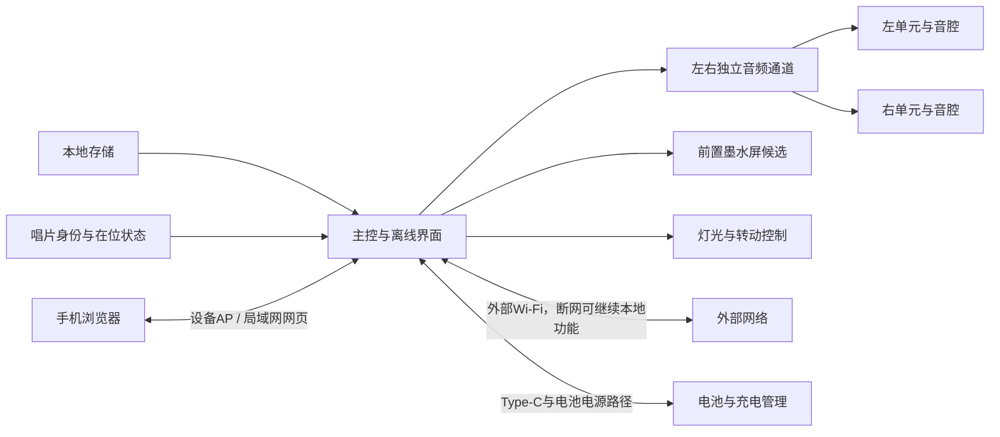

# 共享接口与整机约束

本文只维护跨功能的接口、资源、空间和状态约束。GPIO、封装和具体电源轨必须等准确板卡及模块核对后再确定。

## 数据和信号

| 连接 | 规划约束 | 状态 |
|---|---|---|
| 存储到主控 | 本地歌曲、绑定、事件、图片和设置共用可维护的内容模型 | 需求；介质和格式待选 |
| 主控到功放 | I2S传输左右采样；双单声道模块必须分别验证左/右选择，不能把两个混音模块当作立体声 | 候选；准确模块待核对 |
| 主控到屏幕 | 屏幕刷新不能阻塞音频；优先评估旧墨水屏的静态显示和按需刷新 | 候选；实物待盘点 |
| 主控到识别 | 识别结果区分身份、在位、取走、换片和短暂漏读 | 需求；器件和算法待选 |
| 主控到网页 | 本地AP配网、局域网控制、上传和绑定；状态与本体一致 | 需求；接口契约待实现 |
| 主控到灯光/电机 | 可独立关闭；启停、峰值电流和机械声不得破坏播放 | 需求；驱动待选 |
| Type-C到系统 | 充电、电源路径、输入限流和系统负载共同验证；不能用普通充电模块直接推断边充边用 | 需求；电源模块待选 |
| 外部烧录工具到主控 | 预留后续固件更新与烧录入口，兼顾电平、供电和装配后的可达性 | D053已确认；接口形式和引脚待选 |

## 固件更新与烧录接口

D053确认首版预留便于后续固件更新与烧录的接口。以下是选型与结构评审建议，尚未确定具体器件或引脚：

- 优先比较复用外部Type-C作为充电及USB烧录入口，核实主控原生USB下载或USB转串口方案的支持、成本和软件依赖；Type-C连接器不能只有充电而没有所选方案所需的数据连接。
- 评估不依赖正常应用运行的恢复烧录路径，以及必要的下载模式、复位控制和板上焊盘/连接器。UART、SWD、JTAG等按实际主控支持和用途选择，不要求全部预留；后续若加入无线更新，仍保留有线维护路径。
- 原型板便于接线和测量，成品外部更新入口优先在不拆壳时可用，内部恢复接口经维护盖可达；同时核对数据线插拔空间、电平、电池与USB供电关系及接口占板面积。
- 固件工程记录准确工具、下载模式、复位方法、版本对应和擦除范围，区分应用更新与完整擦除对歌曲、绑定和设置的影响。具体电路、PCB走线和烧录实现另开对应对话。

## 空间、声音和网络

- 左右扬声器优先分别放入可调整音腔；小唱片承接结构、识别部件和挂扣避开运动干涉。若采用NFC等近场路线，再验证线圈与扬声器磁体、电机、金属及壳厚的配合。
- 电池、电路、屏幕开窗、天线净空、Type-C插拔、存储访问和可拆维护路径在同一布局中检查。旧的厘米数图只作历史占地参考，不是外壳尺寸。
- 主控原型可评估带PSRAM的ESP32-S3，但不能据此承诺本地运行通用大模型；AI用途未定，不预先采购麦克风或蜂窝模块。
- 设备首次或手动进入AP，手机配置外部Wi-Fi；连接失败提供重试，断网时本地播放、唱片互动和基础显示继续。外部网络仅用于联网扩展。
- 电池容量、续航、输入功率、温升和充电时间均是待实测量。不得以标称功放功率代替音质或电池结论。

## 建议的第一阶段证据

各专项可独立获得网页保存、唱片识别、显示、电源、灯光或运动证据；音频先核对左右测试音、WAV及实际MP3播放。整合时检查播放并发、共享状态、电源和空间。每个模块记录准确板型、接线、供电、平均/峰值电流、版本和问题；完成跨模块接口评审后再画主板。
