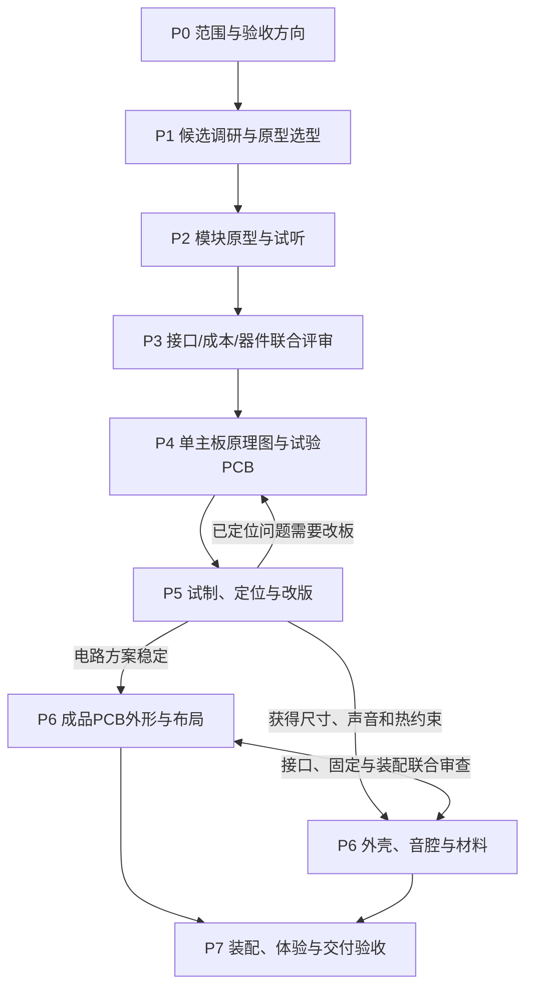

# 项目计划与选型开发流程

功能专项默认并行推进；只有共享接口、真实资源或联合验收形成依赖时才合并验证。

日期：2026-10-09。已确认制作路线见D036–D041。本文件是项目的分阶段计划入口，同时维护候选比较、模块验证、试制和成品交付规则；具体器件、采购和制造参数仍需证据与审阅。

## 当前进度与下一轮

当前处于P0功能细则审阅与P1原型选型，音频基线已进入P2工程准备：阶段主控已按D063确定为S3模块验证、S31成品主线，已形成主控资源对比和候选GPIO分配；音频与挂件已有下一轮方案。本机S3音频板基线已固定依赖并编译，尚未烧录或实物播放，工程暂不发布。尚无本项目实物功能通过、批准BOM或完整成品选型。按D059，以既有墨水屏参考方案作为显示原型基线，不以全面库存盘点作为共同前置；测试所用板卡按准确原理图和实际配置接入。操作映射、文件管理、事件字段、图片导入及异常反馈继续细化。

按D066、D067，完整试验工程先留本机，验证通过后按[模块发布条件](../CONTRIBUTING.md#模块工程发布条件)整理公开版本。本轮规划与资源收敛提交到 `codex/next-planning-convergence`，总规划暂时沿用该分支，`main` 暂不更新。CAD独立测试零件只证明工具接入，不计为产品结构或P2功能通过。

下一轮八条专项并行形成可审阅的原型方案：准确型号、完整材料、同口径费用、资源与空间需求、验证步骤及进入实现的条件。优先收敛一条推荐路线和至多一条有明确用途的备选，不继续无目的扩充候选库。声音与存储建议作为首个制作模块，识别、挂件与音腔同时准备；采购和接线依赖暂选方案、准确规格与重要取舍的审阅。

本轮先将候选缩成可比较的验证安排，再凭材料和试验结果正式选型。已有候选库保留查阅，不以候选数量代表设计完成。播放与内容管理由另一条规划分支维护，见下节；本分支的菜单、唱片行为和内容条目尚未整合其最新结果，不能将旧条目直接作为相关实现规格。

### 不依赖播放与内容管理的并行规划

2026-10-09，用户说明播放与内容管理已在另一分支规划，要求先推进不依赖该部分的工作。本轮只读查阅[行为与内容规划分支](https://github.com/yigencong-1/record-companion/tree/plan/abc-interaction)，查阅版本为`819e1114d75259e600bd3ef3d758483b4f6cd5ae`，已覆盖ABC行为、内容管理、异常处理及可执行规格准备；未合并或改写该分支。

硬件、机械和材料输入可以并行形成，播放策略和内容规则在后续接口核对时统一。以下是本轮总规划的交付安排，不代表器件、尺寸、费用或新行为已定稿。

| 规划范围 | 现在可以推进的具体成果 | 真正需要的输入 | 待对接行为与内容规格的部分 |
|---|---|---|---|
| 音频输出与声音模块 | 补齐两条已确认声音路线的共用/增量材料、准确版本、有效报价、接头净空和同口径试听表 | 主控阶段路线、输出器件资料；功放、扬声器和音腔联合比较 | 歌单循环、停止/恢复、坏曲处理与播放接管；不在本轮重写 |
| 挂件外观、材料和卡座 | 正反面设计要求、标签腔、挂孔/软带/金属扣包络；浅座与插槽的共同配合草案 | 八张配置、标签/天线尺寸候选、挂件和结构专项共同输入 | 电子身份到行为/内容的解释；外观不将歌曲或模式永久固定到标签 |
| 识别硬件与读区 | 读卡模块/标签兼容表、电平/接口/恢复控制、壳厚/金属/邻片的试样条件 | 主控实际资源、候选模块资料及挂件/卡座包络 | 原始事件契约、故障阈值与对播放的影响；事件名称须对接另一分支，阈值仍需实测 |
| 灯光与大唱片转动 | 灯型/漫射与低速传动比较；驱动、使能、默认关断、负载和噪声试验输入 | 大唱片包络/质量候选、结构支撑及电源输入；详细规划按需另开 | 暂停/恢复是否联动、特定唱片触发效果；独立控制沿用现有范围 |
| 显示硬件与维护接口 | 准确墨水屏/驱动板规格、SPI/BUSY/RST、RTC接入比较、屏幕/USB开窗与维护净空 | 参考显示材料的准确规格、主控资源和结构布局 | 播放状态呈现、实体按键映射、曲库/绑定菜单；硬件候选不冻结控件数量 |
| 整机电源输入 | 汇总电源轨/容差、资料平均/峰值负载、启动/待机和并发工况，标明测量缺口 | 各模块暂选型号和真实负载；音频、显示、识别、灯光运动并行提供 | 本轮无须等待歌曲管理规则；关机保存/恢复流程联调时再对接，不提前设计最终电源电路 |
| 结构占位与维护 | 左右净音腔、电子/电池区、天线/线缆净空、卡座/运动避让和拆装顺序 | 各模块完整包络；声音单元、挂件/识别与运动的共同接口 | 不依赖播放规则，但最终按钮数量和布局须与交互规划核对 |

本轮先按[共享输入表](interfaces.md#下一轮共享输入表)补全硬件数据：每项注明准确型号/版号、来源版本、接口/电平、负载、完整包络及费用日期；资料规格、估算、实测分开。未知值写待核实，不用标称功放功率代替平均耗电，不用开发板堆叠推定成品尺寸。

推荐先并行补齐声音模块材料与挂件/卡座接口，电源和结构随收到的模块输入逐项更新；灯光与转动是适合下一轮独立细规划的范围。音质、读区、公差、温升、净充电、续航和最终尺寸留给相应实测。详细菜单、网页内容操作及识别/播放联动使用另一分支的规格，再进入专项实现。

### 主控与系统架构选型：独立子规划先行

按D061，由独立[主控与系统架构子规划](../features/platform/README.md)负责候选调查、资源核对及准确原型配置推荐，总规划汇总跨功能需求、协调共享接口与组织联合审阅。按D063，主控系列的阶段方向已经确认；音频提供解码、存储与上传并发需求，显示、网络、识别、灯光运动、电源和结构提供各自资源与约束。

阶段安排为先用S3跑通模块，S31平台到位后迁移并重验。[资源分配稿](../features/platform/resource-allocation.md)中的S3按官方DevKitC-1-N8R8 v1.1建模，S31按WROOM-3成品模组建模；Korvo-1 v1.1是另列的验证台架候选，三者的引脚表不能混用，均非批准采购或成品安装方案。资源表区分芯片标称、模组可用和开发板实际引出，核对内存占用、USB/启动/恢复、音频与存储、总线共享、低速扩展及供电。S31官方资料和软件支持声明见[主控专项](../features/platform/README.md#本轮公开依据)，国内供货、固定依赖和本项目运行仍待核实。

本轮优先收敛准确S3开发板、内存配置、计算/解码分工与模块材料，作为接线、驱动和固件制作基线。音质与性价比两条声音路线都验证，按约1米听距、相同曲段和相近响度比较；识别、挂件、音腔及负载资料同时推进。S3代码应明确板级配置与外设接口，S31迁移时重核GPIO、I2S/MCLK、SD总线、DMA/内存、USB恢复和供电；不把S3二进制或通过记录直接套给S31。成品具体变体、封装与外围在模块证据及P3联合评审后冻结。

主控选型专项本轮到此收敛，后续接线、构建、烧录和实测由独立实现对话负责。建议第一组用带SD、Codec和按键的S3音频板建立读歌、解码出声、音量/按键及RTC基线，再加入网页与边播边上传；通用S3板可并行准备墨水屏、识别、旋钮、灯光和运动。单声道板载输出只验证播放器基础，左右声道及两条声音路线仍需外接输出验证。接线前重核板号、内存、固定占用、扬声器规格和供电，不照抄参考GPIO表。

其他专项继续并行：音频交回两条声音路线的共用/增量BOM与报价，识别交回准确模块/标签接口，结构确定双音腔台架及卡座/挂件包络，电源据暂选负载启动预算。先收敛本轮测试直接需要的接口和材料，再进入对应模块实现；整机PCB仍等待联合输入与模块证据。

| 主控选型输入 | 核查内容与负责方 |
|---|---|
| 功能与计算分工 | 总规划汇总离线界面、Wi-Fi网页与AP、播放和上传并发；音频给出软件解码或独立解码的资源与代价 |
| 内存、存储与接口 | 音频、显示、网络和识别提供内存需求、I2S/SD/屏幕/读卡总线、电平及GPIO；核对实际板型的可用资源 |
| 电源、维护与空间 | 电源和结构核对供电、功耗、USB下载/恢复、模块尺寸、天线与装配空间 |
| 软件与费用 | 各专项提供可用驱动、开发与验证成本、准确板型/内存配置、国内到手价格和供货依据 |
| 可审阅结论 | 主控子规划在S3原型/S31成品方向下推荐准确板型、内存与资源安排；总规划协调联合审阅，重要取舍由用户确认，正式变体和外围依验证收敛 |

### 首轮收敛稿：2026-10-08

以下主线是总规划推荐的试验安排。除D054–D058的用户要求外，推荐路线、次数和材料均未成为采购或最终器件决定。

| 专项 | 本轮推荐主验证安排 | 下一轮交回的结果 | 保留的对照与未定项 |
|---|---|---|---|
| 音频与存储 | 优先验证主控软件解码、本体存储与左右音频输出；同一链路仍可比较数字功放和DAC加功放 | 准确开发板/存储/输出模块候选，左右测试音、实际音乐、上传并发的验证方案，以及电源与空间需求 | 解码主线仍待确认；独立解码保留资料对照，具体芯片和扬声器未定 |
| 电池与电源 | 按D055暂缓电源电路制作，先汇总各模块的供电信息与共口USB需求 | 电源轨/容差、平均与峰值负载、同时运行工况、候选尺寸和价格证据 | 开源工程只作备用；电源芯片、电池容量、输入功率和续航未定 |
| 结构与声学 | 共用同一对单元与两个可调整独立音腔，对照小挂件浅座和插槽；大唱片始终平放 | 音腔与中央电子区占位、卡座/挂扣空间、运动避让、声音与维护的联合验证方案 | 最终卡座、尺寸、单元和材料未定；概念图不证明实际装配可行 |
| 唱片身份与识别 | 按D058优先用现成无源NFC标签验证；推荐电子编号由本体映射到歌曲/歌单 | 标签与读卡模块兼容候选、读区/壳厚/邻片/取走验证方案，以及给挂件外壳的标签包络 | 具体频段、标签、读卡器、绑定载体与额外在位检测未定 |
| 挂件外观、实体与材料 | 按D060独立比较八张卡的完整外壳，D065生日卡采用近圆形蛋糕轮廓 | 正反面概念、材质与层叠、标签封装、挂扣承力、卡座配合、样品验证与小批费用 | 正式尺寸、图案细节、材料牌号、制造工艺及加工报价未定 |

职责按D060拆分：识别专项维护身份、绑定、标签兼容及在位/取走事件；[挂件专项](../features/charms/README.md)维护图案、材质、封装、挂扣与小批制造；结构专项维护本体卡座、音腔和整机装配。标签外形、壳厚、金属件与卡座配合范围共同审阅，避免各自定型后无法装配或读取。

### 下一轮开始条件与联合检查

- 可以继续原型选型、尺寸占位和试验准备；显示接入前核对所用屏/驱动板版本、供电与引脚，其他功能按新模块准备准确型号。实际接线前核对模块/版号、引脚电平、供电限制、扬声器规格及测量条件，不要求先盘点全部旧材料。
- 电源预算按[共享输入表](interfaces.md#下一轮共享输入表)汇总，不从单个开源UPS或功放标称值推断整机能力。
- 音频与网页共同验证D054：上传允许变慢，但不能自行改成暂停播放再上传。解码、文件系统写阻塞、供电与其他任务分别定位。
- 识别与结构共用挂件/卡座试样，分别改变壳厚、挂扣、邻片及运动条件；读到身份与确认在位继续分开。
- 原型录入实际声音、平均/峰值负载和包络后，再联合评审电源、成品尺寸与正式器件；本轮不直接启动集成PCB或成品CAD。

### 原型选型到实现的下一轮交付

| 专项 | 下一份必须可审阅的成果 | 接着进入的制作工作 |
|---|---|---|
| 主控与系统架构 | 在D063方向下收敛准确S3开发板/内存、计算分工和资源/供电/空间表，核实国内费用与固定软件依赖；维护S31迁移清单 | 准确原型配置经审阅后用于模块实现，S31到位后重验；固件与电路另开实现对话 |
| 音频与存储 | 给主控子规划提供计算/内存/接口需求与候选依据；比较存储/输出链路，给出准确卡座、功放、单元材料及国内报价、WAV/MP3与上传并发验证表 | 共同主控平台及路线与材料审阅后，在独立实现对话做模块接线、播放固件和试听台架 |
| 唱片身份与识别 | 相容的标签与读卡模块推荐、接口和供电、标签/天线外形、起步试样及读区/取走验证表 | 在独立实现对话跑通身份、绑定和取放事件，先少量试样再覆盖八张卡 |
| 挂件外观与材料 | 完整外壳候选组合、八张卡的视觉体系、样片做法、封装/挂扣/卡座配合和小批费用 | 外观与样品方案审阅后，进行样片、加工询价和耐用/识别验证 |
| 结构与声学 | 与音频共同推荐一对单元、可调整音腔台架、浅座/插槽试样、模块和电池占位 | 在独立实现对话制作可拆改台架，试听、取放、挂扣与运动避让并行验证 |
| 电池与电源 | 根据暂选模块形成电源轨、平均/峰值预算、并发工况、USB共口需求和可验证电源候选 | 输入齐备即可启动电源原型电路与模拟负载验证，不必等全部功能完成最终实测 |
| 显示、本地网页、灯光与运动 | 沿用当前专项入口，补齐屏/控件接口、内容保存与播放来源规则、灯光/电机电源和空间需求；复杂细规划按需另开 | 分别验证显示刷新、上传并发、灯光/运动；整合时检查共同资源 |

现成模块、面包板或洞洞板优先用于第一轮验证。需要验证裸芯片外围、供电、接口或布局时，可以在对应实现对话设计专用试验小板；它应有明确试验目标，并非必须先打整机板才能开始。集成主板进入P4前，须具备关键模块证据、共享GPIO/总线与电源预算、USB更新恢复安排和结构包络联合评审。正式器件及成品布局依证据收敛，原型暂选不等于最终芯片定稿。

## 项目总计划

各专项可以同时推进自己的规则、资料和候选，只有进入共享接口或联合验收时才等待对应依赖。阶段编号描述项目门槛，不要求所有专项在同一天完成。

| 阶段 | 交付内容 | 阶段完成条件 |
|---|---|---|
| P0 范围与验收方向 | `product/README.md`、`interfaces.md`、D/F/T编号和用户已确认规则 | 重要体验、离线边界和生日范围明确；未决项显式列出 |
| P1 候选调研与原型选型 | 每条专项的候选、来源、价格性能比较、准确原型材料与接口；显示参考基线 | 推荐满足必要能力，费用、缺口和试验目标可审阅 |
| P2 模块原型与试听 | 面包板/洞洞板/现成模块接线、固件版本、声音/功耗/交互证据 | 关键模块可复现；已知问题可解释；音质同步改善 |
| P3 联合评审 | 接口表、电源预算、BOM、结构占位、扩展接口和正式器件推荐 | 用户完成重要成本、体量和体验取舍；接口与封装有依据 |
| P4 单主板试验PCB | 嘉立创可编辑源工程、原理图、BOM、测试点和制造文件 | 关键模块和联合证据足以支持集成；每块板的目标明确 |
| P5 试制与改版 | 上电、播放、充电、联网、识别、温升、噪声和改版记录 | 每轮解决明确问题；受影响项目重新验证 |
| P6 成品PCB与结构 | 成品板、音腔、外壳、材料、装配和维护路径 | 声音、体量、散热、固定和制造可行性获得实测支持 |
| P7 成品验收 | 匹配的板版号、固件、结构、素材、测试和交付记录 | 已落实的功能、音质、边充边用、续航和日常体验达到验收条件 |

### 并行专项

| 专项 | 先行工作 | 共享依赖 |
|---|---|---|
| 主控与系统架构 | 主控候选、计算分工、原型开发板、内存与资源基线 | 各功能需求、供电/USB、模块空间和软件支持 |
| 音频与存储 | 播放链路、左右测试音、格式、音腔试听 | 电源、结构、网页文件管理 |
| 显示与本体交互 | 墨水屏参考方案、接入规格、页面字段、控件与刷新并发 | 播放状态、网络状态、结构开窗 |
| 唱片身份与识别 | 标签/读卡器、身份/在位状态机、绑定规则 | 挂件封装、卡座、播放、网页、运动空间 |
| 挂件外观与材料 | 八张卡图案、材质/层叠、封装、挂扣、样品及加工费用 | 标签/天线包络、卡座配合、外观与耐用验证 |
| 灯光与转动 | 灯效、停转、机械噪声和峰值负载 | 电源、结构、夜间操作 |
| 网络与网页 | AP配网、上传、保存、状态同步 | 存储、内容模型、离线边界 |
| 电池与电源 | Power Path、充电、温升、功耗和续航 | 所有负载的平均/峰值电流、结构空间 |
| 结构与声学 | 音腔、卡座、屏幕、电池、PCB和材料占位 | 音频、识别、运动、电源和成品板 |

专项的详细规则和候选只维护在对应 `features/*/README.md`；本文件维护阶段门槛和跨专项关系，避免形成第二套功能规格。

结构占位、挂件外形和可调整音腔试样从P1/P2开始并行，不等到P6才首次设计；P6是成品版本的联合收敛。显示、网页、唱片识别等可独立验证，整合时再检查播放并发、电源、空间和共享状态。

## 已确认的制作路线

先逐块实现模块，可以使用面包板、洞洞板和现成模块。模块阶段在条件允许时尽早做好音质，预留有实际用途的扩展接口；随后设计集成原理图和PCB，以一块主板集中功能。试验板利用适用的嘉立创免费打样迭代，其形状可以独立于成品。成品板按声音、装配和外壳需要重新确定外形与走线，PCB和结构可以并行，最终使用更好的材料。

功能、芯片和模块按调研、比较、验证、审阅的过程选择。当前的ESP32-S3、MAX98357A、PN532、BQ25895等都是候选示例；此前建议和估算没有完成完整选型评审，也不是已批准采购的BOM。

## 功能如何选择

在现有简报的已确认范围内，逐项记录以下内容。新增功能、延后实现及只预留接口的取舍由用户审阅；不能把候选功能直接列入首版。

| 字段 | 每项功能应回答的问题 |
|---|---|
| 使用情景与价值 | 平时何时会用，完成什么操作，是否经常需要？ |
| 状态与优先级 | 已确认要求、待评估建议，还是用途尚不清楚？哪些属于首版、后续实现或接口预留？ |
| 离线与联网 | 无网能做什么，断网如何表现，是否需要外部服务？ |
| 体验目标 | 用户怎样知道操作成功，怎样退出，如何验收？ |
| 实现代价 | 增加哪些器件、软件、空间、功耗、费用与维护工作？ |
| 决定与证据 | 哪条用户决定支持它，哪些数据已核实，什么仍需试验？ |

AI的用途未定，先探索实际场景。麦克风、蜂窝模块和订阅服务仍需用途及候选比较支持。生日范围继续遵守D031，仅一张唱片和一个菜单入口。

## 芯片与模块如何选型

每次先写用途和必要条件，再检索候选；核对官方手册、参考设计、真实供货及软件支持，然后进行适度试验。先排除不满足必要条件的候选，再比较性能、价格与实现成本；综合评分的权重若涉及音质、体积和价格的重要取舍，由用户落实。

建议使用下表比较，单项没有资料时写“待核实”，不根据品牌、销量或最大额定值给出性能结论。

| 比较项 | 候选A | 候选B | 候选C，必要时 |
|---|---|---|---|
| 名称、准确型号与公开资料 | 待调研 | 待调研 | 待调研 |
| 必要能力、接口与兼容性 | 待核实 | 待核实 | 待核实 |
| 实测表现、测试条件与问题 | 待试验 | 待试验 | 待试验 |
| 功耗、供电、尺寸与封装 | 待核实 | 待核实 | 待核实 |
| 单价、数量档、供应商与查询日期 | 待询价 | 待询价 | 待询价 |
| 外围件、焊接、移植和调试成本 | 待评估 | 待评估 | 待评估 |
| 供货、替代及维护条件 | 待核实 | 待核实 | 待核实 |
| 推荐理由、关键取舍与适用阶段 | 待形成 | 待形成 | 待形成 |

原型模块与正式芯片分别评审。现成模块能节省验证时间；转入PCB时要重新核对外围电路、封装、焊接能力和供货，明确继续使用封装模块还是采用芯片最小系统。相同功能不意味着能直接替换。

价格记录区分规划估算、实际报价和已支出。总成本同时包含元件、PCB、贴片或手焊、必要钢网、结构试样、运输和改版损耗；免费PCB的节省单列。更贵的材料和器件要说明具体收益，预算暂无硬上限不等于无需比较。

## 逐块验证与接口预留

| 模块 | 独立验证重点 | 向主板提供的结果 |
|---|---|---|
| 声音与存储 | 本地格式、左右声道、控制、稳定播放；配合早期音腔试样改善人声、低频、底噪和失真 | 数字或模拟接口、音频路由、实际供电电流、单元和音腔要求 |
| 电池与电源 | 电源路径、充电结束、Type-C切换、低电行为、温度检测与稳压 | 平均及峰值预算、保护和测温要求、系统电源接口 |
| 墨水屏与时钟 | 实物屏驱动、刷新并发、可读性、离线时间与状态显示 | 接口、时序、尺寸、安装与刷新策略 |
| 唱片识别 | 在位、取走、换片、未绑定标签与预期壳厚 | 通信接口、线圈位置、识别范围和固定要求 |
| 网页与本体操作 | AP配网、断网本地使用、上传保存、播放状态一致 | 网络和存储资源、操作契约、配置保存策略 |
| 灯光与运动 | 亮度、可靠停机、电流、机械声及对声音的干扰 | 控制接口、峰值负载、隔振与运动空间 |

主控建议先调研声音与存储链路，再实施这一块模块。比较主控解码配合I2S音频链路、独立音频解码/播放方案等适用路线，结合网页写入存储、左右声道、音质、功耗和移植成本形成候选报告。首块模块的具体开发板与功放在该报告、准确型号和原型费用审阅后暂选。

面包板适合低电流控制和快速接线。功放、充电、稳压及电机优先用已核对的模块、端子、短线和可靠配电，必要时转到洞洞板焊接；数字音频和存储信号线保持短且有连续回流路径。接线、触点、电源去耦或地回流引起的问题应先排查，避免将其误判为芯片或扬声器性能。

音质在模块阶段同步改善：尽早制作两只扬声器的可调整音腔，用同一音乐、相近响度比较实际听感与功耗。功能通过和音质记录分别保存；裸放扬声器的低频不能替代装入音腔后的结论。当前不强制指定参考设备。

| 预留类别，均待接口评审 | 要明确的条件 |
|---|---|
| 烧录与诊断，D053明确预留 | 固件更新与烧录入口按[共享接口建议](interfaces.md#固件更新与烧录接口)比较；核对恢复下载、复位、关键测试点、供电及成品维护可达性 |
| 外接低速模块 | 按实际主控选择I2C、UART等接口，记录电平、供电、电流、引脚和占板面积 |
| 声音或AI扩展 | 先评估音频输入或输出用途、总线和并发资源，再决定连接器或未装器件位置 |
| 软件与资源 | 模块职责、存储和内存余量、配置版本，以及未接扩展时的正常行为 |

预留表写清用途、资源占用、保护需求和代价，不笼统预留所有接口。精确GPIO、连接器、电源轨及未装器件待主控和外围方案比较后确定。

## 试验板与成品板

目标是一块主板集成主控、存储、音频、电源及所需控制电路。屏幕、扬声器、电机等按位置连接到主板。若实测或装配要求确需分板，应提交具体证据、成本与方案，先由用户落实这一目标的变更。

| 项目 | 工程试验板 | 成品板 |
|---|---|---|
| 目标 | 验证集成电路、定位问题、方便测量和返修 | 满足最终声音、体量、外壳和装配 |
| 板形与布局 | 可独立板形；主控建议便于加工和探测的规整外形 | 按接口、固定、音腔、电池和天线共同确定 |
| 打样条件 | 使用满足当期规则的免费券，记录资格、工艺和次数 | 按成品需要选择尺寸、层数、板厚和材料工艺，不受免费券设计约束，仍满足制造工艺要求 |
| 调试入口 | 保留清晰测试点、接口和必要的隔离或旁路位置 | 保留必要诊断、烧录与维护入口，优化可达性与空间 |
| 资料组织 | 规划保存至hardware/prototype/下独立版号目录 | 规划保存至hardware/product/下独立版号目录，保留变更依据 |

原理图功能分块保持可追溯，两个板型分别维护外形与布局。试验板先验证电路，同时用结构占位模型检查主要器件尺寸。电路方案稳定后，成品PCB和外壳并行细化，共同审查接口、固定孔、天线净空、NFC距离、音腔、电池散热和装配维护路径。

改变板形、布局、走线、地回流或外壳材料后，重测受影响的声音、充电、温升、通信和续航项目。试验板通过的结果不能直接替代成品验收。

成品材料按声学密封与刚度、触感、耐用、散热、加工精度和维修需求比较，选择带来实际收益的升级；具体材质、品牌、工艺和费用仍需试样及用户审阅。

## 嘉立创免费打样规则核查

访问日期2026-10-08。以下为实际读取的官方公开规则，具体券、账号资格和订单条件在每次试制前再次核对；本轮没有领取券、上传制造文件或下单。

| 项目 | 当前公开规则与本项目处理 |
|---|---|
| 常规尺寸与数量 | [PCB+SMT免费券细则](https://www.jlc.com/portal/server_guide_37595.html)，2026-09-29更新：10×10 cm以内、5片，排除“长宽小于1CM”的板；单片出货、常规工艺。试验板尺寸和工艺按选定券核对，未固定设计尺寸 |
| 设计软件 | 上述细则区分不限制设计软件的通用券和需嘉立创EDA设计的专用券；本项目使用嘉立创EDA平台，实际文件和下单路径仍需符合所用券要求 |
| 阻焊与入口 | 常规细则写双面板支持杂油，单、四、六层仅支持绿油；使用嘉立创小助手、移动端下单。板厚、铜厚和附加工艺不能仅凭“常规”推定 |
| 次数与有效期 | [0元福利规则](https://www.jlc.com/portal/server_guide_4114.html)，2026-09-29更新：每月两次0元福利；[领券中心](https://www.jlc.com/coupons)写领取后30天有效，六层免费券每月仅选其中一张使用。用户当前余额未核实 |
| 六层额外条件 | [六层券细则](https://www.jlc.com/portal/server_guide_37576.html)，2026-09-29更新：真实六层，不允许空白层凑层数；10×10 cm以内、1.6 mm、5片、绿油、单片不拼板、沉金、不需要阻抗，后续免费资格涉及上次订单晒单 |
| 沉金面积 | 领券中心写免费沉金面积不得超过整板20%；具体适用券及详细口径在工艺评审时核对 |
| 开源与返单 | 领券中心原文：“开源文件、返单或者存在拆单行为均不支持免费打样”。它没有在已读内容中定义“开源文件”是否包括自行设计后公开的工程，也没有说明真实改版与返单的判定边界，需在提交制造文件前向官方核实 |
| 费用范围 | 0元福利页宣传免运费及24小时加急，实际券、附加工艺、贴片、器件和结构费用应逐项核对；不将PCB优惠等同于完整研发免费 |

本项目公开与PR协作要求保持有效，参与权限见[贡献说明](../CONTRIBUTING.md)。自研公开工程的免费资格尚未确定；不为取得优惠改变公开要求、不通过无意义改动假装改版。真实改版先列问题与变更，再核对规则。若优惠不适用，形成实际付费报价与影响，采购前由用户落实费用。

免费券是降低试制费用的方式，层数和工艺仍依据性能、布局、加工与成本比较选择。免费代拼服务和免费PCB打样券是不同规则，本项目不从代拼宣传推断试验板可以拼板免费出货。

## 每轮试制记录与下一步

不规定固定改版次数。每轮试制应解决明确问题；已经通过的项目仅在电路、布局、结构或固件变化影响它时重测。停止改版的依据是验收通过和已知问题有明确处理，不是免费券用完。

| 记录项 | 本轮必须明确的内容 |
|---|---|
| 版本与目标 | 板版号、原理图/PCB版本、固件版本；本轮要消除的关键不确定性 |
| 改动与原因 | 已定位的问题、具体修改、影响哪些功能和测试 |
| 制造与费用 | 工艺参数、券种及资格依据、BOM与实际支出；记录公开结果，不保存个人订单或凭据 |
| 实测 | 上电、功能、声音、充电、温升和接口中与本轮相关的预期及观察结果 |
| 下一步 | 已通过项、剩余问题、继续改版或进入成品设计的依据 |

首个制作模块建议从[声音与存储](../features/audio/README.md)开始：形成候选比较，与本机库存核对，给出推荐试验路线、材料缺口和报价依据；用户审阅重要取舍后，再落实暂选器件、接线与模块制作。其他专项同时维护自己的下一步，受影响的共享接口交回联合评审。
