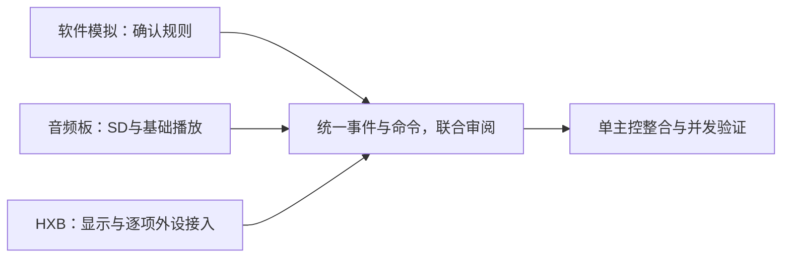
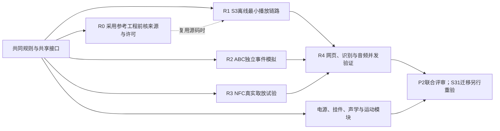
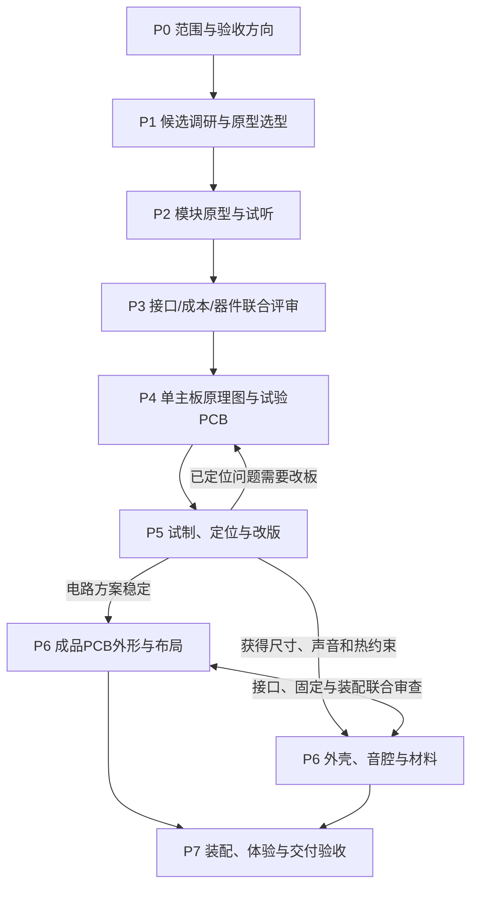

# 项目计划与选型开发流程

功能专项默认并行推进；只有共享接口、真实资源或联合验收形成依赖时才合并验证。

日期：2026-10-10。已确认制作路线见D036–D041。本文件是项目的分阶段计划入口，同时维护候选比较、模块验证、试制和成品交付规则；具体器件、采购和制造参数仍需证据与审阅。

## 当前进度与下一轮

ABC与内容规则已确认至D085，并以D089–D090补齐跨B/C替换及全坏停止后的显式PLAY恢复。PC工程`0.2.2-batch2`两批已运行47 PASS、0 FAIL、0 UNRESOLVED，真实SD掉电、硬件适配器和MP3三项仍待实测；公开工程见[V018](validation.md#v0182026-10-10-播放与内容pc逻辑仿真)。音频板已构建、烧录并响应命令，尚未完成SD读取、发声与完整播放器验证，完整板级工程暂留本机。阶段主控沿用S3模块验证、S31成品主线，GPIO为候选资源稿。器件、音质、控件/显示流程、整机电源、BOM与成品结构仍依证据收敛。按D059沿用既有墨水屏参考方案，接入时核对准确规格。

按D086，完整试验工程先留本机，验证通过后按[模块发布条件](../CONTRIBUTING.md#模块工程发布条件)整理公开版本。PR #8的行为规则与PR #9的硬件规划联合整合为共同基线，总规划按D088负责跨PR审阅和 `main` 收敛。原硬件分支D066/D067改为D086/D087，行为D066–D085编号不变；D087保留此前只提交审阅的历史授权范围。CAD粗模只支持占位几何审阅，嘉立创连接只证明工具接入，均不计为P2实物功能通过。

各专项仍并行收敛准确原型型号、完整材料、同口径费用、资源与空间及验证步骤。2026-10-09开源工程已登记10个来源条目，暂不扩大检索；R0源码/许可证/可复现性审核在采用参考工程前执行，登记来源不代表已完成移植或复现。RC-08纯软件契约/模拟准备与实体模块选型可以并行，实际任务及准入条件维护在[TASKS.md](../TASKS.md)。音频与存储仍是首批实体模块，识别、挂件与音腔并行准备；采购和接线需材料及重要取舍审阅。

先将候选缩成可比较的验证安排，再凭材料和试验结果正式选型。已有候选库保留查阅，不以候选数量代表设计完成。行为规则、共享接口和硬件输入在共同基线中维护，软件模拟与各硬件模块按自身准入条件并行，不必等待整机所有候选定稿。

### 本轮联合收敛：2026-10-10

| 专项 | 已形成的可审阅结果 | 下一步与进入实现的条件 |
|---|---|---|
| 主控 | S3验证/S31成品方向与候选资源稿 | 按实际板型重映射；核对PN7160的独立VEN及灯轨使能、故障、可选脉冲/PWM，旧余额不代表完整装配余量；SD卡检测不占用扩展器INT的GPIO9 |
| 音频与存储 | 两条声音路线的共用/增量材料、报价缺口、接线和试听方案 | 确认本轮准确模块与测量条件，先做播放器基线，再做左右输出与两路线同口径试听 |
| 电池与电源 | 负载输入表、工况和带版本/许可的参考电路 | 补准确供电轨、启动峰值及平均负载后做电源原型；参考数量不代表已批准BOM |
| 识别与挂件 | NFC候选和软件依据、内部挂带孔与标签腔共同接口；写实蛋糕与无预绘光泽的通用卡概念 | 比较准确PN532/PN7160模块与驱动组合；共用样片验证壳厚、金属扣、邻片和取放，不由读卡器直接控制播放 |
| 结构与声学 | 前向左右单元、独立音腔/中央维护区及两类卡座；本机SW占位粗模 | 粗模尺寸、零干涉和材料颜色不是制造结论；补真实器件包络、净音腔、线缆与拆装路径 |
| 灯光与转动 | 独立轴承支撑/低速驱动候选；主要发光位置为唱片外缘下方固定柔光圈 | 转动小模块先验证，灯珠、漫射及运动分别提供电源/空间输入；噪声、跳动、均匀度和负载待实测 |
| 显示与网络 | 墨水屏参考基线、AP配网、离线边界、D081基础管理及D085保存规则 | 核对屏/驱动板规格；以共同命令与状态实现本体/AP页面，刷新、上传并发、持久化与重试去重待验证 |

完整在途硬件工程及原始测试材料留本机；已实际运行通过的PC验证工具按自身功能范围整理公开源码、复跑方法与脱敏结果。专项按自身材料条件进入模块实现；跨专项复用接口先核对，不必等待整机所有候选定稿，采购与集成主板另行审阅。

### 下一轮总规划与并行交付

2026-10-10已收敛PR #8的软件逻辑仿真；用户要求音频规划、音频板测试及HXB外设等待对应硬件到位再接续。当前目标是**发布可复跑的软件契约与结果，继续无需实物的整机操作和结构接口规划**。日常显示、生日及低电等[体验草案](README.md#首版整机体验草案)按具体问题审阅；结构粗模下一轮先核参数、安装/维护包络和紧凑布局。问题、产物及依赖明确后再启动专项。

| 当前工作 | 首批步骤 | 本轮交付与后续门槛 |
|---|---|---|
| 纯软件控制器模拟 | 两批已完成ABC、故障/迟到事件、快照、配置幂等、引用与媒体发布、PC文件恢复；D089–D090已确认并回归 | 公开`0.2.2-batch2`源码、交接契约与47 PASS结果摘录；真实SD、适配器与MP3为3项DEFERRED，下一步以实际硬件接入为条件 |
| S3音频板播放器基础 | 核板型/目标/接入；启动、SD读歌、低音量WAV、MP3、音量/三键及离线连续播放 | 真实接线/供电/版本和板级证据；基础通过后再进RTC、AP上传并发和外接左右输出，不把板载单声道作为双声道音质通过 |
| HXB外设接入 | 按实际板资料核下载/恢复，优先接参考墨水屏做静态图/中文/刷新；旋钮及NFC按材料条件逐项进入 | 独立测试配置、引脚/电平/显示证据和NFC准入缺项；板载RGB占用不得照抄其他板的引脚，未知接入条件先核实 |
| 总规划联合审阅 | 统一PLAY/PAUSE/STOP/NEXT、放置/会话身份和EOF/失败/可信物理事件；核对各测试结果 | 软件验证规则、硬件验证实际能力和时序；随后选择单主控台架整合并发，不能由两板分别通过推定成品已集成 |

音频板启动/烧录已取得部分证据，SD/播放等待TF卡和喇叭核对；HXB已ROM识别，应用恢复、屏幕与NFC待相应接入条件。硬件到位后接续既有工程，准确端口、屏/驱动、电平和供电按步骤核对；本机位置与会话入口只记本机。成品仍沿用S3验证/S31主线，准确成品模组和外围依证据收敛。

并行依据明确的独立问题及输入，不要求整机全部冻结后才验证模块。各模块按[共享输入表](interfaces.md#下一轮共享输入表)核对准确版本、资源、负载、空间和费用，区分资料、估算与实测。跨B/C完整替换沿用D089，全坏停止后的显式恢复沿用D090。

本轮软件完成条件已达成：源码可独立复跑，确定场景有实际结果和交接契约。硬件基础与单主控整合继续按实际证据验收；材料未齐时保留步骤和缺项。编译/模拟/实物分别报告，完整历史工程及在途实现按D086留本机；具体待办见[TASKS.md](../TASKS.md)，后文保留RC-05至RC-08的契约依据。

### 2026-10-09 ABC规划后的近期交付

| 工作包 | 可审阅交付 | 进入验证条件 |
|---|---|---|
| RC-05A/B | ABC统一事件/会话契约及无硬件模拟用例：B取走清空、C取走保持、C→A、外部点歌、手动退出、迟到事件/旧回调 | 状态与预期可核查；目前未执行模拟 |
| RC-03A（2026-10-09研究已完成） | 已按准确型号形成PN7160 MINI V1（两可换天线）主试验候选，NTAG213身份基线及PN532诊断备用；列出已核公开美元/人民币单品标价、线束/小圆标签国内报价缺口 | 进入P2前须审阅国内到手费用和准确板/标签/线束，落实测试工具；尚未采购、烧录或实测，纯NFC方案未被证明可行 |
| RC-03B | 纯NFC读区、连续漏读、可靠离座；浅座/插槽、挂扣、邻片、电机联合试验；必要时比较独立在位检测 | 以T02记录速度、错读、误退出；仅试验后定参数 |
| 其他专项 | S3原型板型/资源、双声道两套音频BOM、可调整双音腔和电源负载预算 | 并行准备，遵守D055/D063/D064 |

RC-03A的PN7160 MINI只是可审阅的技术候选，**未冻结原型及成品方案**。2026-10-09新增“先核查嘉立创已做出的NFC唱片机整机工程、再采购或接线”的推进顺序：优先获取/验证lueer的ESP32＋RC522＋网页源资源、yio-lab的ESP32＋RC522＋SD＋I2S结构，以及lo_startnet的固件工程/取放状态机；RC522可作为S3最小链路对照，PN7160继续保留为原型/成品技术候选，绝不因找到已做项目就默认B离座可靠。先完成资料和许可核验、准确版本、国内费用，再进行S3模块验证与N0–N3试验；需要时才加独立在位传感器。当前没有读取外部ZIP、复现固件或通过实物试验，也没有获准采购、设计整机PCB或更改main。

### 同类开源整机复用优先级（2026-10-09审阅）

未来实施主线按照**R0源工程与许可核验 → 最小链路复用 → NFC可靠性比较 → ABC及双声道/网页并发集成**推进；R0不是当前分支继续产品逻辑规划的前置条件，不以从零自绘原理图作为实施第一步。参考整机按[识别专项对照与R0–R3门槛](../features/records/README.md#2026-10-09--嘉立创开源广场相似工程与优先复用评估rc-03a补充)维护；声音适用边界见[音频专项](../features/audio/README.md)。主要审查的是ESP32 NFC音乐播放器、Arduino网页素材、STM32唱片机工程ZIP和PN7160公开读卡器资料，实际代码/EDA文件尚未下载核验。

**不会因此回退既定产品决策**：仍先用S3做模块验证、S31做成品主线；A/B/C的语义与灯光独立、本体按键暂定、音质与性价比两条路线同时测试均保持。复用是否允许公开发布取决于原作许可/署名与可能存在的转载和非商业限制，不预先复制第三方材料进入公开仓库。

### RC-PROT-01 · 参考工程驱动的首个S3可验证原型：完整执行规划（2026-10-09）

**本节为参考工程复用规划，尚未完成第三方整包导入或复现。** 本机音频基线编译状态见当前进度，不能据此宣称参考工程复现或实物通过。与P0–P7对应：在采用源码前完成来源/许可与固定依赖核查，各部件满足自身准入条件后分别进入P2验证。

**复用基线与角色**：优先从已确认有KiCad、固件和离线网页源码的[GH-01 NFCMusicPlayer](../references/sources.md#2026-10-09--nfc唱片机与实体音乐播放器参考工程登记)理解“UID→本体映射→文件→I2S/网页”端到端接口，但它读卡2000ms一次，去抖/离座不能照搬，且README许可徽章与缺少独立LICENSE需先复核。使用**GH-02 MIT模块设计**审阅MappingStore、Reader、Audio、Web的职责；该项目WIP，没有完整原理图/BOM，且用`PICC_IsNewCardPresent()`判断在位必须另测。[OSH-01 lueer](https://oshwhub.com/lueer/card-music-player-ultimate-editi)与[OSH-02 yio-lab](https://oshwhub.com/yio-lab/record-player)保持国内整机对照，附件尚未核验，不作为可直接导入固件。需要B模式驻留/取走的反例对照时参考GH-03 LauraBox和OSH-03 Minecraft，但它们的“暂停后再放继续”与本项目B“停止清空，从模式起点重新开始”不同。

**路线选择：参考优先、适配优先，不做整包移植。** 固定产品语义D066–D070：A单曲点播取走继续、B取走停止清空、C取走保持；有效新A及本体/网页主动选其他歌曲均先退出B/C；暂停、调音量、模式内切歌不退出；灯光不与ABC强制绑定、实体按键尚未冻结。主控仍S3验证→S31成品，声音仍两条路线约1米全套测试、D054上传播放不中断。

| 任务/次序 | 具体工作与产物归属 | 可核查验收及下一步门槛 |
|---|---|---|
| **R0 来源与基线（采用参考工程前）** | 逐文件复核GH-01 KiCad/固件/网页、GH-02模块设计、OSH ZIP/EDA附件；记录准确SHA/依赖/许可证、允许范围、源码完整性和最小可复现编译情况。证据留references及对应专项 | 已浏览部分来源，尚未完成全面ZIP/EDA审核或第三方工程复现；原作者模块资料、独立编写的模拟与硬件准备可并行 |
| **R1 离线最小播放链路（RC-01+RC-02）** | 核对实际S3测试板版号、内存、供电/USB恢复和固定ESP-IDF依赖；参考DevKit资源表须按板级原理图重映射。microSD存至少两首测试曲，验证44.1/48kHz PCM、MP3及I2S左右输出；板载单声道仅建立基础播放器，左右音路与两声音路线另验。采用注入模拟UID先排除RF因素。完整工程按D086先留本机，通过后再整理必要源工程及接线/BOM | 无互联网可选择内容并完整播放；左右独立音路、暂停/切歌可用；建议30分钟无未知断音/重启，记录构建/下载/板号、格式、音频缓存与SD最长读延迟。声学两套路线不能因选参考工程被降级 |
| **R2 ABC控制器模拟（RC-05B，与R1并行）** | 纯逻辑注入`CARD_INSERTED/REMOVED/UNCERTAIN/READER_FAULT`与本体/网页命令；构造`placement_id`、`session_id`、单调事件序号及可判定的状态转移日志。建议实现域层与具体NFC/音频/网页适配分离；测试代码随固件原型独立可运行 | V018已覆盖并通过列入结果包的确定场景：A取走不停、B退出清空且再放从头、C取走保持、C→A、网页主动点歌退旧模式、模式内NEXT/暂停、手动退出必须真再取放、重复UID、迟到旧事件、开机已有片不自动启动、读卡故障不伪造离座，以及D089完整替换和D090全坏后显式PLAY。调音量、PREV、启动中切歌、真实适配器、MP3、SD/电源和未列L/C/E另待验证 |
| **R3 NFC取放与机电试验（RC-03B）** | 在R1/R2可重复后选择**一个**可买且接口可用的身份读取台架：RC522作为大量现成工程的低门槛基线、PN7160 MINI I2C作为第二技术候选，先核准确标签/线束、电平、库、GPIO、成本；只有首试证据不足才开展第二链路对照。测两种卡座、真实读区/线圈间距、单次读卡超时、邻片、重启、长期在位和B离座 | 延用建议指标：身份确认≤500ms、B物理离座到模式停止≤500ms、到实际出声≤1s；八张各20次共160次作为原型筛查，持续在位、50/100/200ms短漏读、故障、换片需0误身份/重复/误退出；记录物理真值与p50/p95/最大延迟。单纯UID消失不是确认物理离座；若无法同时满足速度/误判则优化天线或进入独立在位传感器对照，不牺牲B |
| **R4 联合并发与恢复（RC-02/RC-05C）** | 最小网页/本体共享播放状态、内容映射与新歌上传；将分块写入、音频供数、NFC采样、墨水屏刷新分离，复用既有可读的UI/文件管理思想而非照搬直接写卡回调；断网、满卡、上传中断、重复绑定与失败保存分别定位 | AP/局域网播放WAV/MP3同时上传，各建议30分钟连续操作，**允许上传限速但不暂停音乐**；无可闻断音、欠载0、无未解释重启；上传失败旧内容/映射不损坏，状态一致，记录最长SD写阻塞/缓冲低水位/任务资源。灯光/转动/电池正式联合电流留给后续模块验证 |

**任务分工边界**：R2事件模拟无须等R0复现第三方固件，但引用/复制外部源码前须核来源与许可。R1在准确S3板型、电平与材料审阅后开展；R3有真实标签/卡座和独立物理真值后可独立测试，联合行为验证再接入控制器；R4等待参与模块与接口可用。完整工程按D086先留本机，各结果按原型版本保存，不为每次对话新建重复规划。

**硬件方案筛选规则**：首选是资料与驱动可读、3.3V接口和指定小标签相容、独立总线资源可协调、国内价格与供货有依据、卡座读区可控的一条原型路线，而不是“芯片越新越好”或“别人做过就免验证”。RC522需要SPI时必须重算MISO/CS/RST与屏幕SPI冲突；PN7160需要I2C/IRQ/VEN，主控S3草案的VEN直连要额外算GPIO；两套外设示例引脚都不能原样迁移。若源工程不完整/许可不清，优先用官方库做小模块清洁实现、保留参考接口思想，不阻塞本项目。没有用户批准报价不采购。

**失败后的决策分流**：R0许可证不清或附件不可得→只参考概念，改读许可清楚的源/官方例程；R1无法编译→先定位开发框架/库API/具体板型，不强行换芯片；音频有断音→先排供电、卡最长阻塞/文件锁、DMA缓存，再评估计算瓶颈；R3错读/误退出→先拆分天线、壳厚、金属件及驱动读取故障，分辨纯NFC物理在位信息不足时试独立在位检测；R4上传打断音乐→必须修改缓存/写入调度，不把D054改成暂停播放才能上传。

**本轮放行边界**：本文件是**完整实施规划可审阅**，不是R0完整移植审核、R1–R4测试已通过。真正进入P2须准确板型/依赖和材料、合法来源/许可、可复现操作及T01/T02/T04测试记录；用户确认费用与重大取舍后才采购/接线，P3之前不集成成品PCB。阶段产品决策已确认至D085；RC-07的Q-I01–Q-I04已登记为D082–D085，但仍未进入固件或硬件实测。

### RC-05A · ABC边界行为审查与规则收敛（2026-10-09）

**本节维护产品逻辑与实现交接。** 已确认决定D066–D070保持不变，R0源码与许可复核在采用参考工程前执行，代码实现与采购由对应任务的准入条件控制。

本轮关键收敛结论：**A是一次性点播命令而非长期驻留模式；B/C才创建持久模式会话**。真实确认B离座属于独立强制退出事件，不能拿“新卡无效所以不切换”阻止旧B正常退出；C取走继续，错误新卡不能随意关闭C。模式内下一首是`MODE_NEXT`，本体/网页主动选其他歌曲是`SELECT_TRACK`，必须不同命令语义。所有具体状态转移与待确认项以[共享接口RC-05A审查表](interfaces.md#rc-05a--abc行为状态机与冲突消解草案2026-10-09)为准。

**U1–U5审阅已完成（D071–D075）：** C同片再放不重启、B持续读卡故障超阈值保护退出、C断电不恢复、实际启动失败不回滚、停止音乐不退出B/C。D079/D082已明确STOP后PLAY从最新选曲0:00；阈值、可信空座证据、绑定持久化和本体/网页控制仍需实现验证。

RC-06的Q-C01–Q-C06已登记D076–D081；RC-07停止态选曲、整张歌单删除保护、坏曲修复与双入口保存也已登记D082–D085。RC-08将已确认规则转为可审计的接口/验收任务包，主控与其它硬件由专项并行负责。规划与实现更新通过PR审阅，采购与成品冻结仍需材料、费用和证据支持。

### RC-06 · 曲库、歌单、身份绑定与本体/网页统一控制（2026-10-09，产品行为已确认）

**阶段：Q-C01–Q-C06已确认并登记D076–D081；相关PC控制与内容场景已执行，范围见V018。** 依D013/D015/D042/D054/D066–D075，歌曲由本体本地管理，唱片无源标签只提供数字身份，A单曲点播、B/C模式循环；本体无手机/断网须能完成基本功能，网页负责便捷批量管理和上传。参考源码复现与采用前审核由R0负责，不在此重做主控选型。

| 工作段 | 这一轮形成的可审阅设计 | 下一步准入与跨专项依赖 |
|---|---|---|
| **RC-06A 数据与身份关系** | 歌曲Track、歌单Playlist、模式ModeConfig、电子身份与设备卡CardBinding、物理文件MediaFile使用稳定内部ID；可见卡号0/1–5与原始UID分离，A只绑定一首歌、B/C可以绑定单曲/歌单/特殊行为 | 具体JSON/数据库/Flash/SD落盘位置未选，先检验重命名不破坏卡片、歌单引用及生日单一内容入口 |
| **RC-06B 统一命令和会话所有权** | 本体/网页统一SELECT_TRACK、MODE_NEXT/PREV、PAUSE_AUDIO、STOP_AUDIO、MODE_EXIT和显式模式再播放语义；UI与模式资源分开，旧回调/请求不改变新会话 | D079/D082：显式重播从最新选曲0:00开始，STOP后NEXT选曲但保持静音；本体具体控件未冻结 |
| **RC-06C 编辑与内容生命周期** | 上传临时项→核验→发布曲目；重命名不变Track ID；绑定和歌单编辑保存仅影响下次模式进入；被卡/歌单/当前播放引用的曲目删除前保护 | D076–D078已确定行为，底层并发锁与持久化仍待验证；D054上传不主动暂停音乐 |
| **RC-06D 存储可靠性和并发** | 设备端单一文件/配置写入管理者维护提交序列与返回修订号；D085最后成功保存生效，网络重试同一请求不重复执行 | 不能因页面使用旧版本而自动拒绝保存；掉电/写入失败不得冒充成功，FAT重命名不保证事务，恢复策略待测 |
| **RC-06E 界面和验收契约** | 本体覆盖曲库/绑定/退出/异常的离线入口，网页提供批量上传及同一状态快照；生日菜单和唯一生日卡复用内容引用 | 只确定能力与界面语义，不锁定按键数量/菜单层级；按T02/T03/T04与新增内容用例验收 |

**推荐软件模型（非已批准实现）：** `RawTagIdentity(tech,uid_bytes,length)`→`Card(card_id)`→`Binding(action_type,target_kind,target_id,revision)`；`Track(track_id,media_ref,metadata,status)`和`Playlist(playlist_id,ordered_track_ids)`分离；B/C的`ModeConfig`引用可无音乐的特殊行为。卡片外观、数字身份、文件路径、歌曲显示名、歌单ID都不得混为一个编号。当前目标建议绑定到稳定内容ID，而不是歌曲路径或目录顺序。

**已确认D077–D078的运行时语义：** B/C进入模式后，绑定和歌单变更只保存新版本，不改变活动模式和循环；下一次明确进入才生效。物理文件如果仍被当前会话使用，删除必须受D076引用保护。UI需明确显示“修改已保存，当前模式仍使用旧版本”。具体快照数据结构和文件占用检测是工程提案，不等于已实现。

**Q-C01–Q-C06已全部确认（D076–D081）：**

| 决策 | 最终行为 |
|---|---|
| Q-C01 / D076 | 卡、歌单或当前播放引用的曲目受保护；显示引用，先解绑/移除/结束使用再删 |
| Q-C02 / D077 | 活动B/C歌单快照不因保存更新；下次进入模式才用新版 |
| Q-C03 / D078 | 在位修改A/B/C绑定只保存，不自动切换；允许明确执行 |
| Q-C04 / D079、D082 | STOP后显式PLAY从**当前选曲0:00**重播，NEXT可在STOP中更新选曲但不发声；PAUSE恢复保留时间点 |
| Q-C05 / D080 | 运行中坏歌记录并跳过、同会话不无限重试；全不可播则音频停止报错但B/C不退出 |
| Q-C06 / D081 | 本体承担基础离线编辑，批量/复杂管理主要交给无需外网的本地AP网页 |

**剩余工程议题**：目录与存储事务、并发提交、掉电恢复、坏曲修复发布及引用扫描的实现仍待验证。产品语义按D076–D085执行，本节未提供相关控制器、存储或实物测试结果；采用参考工程前另做R0核查。

### RC-07 · 停止状态、内容引用与本体/网页异常交互（2026-10-09，已确认）

**Q-I01–Q-I04已得到用户确认，正式编号D082–D085。** 这是产品行为定稿，不代表软件实现、网页可用或实物测试通过。S3验证/S31成品方向和采用参考工程前的R0审核要求保持。

| 工作段 | 用户最终确认 | 下一步实现/验收关注点 |
|---|---|---|
| RC-07A · STOP态选曲 | D082：STOP_AUDIO后MODE_NEXT只移动选曲、继续静音，明确PLAY从新选曲0:00播放 | STOP锁、当前歌单索引、异步EOF旧回调隔离；不等于有独立实体停止键 |
| RC-07B · 歌单删除 | D083：被唱片、生日入口、活动B/C引用则阻止删Playlist并列出引用；删除Playlist不删除音乐文件 | 引用查询必须包含活动快照、删除提交时再次检查，先解绑和结束占用 |
| RC-07C · 运行中坏歌修复 | D084：完成修复媒体校验和发布后自动解锁本会话坏曲，下次轮到才尝试，不打断当前播放；全坏而已停音频不自动响 | 只有成功发布才解锁、第二次损坏再屏蔽、媒体文件切换与活跃文件句柄安全 |
| RC-07D · 本体网页同时编辑 | D085：设备端**最后成功提交覆盖**；不因旧页面版本拒绝；重复同一网络请求防二次执行，双方显示最新数据 | 串行提交与写入成功回执、保存前后的掉电一致性、旧响应不能倒退UI |
| RC-07E · 跨设备体验 | D077–D078下新保存配置不改变当前B/C模式；本体基本离线管理、设备AP网页复杂批量管理 | 已保存版/当前活动快照版同时展示，网络断开不影响播放与本体 |

**推荐实现域层**：`TagPresence → ModeController → AudioPlayer`与`ContentCatalog / BindingStore → UnifiedCommandQueue → DeviceState`；物理`placement_id`和模式`session_id`相互独立，提交顺序`commit_seq`仅针对成功持久化的配置变更。旧网页视图的提交可以覆盖较新配置——这是D085特意确认的产品行为，而非技术缺陷；但同一`request_id`的重复提交不能凭网络重试获得新的写入顺序。对任何删除请求仍须执行D076/D083的引用检查。

**RC-07实施前检查**：D082–D085全部可用模拟事件验证；表面上“已保存成功”需要存储确认，不能在内容写入中断时给成功状态。B/C已经运行的歌单快照不受保存新版本影响；修复成功只是媒体可播资格变化，而不是擅自修改播放顺序。RC-07测试案归入[validation.md](validation.md)，全部仍为待执行。

### RC-08 · ABC/曲库统一控制器的可执行契约与首批模拟验收交接（2026-10-09，规划）

**当前定位：PC确定性场景已执行，硬件适配及完整界面另待验证。** 行为沿用D052、D066–D085及D089–D090；本节保留验收规格，实际通过范围见V018，不冻结控件或宣称网页操作已通过。R0第三方源工程/许可/复现审核在采用前执行，与独立编写模拟和硬件准备互不阻塞。

#### 目标交付与推荐推进次序

| 顺序 | 任务/交付物 | 最小交付内容 | 必要的“可判定通过”证据 |
|---|---|---|---|
| **RC-08A · 行为契约整理，P0** | ABC+音乐+内容状态的一张表 | 独立`TagPresence(placement_id)`、`ModeSession(session_id)`、`AudioState`、`TrackSelection`、`PlaylistSnapshot`、`MediaVersion`、`CommittedConfig`；规范命令、优先级、错误代码和对应D号 | 每条已确认D规则映射至少一条可回放用例；候选硬件超时与已确认语义分开 |
| **RC-08B · R2逻辑模拟任务包，P0** | 无硬件的重放事件与状态断言 | 对NFC放取/故障、A点播/B驻留/C锁存、PAUSE/STOP/NEXT/PLAY/EXIT、新歌曲失败、旧异步回调做确定性模拟 | 对应`L01–L29`和新X类关键序列：会话/出声/队列/错误均可核对，失败时输出首个不一致事件 |
| **RC-08C · 内容目录和并发模拟，P0** | 曲目ID、歌单快照、卡绑定、文件修复/发布与配置写入的最小模型 | 模拟引用保护D076/D083、活动快照D077/D078、坏歌跳过D080及修复D084、最后成功提交覆盖和重复请求去重D085 | 使用`C01–C24`、`E01–E21`的相关序列逐个验证；尤其旧页面更晚保存**应成功覆盖**，同一request_id重试不另建提交 |
| **RC-08D · 本体/本地AP交接，P1** | 同一语义命令和一致状态响应 | 规定本体与网页必须共用的播放/模式/绑定/歌单命令、错误显示、目录引用提示和已保存/活动版本区别 | 离线本体能做D081基础编辑；AP网页不依赖互联网；断网/迟到响应不触发错播。实际屏刷与HTTP性能须后续原型实测 |
| **RC-08E · 硬件联合验证移交，P1** | R1/R3/R4与专项接口清单 | NFC健康/故障阈值及可信离座真值、SD媒体发布与播放并发、I2S缓存、显示刷新和S3→S31资源迁移 | 各专项有准确板型/文件格式/测试脚本和实测证据后再决定硬件方案；不把模拟PASS代替NFC时间/音质/存储安全测试 |

**软件实施顺序建议**：RC-08A静态规则对照与规范审查后，RC-08B/C交给独立固件/模拟实现对话编写和验证，再做RC-08D离线页面联调。真实NFC、音频、电源与结构台架可以同时准备和独立验证，已有接口和限定范围证据后联合接入R1/R3/R4。模拟无需等待硬件到齐，硬件也无需等待全部软件完成；两类结果分别记录，完整试验工程按D086先留本机。

#### 优先核对的跨模块不变量

1. **物理事实不能由配置/网页伪造**：`CARD_REMOVED`需可信离座；读卡器故障保护退出不谎称物理取走；在位重绑不合成新`CARD_INSERTED`。B确认移走即退出，C运行中同片重放不打断（D066/D071/D072/D078）。
2. **音频停止≠模式退出**：STOP后模式内NEXT选曲仍静音，明确PLAY从最新选曲0:00，MODE_EXIT才清理；非模式主动点歌先按D074预检，启动失败不回滚。迟到EOF/STOP回调不反向改写新会话（D068/D074/D075/D079/D082）。
3. **结构快照冻结、媒体修复可生效**：活动B/C的歌单曲目顺序和绑定目标是进入时快照，不被编辑保存改变；但原`track_id`的损坏媒体成功发布修复版本后，按D084允许当前会话下一次轮到时再试。媒体版本变化不是`PlaylistSnapshot`结构变化（D077/D078/D080/D084）。
4. **所有内容操作走设备权威序列**：删除被引用歌曲/歌单依D076/D083拒绝，失败发布不变更目录；绑定/歌单后一次**成功提交**可覆盖前一次，无旧版本自动冲突拒绝；相同`request_id`重试必须幂等，不成为新的成功提交；当前模式原快照照常运行（D077/D078/D085）。
5. **故障状态可观察**：无可播放文件时停止音频、B/C仍可存活；成功修复并发布不自行解除已停止音频；NFC长期故障的保护阈值不能在模拟内擅自固定数值，必须由硬件专项实测。启动失败和运行中坏歌须区别记录（D072/D074/D080/D084）。

**RC-08出入口**：本阶段形成可审阅的事件/状态契约和测试用例；R2真正进入实施必须有明确的本机工程区、依赖、回放命令、失败日志和发布边界。已有产品取舍不重新逐条提问；未决的RC-08A-01仍须用户决定，出现不能同时满足的规范约束时再升级审阅。实现与采购按任务准入条件推进，公开更新通过PR进入共同基线。

**RC-08任务执行入口：** [TASKS.md](../TASKS.md)（P0纯软件、P1虚拟/真实存储、P1硬件台架和仓库文件完善）。本节描述目标和验收原则，不把任务清单标记为已执行的测试。

### 主控与系统架构选型：独立子规划先行

按D061，由独立[主控与系统架构子规划](../features/platform/README.md)负责候选调查、资源核对及准确原型配置推荐，总规划汇总跨功能需求、协调共享接口与组织联合审阅。按D063，主控系列的阶段方向已经确认；音频提供解码、存储与上传并发需求，显示、网络、识别、灯光运动、电源和结构提供各自资源与约束。

阶段安排为先用S3跑通模块，S31平台到位后迁移并重验。[资源分配稿](../features/platform/resource-allocation.md)中的S3按官方DevKitC-1-N8R8 v1.1建模，S31按WROOM-3成品模组建模；Korvo-1 v1.1是另列的验证台架候选，三者的引脚表不能混用，均非批准采购或成品安装方案。资源表区分芯片标称、模组可用和开发板实际引出，核对内存占用、USB/启动/恢复、音频与存储、总线共享、低速扩展及供电。S31官方资料和软件支持声明见[主控专项](../features/platform/README.md#本轮公开依据)，国内供货、固定依赖和本项目运行仍待核实。

本轮优先收敛准确S3开发板、内存配置、计算/解码分工与模块材料，作为接线、驱动和固件制作基线。音质与性价比两条声音路线都验证，按约1米听距、相同曲段和相近响度比较；识别、挂件、音腔及负载资料同时推进。S3代码应明确板级配置与外设接口，S31迁移时重核GPIO、I2S/MCLK、SD总线、DMA/内存、USB恢复和供电；不把S3二进制或通过记录直接套给S31。成品具体变体、封装与外围在模块证据及P3联合评审后冻结。

主控选型专项本轮到此收敛，后续接线、构建、烧录和实测由独立实现对话负责。建议第一组用带SD、Codec和按键的S3音频板建立读歌、解码出声、音量/按键及RTC基线，再加入网页与边播边上传；通用S3板可并行准备墨水屏、识别、旋钮、灯光和运动。单声道板载输出只验证播放器基础，左右声道及两条声音路线仍需外接输出验证。接线前重核板号、内存、固定占用、扬声器规格和供电，不照抄参考GPIO表。

其他专项继续并行：音频交回两条声音路线的共用/增量BOM与报价，识别交回准确模块/标签接口，结构确定双音腔台架及卡座/挂件包络，电源据暂选负载启动预算。先收敛本轮测试直接需要的接口和材料，再进入对应模块实现；整机PCB仍等待联合输入与模块证据。

| 主控选型输入 | 核查内容与负责方 |
|---|---|
| 功能与计算分工 | 总规划汇总离线界面、Wi-Fi网页与AP、播放和上传并发；音频给出软件解码或独立解码的资源与代价 |
| 内存、存储与接口 | 音频、显示、网络和识别提供内存需求、I2S/SD/屏幕/读卡总线、电平及GPIO；核对实际板型的可用资源 |
| 电源、维护与空间 | 电源和结构核对供电、功耗、USB下载/恢复、模块尺寸、天线与装配空间 |
| 软件与费用 | 各专项提供可用驱动、开发与验证成本、准确板型/内存配置、国内到手价格和供货依据 |
| 可审阅结论 | 主控子规划在S3原型/S31成品方向下推荐准确板型、内存与资源安排；总规划协调联合审阅，重要取舍由用户确认，正式变体和外围依验证收敛 |

### 首轮收敛稿：2026-10-08

以下主线是总规划推荐的试验安排。除D054–D058的用户要求外，推荐路线、次数和材料均未成为采购或最终器件决定。

| 专项 | 本轮推荐主验证安排 | 下一轮交回的结果 | 保留的对照与未定项 |
|---|---|---|---|
| 音频与存储 | 优先验证主控软件解码、本体存储与左右音频输出；同一链路仍可比较数字功放和DAC加功放 | 准确开发板/存储/输出模块候选，左右测试音、实际音乐、上传并发的验证方案，以及电源与空间需求 | 解码主线仍待确认；独立解码保留资料对照，具体芯片和扬声器未定 |
| 电池与电源 | 按D055暂缓电源电路制作，先汇总各模块的供电信息与共口USB需求 | 电源轨/容差、平均与峰值负载、同时运行工况、候选尺寸和价格证据 | 开源工程只作备用；电源芯片、电池容量、输入功率和续航未定 |
| 结构与声学 | 共用同一对单元与两个可调整独立音腔，对照小挂件浅座和插槽；大唱片始终平放 | 音腔与中央电子区占位、卡座/挂扣空间、运动避让、声音与维护的联合验证方案 | 最终卡座、尺寸、单元和材料未定；概念图不证明实际装配可行 |
| 唱片身份与识别 | 按D058优先用现成无源NFC标签验证；推荐电子编号由本体映射到歌曲/歌单 | 标签与读卡模块兼容候选、读区/壳厚/邻片/取走验证方案，以及给挂件外壳的标签包络 | 具体频段、标签、读卡器、绑定载体与额外在位检测未定 |
| 挂件外观、实体与材料 | 按D060独立比较八张卡的完整外壳，D065生日卡采用近圆形蛋糕轮廓 | 正反面概念、材质与层叠、标签封装、挂扣承力、卡座配合、样品验证与小批费用 | 正式尺寸、图案细节、材料牌号、制造工艺及加工报价未定 |

职责按D060拆分：识别专项维护身份、绑定、标签兼容及在位/取走事件；[挂件专项](../features/charms/README.md)维护图案、材质、封装、挂扣与小批制造；结构专项维护本体卡座、音腔和整机装配。标签外形、壳厚、金属件与卡座配合范围共同审阅，避免各自定型后无法装配或读取。

### 下一轮开始条件与联合检查

- 可以继续原型选型、尺寸占位和试验准备；显示接入前核对所用屏/驱动板版本、供电与引脚，其他功能按新模块准备准确型号。实际接线前核对模块/版号、引脚电平、供电限制、扬声器规格及测量条件，不要求先盘点全部旧材料。
- 电源预算按[共享输入表](interfaces.md#下一轮共享输入表)汇总，不从单个开源UPS或功放标称值推断整机能力。
- 音频与网页共同验证D054：上传允许变慢，但不能自行改成暂停播放再上传。解码、文件系统写阻塞、供电与其他任务分别定位。
- 识别与结构共用挂件/卡座试样，分别改变壳厚、挂扣、邻片及运动条件；读到身份与确认在位继续分开。
- 原型录入实际声音、平均/峰值负载和包络后，再联合评审电源、成品尺寸与正式器件；本轮不直接启动集成PCB或成品CAD。

### 原型选型到实现的下一轮交付

| 专项 | 下一份必须可审阅的成果 | 接着进入的制作工作 |
|---|---|---|
| 主控与系统架构 | 在D063方向下收敛准确S3开发板/内存、计算分工和资源/供电/空间表，核实国内费用与固定软件依赖；维护S31迁移清单 | 准确原型配置经审阅后用于模块实现，S31到位后重验；固件与电路另开实现对话 |
| 音频与存储 | 给主控子规划提供计算/内存/接口需求与候选依据；比较存储/输出链路，给出准确卡座、功放、单元材料及国内报价、WAV/MP3与上传并发验证表 | 共同主控平台及路线与材料审阅后，在独立实现对话做模块接线、播放固件和试听台架 |
| 唱片身份与识别 | 相容的标签与读卡模块推荐、接口和供电、标签/天线外形、起步试样及读区/取走验证表 | 在独立实现对话跑通身份、绑定和取放事件，先少量试样再覆盖八张卡 |
| 挂件外观与材料 | 完整外壳候选组合、八张卡的视觉体系、样片做法、封装/挂扣/卡座配合和小批费用 | 外观与样品方案审阅后，进行样片、加工询价和耐用/识别验证 |
| 结构与声学 | 与音频共同推荐一对单元、可调整音腔台架、浅座/插槽试样、模块和电池占位 | 在独立实现对话制作可拆改台架，试听、取放、挂扣与运动避让并行验证 |
| 电池与电源 | 根据暂选模块形成电源轨、平均/峰值预算、并发工况、USB共口需求和可验证电源候选 | 输入齐备即可启动电源原型电路与模拟负载验证，不必等全部功能完成最终实测 |
| 显示、本地网页、灯光与运动 | 沿用当前专项入口，补齐屏/控件接口、内容保存与播放来源规则、灯光/电机电源和空间需求；复杂细规划按需另开 | 分别验证显示刷新、上传并发、灯光/运动；整合时检查共同资源 |

现成模块、面包板或洞洞板优先用于第一轮验证。需要验证裸芯片外围、供电、接口或布局时，可以在对应实现对话设计专用试验小板；它应有明确试验目标，并非必须先打整机板才能开始。集成主板进入P4前，须具备关键模块证据、共享GPIO/总线与电源预算、USB更新恢复安排和结构包络联合评审。正式器件及成品布局依证据收敛，原型暂选不等于最终芯片定稿。

## 项目总计划

各专项可以同时推进自己的规则、资料和候选，只有进入共享接口或联合验收时才等待对应依赖。阶段编号描述项目门槛，不要求所有专项在同一天完成。

| 阶段 | 交付内容 | 阶段完成条件 |
|---|---|---|
| P0 范围与验收方向 | `product/README.md`、`interfaces.md`、D/F/T编号和用户已确认规则 | 重要体验、离线边界和生日范围明确；未决项显式列出 |
| P1 候选调研与原型选型 | 每条专项的候选、来源、价格性能比较、准确原型材料与接口；显示参考基线 | 推荐满足必要能力，费用、缺口和试验目标可审阅 |
| P2 模块原型与试听 | 面包板/洞洞板/现成模块接线、固件版本、声音/功耗/交互证据 | 关键模块可复现；已知问题可解释；音质同步改善 |
| P3 联合评审 | 接口表、电源预算、BOM、结构占位、扩展接口和正式器件推荐 | 用户完成重要成本、体量和体验取舍；接口与封装有依据 |
| P4 单主板试验PCB | 嘉立创可编辑源工程、原理图、BOM、测试点和制造文件 | 关键模块和联合证据足以支持集成；每块板的目标明确 |
| P5 试制与改版 | 上电、播放、充电、联网、识别、温升、噪声和改版记录 | 每轮解决明确问题；受影响项目重新验证 |
| P6 成品PCB与结构 | 成品板、音腔、外壳、材料、装配和维护路径 | 声音、体量、散热、固定和制造可行性获得实测支持 |
| P7 成品验收 | 匹配的板版号、固件、结构、素材、测试和交付记录 | 已落实的功能、音质、边充边用、续航和日常体验达到验收条件 |

### 并行专项

| 专项 | 先行工作 | 共享依赖 |
|---|---|---|
| 主控与系统架构 | 主控候选、计算分工、原型开发板、内存与资源基线 | 各功能需求、供电/USB、模块空间和软件支持 |
| 音频与存储 | 播放链路、左右测试音、格式、音腔试听 | 电源、结构、网页文件管理 |
| 显示与本体交互 | 墨水屏参考方案、接入规格、页面字段、控件与刷新并发 | 播放状态、网络状态、结构开窗 |
| 唱片身份与识别 | 标签/读卡器、身份/在位状态机、绑定规则 | 挂件封装、卡座、播放、网页、运动空间 |
| 挂件外观与材料 | 八张卡图案、材质/层叠、封装、挂扣、样品及加工费用 | 标签/天线包络、卡座配合、外观与耐用验证 |
| 灯光与转动 | 灯效、停转、机械噪声和峰值负载 | 电源、结构、夜间操作 |
| 网络与网页 | AP配网、上传、保存、状态同步 | 存储、内容模型、离线边界 |
| 电池与电源 | Power Path、充电、温升、功耗和续航 | 所有负载的平均/峰值电流、结构空间 |
| 结构与声学 | 音腔、卡座、屏幕、电池、PCB和材料占位 | 音频、识别、运动、电源和成品板 |

专项的详细规则和候选只维护在对应 `features/*/README.md`；本文件维护阶段门槛和跨专项关系，避免形成第二套功能规格。

结构占位、挂件外形和可调整音腔试样从P1/P2开始并行，不等到P6才首次设计；P6是成品版本的联合收敛。显示、网页、唱片识别等可独立验证，整合时再检查播放并发、电源、空间和共享状态。

## 已确认的制作路线

先逐块实现模块，可以使用面包板、洞洞板和现成模块。模块阶段在条件允许时尽早做好音质，预留有实际用途的扩展接口；随后设计集成原理图和PCB，以一块主板集中功能。试验板利用适用的嘉立创免费打样迭代，其形状可以独立于成品。成品板按声音、装配和外壳需要重新确定外形与走线，PCB和结构可以并行，最终使用更好的材料。

功能、芯片和模块按调研、比较、验证、审阅的过程选择。当前的ESP32-S3、MAX98357A、PN532、BQ25895等都是候选示例；此前建议和估算没有完成完整选型评审，也不是已批准采购的BOM。

## 功能如何选择

在现有简报的已确认范围内，逐项记录以下内容。新增功能、延后实现及只预留接口的取舍由用户审阅；不能把候选功能直接列入首版。

| 字段 | 每项功能应回答的问题 |
|---|---|
| 使用情景与价值 | 平时何时会用，完成什么操作，是否经常需要？ |
| 状态与优先级 | 已确认要求、待评估建议，还是用途尚不清楚？哪些属于首版、后续实现或接口预留？ |
| 离线与联网 | 无网能做什么，断网如何表现，是否需要外部服务？ |
| 体验目标 | 用户怎样知道操作成功，怎样退出，如何验收？ |
| 实现代价 | 增加哪些器件、软件、空间、功耗、费用与维护工作？ |
| 决定与证据 | 哪条用户决定支持它，哪些数据已核实，什么仍需试验？ |

AI的用途未定，先探索实际场景。麦克风、蜂窝模块和订阅服务仍需用途及候选比较支持。生日范围继续遵守D031，仅一张唱片和一个菜单入口。

## 芯片与模块如何选型

每次先写用途和必要条件，再检索候选；核对官方手册、参考设计、真实供货及软件支持，然后进行适度试验。先排除不满足必要条件的候选，再比较性能、价格与实现成本；综合评分的权重若涉及音质、体积和价格的重要取舍，由用户落实。

建议使用下表比较，单项没有资料时写“待核实”，不根据品牌、销量或最大额定值给出性能结论。

| 比较项 | 候选A | 候选B | 候选C，必要时 |
|---|---|---|---|
| 名称、准确型号与公开资料 | 待调研 | 待调研 | 待调研 |
| 必要能力、接口与兼容性 | 待核实 | 待核实 | 待核实 |
| 实测表现、测试条件与问题 | 待试验 | 待试验 | 待试验 |
| 功耗、供电、尺寸与封装 | 待核实 | 待核实 | 待核实 |
| 单价、数量档、供应商与查询日期 | 待询价 | 待询价 | 待询价 |
| 外围件、焊接、移植和调试成本 | 待评估 | 待评估 | 待评估 |
| 供货、替代及维护条件 | 待核实 | 待核实 | 待核实 |
| 推荐理由、关键取舍与适用阶段 | 待形成 | 待形成 | 待形成 |

原型模块与正式芯片分别评审。现成模块能节省验证时间；转入PCB时要重新核对外围电路、封装、焊接能力和供货，明确继续使用封装模块还是采用芯片最小系统。相同功能不意味着能直接替换。

价格记录区分规划估算、实际报价和已支出。总成本同时包含元件、PCB、贴片或手焊、必要钢网、结构试样、运输和改版损耗；免费PCB的节省单列。更贵的材料和器件要说明具体收益，预算暂无硬上限不等于无需比较。

## 逐块验证与接口预留

| 模块 | 独立验证重点 | 向主板提供的结果 |
|---|---|---|
| 声音与存储 | 本地格式、左右声道、控制、稳定播放；配合早期音腔试样改善人声、低频、底噪和失真 | 数字或模拟接口、音频路由、实际供电电流、单元和音腔要求 |
| 电池与电源 | 电源路径、充电结束、Type-C切换、低电行为、温度检测与稳压 | 平均及峰值预算、保护和测温要求、系统电源接口 |
| 墨水屏与时钟 | 实物屏驱动、刷新并发、可读性、离线时间与状态显示 | 接口、时序、尺寸、安装与刷新策略 |
| 唱片识别 | 在位、取走、换片、未绑定标签与预期壳厚 | 通信接口、线圈位置、识别范围和固定要求 |
| 网页与本体操作 | AP配网、断网本地使用、上传保存、播放状态一致 | 网络和存储资源、操作契约、配置保存策略 |
| 灯光与运动 | 亮度、可靠停机、电流、机械声及对声音的干扰 | 控制接口、峰值负载、隔振与运动空间 |

主控建议先调研声音与存储链路，再实施这一块模块。比较主控解码配合I2S音频链路、独立音频解码/播放方案等适用路线，结合网页写入存储、左右声道、音质、功耗和移植成本形成候选报告。首块模块的具体开发板与功放在该报告、准确型号和原型费用审阅后暂选。

面包板适合低电流控制和快速接线。功放、充电、稳压及电机优先用已核对的模块、端子、短线和可靠配电，必要时转到洞洞板焊接；数字音频和存储信号线保持短且有连续回流路径。接线、触点、电源去耦或地回流引起的问题应先排查，避免将其误判为芯片或扬声器性能。

音质在模块阶段同步改善：尽早制作两只扬声器的可调整音腔，用同一音乐、相近响度比较实际听感与功耗。功能通过和音质记录分别保存；裸放扬声器的低频不能替代装入音腔后的结论。当前不强制指定参考设备。

| 预留类别，均待接口评审 | 要明确的条件 |
|---|---|
| 烧录与诊断，D053明确预留 | 固件更新与烧录入口按[共享接口建议](interfaces.md#固件更新与烧录接口)比较；核对恢复下载、复位、关键测试点、供电及成品维护可达性 |
| 外接低速模块 | 按实际主控选择I2C、UART等接口，记录电平、供电、电流、引脚和占板面积 |
| 声音或AI扩展 | 先评估音频输入或输出用途、总线和并发资源，再决定连接器或未装器件位置 |
| 软件与资源 | 模块职责、存储和内存余量、配置版本，以及未接扩展时的正常行为 |

预留表写清用途、资源占用、保护需求和代价，不笼统预留所有接口。精确GPIO、连接器、电源轨及未装器件待主控和外围方案比较后确定。

## 试验板与成品板

目标是一块主板集成主控、存储、音频、电源及所需控制电路。屏幕、扬声器、电机等按位置连接到主板。若实测或装配要求确需分板，应提交具体证据、成本与方案，先由用户落实这一目标的变更。

| 项目 | 工程试验板 | 成品板 |
|---|---|---|
| 目标 | 验证集成电路、定位问题、方便测量和返修 | 满足最终声音、体量、外壳和装配 |
| 板形与布局 | 可独立板形；主控建议便于加工和探测的规整外形 | 按接口、固定、音腔、电池和天线共同确定 |
| 打样条件 | 使用满足当期规则的免费券，记录资格、工艺和次数 | 按成品需要选择尺寸、层数、板厚和材料工艺，不受免费券设计约束，仍满足制造工艺要求 |
| 调试入口 | 保留清晰测试点、接口和必要的隔离或旁路位置 | 保留必要诊断、烧录与维护入口，优化可达性与空间 |
| 资料组织 | 规划保存至hardware/prototype/下独立版号目录 | 规划保存至hardware/product/下独立版号目录，保留变更依据 |

原理图功能分块保持可追溯，两个板型分别维护外形与布局。试验板先验证电路，同时用结构占位模型检查主要器件尺寸。电路方案稳定后，成品PCB和外壳并行细化，共同审查接口、固定孔、天线净空、NFC距离、音腔、电池散热和装配维护路径。

改变板形、布局、走线、地回流或外壳材料后，重测受影响的声音、充电、温升、通信和续航项目。试验板通过的结果不能直接替代成品验收。

成品材料按声学密封与刚度、触感、耐用、散热、加工精度和维修需求比较，选择带来实际收益的升级；具体材质、品牌、工艺和费用仍需试样及用户审阅。

## 嘉立创免费打样规则核查

访问日期2026-10-08。以下为实际读取的官方公开规则，具体券、账号资格和订单条件在每次试制前再次核对；本轮没有领取券、上传制造文件或下单。

| 项目 | 当前公开规则与本项目处理 |
|---|---|
| 常规尺寸与数量 | [PCB+SMT免费券细则](https://www.jlc.com/portal/server_guide_37595.html)，2026-09-29更新：10×10 cm以内、5片，排除“长宽小于1CM”的板；单片出货、常规工艺。试验板尺寸和工艺按选定券核对，未固定设计尺寸 |
| 设计软件 | 上述细则区分不限制设计软件的通用券和需嘉立创EDA设计的专用券；本项目使用嘉立创EDA平台，实际文件和下单路径仍需符合所用券要求 |
| 阻焊与入口 | 常规细则写双面板支持杂油，单、四、六层仅支持绿油；使用嘉立创小助手、移动端下单。板厚、铜厚和附加工艺不能仅凭“常规”推定 |
| 次数与有效期 | [0元福利规则](https://www.jlc.com/portal/server_guide_4114.html)，2026-09-29更新：每月两次0元福利；[领券中心](https://www.jlc.com/coupons)写领取后30天有效，六层免费券每月仅选其中一张使用。用户当前余额未核实 |
| 六层额外条件 | [六层券细则](https://www.jlc.com/portal/server_guide_37576.html)，2026-09-29更新：真实六层，不允许空白层凑层数；10×10 cm以内、1.6 mm、5片、绿油、单片不拼板、沉金、不需要阻抗，后续免费资格涉及上次订单晒单 |
| 沉金面积 | 领券中心写免费沉金面积不得超过整板20%；具体适用券及详细口径在工艺评审时核对 |
| 开源与返单 | 领券中心原文：“开源文件、返单或者存在拆单行为均不支持免费打样”。它没有在已读内容中定义“开源文件”是否包括自行设计后公开的工程，也没有说明真实改版与返单的判定边界，需在提交制造文件前向官方核实 |
| 费用范围 | 0元福利页宣传免运费及24小时加急，实际券、附加工艺、贴片、器件和结构费用应逐项核对；不将PCB优惠等同于完整研发免费 |

本项目公开与PR协作要求保持有效，参与权限见[贡献说明](../CONTRIBUTING.md)。自研公开工程的免费资格尚未确定；不为取得优惠改变公开要求、不通过无意义改动假装改版。真实改版先列问题与变更，再核对规则。若优惠不适用，形成实际付费报价与影响，采购前由用户落实费用。

免费券是降低试制费用的方式，层数和工艺仍依据性能、布局、加工与成本比较选择。免费代拼服务和免费PCB打样券是不同规则，本项目不从代拼宣传推断试验板可以拼板免费出货。

## 每轮试制记录与下一步

不规定固定改版次数。每轮试制应解决明确问题；已经通过的项目仅在电路、布局、结构或固件变化影响它时重测。停止改版的依据是验收通过和已知问题有明确处理，不是免费券用完。

| 记录项 | 本轮必须明确的内容 |
|---|---|
| 版本与目标 | 板版号、原理图/PCB版本、固件版本；本轮要消除的关键不确定性 |
| 改动与原因 | 已定位的问题、具体修改、影响哪些功能和测试 |
| 制造与费用 | 工艺参数、券种及资格依据、BOM与实际支出；记录公开结果，不保存个人订单或凭据 |
| 实测 | 上电、功能、声音、充电、温升和接口中与本轮相关的预期及观察结果 |
| 下一步 | 已通过项、剩余问题、继续改版或进入成品设计的依据 |

首个制作模块建议从[声音与存储](../features/audio/README.md)开始：形成候选比较，与本机库存核对，给出推荐试验路线、材料缺口和报价依据；用户审阅重要取舍后，再落实暂选器件、接线与模块制作。其他专项同时维护自己的下一步，受影响的共享接口交回联合评审。
